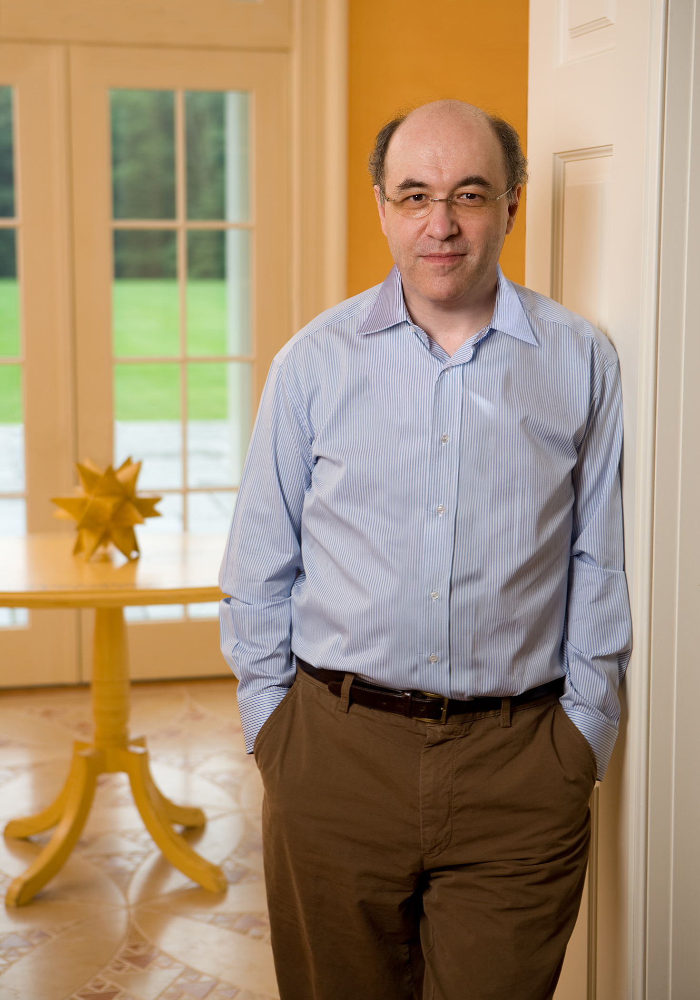

# 斯蒂芬·沃尔夫拉姆

斯蒂芬·沃尔夫拉姆（Stephen Wolfram，1959年出生于伦敦）是一位英裔美国计算机科学家、物理学家和企业家。他以其在计算机代数、理论物理以及通过元胞自动机研究复杂系统方面的工作而闻名。

作为一名神童，沃尔夫拉姆15岁时就发表了他的第一篇科学论文，并在20岁时获得了加州理工学院的理论物理学博士学位。1981年，他成为麦克阿瑟“天才奖”奖学金最年轻的获得者。

1987年，他创立了沃尔夫拉姆研究公司（Wolfram Research），并于1988年发布了Mathematica，这是一个技术计算系统，现已成为许多科学和技术领域的标准工具。2002年，经过十多年的努力，他出版了他的开创性著作《一种新科学》（A New Kind of Science），书中提出宇宙可以被理解为一个计算过程，而研究简单程序是探索科学的一种全新的、强大的方式。之后，他创建了Wolfram|Alpha计算知识引擎和沃尔夫拉姆语言（Wolfram Language）。

