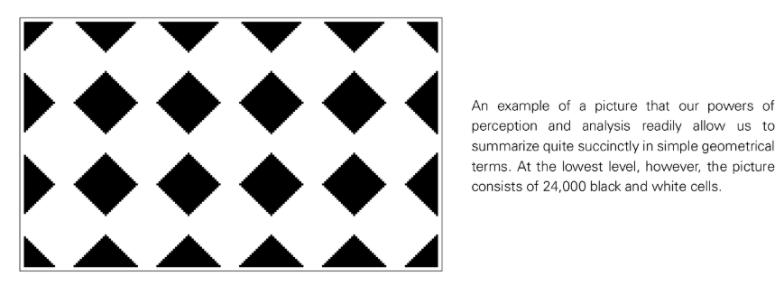
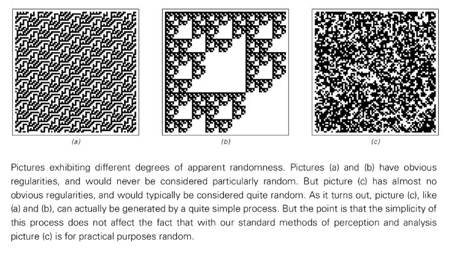
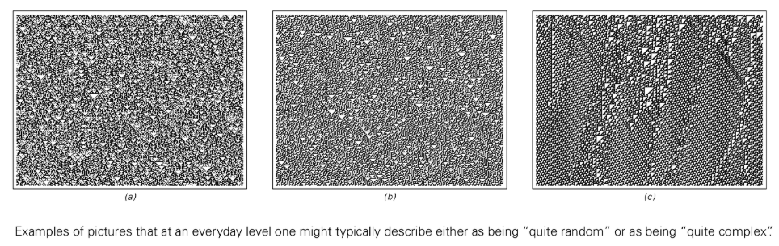
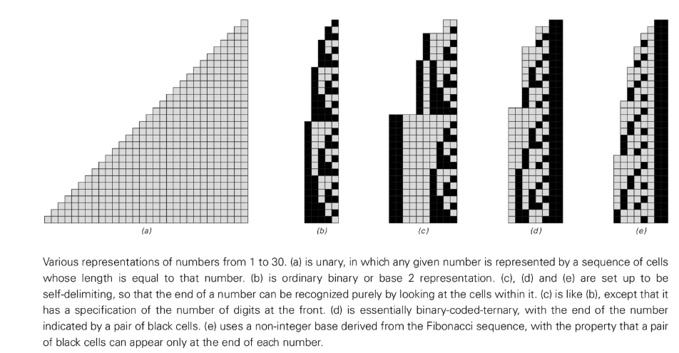
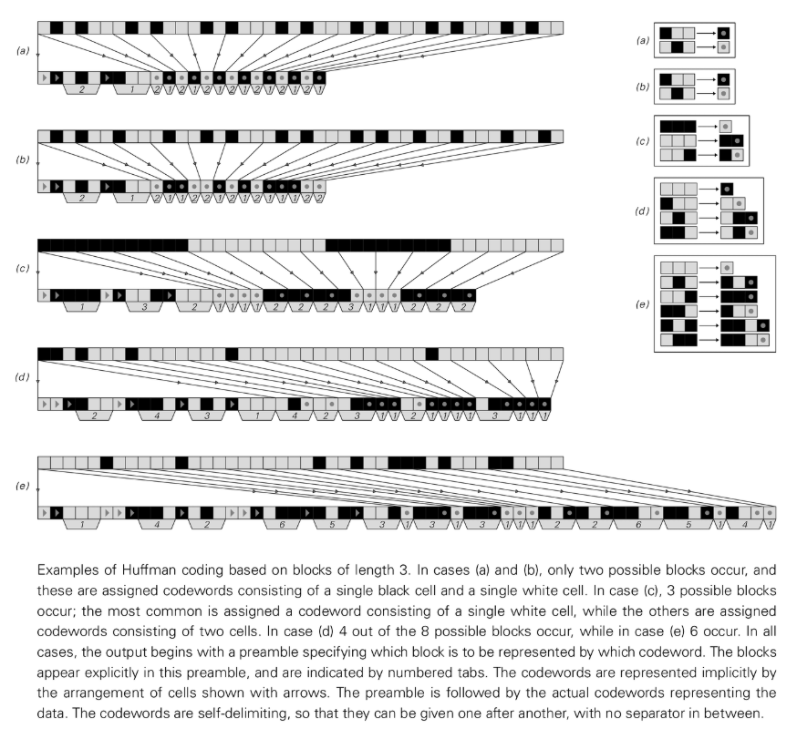
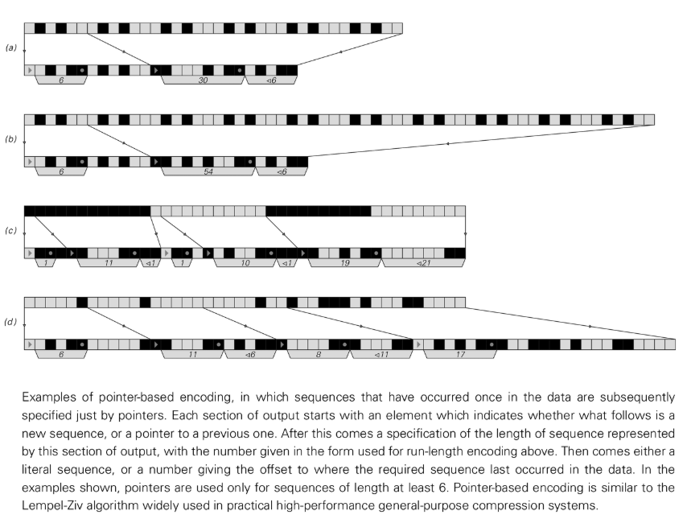
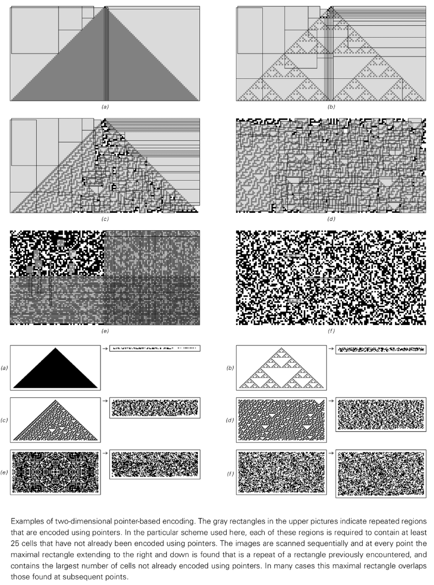
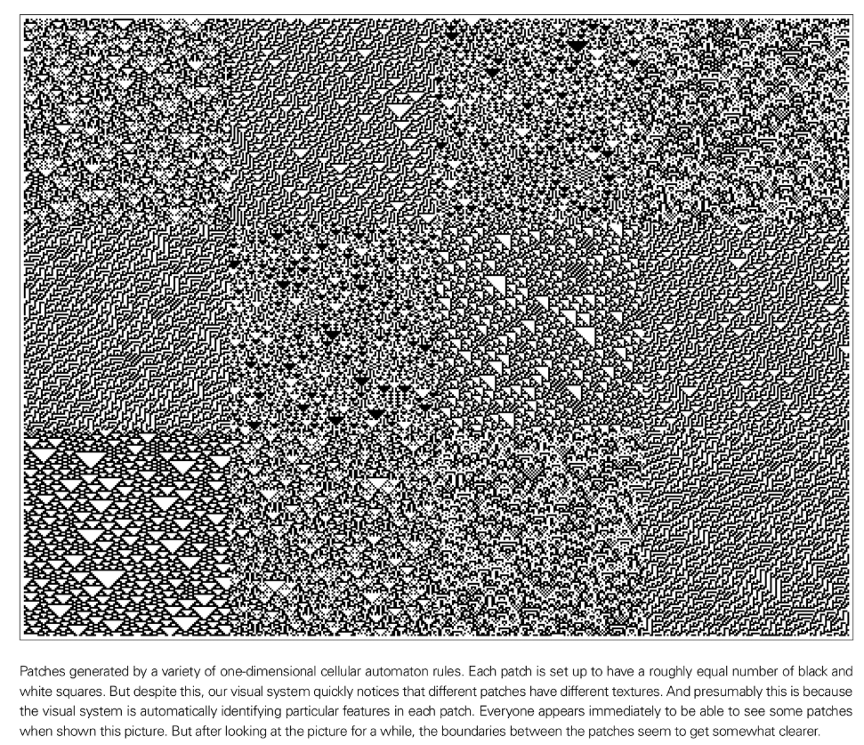
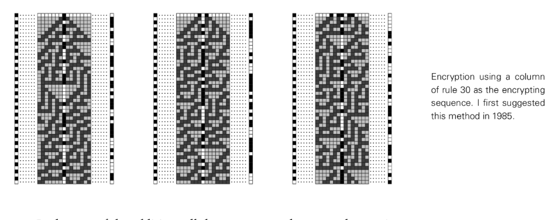

# Chapter 10 Perception and Analysis Process

## Introduction

In the past few chapters, we have discussed the basic mechanisms behind various phenomena in nature. But to explain our actual experience of the natural world, we need to consider not only how natural phenomena arise, but also how we perceive and analyze them. Because our experience of the natural world is ultimately not based directly on what nature does, but on the results of our perception and analysis of its behavior.

In the early chapters of this book, I argued that the basic mechanisms of many processes in nature can be captured by simple computer programs based on simple rules. What about the processes involved in perception and analysis? In this chapter I will argue that available evidence shows that its basic working mechanisms can also be successfully captured by simple procedures based on simple rules.

## The role of perception and analysis

In our daily lives, we are constantly bombarded by massive amounts of data (such as images, sounds, etc.). In order to leverage this data, we must simplify it to a more manageable level. This is exactly what perception and analysis attempt to do. Their role is actually to extract usable summaries from large amounts of raw data.

Data is typically sensed and analyzed in two ways. First, aspects of the data that are not relevant for the current purpose can be simply ignored. Second, by exploiting the regularities we observe, we avoid having to specify every element in the data.

When regularity exists in data, it actually means that part of the data is redundant. In general, the existence of regularities makes it possible to replace literal descriptions of data with procedural descriptions based on reproduced data.

Perception and analysis are in many ways the opposite of what much of this book examines. We usually start with a simple computer program and observe what behavior it produces. But in perception and analysis, we start from observed behavior and try to infer what procedures or processes reproduce the data.

## Define the concept of randomness

I refer several times in this book to the behavior of some systems that "appears to be random." But what exactly is randomness? We will find that to give an adequate definition we must consider issues of perception and analysis.

In everyday language, when we say that something appears random, we usually mean that we cannot discern any significant regularity in it—at least with our current methods of perception and analysis.

When we say that no regularity can be identified, this is equivalent to saying that we cannot find a shorter description. A thing looks random because in practice we have no choice but to explicitly specify the color of each of its cells.

However, the absence of brief descriptions of our usual perceptual and analytical processes does not in any way mean that such descriptions do not exist. In fact, a pattern that looks completely random may be generated by just 250 evolutions of a simple two-dimensional cellular automaton rule.

So, does the existence of this short description mean that this pattern should not be considered random? From a practical perspective, if we can never find this short description through any of the available methods of perception and analysis, then its existence may not matter.

Therefore, any useful definition of randomness must involve, at least in part, how to find these short descriptions. The key point of this chapter is that essentially all standard methods of perception and analysis can ultimately be seen as based on fairly simple procedures. This suggests a definition of randomness that we can give: something should be considered random when essentially no simple program can successfully detect a regularity in it.

## Define the concept of complexity

In everyday language, when we say that something looks complicated, we usually mean that we have not been able to find any simple description of it—or at least of those features that interest us. When we say that something looks complicated, we are actually saying that our perceptual and analytical abilities fail at it.

The definition of complexity requires consideration of both the perceptual and analytical functions. What we want to know is not whether we can find a simple or short description of every detail of something, but only whether we can find such descriptions of those features that happen to interest us.

In everyday language, "complexity" and "randomness" are sometimes used almost interchangeably. But if we just look at overall features, it's common to say that certain patterns that exhibit diverse structures are more complex than those that are uniformly random. Because the latter still have a fairly simple description at the overall level: they're essentially just a uniform randomness where every region looks roughly the same as every other region. But the former shows inhomogeneity even at the overall level, so we cannot give a brief description even if its small-scale details are ignored.

In practice, when we most often say that something looks complex, we mean that the specific processes involved in human visual perception fail to extract a brief description.

## Data compression

In most modern computer and communication systems, the equivalent of sensing and analyzing processes occurs all the time when data is compressed so that it can be stored or transmitted more efficiently.

Run-length encoding: The basic idea is to break the data into "runs" of consecutive identical elements and then specify the data only by giving the length of these runs.

Block-based encoding: Another common data compression method is based on forming fixed-length blocks and then using specific codewords to represent the occurrence of different blocks.

Pointer-based encoding: To achieve higher compression rates, it is possible to set up an encoding in which any particular sequence is given explicitly only once, and all subsequent occurrences of the same sequence are specified by pointing back to the first occurrence.

All these data compression methods can be considered to correspond to fairly simple programs. But we found that the properties of these methods are surprisingly similar. For example, almost every method can successfully compress large areas of uniform color, and most methods can compress repetitive behavior and, to some extent, nested behavior—two simple behaviors that I mention several times in this book.

However, for more complex behaviors, none of these methods seem to be able to achieve substantial compression. This is not in principle impossible to compress. In fact, many complex patterns can be generated by very short cellular automaton programs. But the point is that unless the overall behavior appears repetitive or nested, none of the standard data compression methods we discussed fall far short of finding such a brief description.

##Visual perception

The human visual system remains one of the most powerful and reliable tools we have. The basic scheme used over and over again in almost all types of human perception seems to be: have a specific type of cell respond to a specific fixed feature in the data, and then ignore all other features.

As with pattern and texture, the basic answer seems to be that the nerve cells in our eyes and brains are programmed to respond to specific local patterns in the images formed on our retinas. We can idealize this as having an array of black and white squares on the retina and a corresponding array of cells in the visual cortex. Each cell receives input from a 2x2 block of squares and follows a rule that it responds only when the colors of the squares form a certain pattern.

Just as we distinguish colors by the density of red, green, and blue, we probably distinguish textures by the density of certain local features.

However, with nested structures, the situation is quite different. It is difficult to tell with the naked eye that patterns are nested. This can be seen as a clear limitation of our visual perception capabilities. This is not because nested structures are fundamentally difficult to identify, just because the specific processes that happen to occur in human visual perception often fail to do so.

## Auditory perception

Fundamentally, all sound is made up of rapidly vibrating patterns. The most important aspect of how we perceive sounds is the frequency they contain.

If a sequence of elements is repeated, what is heard is essentially a pure tone at a specific frequency. But if the sequence is random, all you hear is an amorphous hiss.

So what happens between these two extremes? We seem to easily identify exact or near repeats of certain frequencies and essentially nothing else. For example, when we listen to nested sequences, we have no direct way of telling that they are nested, we only seem to be sensitive to some fairly simple features of the frequency spectrum in which they occur.

## Cryptography and Cryptoanalysis

The purpose of cryptography is to hide the content of a message through encryption so that it cannot be identified unless someone obtains a special decryption key. The goal of cryptanalysis is to break it by finding ways to decrypt the message without a key.

For cryptography to work, it must be such that even if certain features or parts of the encrypted sequence are known, it must be difficult to deduce the original key or the rest of the generated sequence.

Systems based on [Additive Cellular Automata](annotation:additive-cellular-automata) (e.g. [Rule 60](annotation:rule-60)): their nested structure enables the identification of regularities using a variety of sensing and analysis methods discussed in this chapter. Its additivity makes cryptanalysis relatively straightforward.

Systems based on Rule 30: Even sequences generated from simple initial conditions appear completely random to all perception and analysis methods discussed so far. There seems to be no easy way to deduce the key of Rule 30 from any suitably chosen encryption sequence, at least for standard cryptanalytic methods, and some others.

## HUMAN MIND

To what extent does the human mind transcend the other methods of perception and analysis discussed in this chapter? The most obvious standout is its massive use of memory. Other methods essentially operate by applying a fixed procedure independently to each new data. But in the human mind, we routinely draw on the vast memories we've built through exposure to billions of previous data.

My strong suspicion is that the use of memory is actually the basis for almost all major aspects of human thinking. Abilities like generalization, analogy, and intuition seem immediately closely related to the ability to retrieve data from memory based on similarity. But what about abilities like logical reasoning? Perhaps they correspond to a more advanced type of human thinking?

My strong suspicion is that when we reason logically, we are actually just using memory to retrieve patterns of logical argument that we have learned from experience.

Based on the findings of this book, we now know that it is entirely possible to produce highly complex behavior even from very simple basic rules. It immediately becomes conceivable that there are rather simple mechanisms underlying the human mind.

## Higher forms of perception and analysis

Do our existing methods of perception and analysis essentially cover everything that is ultimately possible? Or are there fundamentally more powerful higher forms of perception and analysis that we for whatever reason do not currently use?

One of the core findings of this book is that it is actually quite common for rules with extremely simple descriptions to produce highly complex data whose regularity cannot be discerned by any of our standard methods.

But the fact that a simple rule is ultimately responsible for the data means that, at some level, there must be regularity in the data. The point is, these regularities are precisely what our standard methods of perception and analysis cannot detect. However, the existence of regularities means that, at least in principle, there may be higher forms of perception and analysis that can successfully identify them.

I firmly believe that this will never be possible, at least in complete generality. But this does not mean that it is impossible to have higher forms of perception and analysis that can at least successfully identify certain regularities that our current methods cannot.