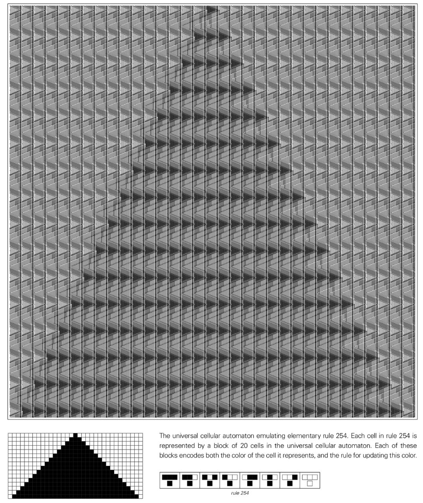
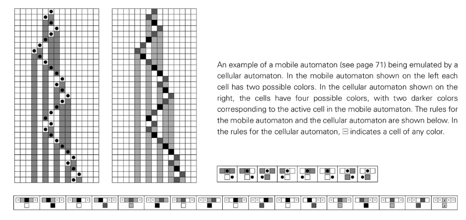
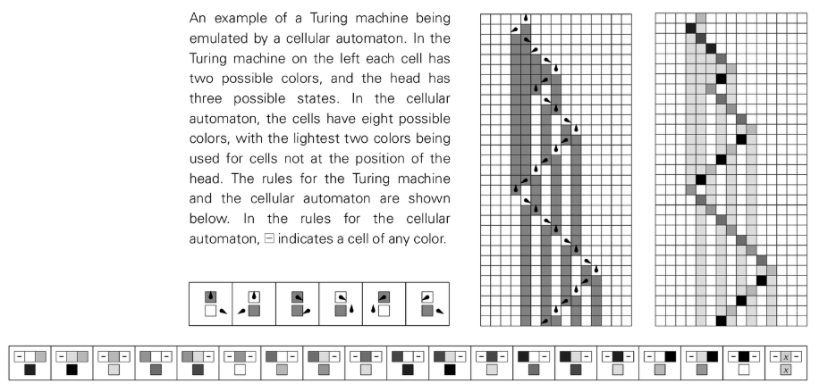
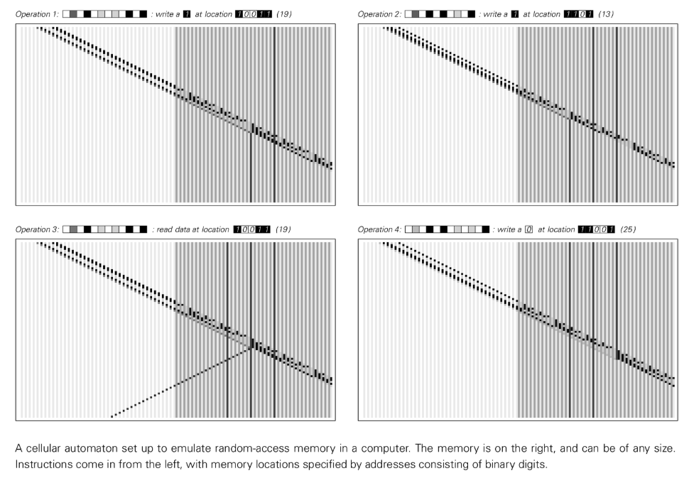

# Chapter 11: Concept of Computing

## Computing as a framework

In the early chapters of this book, we saw the various behaviors that cellular automata and other systems with simple underlying rules can produce. Experience from traditional science might tell us that standard mathematical analysis should provide the basis for any such framework, but that such analysis is only useful if the overall behavior under study is fairly simple.

When behavior becomes complex, conventional science can get us into trouble. However, this book aims to develop a new science that can still make progress under such conditions. The most important idea underpinning this new science was the concept of computation. We can think of systems like cellular automata as simple computer programs that perform computations. The initial conditions of the system can be seen as the input to the calculation, while the state of the system after several steps corresponds to the output. The point is that we should think about the calculations performed in abstract terms without focusing on the details of how they work.

This abstraction is useful mainly because it allows us to discuss systems with completely different underlying rules uniformly. Even though the inner workings of two systems may be very different, the calculations they perform may be very similar. By thinking computationally, it is possible to conceive of annotation (universality) principles that apply to a wide range of different systems, without having to consider the detailed structure of the underlying rules.

## Calculations in cellular automata

The evolution of any system, such as a cellular automaton, can be considered a computation. For example, a simple cellular automaton can calculate whether a number is odd or even. By setting an appropriate number of initial black cells as input, we can determine the result of the calculation by observing the final number of surviving black cells.

More complex calculations are also possible. Some cellular automata can calculate the square of any number or generate a sequence of prime numbers. These examples show that even simple cellular automata can perform arbitrarily complex calculations.

Many of the cellular automata we have discussed previously have behaviors that can be described using traditional mathematical concepts. For example, rule 94 can effectively be described as enumerating even numbers. However, for cellular automata like Rules 30, 45, and 73, their behavior seems impossible to describe in simple mathematical or other terms. Traditional mathematics is of little help here, but some ideas from practical calculations give us the framework we need.

## Universal phenomenon

We saw that it is possible to perform certain complex computations by setting up cellular automata with different underlying rules. Our daily experience with machinery and other equipment may lead us to believe that in order to perform different types of tasks we must use systems with different underlying constructs. However, the remarkable discovery that sparked the computer revolution was that this was not the case. In fact, we can build pervasive systems where the underlying structure remains the same and can be programmed differently to perform different tasks.

This is how a real computer works: the hardware remains the same, but by loading different software, the computer can be programmed for different tasks. This idea of ​​[Universality](annotation:universality) is also the basis of computer language.

Although the details of a particular computer system or language can affect the ease or difficulty of performing a particular task, a crucial fact is that, with appropriate programming, any computer system or language can ultimately perform the exact same set of tasks. For example, any system can be programmed to simulate another system.

The phenomenon of [Universality](annotation:universality) also exists in other fields, such as human language. Any given language can be used to describe almost any wide range of things, and translation between any two languages ​​is always possible.

In the natural sciences, the concept of universality has never been seriously considered in the past. However, generalizability is crucial for characterizing and understanding the complexity we see in natural systems. For a system to be universal, it must be able to simulate any other system, so that it can produce the same complex behavior as any other system.

In the past, people tended to think of universality as a rare and special quality, usually only found in purpose-built systems. But one conclusion of this chapter is that universality is actually a more common phenomenon.

## A universal cellular automaton

This section discusses a specific universal cellular automaton that is set up so that its operation is easy to understand. The rules of the cellular automaton itself are always the same. But because it is universal, given the appropriate initial conditions, it can be programmed to simulate any possible cellular automaton, regardless of its rules.

This universal cellular automaton uses blocks of 20 cells to represent individual cells in the simulated cellular automaton. This block encodes both the current color of the represented cell and the rules for updating that color. In order to update the color of the cell represented by a block, the universal cellular automaton must determine which of eight possible situations applies to the cell. It does this by progressively eliminating inapplicable cases until eventually only one case remains.

This universal cellular automaton is not limited to simulating rules involving nearest neighbors. For example, it can model rules involving next-nearest neighbors as well as nearest neighbors. For rules with more than two colors, it can also be simulated by using rules with only two colors but a larger number of neighbors.

This result is important and, at first glance, surprising. It means that a universal cellular automaton can simulate cellular automata that are more complex than its own rules. If we were unaware of the basic phenomenon of [Universality](annotation:universality), we might well assume that by using more complex rules we could always generate new and different types of behavior. But now we know that's not the case.

However, the rules for the specific universal cellular automata we discuss in this section are quite complex. If such complex rules were indeed required to achieve universality, we would not expect to see universality in natural systems. But as we will see later, this complexity of underlying rules is not necessary.

## Use cellular automata to simulate other systems

The previous section showed that a specific universal cellular automaton can simulate any possible cellular automaton. But what about other types of systems? Can cellular automata simulate them too?

One might think that, because of their simple and specific underlying structure, cellular automata would never be able to simulate a very wide range of other systems. But this section will show that this is not the case, and that cellular automata can actually simulate almost every type of system we have discussed in this book.

For example, cellular automata can simulate mobile automata, Turing machines, substitution systems, sequential substitution systems, tag systems, register machines, and even actual computers.

Therefore, a universal cellular automaton can simulate not only any cellular automaton, but also a wide range of other systems, including real computers.

## Simulate cellular automata with other systems

In the previous section we discovered that cellular automata can be set up to simulate an extremely wide range of other types of systems. But is this some special feature of cellular automata, or do other systems have similar capabilities?

In this section we will discover that, in fact, almost all of the systems we have considered previously have the same functionality. Just as we have shown that every system can be simulated by a cellular automaton, we will now show that these systems can also be simulated by a cellular automaton.

[Mobile automata](annotation:mobile-automata), [Turing machines](annotation:turing-machines), neighbor-dependent [substitution systems](annotation:substitution-systems), [sequential substitution systems](annotation:sequentia l-substitution-systems), [Tag Systems](annotation:tag-systems), symbol systems, loops [Tag Systems](annotation:tag-systems), and [register-machines](annotation:register-machines) can all be set up to simulate cellular automata. Since we know that at least some cellular automata are universal, this means that all these types of systems can also be universal.

## Universal Enlightenment

Although systems such as cellular automata, [Turing machines](annotation:turing-machines), [Substitution Systems](annotation:substitution-systems), [Register Machines](annotation:register-machines) and other systems have huge differences in their underlying structures, they can ultimately simulate each other. From a computational perspective, this means that a wide variety of systems with very different underlying structures are in some way fundamentally equivalent.

This is not to say that all systems of any particular type have the same computing power. In fact, some cellular automata can only perform very simple calculations. But the key point is that as people examine cellular automata with increasingly powerful computing capabilities, they will eventually cross the threshold of [Universality](annotation:universality). Once this threshold is crossed, the set of computations that can be performed will always be exactly the same.

Once a system is universal, its properties are very independent of the details of its construction. In terms of the computations it can perform, it doesn't matter how complex the underlying rules of the system are, or whether the system is cellular automata, [Turing Machines](annotation:turing-machines), or something else.

## Rule 110 Cellular Automata

How complex do the underlying rules of a system need to be in order to achieve universality? The universal cellular automata described earlier in this chapter have fairly complex underlying rules. However, it turns out that even cellular automata with extremely simple rules like [Rule 110](annotation:rule-110) can be universal.

Although the underlying rules of Rule 110 are simple, it supports a wide variety of local structures that move and interact in many complex ways. These local structures can be arranged to perform meaningful computations. The basic idea of ​​proving the universality of Rule 110 is to show that it can simulate any system in a certain class of systems known to be universal, such as cyclic labeling systems. With careful construction, it can be shown that Rule 110 can indeed model any loop labeling system, and is therefore itself universal.

## The meaning of universality in Rule 110

The universality of Rule 110 shows that universality is a much more common phenomenon than people think. It shows that even systems with very simple rules can be universal. This means that in a sequence of systems with progressively more complex rules, the resulting overall behavior will only become more complex until a threshold of [Universality](annotation:universality) is reached. Once this threshold is crossed, there will be no more fundamental changes.

Knowing that a system like Rule 110 is universal, we now suspect that this threshold is very easy to reach. This means that beyond the simplest rules of any given type, the behavior we see should quickly become as complex as possible.

## Type 4 Behavior and Universality

The typical behavior of Rule 110 is characterized by the presence of a large number of local structures that move and interact with each other in complex ways. This behavior is characteristic of all cellular automata that I call type 4. I strongly suspect that any cellular automaton that exhibits overall Type 4 behavior will eventually prove to be [Universality](annotation:universality) like Rule 110. I believe that if you study any type 4 rule hard enough, you will eventually find a rich enough set of local structures to support universality.

## Universal threshold in cellular automata

In order for a system to be universal, it must be possible to make it simulate any type of behavior that might occur in any other system by choosing appropriate initial conditions. Therefore, systems like Type 1 and Type 2 cellular automata that always produce simple uniform or repetitive patterns of behavior are certainly not universal. Additive rules like Rules 90 and 150 are ultimately predictable in their behavior and therefore not universal.

My general expectation is that almost any system whose behavior is not fundamentally repetitive or nested will eventually prove to be universal. However, for some systems, confirming this fact may be much more difficult than for others.

## Universality in Turing Machines and Other Systems

In cellular automata, the threshold for [Universality](annotation:universality) is quite low. The same is true for other types of systems, such as [Turing Machines](annotation:turing-machines). One of the simplest known universal Turing machines has only 2 states and 5 possible colors. I have no doubt that simpler universal Turing machines exist.

[Reference: Prove the simplest universal Turing machine](https://writings.stephenwolfram.com/2007/10/the-prize-is-won-the-simplest-universal-turing-machine-is-proved/)

I believe that in almost any case where we have seen complex behavior earlier in this book, it will eventually be possible to demonstrate [Universality](annotation:universality). In fact, as I will discuss in detail in the next chapter, I believe there is a strong connection between [Universality](annotation:universality) and the emergence of complex behavior.