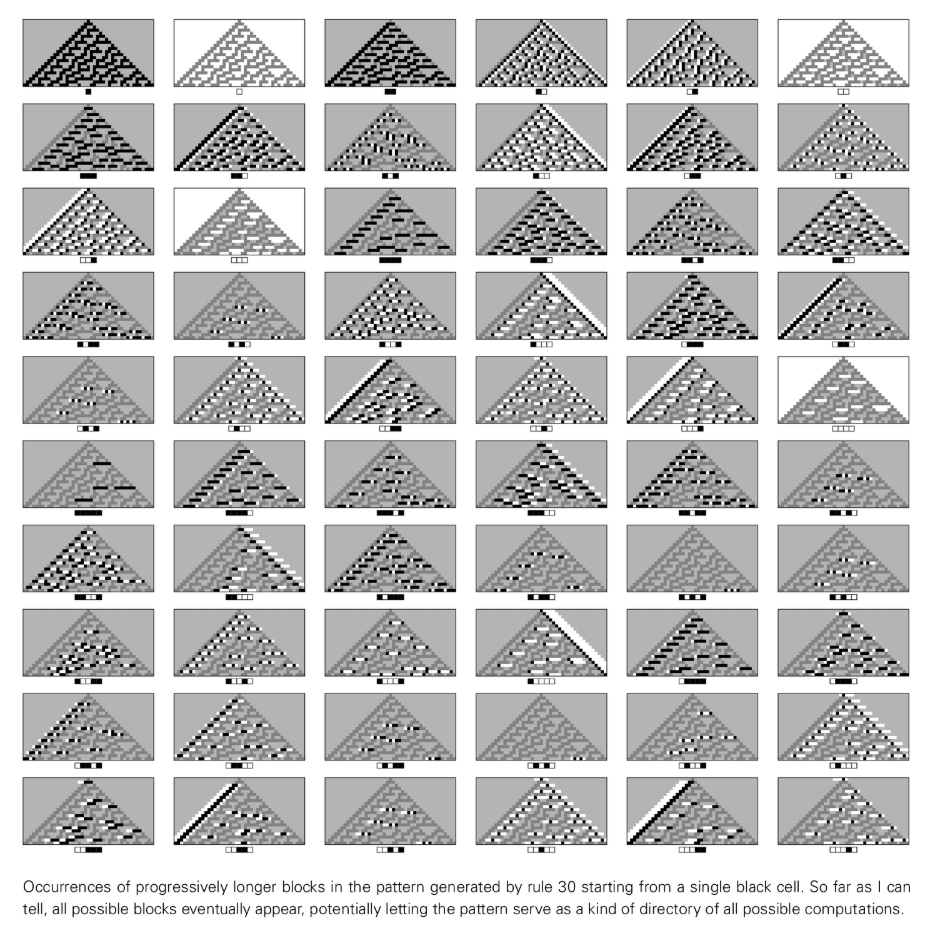
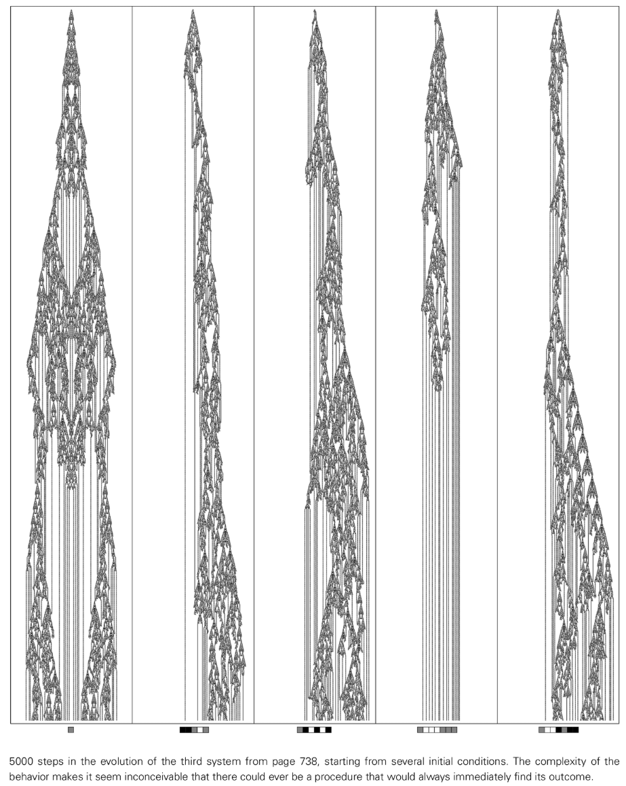
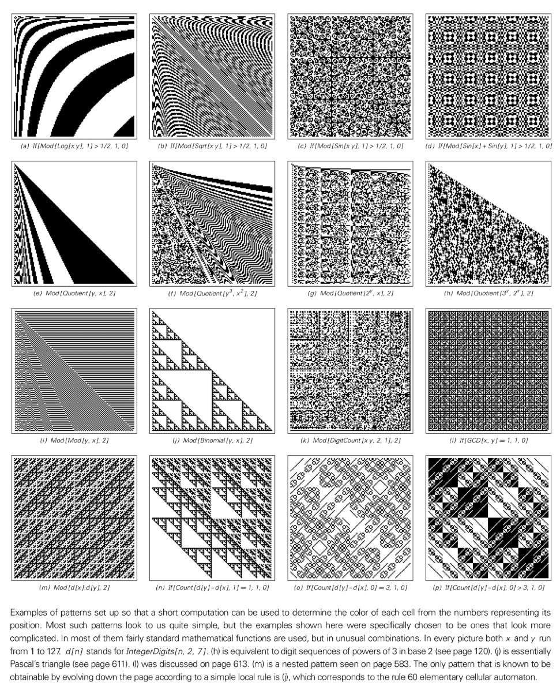
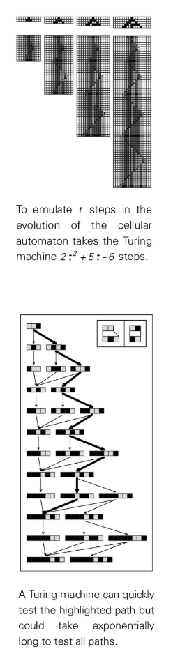
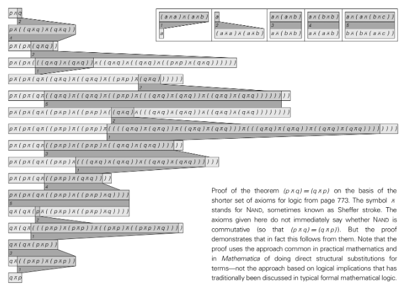
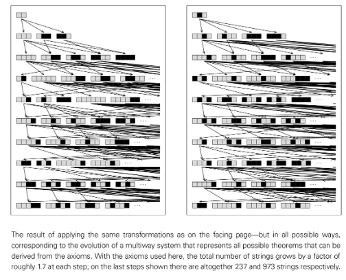
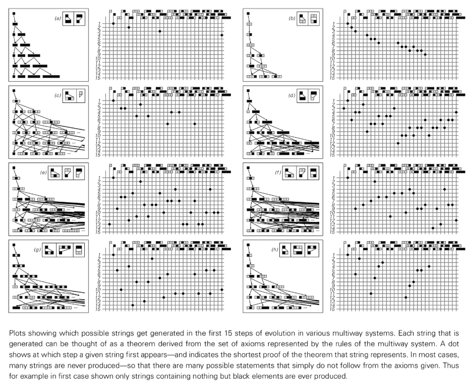
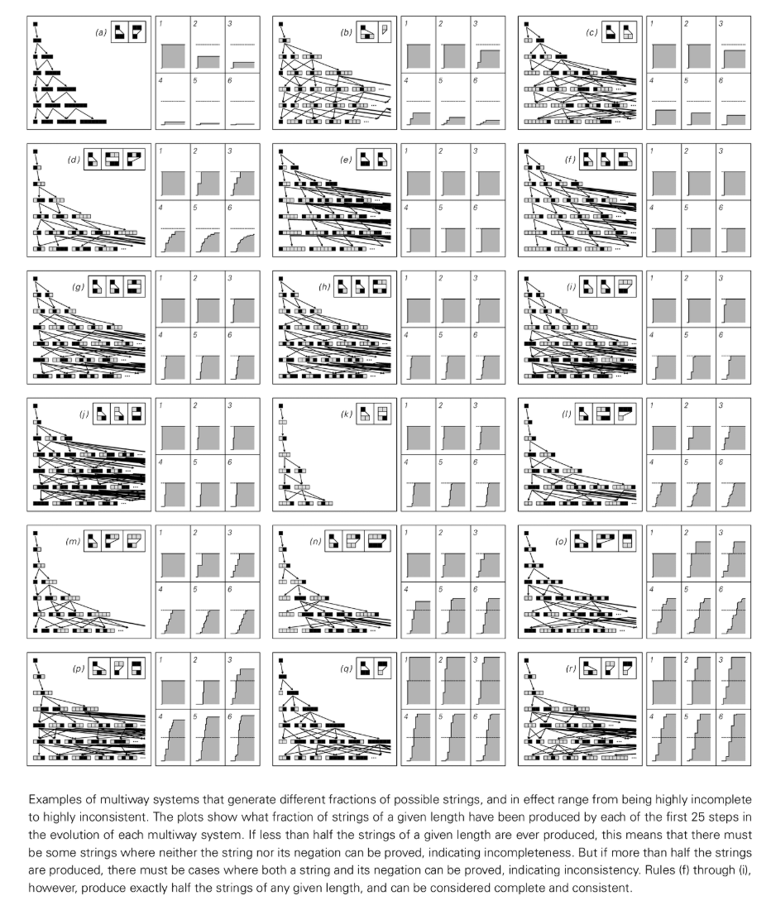

# Chapter 12 Computational Equivalence Principle (Computational Equivalence)

## Basic framework

Based on the findings of this book, I am going to describe a bold hypothesis that I call "[Computational Equivalence](annotation:computational-equivalence)." This principle has a wide scope of application, covering any natural or man-made process, and has a profound impact on many long-term problems in science, mathematics, philosophy and other fields.

Its core unifying idea is that all processes, whether man-made or naturally occurring, can be considered computations. The evolution of a system (such as a cellular automaton) can be viewed as a computation. Likewise, processes in nature can be viewed as computations, the rules of which are defined by natural laws. It is this unity that makes it possible to construct the principle of computational equivalence.

## Principle overview

Although processes in nature and man-made systems vary widely, viewing any process as a computation provides a unifying framework for discussing them. The principle of computational equivalence uses this framework to assert that there is a fundamental equivalence between many different types of processes from a computational perspective.

The most general statement of this principle is that almost any process that is not obviously simple can be regarded as a computation of equal complexity.

One might think that there are huge differences in the computational complexity of different processes, but the principle of computational equivalence asserts that in reality there is essentially only one highest level of computational complexity, and that almost all seemingly non-simple processes can reach this level. An important clue comes from the phenomenon of “universality.” Ubiquitous systems can perform any computation, so they all achieve the highest levels of computational complexity.

Traditionally, it is believed that achieving universality requires setting up complex and exquisite rules. But an important discovery of this book is that even extremely simple rules can be universal (for example, cellular automata [Rule-110](annotation:rule-110)). A corollary of the principle of computational equivalence is that almost any rule whose behavior is not obviously simple should eventually achieve the same computational complexity and thus be universal. Therefore, universality is not a rare property, but is extremely common and expected to occur in various systems in nature.

The principle of computational equivalence also asserts that even starting from simple initial conditions, as long as the behavior is not obviously simple, it almost always corresponds to an equally complex computation. No matter how simple the rules or initial conditions are, as long as the process itself does not look simple, it almost always corresponds to an equally complex calculation. This reveals a fundamental unity among processes in nature and beyond.

## Contents of the principle

The principle of computational equivalence is in part a new law of nature, an abstract fact, and a definition. It tells us what kinds of computation can and cannot happen in the universe.

This principle introduces a new law of nature: no system can perform more complex explicit computations than systems such as cellular automata and Turing machines. I believe that if a final physical theory could be found, it would be simulated by a universal system, confirming that more complex computations cannot occur anywhere in our universe.

The principle also asserts a fundamental abstract fact: the vast majority of all possible systems whose behavior is not obviously simple are universal. Although it can be extremely difficult to prove the universality of any simple rule, I firmly believe that most systems whose behavior is not obviously simple will eventually prove to be universal.

When no constraints force simple overall behavior, the rules that arise in nature can be viewed as non-particularly chosen, so that in cases where the behavior is not simple, they almost always exhibit universality.

The principle of computational equivalence not only focuses on the computational complexity of the complete system, but also on the computational complexity of specific processes within the system. It asserts that almost any behavior that is not obviously simple, even if derived from simple initial conditions, will eventually correspond to computations of equal complexity. Simple initial conditions are sufficient to produce extremely complex behavior, while making the initial conditions more complex usually does not cause the behavior to look any different.

## Explanation of complex phenomena

The book reveals a remarkable discovery early on: Even systems with extremely simple rules can produce behavior that appears to us to be extremely complex. The principle of computational equivalence provides a fundamental explanation for this. The key is to compare the computational complexity of the systems we study versus the systems we use to study them (our brains, mathematical methods, etc.).

The principle of computational equivalence asserts that almost all processes that are not obviously simple are equivalent in computational complexity. This means that even if the underlying rules of a system are simple, its evolution can be as computationally complex as the processes we use to perceive and analyze it. This is the fundamental reason why a system of simple rules can exhibit complex behavior.

Ultimately, the reason we see so much complexity can be directly attributed to the principle of computational equivalence and the fact that a large number of systems we encounter in practice are computationally equivalent.

## Calculate irreducibility

Much of the success of traditional theoretical science is based on finding shortcuts that reduce the computational effort required to predict system behavior, such as using mathematical formulas. However, I have found that many common systems do not have simple formulas that describe their overall behavior. I believe this is a phenomenon caused by a fundamental corollary of the principle of computational equivalence—what I call “[Computational Irreducibility](annotation:computational-irreducibility).”

When there is computational irreducibility in a system, it means that the only way to predict its behavior is essentially to perform as many computational steps as it evolves itself.

Traditional science generally assumes that the systems used to predict (our brains and mathematics) are computationally much more complex than the systems being predicted. However, the principle of computational equivalence asserts that this is not true; almost all systems whose behavior is not simple are equivalent in computational complexity. Therefore, the system used for prediction cannot systematically "outperform" the system being predicted. As a result, the behavior of many systems must be considered computationally irreducible (annotation:computational-irreducibility).

I believe that this is the fundamental reason why traditional theoretical science has so little success in studying most non-simple systems. When computational irreducibility exists, the common methods of traditional theoretical science are bound to fail.

## The phenomenon of free will

It has always been a great mystery that the universe obeys clear laws, yet we humans seem to be able to make decisions freely. The key, I believe, lies in the phenomenon of computational irreducibility.

This phenomenon means that even if a system obeys clear underlying laws, some aspects of its overall behavior may still not be described by reasonable laws. If the evolution of a system corresponds to an irreducible computation, then the only way to deduce its behavior is to perform this computation. As a result, there can be no laws that would allow us to more directly infer its behavior.

This, I believe, is the ultimate source of the apparent freedom of the human will. Although all components of our brains may obey clear laws, I strongly suspect that their overall behavior corresponds to an irreducible computation whose results cannot be predicted by reasonable laws.

## Undecidability and incomprehensibility

Computational irreducibility is a common phenomenon, and one of its consequences is a variety of phenomena that are widely studied in abstract computational theory. It was often thought that these phenomena only occur in special systems, but my findings show that they are actually very common.

What is the final result of a system (after infinitely many steps)? This question may suffer from "[undecidability](annotation:undecidability)". If the behavior of a system is computationally irreducible, then no shortcut can exist to determine its final behavior, which means that the problem is formally undecidable. I suspect that for almost any system whose behavior appears complex to us, any non-trivial question about its behavior after infinitesimal steps will be undecidable.

For finite problems, they can become "hard" when computational irreducibility exists. For example, the amount of computation required for some computational tasks may grow exponentially with input length. My findings show that even systems with very simple rules, such as Turing machines, do have such computational tasks that require exponential computational effort to complete them.

## Impact on mathematics and its foundations

There are similarities between nature and mathematics at an abstract level: in nature, simple underlying laws lead to rich and complex behaviors, while in mathematics, simple [axioms](annotation:axiom) can also lead to various rich and complex results. I believe this is ultimately yet another corollary of the principle of computational equivalence.

Similar to multiway systems, some simply stated theorems in mathematics may require extremely long proofs, reflecting computational irreducibility. This phenomenon makes certain infinite problems undecidable. For example, in a multipath system, the question "whether a particular string will be generated?" is usually undecidable. This is similar to the situation in mathematics, where for a given axiomatic system there may be statements whose truth cannot be proven.

This is the essence of Godel's [Godel Theorem](annotation:godel-theorem), and the discoveries in this book make it almost obvious. If the evolution of a system is computationally irreducible—the question of its final behavior is undecidable—then the system cannot be both complete and coordinated.

The principle of computational equivalence means that almost any axiomatic system should be universal as long as it exceeds a very low threshold. This explains why axiomatic systems used in most contemporary mathematical research such as arithmetic, set theory, group theory, etc. are universal. Therefore, the incompleteness revealed by Gödel's theorem should be a common phenomenon in mathematics.

I believe that mathematics has developed as far as it has because it has tended to define itself as focusing only on those problems that its methods can successfully solve, thereby inevitably avoiding those problems that involve undecidability and unprovability. Once we step outside the confines of mathematical tradition, undecidability and unprovability become quite common.

## Intelligence in the Universe

If intelligence is related to the ability to perform complex computations, then according to the principle of computational equivalence, this ability never required billions of years of biological evolution to arise—it should be ubiquitous, present in a variety of biotic and abiotic systems.

The basic criterion we use to judge intelligence is whether it makes "meaning" or "communicates." However, in the absence of a common background and context, discerning meaning becomes extremely difficult.

Likewise, it is difficult to tell whether an object is the product of intelligence (i.e., an artifact). Traditionally, artifacts have been easy to identify because of their simplicity, because we need to anticipate their behavior to achieve our purposes. However, more advanced technologies may exploit systems with complex behavior to achieve simple ends. In this case, a system created for a specific purpose may look more like a product of nature than an artifact.

Ultimately, I concluded that the key was not to find systems that could perform complex enough calculations, but to find systems whose details were just so similar to ours that we recognized their behavior as intelligent.

## Impact on technology

One of the central findings of this book is that systems with extremely simple rules can produce extremely complex behavior. I believe there are a lot of new technologies that will be possible using these types of systems.

Traditional engineering methodologies favor building systems whose behavior is simple enough to be easily predicted, which precludes many of the systems I study in this book. But the principle of computational equivalence means that there are actually a large number of systems with completely different rules but exactly the same computing power, and they can in principle serve as the basis for building computers.

Because the underlying rules can be very simple, this greatly expands the range of components that can be used to implement them. For example, self-assembling a conventional computer from atoms seems impractical, but doing so for a cellular automaton similar to [Rule 110](annotation:rule-110) seems quite feasible.

## Historical Perspective

Many of the great advances in the history of science have come from the discovery that we humans are not special beings. The principle of computational equivalence now similarly states that there is nothing fundamentally special about us, even in terms of intelligence or complexity. Whether they are human brains, turbulent flows, or cellular automata, the behaviors they exhibit correspond to computations of equal complexity.

Therefore, we humans are no more computationally powerful than cellular automata with very simple rules. But the principle of computational equivalence also means that this ultimately applies to our entire universe as well. The processes taking place within us can eventually reach the same computational complexity as the entire universe.

Ultimately, the principle of computational equivalence reveals both science's ultimate power and its ultimate weakness. It means that all the wonders of our universe can actually be captured by simple rules, but it also shows that we can't know all of the consequences of those rules unless we see them unfold.