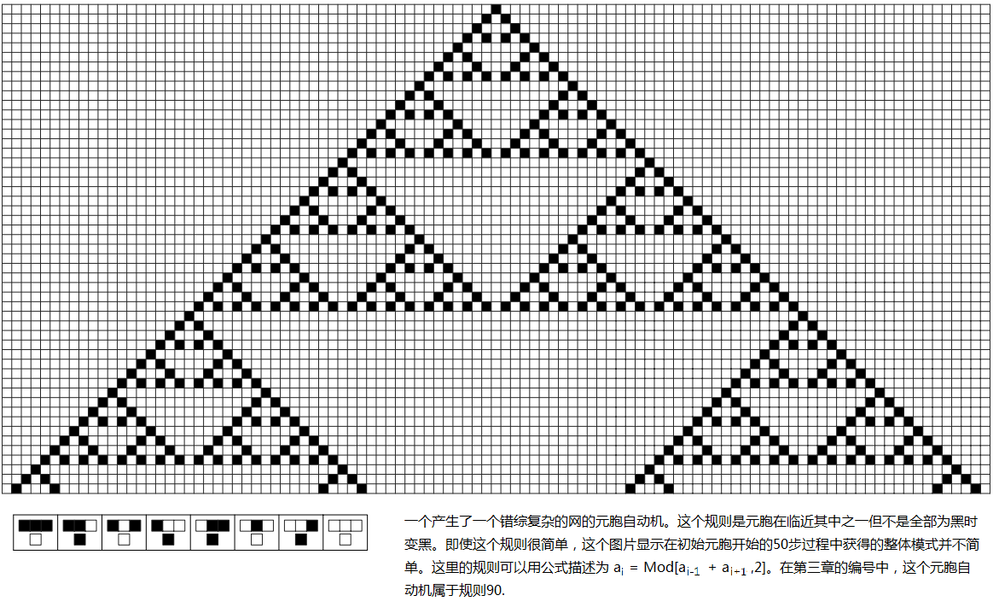
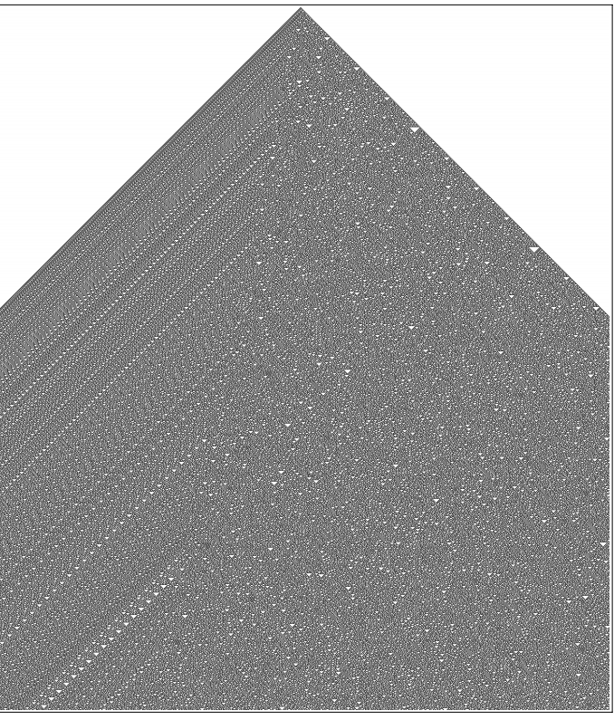

# Chapter 2: Key Experiments

Twenty years ago, a key idea came to my mind that ultimately led me to write this book: What if we didn’t set any specific goals for our program, but just picked a very simple program at random and ran it to see what it did?

This question is difficult to answer using traditional mathematical methods, but it is straightforward to do experiments with computers. So, I chose a minimalist program that I called [Cellular Automata](annotation:cellular-automata) and started my exploration. Its rules are extremely simple: imagine a row of cells composed of black and white. At each step of the passage of time, the color of the next generation of a cell is determined only by its own color and the colors of its two neighbors on the left and right in the previous step.

## Experimental findings: from intuitive to subversive cognition

At first, some of the rules produced behavior that was pretty much what we expected, very simple: some produced a uniform patch of black, others produced repeating patterns like a checkerboard. This is completely consistent with our intuition.

But soon, I got my first surprise. A slightly different rule produces a complex but very regular nesting pattern. If you look closely, you will find that it is composed of many smaller triangular fragments, each of which is like a miniature replica of the entire pattern. This is already interesting, showing that simple rules can at least produce orderly complexity.

However, what really shocked me and formed the core of this new science was this next guy I call [Rule 30](annotation:rule-30). Its rules are even a little weird to describe: First, look at each cell itself and its right neighbor. If both of them are white, then the new color of this cell is the same as the color of its left neighbor; otherwise, it becomes the opposite color of its left neighbor.

The rule itself is not complicated, but once it started running from a solitary black cell, the patterns produced surprised me. It's extremely complex, has no pattern, and looks completely random.

<!-- Can be replaced by interactive Demo: demos/wolfram-rules-explorer/ or use ../../images/cellular-automata/cellular-automata-rule-30.svg -->

Where does this complexity come from? I didn't give it any complicated design, the rules and initial conditions are as simple as they come. I have exhausted various mathematical and statistical methods to analyze it, and the results show that the color sequence of the central column of cells does not have any repetition within millions of steps, and its randomness is almost indistinguishable from a true random process. Although there are some obvious diagonal stripes on the left edge of the pattern, the main part is chaos.

At that moment I realized that I might have touched on a very common and fundamental phenomenon: even with simple rules, systems can spontaneously produce seemingly endless complex behaviors.

It's not over yet. I discovered a system like [Rule 110](annotation:rule-110) again. Its behavior is more wonderful and subtle. Part of the pattern is a fairly regular, repeating background of small triangles, but another part is a chaotic mess of random areas. The most incredible thing is that there are some stable local "structures" appearing on this background, some are stationary, and some are moving at a fixed speed. When these structures meet, they collide and react like particles, sometimes annihilating and sometimes creating new structures.

<!-- Interactive Demo can be linked to demos/chapter3/turing-machine-demo.html or ../../images/computational-art/rule-110-pattern.png -->

This got me thinking: Will these structures eventually disappear, leaving only a regular background? Or will more and more structure be created, making the entire system completely random? To find out, I had to keep the computer running. Finally, after nearly three thousand steps, a stable structure survived and interacted periodically with the background.

## The birth of a new intuition

These experimental results completely overturned my intuition. In our daily experience, especially in engineering, we always feel that in order to build something complex, the design drawings behind it must also be equally complex. To ensure that a machine can do what we want it to do, we must be able to understand and predict its behavior, so we avoid systems whose behavior is difficult to predict.

But nature operates without the same constraints that we human engineers have. It's entirely possible that it's using this mechanism from simplicity to complexity universally to create the infinite complexity we see in the world.
In fact, in the field of practical computing, we have already experienced this phenomenon. Programmers all know that a very simple piece of code can sometimes produce extremely unpredictable "bugs". This is an example of simple rules producing unexpectedly complex behavior. But for a long time, this intuition from practice has never been applied to the level of basic science.

The ability of simple rules to produce complex behavior is initially difficult to understand because it runs counter to our intuitions based on everyday experience. Our experience, especially in the engineering and manufacturing fields, almost always tells us that something that looks complex must have its origins in an equally complex construction plan or blueprint.

This intuition has its roots in a fundamental approach to engineering: we design and build a system to achieve a specific, predictable goal. To ensure that a system does what we want it to do, we must be able to understand and predict its behavior, and therefore intentionally avoid systems that create uncontrollable complexity. But nature operates without such artificial constraints, so it is free to evolve complex behavior from simple rules, and this is a core idea that this book attempts to illustrate.

We might think of using the analogy of practical computing, where computers can indeed perform complex tasks using simple low-level instructions. But the key difference here is that although the instructions are simple, the programs composed of the instruction strings are usually lengthy and complex, which goes back to the engineering model of "complex designs produce complex results." However, the phenomenon revealed by cellular automata is more profound: not only are its rules simple, but its initial conditions (programs) can also be extremely simple—for example, starting from just one black cell—but the behavior it produces can be highly complex. This is confusing because it seems to create something out of nothing.

Because of this, we cannot call upon any existing experience to help understand this fundamental phenomenon. We have no choice but to try to develop a completely new kind of intuition. The only reasonable way to do this is to immerse yourself in a large number of examples, observing the behavior of cellular automata and various other systems in subsequent chapters, and ultimately develop a new way of thinking that naturally and inevitably recognizes the universality of this phenomenon.

<button class="expand-toggle" data-target="simplified" data-expanded="false">
  Expand details
  ▼
</button>

## Why only found out now?

You may ask: Why has no one discovered such a basic phenomenon before?

I think a key reason is technology. Before the advent of computers, drawing these drawings by hand was too boring. Drawing a preliminary image of **Rule 30** may take an hour, and drawing a picture showing its long-term behavior may take several weeks. Without large-scale experiments, it is difficult to discover general rules from one or two examples.

The more important reason is mindset. The intuition of traditional science will tell us that there will be no profound scientific value in this simple "game". Throughout history, whether it is the exquisite decorative arts of the ancients, or the distribution of prime numbers and the number sequence of π discovered in early mathematics, although they have all shown clues that "simple rules produce complex appearances", they are often regarded as isolated and peculiar phenomena, and no one has promoted them to a universal scientific principle.

Looking back, it was the computer, a powerful experimental tool, and a new way of thinking derived from "computing" that gave me the opportunity to open the door to new science. It tells me that perhaps the most profound secrets in the universe are hidden behind the simplest rules.

The central finding of this chapter—that programs based on simple rules can produce complex results—seems so basic that we might think it was long overdue. This is not the case, and the reasons behind it are useful for understanding the scientific process itself.

First, a major reason is that conducting the necessary experiments requires the appropriate technology. In the history of science, new technologies are often catalysts for the development of basic science. Just as the telescope led to modern astronomy, computer technology was key to the new science described in this book. In principle, it would have been possible to simulate cellular automata by hand before computers, but this would have been extremely tedious and time-consuming—simulating a simple drawing might take an hour, while a more complex one could take weeks. More importantly, to discover its general phenomenon, you cannot just look at one or two examples, but must conduct large-scale, systematic experiments without any bias. This did not become a reality until computer time became cheap and easy to obtain in the 1970s.

But a deeper, more fundamental reason is that the standard intuition of traditional science is that such experiments are simply not worth doing. Since the great success of calculus in the 17th century, the scientific community has developed an ingrained belief that to explain complex phenomena in nature, one must rely on equally complex mathematical equations. In this line of thinking, few believe that simple rules can produce any meaningful complexity, and thus systematic study of them is out of the question.

Breaking out of this mindset requires developing a new kind of "computational" intuition, which stems from practical experience of working with computers. For example, the experience of using computer monitors tells us that a simple grid composed of discrete pixels can completely display realistic and complex images; and the experience of writing programs, especially the difficulty of debugging, makes us deeply realize that the behavior of even simple programs is often difficult to predict. Without these practical experiences, scientific intuition will lead people in the wrong direction at almost every step.

Looking back at history, there have actually been many moments close to this discovery. From ancient decorative arts, to ignoring the randomness of the distribution of prime numbers, to treating small numbers of π as mere anecdotes, and even in the "game of life" where people strive to avoid and eliminate complex behaviors, they all reflect the same problem: Although complex phenomena based on simple rules are repeatedly observed, under a framework that believes that "simplicity only produces simplicity," they are either ignored or regarded as special cases without universal significance or interference that need to be eliminated. So, despite the ubiquitous hints, this universal phenomenon ultimately awaits the emergence of new tools and new ideas to be revealed.

<button class="expand-toggle" data-target="simplified" data-expanded="false">
  Expand details
  ▼
</button>