# Chapter 3: The World of Simple Programs

In the previous chapter, we got a glimpse of the surprisingly complex behavior that a simple [Cellular Automata](annotation:cellular-automata) can produce. But is this a coincidence, or does it reveal a deeper universal law? In order to answer this question, we must go beyond the specific examples in Chapter 1 and systematically examine what other "species" are hidden in the "computational universe" composed of simple rules, just like natural scientists explore biological diversity.

## Re-exploration of cellular automata

### Basic behavior types
We first returned to the world of [Cellular Automata](annotation:cellular-automata) to conduct a more comprehensive census. By examining all 256 most basic (two colors, neighborhood 1) rules one by one, we found that although the details vary widely, the behavior patterns can still be clearly classified into four categories (see [Four Classes Of Behavior](annotation:four-classes-of-behavior)):
- Repeating structures that stabilize quickly, such as rule 0;
- Form fixed-size, movable partial structures;
- Generate nested or fractal patterns with infinite detail but high regularity, such as Rule 90;
- Present seemingly completely random and disordered patterns, such as [Rule 30](annotation:rule-30).

These categories not only help us quickly locate typical performance, but also form a frame of reference for subsequent cross-system comparisons.

### Basic Rules Panorama
To quantify the difference across 256 rules, we encode each local neighborhood's "truth table" into an 8-bit binary sequence, resulting in a compact view of the rule space. A collage of images contrasts the common rules of the cover and presents a panorama of all combinations, thumbnails that make the diversity of the "computational universe" clear at a glance.

In addition to macro classification, the evolution of individual rules also reveals more subtle differences: some quickly fall into unity, some release moving local structures, and some continue to rearrange as they spread.

<button class="expand-toggle" data-target="simplified" data-expanded="false">
  Expand details
  ▼
</button>

### Fractal and Random Examples
Although many rules tend to have repetitive or finite structures, there are still a number of rules that generate nested fractals or nearly random complex textures. For example, rules 22, 159, and 225 present different fractal dimensions, while rules 30, 45, 106, etc. maintain a random background with no obvious period over a long period of time.

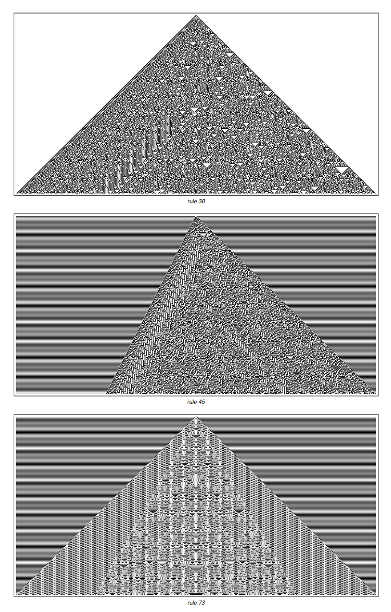

Mixed behaviors can be observed by extending the evolution time: regular backgrounds intertwined with irregular conflicts, slow growth or decay of local structures, and simplifying trends that only appear on extremely long time scales.

<button class="expand-toggle" data-target="simplified" data-expanded="false">
  Expand details
  ▼
</button>

### Sum rules and multi-color extensions
To test whether rule complexity fundamentally changes behavior, we expanded the cellular colors from two (black/white) to three (black/white/grey) and tried the "extreme" or [totalistic-cellular-automata] rule (annotation:totalistic-cellular-automata) (new colors only depend on the sum of neighbor colors). This setting pushes the number of rules from 256 to 2187 or even higher, but its core behavior still follows the three themes of repetition, nesting, and randomness.

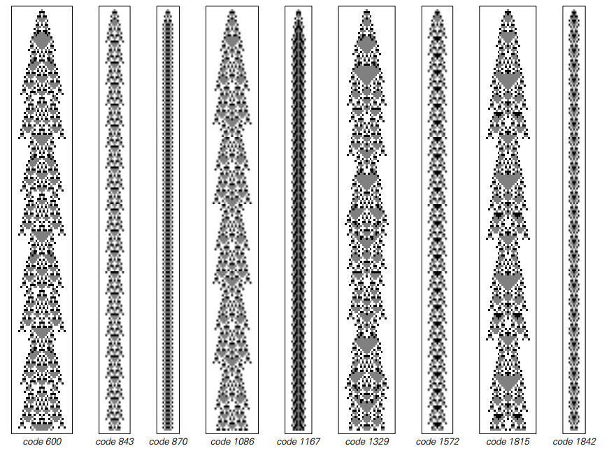

Even if we continue to examine higher color numbers or larger neighborhoods, the image still shows that the key elements required for complexity are already satisfied at a very low threshold of rule complexity.

<button class="expand-toggle" data-target="simplified" data-expanded="false">
  Expand details
  ▼
</button>

## Expeditions across different systems

To confirm that these phenomena are not limited to cellular automata, we generalized the same exploratory approach to multiple computational models and recorded their representative evolution in images.

### [Mobile automata](annotation:mobile-automata)
Moving automata change updates from global synchronization to local updates and movements of individual "active cells". Of the 65,536 simplest rules, most cases produce only limited or periodic behavior, but nested structures and approximately random color patches can still be observed. Complex evolution becomes more likely to emerge when multiple active cells or richer states are allowed.

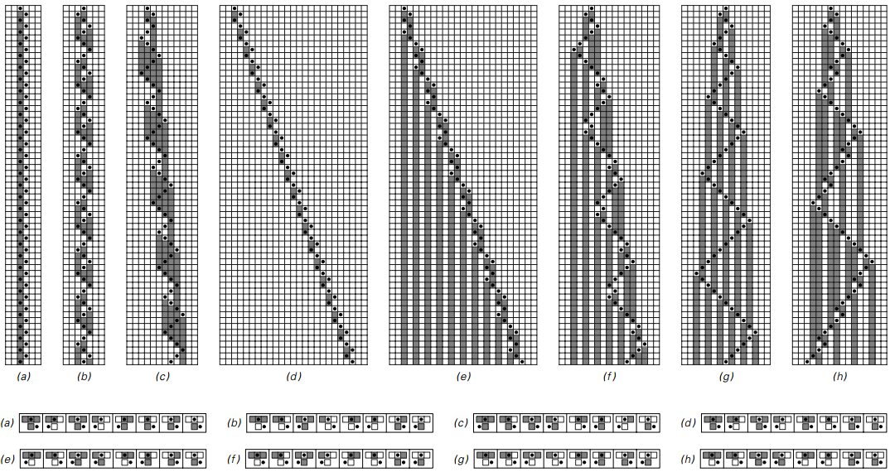

As the complexity of the rules increases and even allows active cell division, the mobile automata will also exhibit diverse textures of nesting and randomness.

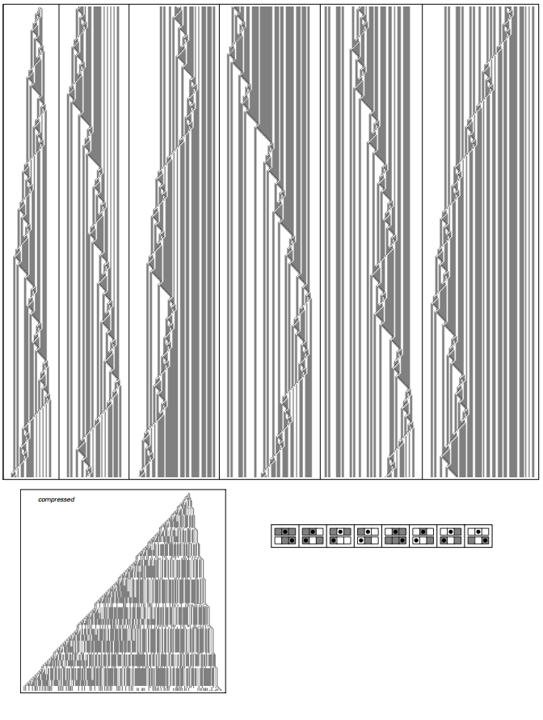

<button class="expand-toggle" data-target="simplified" data-expanded="false">
  Expand details
  ▼
</button>

### [Turing machine](annotation:turing-machines)
Turing machines are similar to moving automata in that they also move active cells (heads) on a one-dimensional tape, but the heads can have multiple states. The simplest combination of two states and two colors will only produce repeated or nested behaviors. When the head states are expanded to four, random textures appear, once again confirming the existence of a "complexity threshold."

Typical behavior of a two-state Turing machine

Behavior comparison of multi-state Turing machines

Stochastic evolution of four-state Turing machines
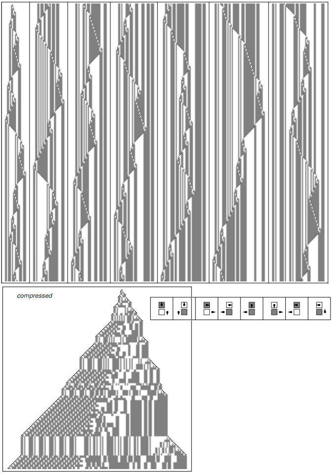

<button class="expand-toggle" data-target="simplified" data-expanded="false">
  Expand details
  ▼
</button>

### [Substitution System](annotation:substitution-systems)
The substitution system allows the number of elements to increase or decrease as the rules change. If the rules only rely on the color of the element itself, a highly regular nested fractal will be generated; when the rules rely on neighbors and allow elements to be created or destroyed, the behavior will be closer to random diffusion, which is indistinguishable from the performance of a cellular automaton.

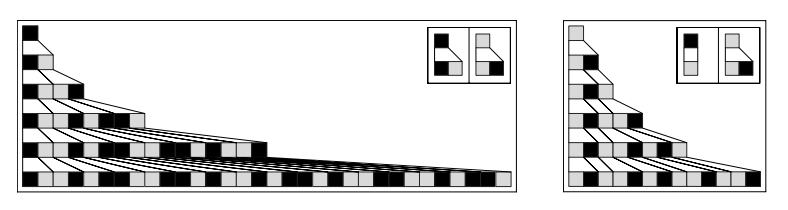
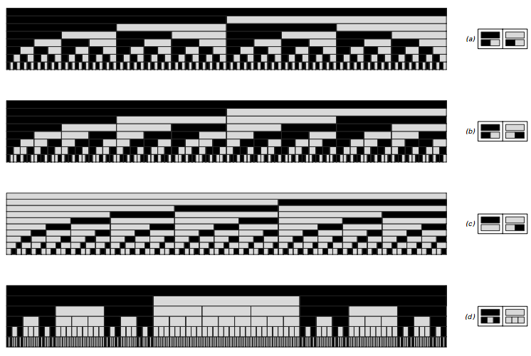
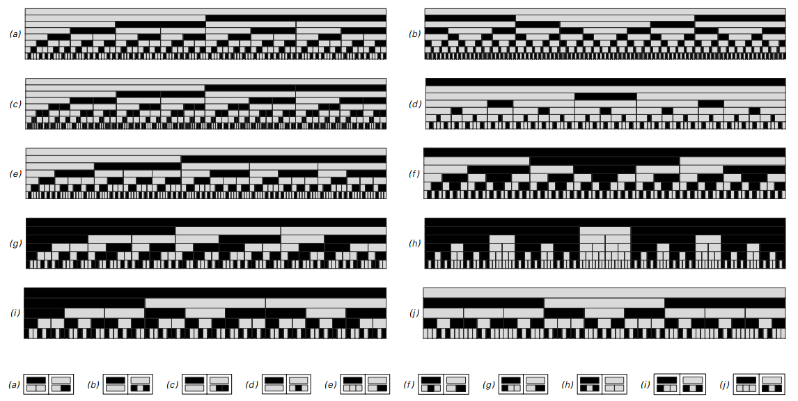
Replace system with tree visualization
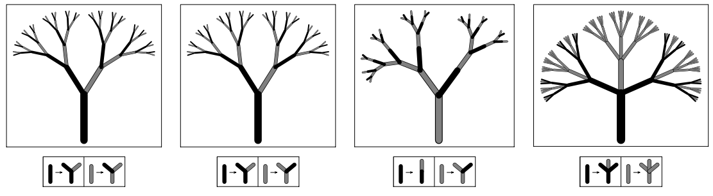

Replacement system including creation and destruction

<button class="expand-toggle" data-target="simplified" data-expanded="false">
  Expand details
  ▼
</button>

### [Sequential-substitution-systems](annotation:sequential-substitution-systems)
Change the replacement system to "find the first match from left to right and replace", and you get a model similar to the "find-replace" of a text editor. A small number of rules will only produce duplication or nesting, but when the set of rules expands, unpredictable sequences comparable to cellular automata can also occur.

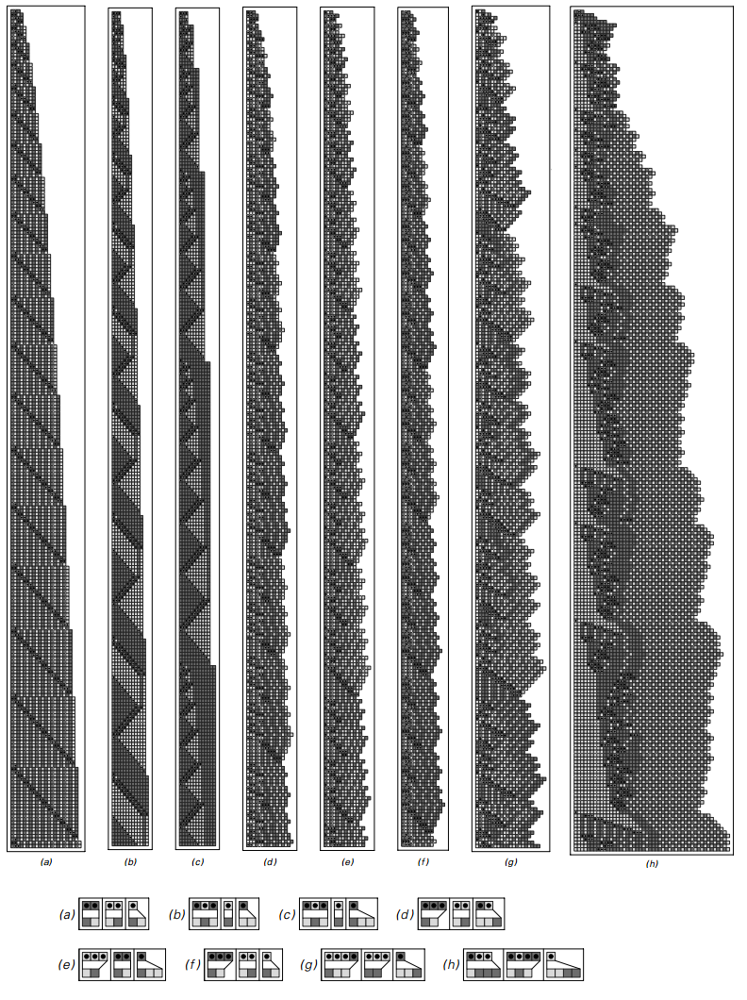

<button class="expand-toggle" data-target="simplified" data-expanded="false">
  Expand details
  ▼
</button>

### [Identification system](annotation:tag-systems)
The marking system removes a fixed number of symbols from the front of the sequence at each step, and then appends specific blocks of symbols to the end according to the pattern of removal. When one symbol is removed, it acts as a neighbor-independent substitution system; when two symbols are removed or a round-robin rule is used, complex interactions and random fluctuations emerge.

<button class="expand-toggle" data-target="simplified" data-expanded="false">
  Expand details
  ▼
</button>

### Cycle identification system

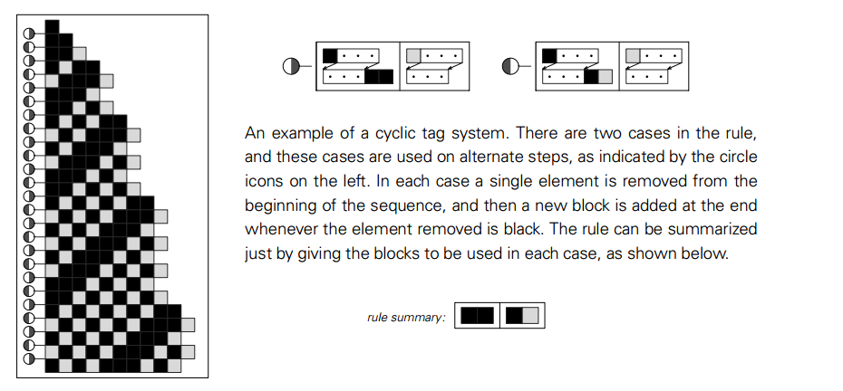

Growth fluctuations in cycle identification systems
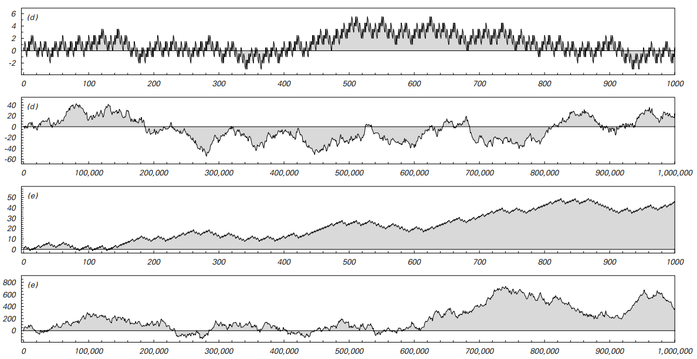

<button class="expand-toggle" data-target="simplified" data-expanded="false">
  Expand details
  ▼
</button>

### [Register machine](annotation:register-machines)
The register machine abstracts the way the underlying CPU operates registers through increment and decrement-jump instructions. Programs within four instructions eventually return to repetitive behavior, and when the number of instructions reaches eight, approximately random complex sequences appear, indicating that the complexity threshold is still very low.

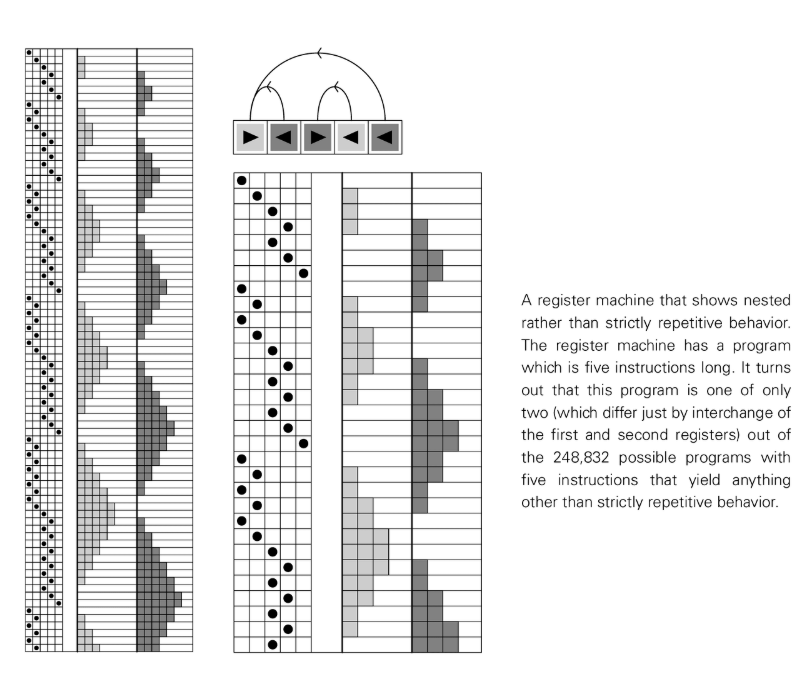

<button class="expand-toggle" data-target="simplified" data-expanded="false">
  Expand details
  ▼
</button>

### [Symbol system](annotation:symbolic-systems)
Similar experiments can also be performed in type rewriting systems: we simulate symbolic derivation with concise bracket expressions and substitution rules (such as `/.` matching substitution in Mathematica). Although the rules are highly non-local, these systems also exhibit repetitive, nested, and even random behaviors under simple settings.

<button class="expand-toggle" data-target="simplified" data-expanded="false">
  Expand details
  ▼
</button>

> Extended reading: [Combinators: A Centennial View](https://writings.stephenwolfram.com/2020/12/combinators-a-centennial-view/)

## Conclusion and reflection on methodology

This journey across many computational models finally led us to a solid and profound conclusion: extremely simple rules can emerge extremely complex behaviors. This is neither an accident nor a special case, but a universal computing phenomenon. Regardless of whether the underlying structure is a parallel cell array, a moving head, or a dynamic string, as long as the rules allow sufficient information processing power (the threshold is very low), they will exhibit the four common behavioral patterns.

The discovery itself relies on a new scientific method - [computer experiment](annotation:scientific-methodology). Instead of setting a goal and then constructing a system that can achieve it like traditional mathematics, we do it in the most direct way: running the simplest programs systematically and without bias, and observing their behavior in detail. It is this method that allows us to get rid of the constraints of intuition and capture phenomena that are difficult to deduce by pure theory. It also reminds us that the best way to discover new phenomena is often to conduct the simplest and most direct experiments, and to look at the vast amounts of raw data generated by the experiments with an open mind - many times, an image reveals far more information than any statistical summary.