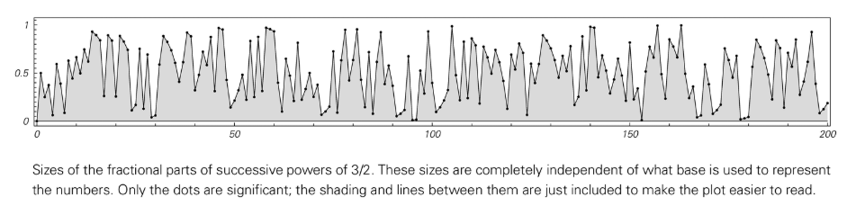

# Chapter 4: Number-Based Systems

## The concept of numbers
Traditional science has long focused on using numbers to describe natural systems, but this approach often idealized numbers and focused solely on their size. In this perspective, numbers are viewed as basic, indivisible entities whose only important property is their position on the number line. In computers, however, numbers must be explicitly represented by sequences of numbers (such as binary 0s and 1s), which reveal a deeper structure.

This difference is crucial. When we look at the way numbers are represented in computers (that is, their sequences of numbers), we see that even systems based on the simplest numerical rules can produce complex behaviors, with patterns that are strikingly similar to those produced by other [Numeric Simple Programs](annotation:numeric-simple-programs) such as [Numeric Cellular Automata](annotation:numeric-cellular-automata). Traditional mathematics often misses this point because it tends to look for systems that produce concise, closed-form solutions that are inherently simple in behavior. However, when we abandon this restriction and consider numbers as manipulable data structures, the origins of [Numeric Complexity](annotation:numeric-complexity) emerge from the details of these numerical sequences.

## Basic arithmetic
The seemingly simplest arithmetic procedures can lead to highly complex behavior. For example, by repeatedly adding 1 starting from 1, the generated number sequence (1, 2, 3, ...) will form a pattern with a complex nested structure under the binary representation, which shows that the simple accumulation process is not simple in the underlying structure.

 

Multiplication can produce more dramatic results. Repeated multiplication by 2 starting from 1, which in binary is just a simple left shift operation, produces a very simple, predictable pattern. However, if you multiply by three repeatedly, the resulting number sequence pattern is extremely complex, and although tiny triangular structures are still visible, it looks almost [random](annotation:numeric-randomness) on a macro scale.

This complexity is not simply an artifact of numerical representation. For example, the process of repeatedly multiplying by 3/2 results in a decimal-sized sequence that itself exhibits complexity and apparent [Numeric Randomness](annotation:numeric-randomness), proving that complexity resides in the value itself and not just in its binary visual representation. Even in systems involving only integers, such as systems that apply different rules based on the parity of the numbers, seemingly random behavior and unpredictable growth can occur. Together, these examples show that even basic arithmetic operations can generate highly complex and seemingly random behavior from simple rules, like an [Numeric Cellular Automata](annotation:numeric-cellular-automata).

> Additional reading: [After 100 years, can we finally crack Post’s labeling problem? A Story of Computational Irreducibility, and More](https://writings.stephenwolfram.com/2021/03/after-100-years-can-we-finally-crack-posts-problem-of-tag-a-story-of-computational-irreducibility-and-more/)

## Recursive sequence
[Recursive sequence](annotation:self-referential-recursion), that is, each item in the sequence is determined by the previous item, is another source of complexity. Standard linear recurrence relationships, such as the Fibonacci Sequence `f(n) = f(n-1) + f(n-2)`, have fixed rules and therefore often produce simple growth or repetitive behavior.

However, when a rule allows an item's index to depend on a previous value in the sequence, such as `f(n) = f(n - f(n-1)) + f(n - f(n-2))`, the behavior becomes much more complicated. The key here is that how far back the system goes to obtain information is determined by the values ​​it generates. This self-referential feedback loop breaks simple predictability. Although such rules involve only addition and subtraction, they generate sequences that can superimpose violent and seemingly random fluctuations on an overall growing trend. This shows that recursive application of even the most basic operations is enough to generate enormous complexity.

## Prime sequence
[Prime number sequence](annotation:prime-distribution-spectrum) is generated by a very simple rule (the sieve of Eratosthenes), but its distribution is extremely complex. The sequence of prime numbers (2, 3, 5, 7, 11, ...) exhibits randomness in many ways. For example, the spacing of primes, the distribution of specific forms of primes, and other related properties all show unpredictable fluctuations. This fact has profound implications: a sequence so fundamental in mathematics, so deterministically defined, behaves indistinguishably from a random process.

This phenomenon is not limited to prime numbers. Many other sequences based on simple numerical properties, such as the number of divisors of a number or the number of ways to write it as a sum of squares, also display tremendous complexity. Despite centuries of work by number theorists, many aspects of these sequences remain unsolved mysteries, strongly suggesting that complexity is an essential feature, rather than an exception, of these systems defined by simple rules of arithmetic.

## Mathematical constants
The numerical sequence of [mathematical constants](annotation:transcendental-digit-patterns) is another striking example of complexity. Sequences of numbers for rational numbers (such as 1/3 or 1/7) are always simply repeated. However, the sequence of numbers for a number like π, which results from a simple geometric definition (the ratio of a circle's circumference to its diameter), appears to be completely random, with no pattern found in the trillions of digits that have been calculated so far.

Likewise, the sequence of digits in a number like √2 also appears random. This complexity is an inherent property of these numbers, independent of the base in which they are represented. Changing the representation is a powerful test: for example, in [Continued Fraction](annotation:continued-fraction), rational numbers and quadratic irrational numbers (like √2) have simple or repeating patterns, but numbers like π and $\sqrt[3]{2}$ produce seemingly random sequences. When complexity persists across different basic representations, we can conclude that this complexity is an intrinsic property of numbers themselves.

## Math functions
Standard mathematical functions, such as `Sin[x]` or [Bessel Function](annotation:bessel-function), often produce simple repeatable curves. However, by combining these simple functions (annotation:function-superposition), it is possible to produce complex non-repetitive behaviors. For example, the curve of `Sin[x] + Sin[√2 x]` looks complex, random in many ways, and its waveform never repeats.

In addition, there are cases where a single function can produce complex behavior. A typical example is the [Riemann Zeta function](annotation:riemann-zeta-function), which is closely related to the distribution of prime numbers and its behavior curve is extremely complex. The zero position of the zeta function encodes deep information about the distribution of prime numbers, so the complexity and unpredictability of its curve directly reflects the complexity of the prime number sequence itself. To this day, many of its basic properties remain major unsolved problems in mathematics.

## [Iterative mapping](annotation:iterative-map-behavior) and [Chaos](annotation:iterative-chaos) phenomena
Iterative mapping is the process of repeatedly updating a value (usually between 0 and 1) under a fixed rule. Such systems can reveal two different types of complexity.

Some maps, such as `x → FractionalPart[2x]` (shift map), exhibit so-called "chaos" or sensitive dependence on initial conditions. Small changes to the initial value (that is, changing the number later in the sequence) will be gradually amplified over iterations, eventually leading to huge differences in the results. However, such a system does not generate randomness itself; it simply amplifies and reveals the randomness that is already present in the initial conditions. It acts like a conveyor belt, transporting deeper sequences of numbers from the initial number into prominence. If you start with a simple initial number such as 1/2, the behavior is simple and repetitive.

In contrast, mappings like `x → FractionalPart[3/2x]` inherently generate complexity. Even starting from a very simple initial condition, the system evolved into a complex sequence of numbers and numerical magnitudes. The arithmetic operations here themselves continually create new and complex arrangements of numbers. This shows that complexity can arise from the evolutionary process of the system itself, rather than just amplifying the randomness already present in the initial conditions, which is the fundamental difference between revealing information and creating it.

## Continuous Cellular Automata and Partial Differential Equations
Complexity is not limited to systems made of discrete elements such as integers or numbers. Complexity can also be found in continuous systems. This means that complexity is not a by-product of “digitization” or discretization, but a more general property of dynamic systems.

For example, in an [Continuous Cellular Automata](annotation:continuous-cellular-automata) where each unit can take on a continuous gray value, simple local rules can generate highly complex patterns, including seemingly random textures and discrete local structures, from the initial state of a single black unit.

Furthermore, complexity can arise even in completely continuous systems that are the basis of modern physics, such as those described by [Pde](annotation:pde) (PDEs). Although most PDEs studied historically (such as wave equations and diffusion equations) behave simply, searches can reveal some PDEs that are simple in form but whose solutions are highly complex. These continuous systems generate complex patterns that are very similar to what we see in discrete systems, providing an [Computation Physics Bridge](annotation:computation-physics-bridge) and the mathematical universe of traditional physics.

## Conclusion: Continuous vs. Discrete Systems
The complexity phenomena discovered in this book are not unique to discrete systems; they exist in continuous systems as well. However, this phenomenon is much easier to discover and study in discrete systems. Simulations of discrete systems are straightforward and unambiguous, allowing us to conduct an empirical, experimental-like mathematical exploration. In contrast, numerical analysis of continuous systems often introduces approximations and artifacts that make it difficult to determine whether the complexity seen is a true property of the system or an artifact of the computational method.

Nonetheless, the core conclusion is that the generation of complex behavior from simple rules is ubiquitous whether the system is discrete or continuous. This discovery was possible precisely because discrete systems provide a clear window into which we can observe this profound and universal principle.