# Chapter 5: Two dimensions and higher

## Introduction

The physical world we live in is three-dimensional, but the systems discussed previously in this book are basically limited to one dimension. This chapter aims to explore how much difference allowing for multiple dimensions makes. Traditional science, especially in the fields of physics and mathematics, often assumes that adding dimensions has fundamental, serious consequences. Many well-studied phenomena, such as fluid dynamics involving complex geometries or [Topological Knots](annotation:topological-knots) that require three dimensions to exist, do not occur in one dimension. However, adding dimensionality does not seem to have a fundamental impact on the phenomenon of complexity, the central theme of this book, the ability of simple rules to produce unpredictable behavior. Although we will encounter some specific effects that depend on multiple dimensions during the exploration process, the overall behavioral characteristics are not essentially different from those of a one-dimensional system, and the emergence of the basic phenomenon of complexity does not change significantly with the increase in dimensions.

## Cellular Automata

We can easily extend cellular automata from a one-dimensional linear arrangement to a two-dimensional grid, where the color of each cell is updated based on the state of its surrounding neighbors. The definition of these neighbors itself introduces new possibilities; the simplest neighborhood ([von-neumann-neighborhood](annotation:von-neumann-neighborhood)) only considers cells in the four directions of up, down, left, and right.

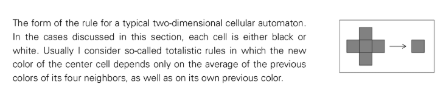

An extremely simple rule, that if any of its neighbors is black, then the center cell becomes black produces a uniformly expanding rhombus with a predictable morphology. However, just slightly modifying the rules, such as stipulating that a cell turns black only when one or all four of its neighbors are black, produced surprisingly complex but highly regular snowflake-like patterns that exhibit self-similarity at different scales. What’s even more interesting is that if we stack these two-dimensional patterns layer by layer, we can construct a three-dimensional object with a regular [Nested Patterns](annotation:nested-patterns) structure to visualize the time dimension.

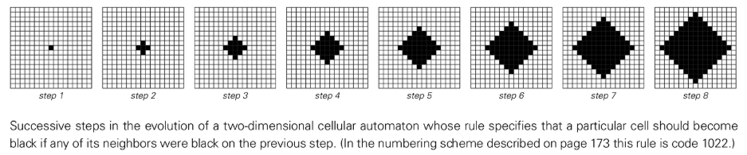

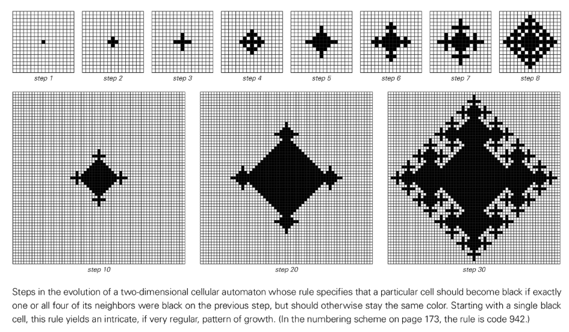

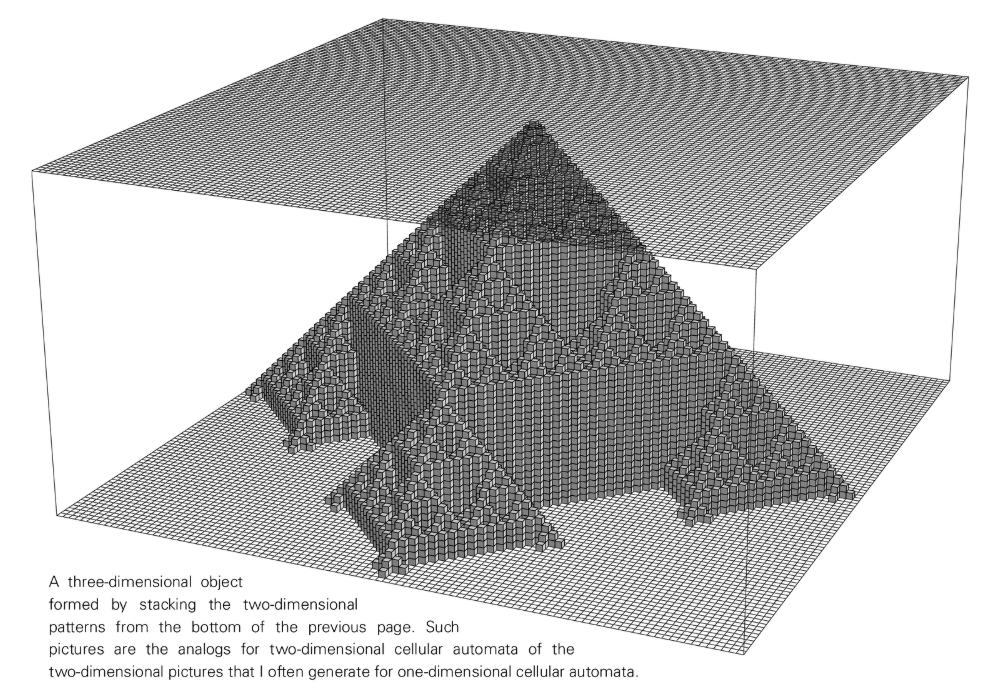

By exploring different 2D cellular automata rules, we find that their generated complexity is very similar to the 1D case. A powerful demonstration of this is that when we look at any one-dimensional slice of these two-dimensional patterns, their evolution over time is strikingly consistent with the simple, nested, or complex behaviors we see in one-dimensional cellular automata.

Although many rules produce geometrically regular patterns, we can also find rules that produce irregular shapes. For example, certain rules can produce patterns with rough surfaces or an overall shape that approximates a perfect circle, demonstrating the profound connection between local rules and global morphology. More complex rules, such as when a cell turns black when exactly three of its eight neighbors (including the diagonal [Moore Neighborhood](annotation:moore-neighborhood)) are black, can evolve from very simple initial conditions (such as a row of black cells) to complex macroscopic structures that are constantly changing and have no simple overall shape. This clearly shows that complexity is not only reflected in the microscopic arrangement of cellular details, but also in the overall macroscopic shape of the pattern.

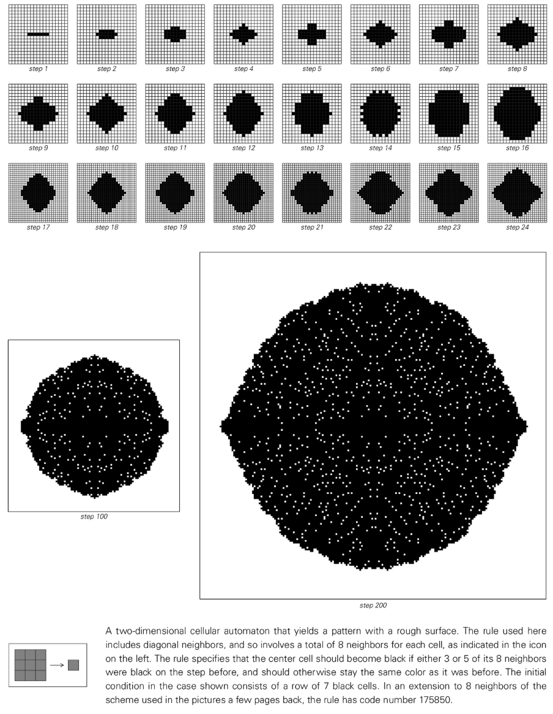

Extending this concept to three-dimensional cellular automata, we can observe some new specific phenomena, but the basic type of behavior is the same as in one and two dimensions. The final conclusion is that the emergence of the fundamental phenomenon of complexity does not seem to depend critically on the dimensions of the system.

## [Turing machine](annotation:turing-machines)

Similar to cellular automata, Turing machines can also be generalized from one-dimensional strips to two-dimensional grids. In this setting, the read-write head is no longer limited to moving forward and backward, but can move freely in the four directions of the grid, up, down, left, and right. At each step, the read-write head reads the color of the current cell and decides to write a new color, change its own state, and select the next movement direction based on its own internal state. We might intuitively expect that giving a machine the freedom to move across an entire plane would make it easier to produce complex behaviors, but in reality the situation is very similar to one dimension.

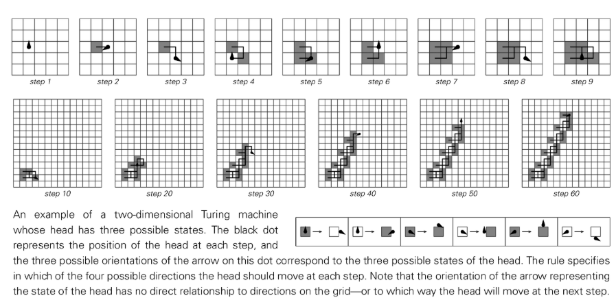

For Turing machines with two or three states, their behavioral trajectories often exhibit only repeating and nested patterns. More complex behavior becomes possible when the number of states increases to four, but this is still a fairly rare phenomenon. In the exploration of a large number of random rules, the vast majority of behaviors are extremely simple, and only a few will exhibit complex behaviors with seemingly completely random paths. This once again confirms a core point: merely increasing the degree of freedom of a system (such as the spatial dimension here) does not necessarily lead to an increase in complexity.

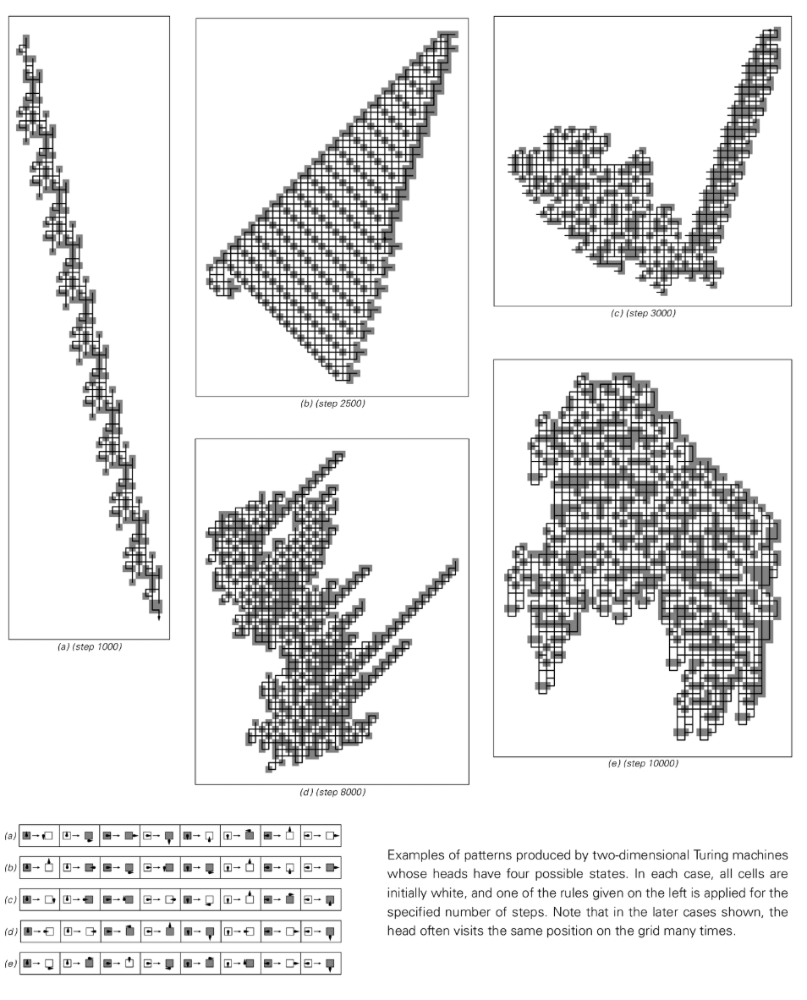

## [Substitution System](annotation:substitution-systems) and fractal

One-dimensional replacement systems work by subdividing elements into smaller elements at each step, a concept that naturally extends to two dimensions. In a two-dimensional replacement system, each square is replaced at each step by a set of smaller squares, a recursive process that often results in complex patterns with finely nested structures. This nested structure arises inevitably because each newly generated square will be replaced again in exactly the same way, thus repeating a reduced copy of the entire pattern at different scales, creating what is called "self-similarity." No matter which part of the pattern you zoom in on, you'll see a miniature that resembles the overall structure.

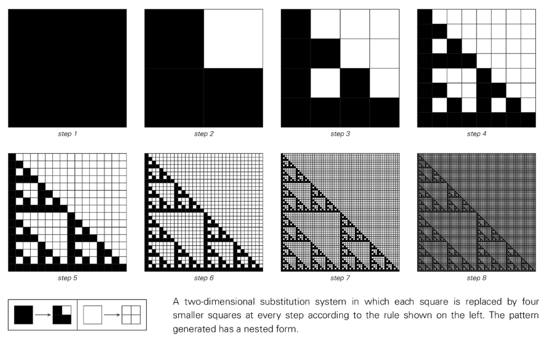

This process does not rely on a rigid grid. Simple geometric rules are used to replace the squares, and even though there may be overlap between squares, the resulting pattern is still highly regular and nested. This idea of ​​building patterns through the repeated application of geometric rules is at the heart of "fractal geometry." As long as the rules are context-free, that is, the replacement of an element depends only on itself and not on its neighbors, then the resulting patterns are necessarily nested.

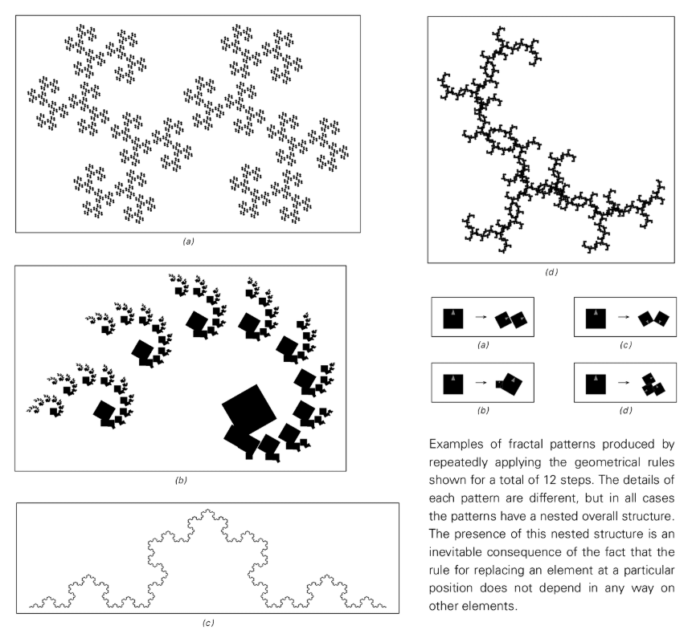

To obtain more complex, non-nested structures, it is necessary to introduce interactions between elements, that is, the replacement rule of an element depends on the status of its neighbors. In a grid-based system, this is easy to implement and can instantly produce a variety of complex, non-purely nested patterns. However, generalizing a sequential replacement system (i.e., replacing only one block of elements in a step) to higher dimensions is more difficult because in one dimension there is a natural left-to-right scanning order, whereas in two dimensions any preset scanning path (such as a spiral) effectively reduces the problem back to one dimension.

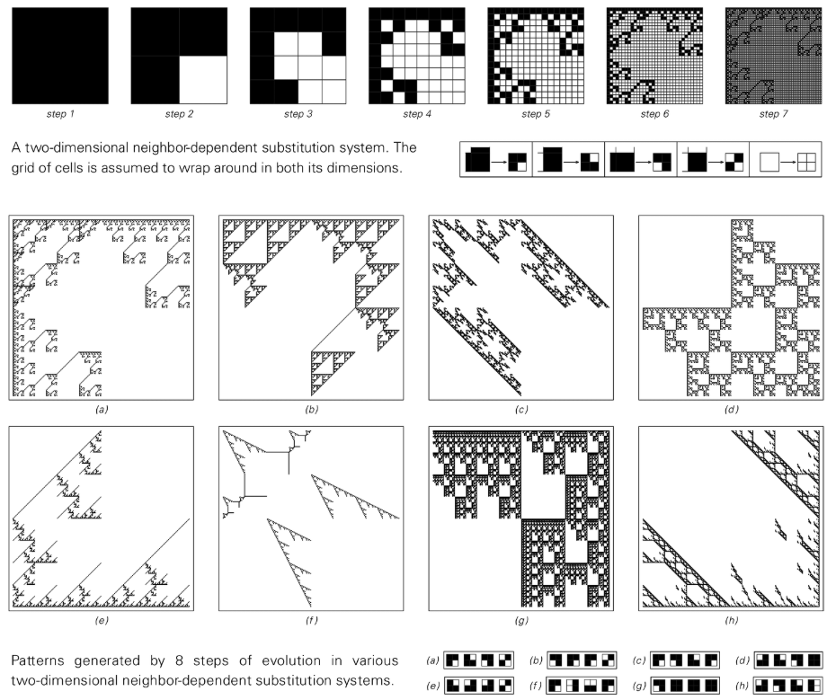

## [Network system](annotation:network-systems)

A system like a cellular automaton has its elements always arranged in a fixed, pre-existing regular array. However, we can build a more fundamental system whose structure itself can evolve—what we call a networked system. A network system consists of nodes and the connections between them, and its rules dictate how these connections change over time. In such a system, there is no fixed background space; the space itself is defined by the connection patterns of the nodes. The properties of a system depend only on how the nodes are connected, not on any particular visual arrangement of them in space.

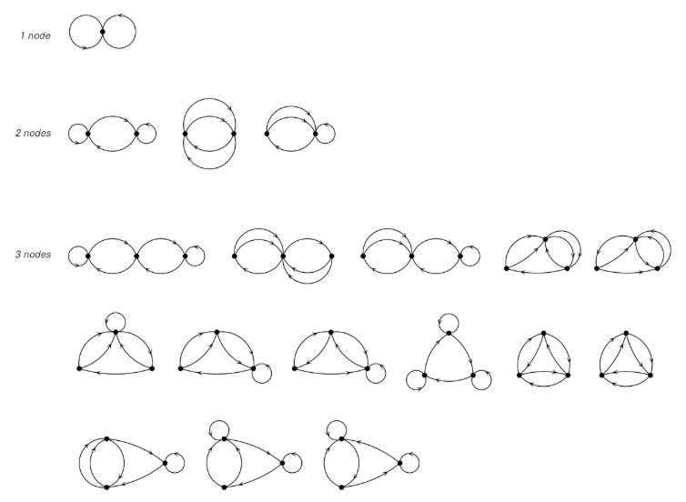

By cleverly changing the connection patterns between nodes, structures with different effective dimensions can be constructed. For example, connect each node block to two neighbors to form a one-dimensional line; to four neighbors to form a two-dimensional grid; to six to form a three-dimensional array. It is even possible to construct infinite trees or nested geometric structures.

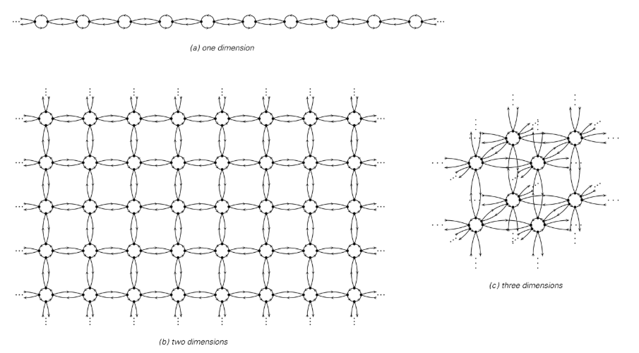

The evolution rules of a network can dictate how it is rewired based on the local structure around each node. Simple rules, such as all nodes performing the exact same action, often lead to simple repetitive growth. However, the behavior becomes more complex if the rules allow different actions to be performed based on the node's local network structure. Especially when the basis for judging a rule relies on network features that are slightly distant (such as within two or three steps), complex behaviors immediately become possible. In this case, the total number of nodes in the network can change drastically in a seemingly completely random manner, which means that the structure of the system "space" itself is evolving unpredictably.

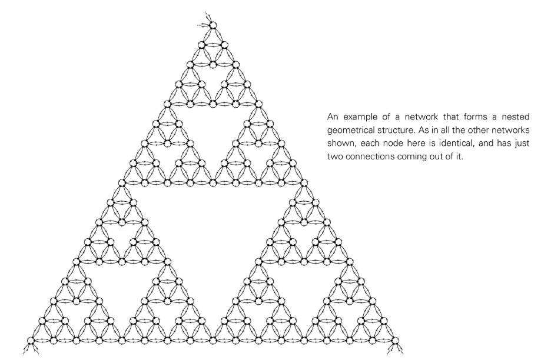

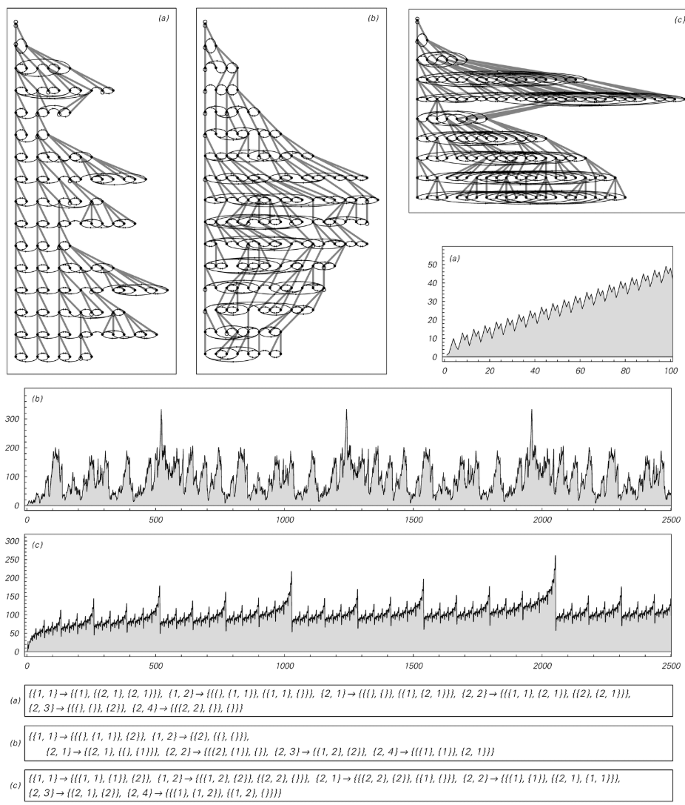

## [Multiway systems](annotation:multiway-systems)

All systems we have discussed so far have only one deterministic state that evolves over time. Multi-way systems are different. They can have multiple possible states at each step, similar to exploring all branches of a decision tree at the same time. Each state in the system consists of a sequence of elements, and the rules specify various possible substitutions of the elements in the sequence. Unlike sequential substitution systems that perform only one substitution, multiplexed systems perform all possible substitutions at each step and retain all resulting new, non-repetitive sequences.

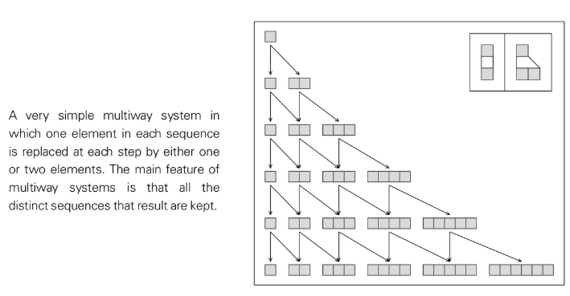

Simple rules may cause the number of states to grow steadily in a predictable manner (such as linear or quadratic). But other rules can lead to complex fluctuations in the number of states, sometimes with surprising long-term periodicity and sometimes with a greater degree of randomness. Although some systems may appear random in the early stages, they may eventually settle into a grand, repeating pattern. For systems whose number of states grows exponentially, although it is difficult to completely track all states, the set of sequences generated in the early stages can themselves exhibit repeating, nested, or more complex structures.

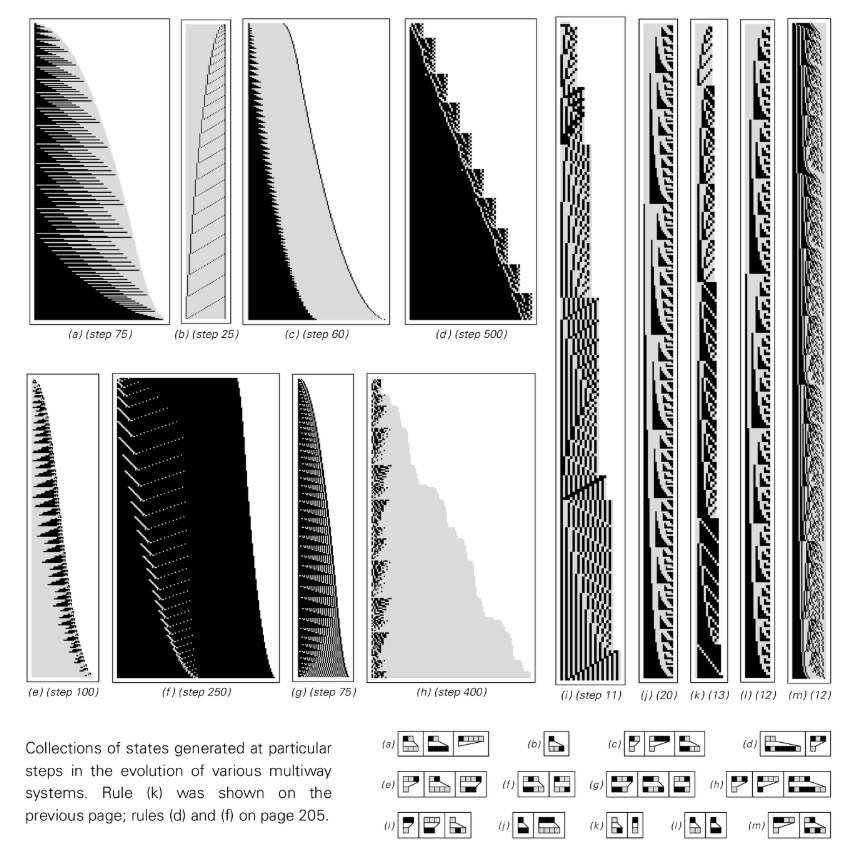

The complete evolution of a multipath system can be elegantly represented as a network, in which each unique sequence (state) appears only once as a node. This network shows the causal connections between states that evolve over time, where different evolutionary paths can rejoin the same state. The structure of this "state space" network itself can also become quite complex as it evolves, revealing a nonlinear concept of time that coexists with branching and merging.

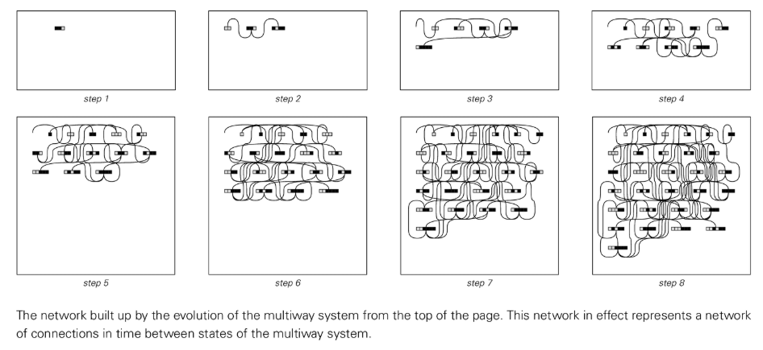

> Extended reading: [Multicomputation with numbers: the case of simple multiway systems](https://bulletins.wolframphysics.org/2021/10/multicomputation-with-numbers-the-case-of-simple-multiway-systems/)

## [Constraint-based systems](annotation:constraint-based-systems)

Most of the systems in this book are based on explicit, imperative evolutionary rules: "If you see A, do B." However, another way common in traditional science is to set up the system by defining constraints that the system must satisfy, namely "A must not appear in the final pattern."

For example, a constraint could be that every cell in a one-dimensional row must have exactly one black and one white neighbor. This seemingly simple local constraint, through global interaction, ultimately allows only one global pattern to exist: a simple, alternating repeating sequence of ABAB. Other constraints may allow for more patterns, but in all cases local constraints in any one dimension can always be satisfied by simple repeating patterns. This means that, in one dimension, complex patterns cannot be forced by local constraints alone.

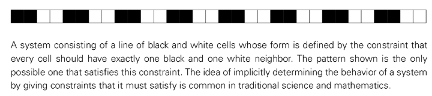

In two dimensions, the situation is different. While most simple local constraints (e.g., how many black or white neighbors each cell must have) can still only be satisfied by simple repeating patterns, there is a theoretical possibility to force complex patterns. Finding such constraints is extremely difficult because it requires a systematic, large-scale computational search, unlike evolutionary rules that can be directly run and the results observed. In the vast majority of cases, a simple repeating pattern will suffice if a constraint can be satisfied.

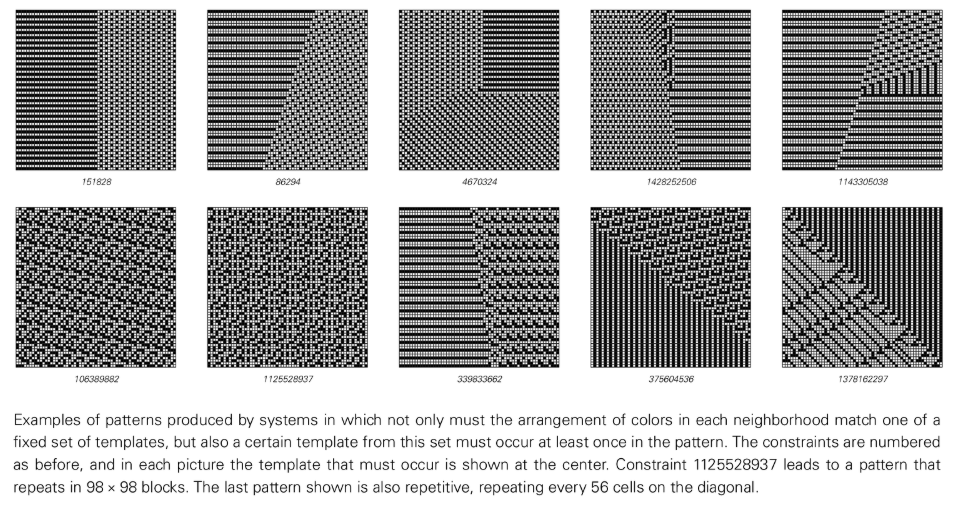

However, with clever extensions to the constraint types (for example, not only requiring that all local templates be legal, but also requiring that a particular template must appear at least once in the entire pattern), the situation changes radically. After a massive computational search, a simple constraint system can be found that enforces a non-repeating pattern with a nested structure. Going a step further, by constructing more complex templates based on 3 × 3 neighborhoods, it is even possible to design constraints whose only allowed satisfying pattern is complex and largely seemingly random, such as a complex pattern that corresponds one-to-one to a pattern generated by a one-dimensional regular 30 cellular automaton.

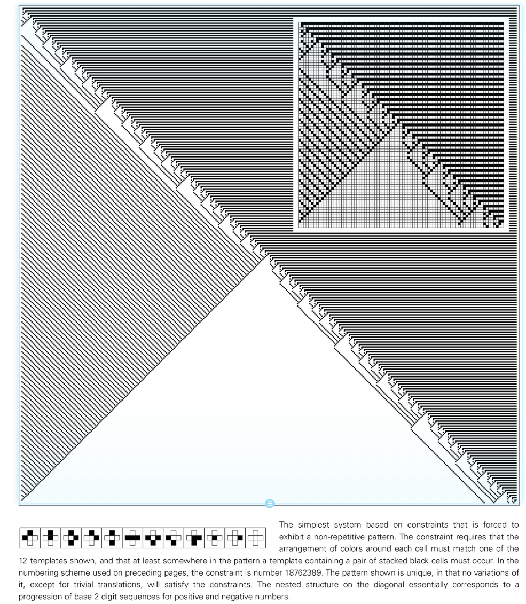

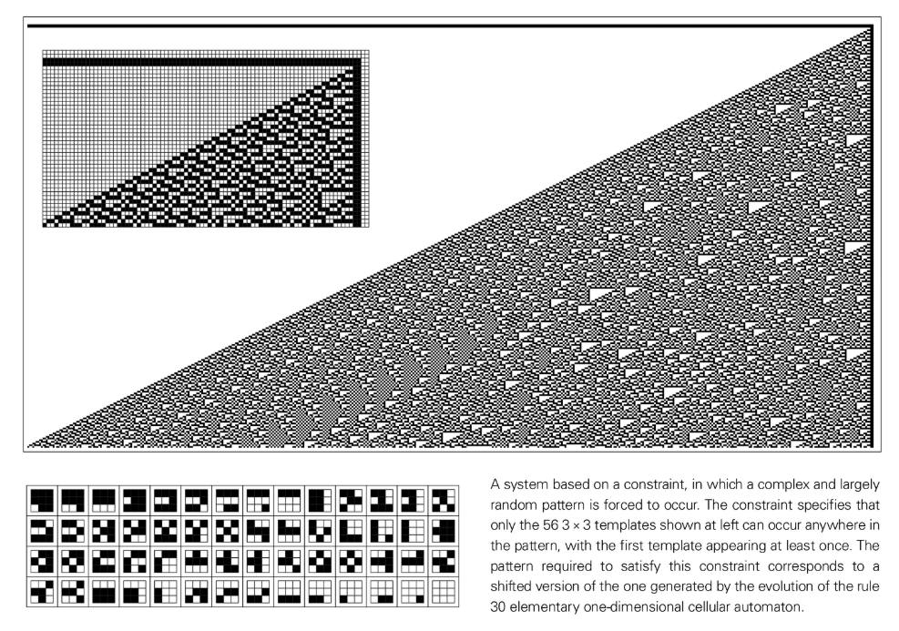

This finding is profound, showing that even in the absence of an explicit temporal evolution mechanism, complexity can emerge as an unavoidable global outcome that a system must achieve in order to simultaneously satisfy a set of simple local conditions. However, this seems to be quite rare. Unlike many of the simple evolutionary rules discussed in this book, the vast majority of simple constraints lead to simple, predictable patterns.