# Chapter 6: Starting with Randomness

## The emergence of order

In previous chapters we have seen many behaviors that simple programs can produce, but we have mainly considered the simplest initial conditions, such as starting with a single black cell. This chapter aims to explore the other extreme: completely random initial conditions, where the color of each cell is randomly chosen.

One might think that from this randomness no order can emerge. But we will find that many systems organize spontaneously, and even under completely random initial conditions, they end up with many properties that are not random.

A simple example is a cellular automaton (CA) evolving according to the rule "if any neighbor is black, then the cell becomes black". Starting from random initial conditions, all white areas are gradually filled with black, and eventually the system reaches a uniform state where all cells are black. Some other simple rules will also cause the system to quickly evolve to a uniform white or black state.

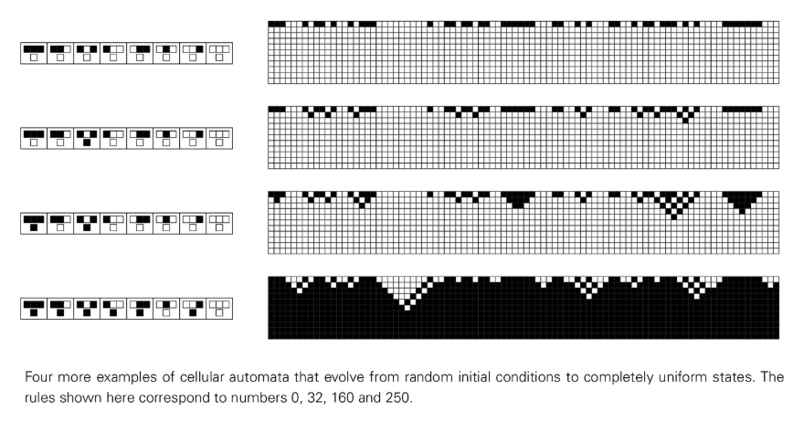

There are also cellular automata whose behavior is slightly more complex. They also stabilize rapidly from random initial conditions, but their stable state is not uniform but consists of a series of fixed or periodically repeating structures.

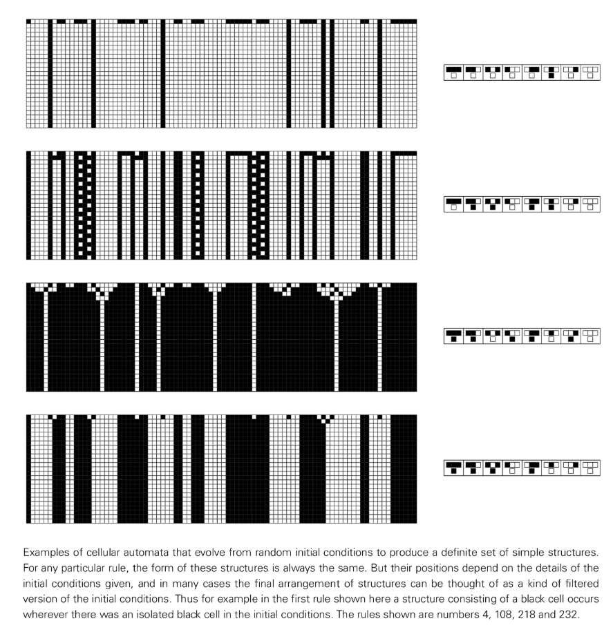

However, not all cellular automata with simple rules do this. Many systems, such as [Rule 126](annotation:rule-126), will continue to exhibit complex behavior forever, even if they start from random initial conditions. In many ways this behavior appears completely random, but structures such as white triangles scattered throughout the pattern also show a degree of organization.

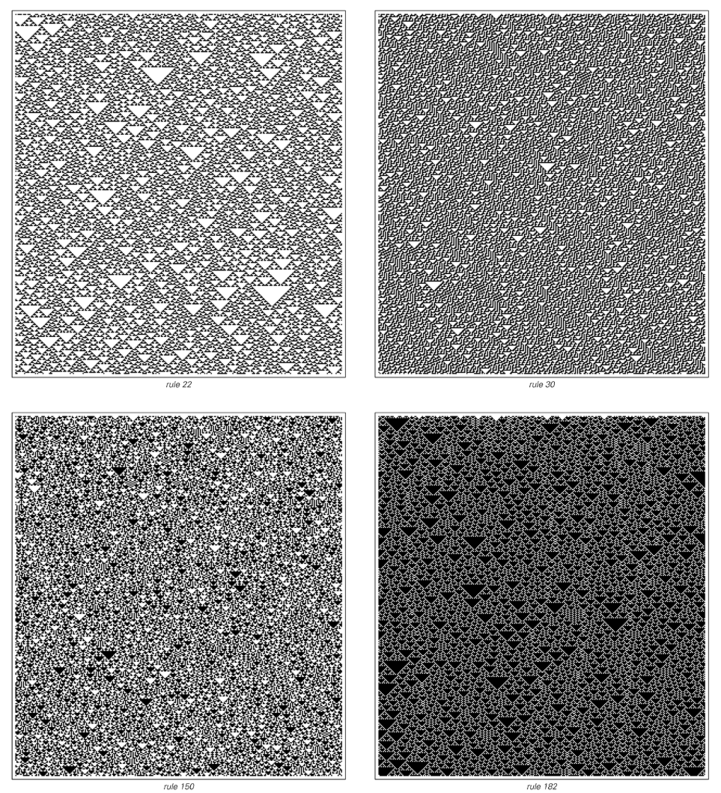

So, what are the complexity limits of the behavior of a cellular automaton starting from random initial conditions? We have seen that some systems stabilize rapidly and others remain random forever. But the greatest complexity lies somewhere in between. Taking [Rule 110](annotation:rule-110) as an example, the system starts from random initial conditions and will quickly organize into a series of clear local structures. These structures are not static, but move around and interact with each other in complex ways, ultimately forming an elaborate pattern that mixes order and randomness as complex as anything we've seen in this book.

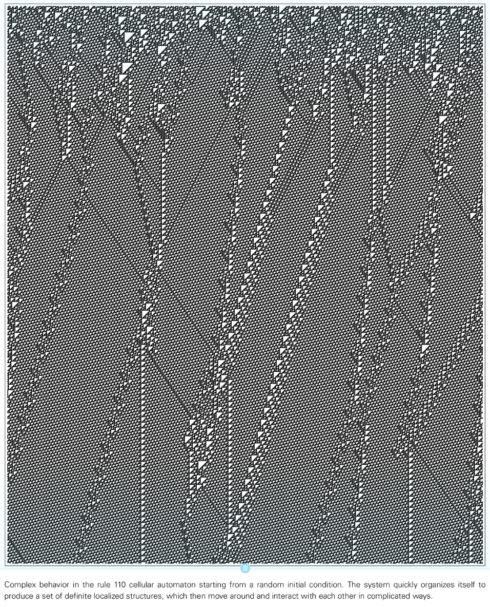

## [Four classes of behavior](annotation:four-classes-of-behavior)

When we examine the behavior of arbitrary cellular automata, a striking finding is that although the specific patterns generated by each rule vary, these patterns can fundamentally be classified into a very limited number of types. In fact, the behavior of almost all cellular automata can be easily divided into four basic categories.

- [**Category 1**](annotation:class-1): The behavior is very simple and almost all initial conditions will evolve to the exact same uniform final state.
- [**Category 2**](annotation:class-2): There are many possible final states, but they all consist of a simple set of structures that either remain the same or repeat in short cycles.
- [**Category 3**](annotation:class-3): The behavior appears random in many respects, although triangles or other small-scale structures are always observed at some scale.
- [**Category 4**](annotation:class-4): Mixes order and randomness. Systems create local structures that are themselves fairly simple, but they move and interact in very complex ways.

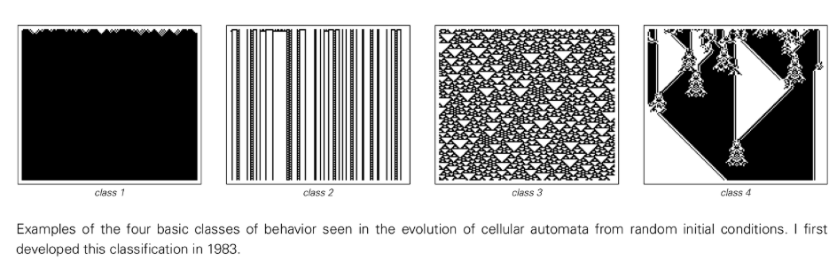

This classification was initially based on the visual appearance of patterns, but subsequent research has found that many detailed properties of cellular automata are closely related to these categories. This situation is analogous to the division of matter into solid, liquid, and gaseous states, or the division of living things into plants and animals. This classification scheme applies not only to one-dimensional cellular automata, but also to two-dimensional and even continuous cellular automata.

## Sensitivity to initial conditions

The four categories also showed significant differences in how they responded to small changes in initial conditions, revealing fundamental differences in how they process information.

- **Category 1**: Any changes will eventually disappear and the system will forget its initial conditions.
- **Category 2**: Changes may persist, but are always localized to a small area and information does not propagate between parts of the system.
- **Category 3**: Exhibiting long-range communication of information. Small changes in any part of the system will eventually propagate to the furthest parts.
- **Category 4**: Long-range communication of information is possible, but does not always occur. Changes are propagated only when they affect local structures that can move within the system.

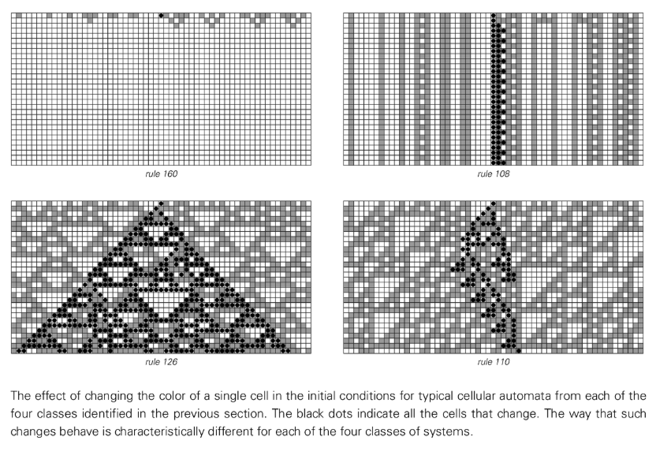

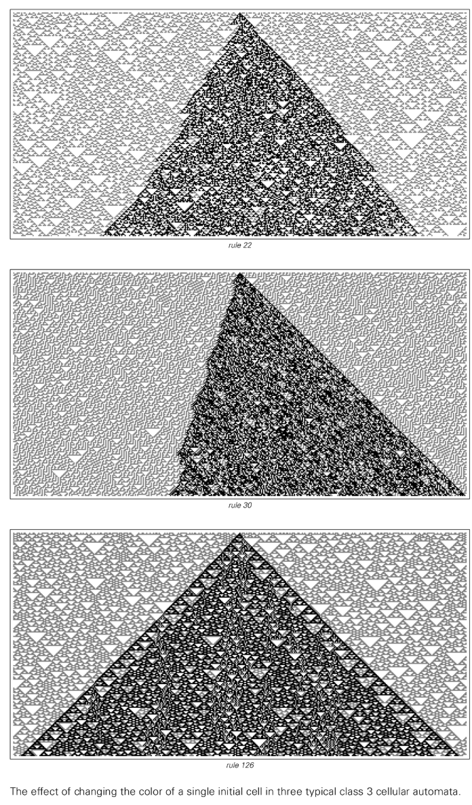

## Finite size systems and Category 2 behavior

Category 2 systems always end up exhibiting repetitive behavior and do not support long-range communications. The connection between the two is that the lack of long-range communication actually forces every part of the system to behave like a system of limited size. And any finite-size system made of discrete elements and obeying deterministic rules must eventually exhibit repetitive behavior. This is because the total number of states of the system is limited, so during the evolution process, it will inevitably return to a state that once appeared and start to repeat.

## Randomness in Category 3 Systems

The most striking characteristic of a Category 3 system is the randomness of its behavior. Is this randomness simply a reflection of randomness in the initial conditions? The key point is that random behavior can occur even if there is no randomness in the initial conditions. For example, [Rule-30](annotation:rule-30) Whether starting from random initial conditions or from a single black cell, the resulting patterns quickly become indistinguishable, exhibiting typical random behavior.

This suggests that this randomness is intrinsically generated by the system's evolutionary process. This inherent ability to generate randomness gives systems a kind of stability: their overall stochastic behavior and macroscopic properties remain unchanged regardless of initial conditions. However, there are some exceptions, such as additivity [Rule-90](annotation:rule-90), where the resulting pattern is simply a superposition of the structures in the initial conditions, so its randomness comes entirely from the randomness of the initial conditions.

## Special initial conditions

We have seen that cellular automata like [Rule 30](annotation:rule-30) can produce seemingly random behavior whether starting from random or simple initial conditions. But does this mean that it cannot produce simple behavior in any case? This is not the case. Even Rule 30 can produce simple repetitive behavior by setting up special initial conditions consisting of infinite repetitions of specific blocks of cells.

What’s more interesting is that by setting special initial conditions, one cellular automaton can simulate the behavior of another cellular automaton. For example, [Rule 126](annotation:rule-126) can behave exactly like [Rule 90](annotation:rule-90) under certain conditions. This explains why many different rules produce the same nested pattern when starting from simple initial conditions.

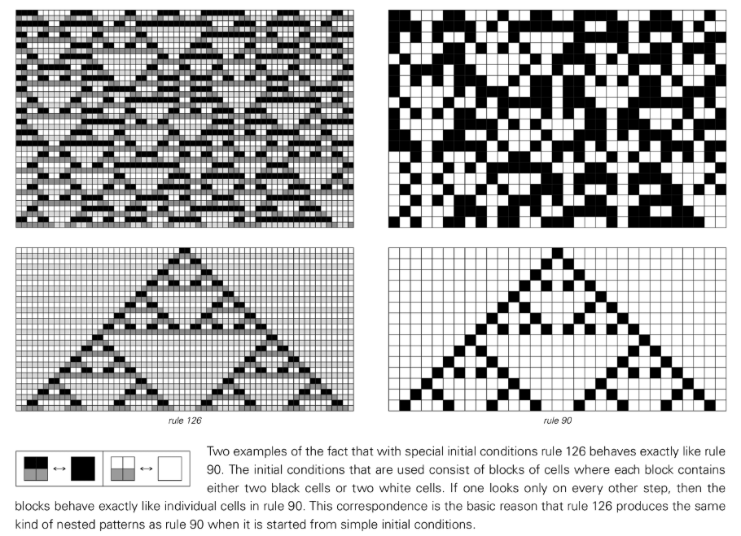

## The concept of attractor

As cellular automata evolve from random initial conditions, the possible cellular sequences that can emerge become increasingly constrained over time. The set of possible states that the final system evolves toward is called an attractor.

We can use an [State Network](annotation:state-network) to represent all cell sequences that may appear at each step of the evolution process. For Category 1 and Category 2 systems, the complexity of this network increases slowly and is limited. But for Category 3 and Category 4 systems, the complexity of the network increases rapidly, reflecting the complexity of its behavior.

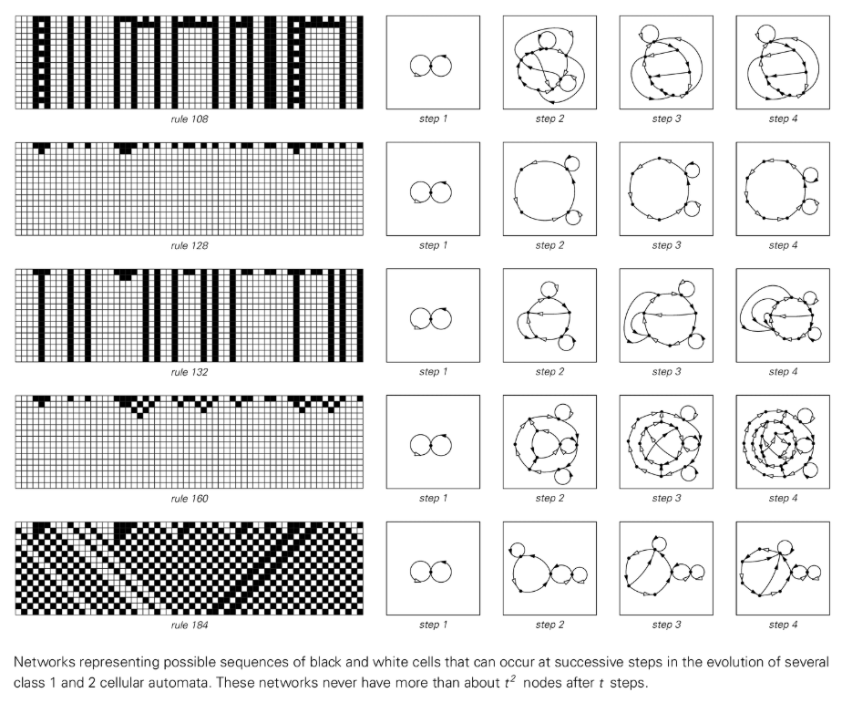

## Structures in Category 4 Systems

Category 4 systems are typically characterized by the emergence of well-defined, persistent local structures in a stochastic background. These structures are key to Category 4 complexity because they can move, passing information between different parts of the system.

A "zoo of structures" supported by a given Category 4 rule can be discovered through a systematic search of a large number of initial conditions. For example, [Rule 110](annotation:rule-110) supports a variety of structures, some stationary and some moving at different speeds. When these structures collide, their interactions can be incredibly complex, sometimes requiring thousands of steps to see the final result.

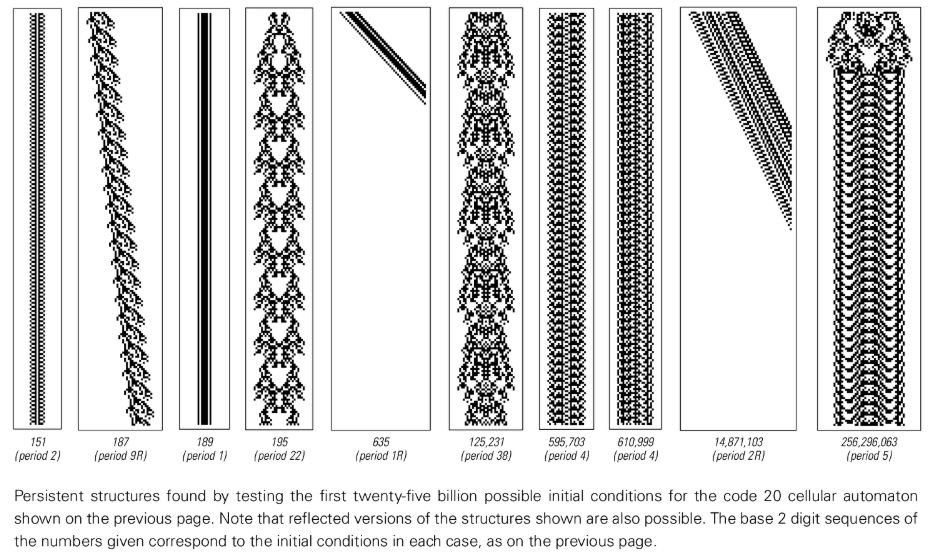

What's more, some Category 4 systems also support structures capable of infinite growth, sometimes referred to as "glider guns." As these structures are moved, they continually create new persistent structures, allowing the overall pattern to grow forever. This phenomenon, the emergence of infinite and often complex growth from simple deterministic rules and finite initial conditions, is a profound manifestation of the computational power and complexity in these systems.

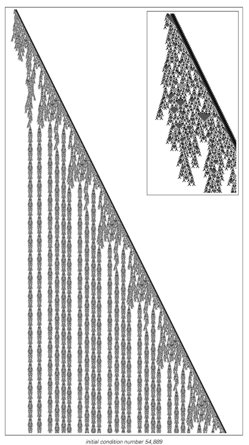