# Chapter 7: Programs and the Mechanisms of Nature

## Universality of behavior

Simple programs, although their rules may be extremely simple, can generate incredibly complex behavior. This is one of the core findings of this book. What's even more striking is that the behaviors produced by these simple procedures show striking similarities to phenomena we observe widely in nature. This similarity is not an accidental coincidence or an optical illusion, but a profound reflection of a fundamental correspondence between simple programs and natural systems.

When we observe the natural world, we find a common phenomenon: many systems exhibit very similar behavior patterns at the macroscopic level, even though their underlying physical, chemical, or biological makeup is very different. Similarly, in the study of simple programs, we can also observe that even if the underlying rules of the programs are very different, the overall behavior they generate can be highly consistent. This reveals a kind of "behavioral universalism," in which certain types of behavior patterns appear repeatedly, independent of the specific details that make up the system.

This insight is crucial because it means we can gain a deep understanding of how natural systems work by studying the behavior of simple programs. The fundamental driving forces behind natural phenomena are essentially the same as the mechanisms we see in simple programs. Therefore, this chapter aims to delve into some common phenomena in nature, clarify how they correspond to behavior in simple programs, and pay special attention to complex phenomena that are difficult to fully explain using traditional scientific frameworks, showing how new scientific methods can provide clear and powerful explanations for them.

## Three mechanisms of randomness

In nature, randomness is a ubiquitous phenomenon. Through systematic research on simple programs, I found that the generation of randomness can be mainly attributed to three basic mechanisms:

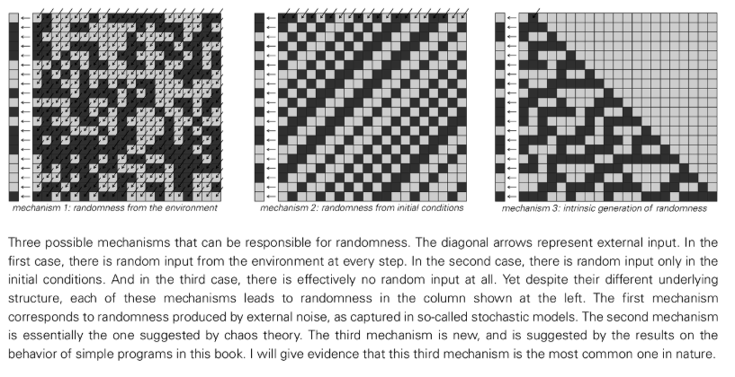

### Randomness from the environment

This is the most classic and widely accepted view in traditional science. It believes that the randomness of a system is the result of its continuous interaction with an external environment full of uncertainty. In daily life, the bumping of ships on the water is a good example. The movement of the ship seems random, but in fact it is passively following the random waves. In the microscopic world, the irregular beating of pollen grains in Brownian motion is caused by the never-ending and unpredictable collision of a large number of molecules in the liquid. The essence of this mechanism is that randomness is continuously input into the system as a kind of external "noise". However, this view doesn’t really explain the ultimate source of randomness, just attributing it to a larger “external system” that we happen to not be studying. In addition, physical random sources in reality (such as [Electronic Noise Generator](annotation:electronic-noise-generator)) often fail to produce perfect randomness due to the "memory effect" (relaxation time) of the internal state and the subtle correlations existing in the environment.

### Randomness from initial conditions ([chaos theory](annotation:deterministic-chaos))

This mechanism believes that randomness is not continuously injected into the system during its evolution, but is rooted in the initial conditions of the system that cannot be infinitely accurately measured. The system itself follows completely deterministic rules, but its evolutionary trajectory shows extreme sensitivity to initial conditions. A tiny initial difference will be exponentially amplified over time, eventually leading to randomness in macroscopic behavior. For example, the final result of tossing a coin or a die depends largely on a series of small random changes in initial speed, rotation, and angle that cannot be accurately reproduced by the human hand. However, the essence of this mechanism is a kind of "transcription", which only reveals the randomness that already exists in the initial conditions (shown as randomness in the infinite number sequence), and the randomness of its behavior is completely limited by the randomness of the initial conditions. Therefore, it also does not answer the question of the source of randomness, but just pushes the question to the "original initial".

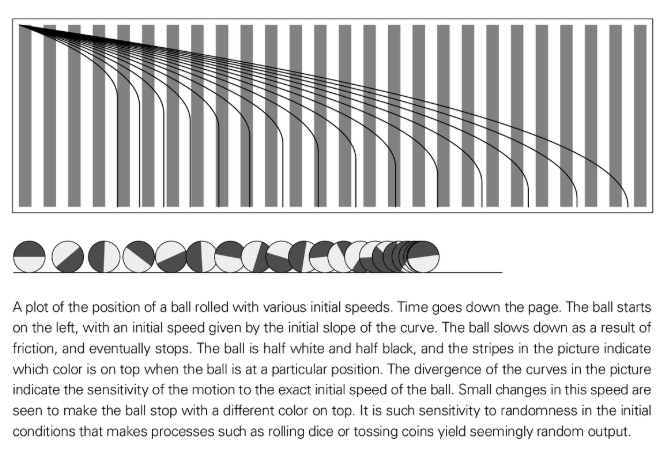

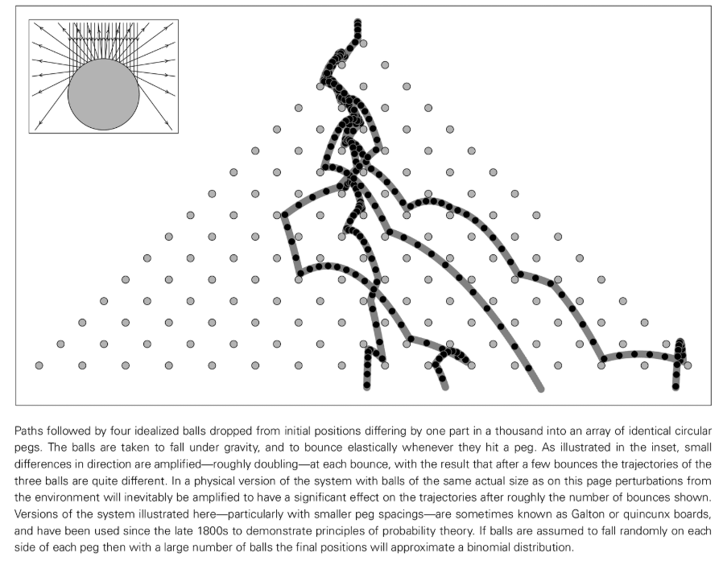

[Three-body problem](annotation:three-body-problem)
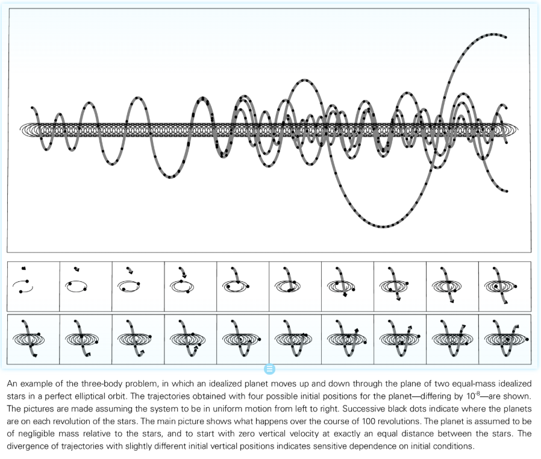

### Intrinsic generation of randomness

This is a revolutionary discovery made in this book. It reveals that a system, even in the absence of random inputs - with extremely simple rules and initial conditions - can, through its own completely deterministic evolution, create from scratch highly complex behavior that appears random under all practical testing criteria. "[Rule 30](annotation:rule-30)" The cellular automaton is an example of this mechanism. It starts with a single black dollar, follows a simple rule, and yet generates a statistically impeccable random sequence. This mechanism does not rely on any external source of randomness, but creates randomness intrinsically and spontaneously. We find this phenomenon very common in various simple programs. Therefore, we have good reason to believe that most, if not all, of the random phenomena we observe in nature have their ultimate roots here. A key and unique feature of this mechanism is that the random behavior it produces is repeatable in detail - as long as the experimental settings (rules and initial conditions) are exactly the same, every run will result in exactly the same random sequence, in sharp contrast to the unpredictable, non-repeatable randomness produced by the previous two mechanisms.

## Continuity phenomenon

In nature, many systems such as water flow and air flow exhibit continuous and smooth macroscopic properties. However, the basic components of the programs we use to model, such as cellular automata, are discrete. How should the seemingly existing gap between the two be unified?

The key is that the average behavior of a large number of discrete components on a macroscopic scale can exhibit perfect continuity. Randomness is the core element in realizing the transition from discrete to continuous. When a large number of discrete particles (such as molecules or sand grains) perform irregular random motions (i.e., "random walks"), their discrete, jagged trajectories are "averaged" as a whole, resulting in a smooth macroscopic motion like a fluid.

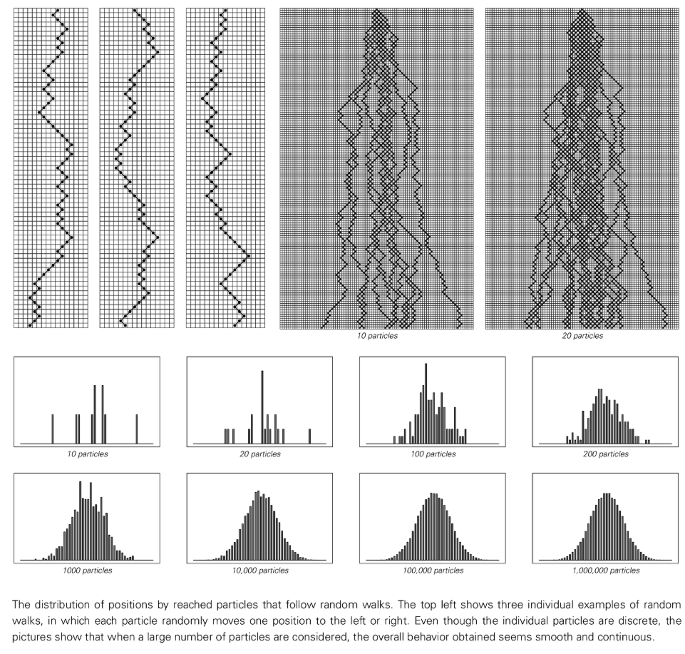

Similarly, in the simple "[aggregation model](annotation:aggregation-model)", although we only randomly add a discrete unit at the edge of the existing cluster at a time, after thousands of steps, the formed cluster will also appear as an approximately smooth circle macroscopically. Importantly, the randomness to achieve this smoothing effect does not have to come from the outside. The randomness "inherently generated" by the system can also effectively drive this smooth macroscopic result.

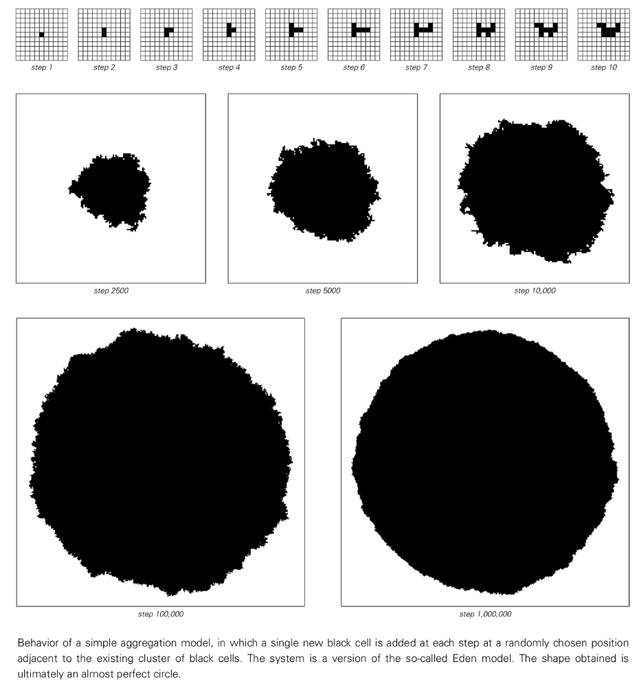

## The origin of discreteness

Corresponding to continuous phenomena, nature is also full of various distinct discrete phenomena, such as black and white stripes on animal fur rather than continuous gradients of gray. How does this discreteness arise?

An important mechanism is that even if the underlying rules of a system are completely continuous, its macroscopic behavior may exhibit discrete characteristics. This is usually achieved through what is called an "[Phase Transition](annotation:phase-transition)". When a control parameter of a system is changed continuously and smoothly, the behavior of the system itself may undergo a sudden, discontinuous state transition at a specific critical point.

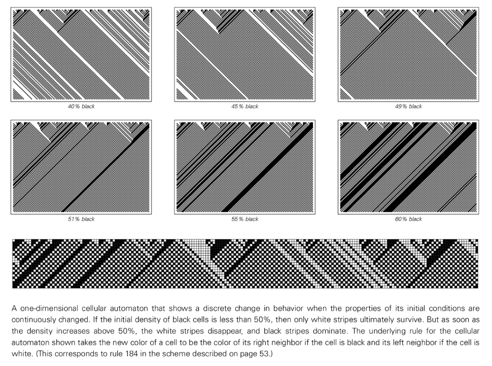

A similar phenomenon can be clearly observed in our program model. For example, in a one-dimensional cellular automaton, if we take as a parameter the density occupied by the initial black cells and increase continuously starting from 0. We will find that as long as the density is less than 50%, no matter what the specific value is, the system will eventually evolve to a completely white state. However, once the density crosses 50%, the behavior of the system changes abruptly, eventually settling into a completely black state. This phenomenon of discrete results from smoothly changing parameters is extremely common in nature.

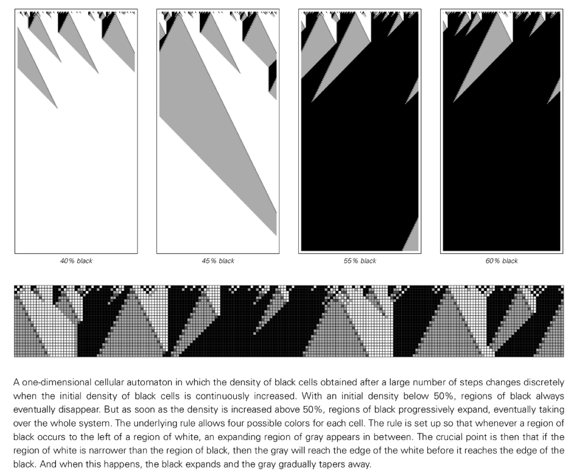

## The problem of satisfying constraints

Traditional science, especially in biology and physics, tends to explain the causes of natural forms in terms of "constraints." This view holds that a system will spontaneously evolve in some way to reach a final state that satisfies certain optimal constraints (such as minimum energy, minimum surface area, or maximum packing density). However, it is the view of this book that this explanation is untenable in the face of complex morphology.

For a natural system, it is almost impossible to find an exact solution that satisfies global constraints through blind random attempts or stepwise iterative improvements based on local information. It is very easy for the iterative process to fall into the so-called "local optimal solution" - just like a ball trying to roll to the lowest point of a valley, it is easy to get stuck in a small pothole and fail to reach the real valley bottom. Even if additional "shocks" are artificially applied to help it escape from these small pits to get closer to the global optimal solution, this method is still extremely computationally expensive and often has no guarantee of success.

Therefore, a more reasonable and powerful explanation is that the complex patterns we see in nature are not the result of a system "solving" a complex optimization problem, but the direct result of following a relatively simple and clear set of evolutionary rules (just like a computer program). Evolution rules provide a clear, step-by-step generation process, while constraints are just a way to describe the final form.

## Origin of simple behavior

Just as complex behaviors can be generated by simple rules, simple behaviors common in nature (such as uniformity, repetition, and nesting) can also be generated by a variety of different simple rule-based mechanisms. We don’t need to look for a unique, complex explanation for every simple behavior.

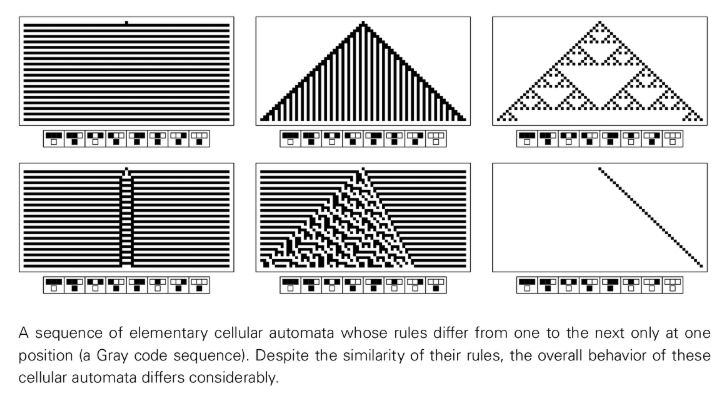

### Uniformity

Achieving a uniform state of the system can be achieved in several ways. For example, homogeneous growth starting from an initial point and expanding outward like a crystal; each isolated part of the system evolving independently to the same stable state; or, and a very important way, the system shows a high degree of random behavior at the micro level, but at the macro scale, these random fluctuations are averaged out, and finally present a seemingly perfect uniform state.

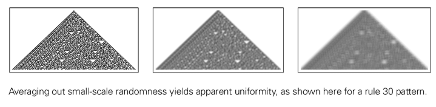

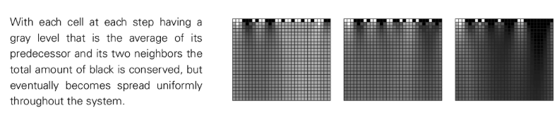

### Repeatability

When a deterministic system has only a limited number of possible states, its behavior will eventually enter a cycle, thus showing repeatability in time. In space, repeatability can arise through the movement of local periodic structures (forming waves) or regular growth from a simple "seed" structure. Even starting from completely random initial conditions, highly repetitive patterns may naturally emerge through the system's own evolutionary mechanisms.

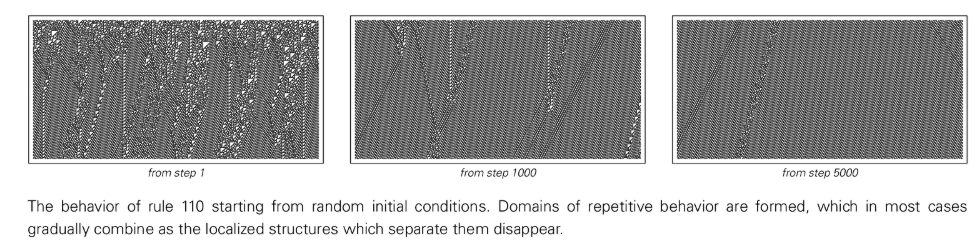

### Nestedness (fractal)

Beautiful nested structures can also be produced through a variety of mechanisms. One is the intuitive "top-down" splitting process, in which an element splits into several smaller, scaled-down versions of itself according to fixed rules. This process continues recursively, just like plant branches. However, another, more common and profound approach is "bottom-up" construction: starting from a simple local rule, the system naturally emerges nested, self-similar structures at the macro scale through continuous iteration.

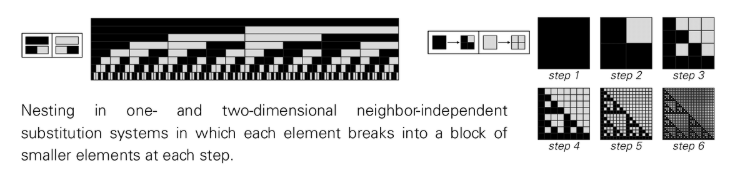

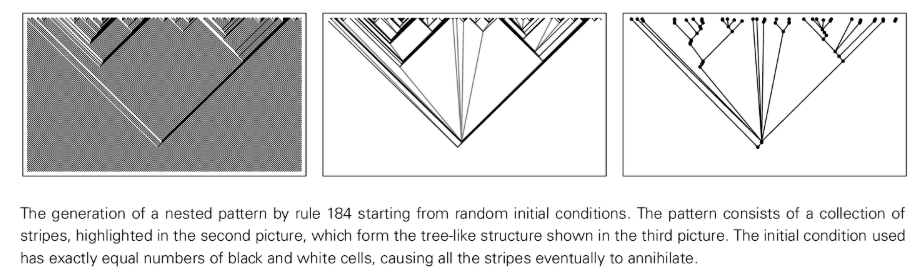

In the end, we found that whether it is a simple behavior or a complex behavior, there are multiple possible generation mechanisms behind it. The mechanisms themselves are not complex, and can all be captured and reproduced by very simple program models.