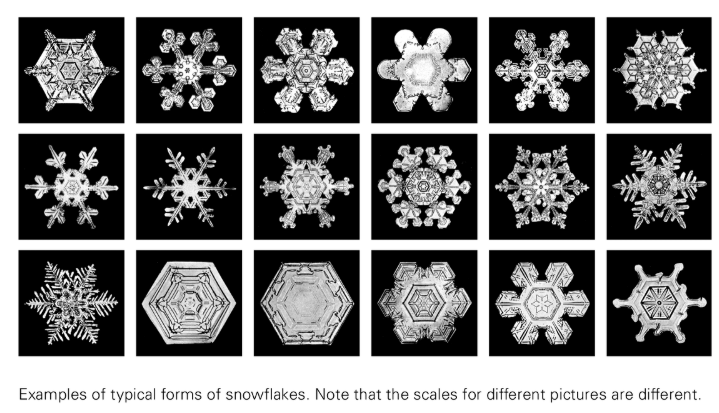
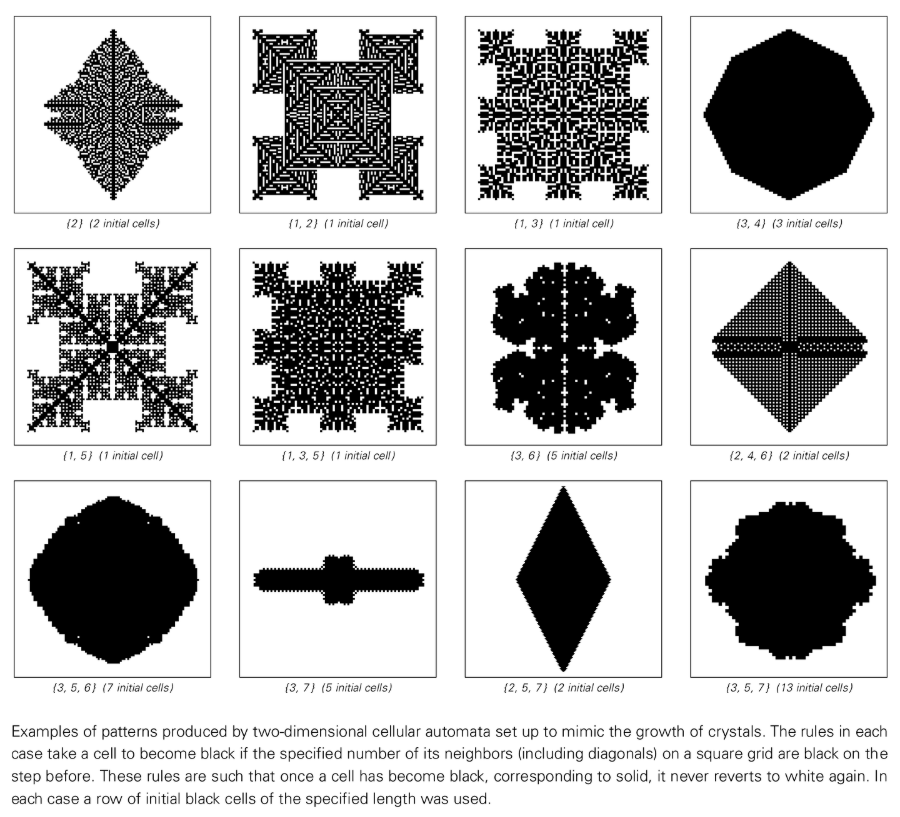
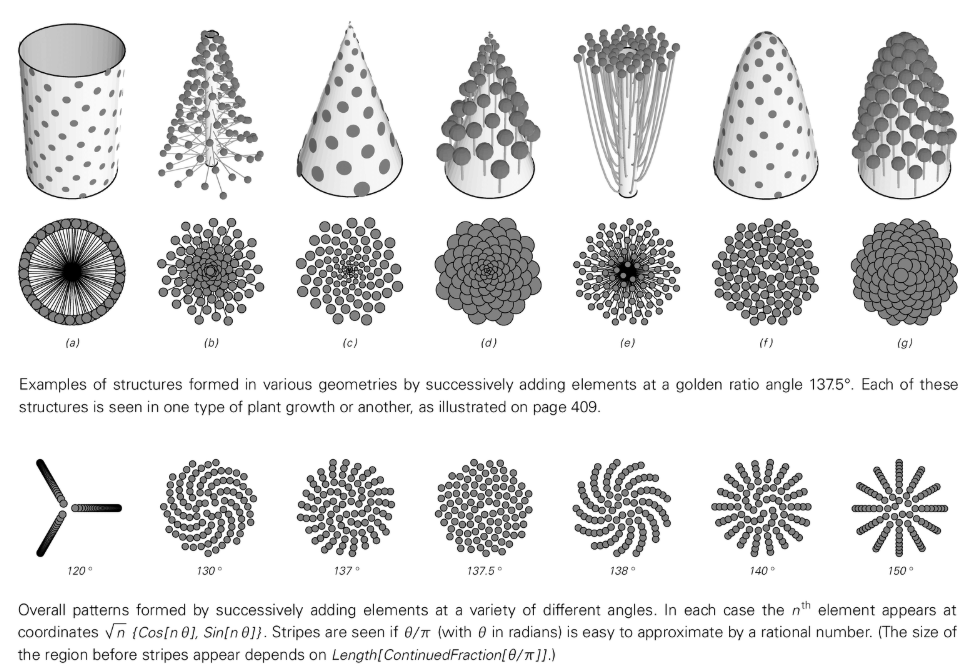
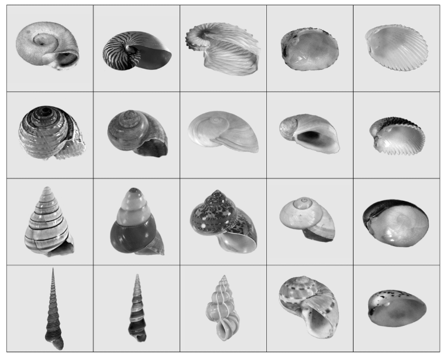
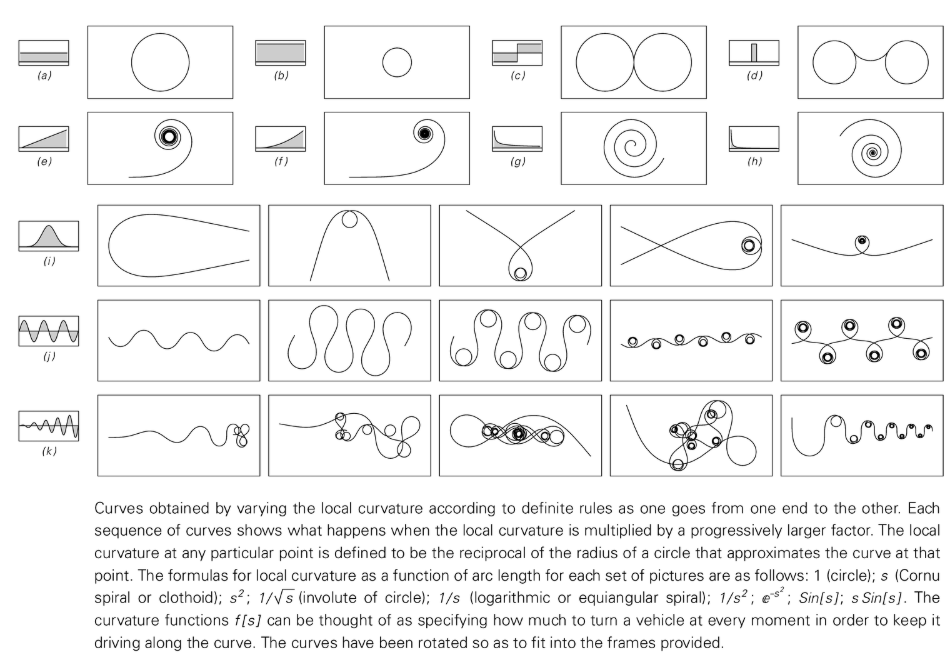
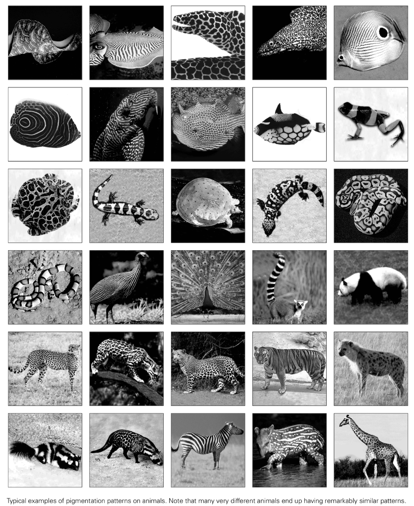
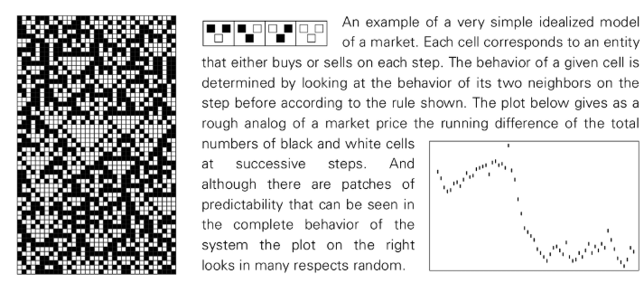

# Chapter 8: Impact on daily systems

## Modeling issues

This chapter will use the idea of ​​simple programs to explore a range of specific systems in nature and other fields, and explain the roots of their behavioral characteristics. Most of these systems are common in everyday life, but the underlying causes of their behavior remain largely unsolved. We will discover that the origins of these behaviors become less mysterious through the lens of simple programs.

My aim is not to explain all the details in detail, but rather to identify the basic mechanisms that lead to the most salient behavioral characteristics of various types of systems. I will build the simplest model possible. A core finding of this book is that complex behavior can arise from extremely simple rules, especially when thinking in terms of programs rather than traditional mathematical equations.

A model is, after all, an idealization. Traditional science sometimes relies too much on a few numbers to validate models and ignores overall behavior. In my opinion, the best first step in evaluating a model is to visually compare the images produced by the model with those of the system itself. A good model should be simple but able to roughly reproduce the various characteristics of the system.

To be clear, a model is an abstract representation of a system, and its internal elements need not correspond directly to the physical components of the system itself. For example, a cellular automaton model can successfully reproduce system behavior, but this does not mean that the system itself is composed of discrete units that follow the rules of a cellular automaton. The key to the model is to capture the important effects that determine system behavior and ignore other secondary factors. This is where the challenge of building the model lies. I always build a minimalist model of the few effects I consider most important to understand the underlying mechanisms of the overall behavior.

## Crystal Growth

Crystals are composed of regularly arranged atoms at the microscopic level. The growth process begins with a "seed" and then the atoms gradually accumulate on the surface. A simple cellular automaton model—any cell adjacent to a black cell also turns black in the next step—can generate simple polyhedral crystal morphologies, similar to the shapes of many natural gemstones.

However, the shape of snowflakes is incredibly complex. The main reason for its complexity is that when ice crystals attach to snowflakes, they release heat, inhibiting the attachment of new ice crystals in nearby areas. We can capture this effect with a cellular automaton rule: a cell becomes black only if it has one and only one black neighbor. This simple rule can produce complex patterns that are surprisingly similar to real snowflakes. This suggests that the complexity of snowflake morphology arises from simple growth inhibition rules.

Likewise, other types of crystals exhibit a variety of morphologies, including needles, dendrites, and even seemingly random shapes. These complex and random morphologies can also be generated by very simple cellular automata rules. This suggests that the randomness observed in crystal shapes is likely not due to randomness in the external environment or seeds, but is instead generated intrinsically by simple underlying rules.

## Material break

In daily life, breaking a solid object is a common way to generate randomness. What is the root cause of the rough, random cracked surface produced by fracture? Even in perfect single crystals, the fracture patterns appear random, suggesting that the underlying mechanism is independent of the details of the specific material.

When a solid breaks, the cracks propagate rapidly. We can think of the components of a solid as being connected by springs, with the crack propagation path determined by the point at which the spring is stretched to break. A minimalist cellular automaton model can simulate this process: the displacement state of a cell is updated based on the state of its neighbors, and a crack (a special marker) moves based on the displacement of surrounding cells. Although no external randomness is introduced into the model, the crack paths generated exhibit significant randomness. This suggests that the randomness in material fracture is likely to be intrinsically generated by dynamic processes within the system.

## Fluid flow

From smooth laminar flow in slow water to complex vortices and turbulence formed behind objects in high-speed water, fluid-flow exhibits a wide range of complex phenomena. As the flow rate increases, the regular vortices begin to appear with irregular "glitches," eventually creating seemingly random turbulence.

Conventional science has been unable to provide a convincing explanation for the origins of turbulence. However, turbulence phenomena are no longer so surprising in light of the discovery that simple procedures are prone to produce complex and random behavior. We can simulate fluids with a simple cellular automaton system: a large number of particles moving on a discrete grid and colliding according to simple rules. At the microscopic scale, we see the motion of discrete particles; but at the macroscopic scale, by averaging over a large mass of particles, the system exhibits smooth, continuous fluid behavior.

The model can successfully reproduce the entire process from the formation of a stable vortex to its transformation into irregular turbulence. Where does this randomness come from? In the past, it was generally believed that this was related to the "sensitive dependence on initial conditions" in "chaos theory". However, in this model, small changes in initial conditions have little discernible effect at the macroscopic fluid behavior level. This means that the randomness in the fluid is not simply amplified by the randomness of the initial conditions.

The conclusion is that much of the randomness in turbulence is intrinsically generated by the system itself. Randomness does not only exist at the level of microscopic particles, but is directly generated at the level of macroscopic fluid movement.

## Basic questions in biology

Biological systems are often seen as the pinnacle of complexity in nature, often attributed to adaptation and natural selection. However, I have come to believe that many of the most striking instances of complexity in biological systems actually have little to do with adaptation or natural selection. They are more likely to be yet another example of the basic phenomenon I discovered in this book: In almost any kind of system, the choice of many underlying rules inevitably leads to highly complex behavior.

An organism's genetic material can be viewed directly as the program that directs its development. Although the genetic program of a complete organism is very large, controlling a local subroutine may be very simple. Many of the complex biological forms we see, such as [Leaf Morphogenesis](annotation:leaf-morphogenesis) and pigmentation patterns, often involve only a few cell types, suggesting that they may be generated by simple programs.

In the past, it was generally believed that every characteristic of an organism was the result of careful optimization by natural selection in order to maximize its fitness. For example, the [Golden Spiral](annotation:golden-spiral) of plant branches and leaves has been interpreted as maximizing light, while the complex patterns on mollusk shells are seen as camouflage to confuse natural enemies. But I strongly suspect that these "purposes" have very little to do with the real reasons why these features exist. I believe these features arise simply because they can be easily produced by fairly simple procedures.

Random mutation will try a large number of procedures during the biological evolution process, which is quite similar to the strategy of evolutionary calculation methods such as [Genetic Algorithm](annotation:genetic-algorithm). Based on the findings of this book, a significant number of these programs must produce complex behavior. Natural selection will winnow out those programs that will survive successfully, but it is often the coarser traits that determine an organism's success, rather than all the details of complex behavior. Thus, a program that happens to produce complex patterns may be chosen simply because it satisfies the crude survival advantage of "producing mixed colors."

I think that much of the complexity we see in biological systems has its roots in a purely abstract fact: among randomly selected programs, many programs can themselves produce complex behavior. Gaining complexity is actually quite easy.

So, what is the role of natural selection? The main effect of natural selection, I suspect, is almost the opposite: it tends to limit complexity. For systems with simple behavior (such as linear growth), natural selection can effectively optimize (such as selecting the optimal length). But natural selection has little power over systems with complex behavior because it cannot predict how small changes to the underlying program will have systematically beneficial effects on the overall complex behavior.

Natural selection thus makes biological systems in some respects more like engineered systems: made up of modules whose behavior is relatively simple and predictable, making them easy to adjust and optimize. Aspects that are not strictly constrained by natural selection can exhibit unrestricted complexity intrinsically generated by simple programs, as we observe in physical systems.

### Growth of animals and plants

The complex forms of plants and animals probably originate from extremely simple growth rules.

Taking plants as an example, their branching structure can be modeled by a simple neighborhood-independent replacement system. At each step, each growing stem tip is replaced by a set of smaller new stems of a specific morphology. Although the underlying rules are extremely simple, the resulting geometric arrangements can immediately reveal immense complexity. This simple branching process generates not only the overall form of various plants, from algae to trees, but also the [Leaf Morphogenesis](annotation:leaf-morphogenesis). The huge diversity of leaf shapes is likely a direct reflection of these simple growth rules.

Another example is a plant's "phyllotaxis," the arrangement of leaves, petals, and other elements around the stem. In most plants, the angle formed between the new elements is almost exactly 137.5° (annotation:golden-angle). This precise angle does not result from a complex optimization process, but is the inevitable result of a simple self-organizing process: new elements tend to form where the largest gaps are left by existing elements, and this process naturally converges to the golden angle.

Animal growth mechanisms are different. For example, horns and shells grow by adding material to the base, which results in coiling rather than branching. The diverse morphologies of mollusc shells can be generated by simple geometric rules that vary the rate of secretion of material at different points along the opening. Almost all possible shell forms in nature can be found in the parameter space of this simple model.

For more complex animals, whose bodies are made up of different parts, this is because different parts of the genetic program are activated at different stages and locations in embryonic development. Because animal embryos lack rigidity in the early stages of development, tissues can undergo complex deformations such as folding and curling to form various internal organs. Differences in animal morphology are largely the result of changes in the relative growth rates of different parts.

All in all, the amazing diversity and complexity we see in plant and animal forms does not seem to require complex underlying rules. Rather, they are the result of extremely simple growth rules that produce subtle variations across species, and these simple procedural rules themselves contain the potential for enormous complexity.

### Biopigmentation Patterns

Biological pigmentation patterns are one of the most visually obvious examples of complexity. The diversity of patterns on mollusk shells is strikingly similar to patterns evolved by one-dimensional cellular automata from random initial conditions. Since the growth of the shell is cumulative row by row, this strongly suggests that its pattern is generated by simple local rules similar to a one-dimensional cellular automaton. These rules may be chosen randomly across species, with complex patterns emerging not for a specific purpose but as the accidental product of simple rules. The patterns on many mollusk shells are covered by opaque skin throughout their lives, also proving that these patterns could not have been carefully optimized by natural selection.

The two-dimensional skin patterns of other animals (such as mammals, fish, reptiles) can also be explained by simple models. A two-dimensional cellular automaton, whose rule is that the color of each cell is determined by the average color of nearby cells (similar colors are promoted near and suppressed at distances), can quickly generate spots, stripes, maze-like structures such as spots, stripes, and maze-like structures from random initial conditions. These structures are very similar to patterns that appear repeatedly in a large number of different animals.

This once again shows that many strikingly complex patterns in the biological world are not rooted in complex adaptive mechanisms, but are intrinsically generated by extremely simple local rules similar to cellular automata.

## Financial system

Fluctuations in financial market prices, especially on short time scales, exhibit obvious randomness. Where does this randomness come from? It is unlikely that it is entirely a reflection of random events in the outside world. More likely, this randomness is largely a product of the internal dynamics of the market.

We can think of the market as a system consisting of a large number of entities (traders), each of which follows simple rules based on the behavior of other entities. A minimalist, idealized model is to think of the market as a one-dimensional cellular automaton, with each cell representing a trading entity whose color (buy or sell) is determined by the behavior of its neighbors at the previous step.

As we have seen repeatedly in this book, simple models can produce complex behavior. Even if the underlying rules are deterministic and the initial conditions are simple, such a model can generate seemingly random sequences of price movements (e.g., by calculating the cumulative difference in the total number of units bought and sold at each step).

This means that much of the randomness observed in financial markets may not originate from external random inputs or unpredictable human behavior, but is intrinsically generated by the market itself as a system of numerous interacting entities that follow simple rules.