# Chapter 9: Basic Physics

## Physics questions

Traditional mathematical methods have achieved great success in fundamental physics, but many core questions remain unanswered. This chapter aims to explore some of these issues using insights from studying simple programs. Although properties of physical systems such as conservation of energy or equivalence of spatial directions have no obvious counterpart in most of the programs discussed previously in this book, simple programs do exhibit these properties. What's more, some of the most critical unsolved mysteries in physics have more universal underlying phenomena, and simple procedures can capture their core.

For example, [Second Law Thermodynamics](annotation:second-law-thermodynamics), or [Entropy Increase](annotation:entropy-increase), describes that many physical systems will irreversibly tend toward a more chaotic state. This chapter will reveal that the nature of this behavior can be easily observed in simple programs. By studying the Second Law in the context of simple programs, we can gain a clear understanding not only of why it generally holds, but also of the conditions under which it fails.

My approach is to use simple programs as metaphors for physical systems. But going further, is it possible that the physical system itself is directly operated by a simple program at some level? Although the laws of physics we now know may seem complex, a key finding of this book is that even programs with minimal rules can generate enormous complexity. The same may be true of basic physics: beneath the laws of physics we know, there may be a very simple program from which all the complex phenomena in the universe are derived.

It's a bold hypothesis to assume that our universe is essentially just a simple program. In the second half of this chapter, I describe the important progress I have made in researching this hypothesis. Although there is still a long way to go, I am very optimistic that using the ideas in this book, the most fundamental problem in physics, and even one of the ultimate problems in science as a whole, may finally be solved.

## The concept of reversibility

All current evidence shows that the basic laws of physics are reversible, that is, as long as the current state of a physical system is accurately understood, its future and past can be deduced.

Some cellular automata are reversible, such as Rule 51, and their evolution retains enough information to be traceable. But others are not, such as rule 254, which will quickly evolve into a completely black state, erasing all information about the previous state.

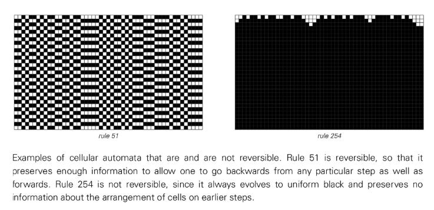

Many systems in nature appear to self-organize, which contradicts the reversibility of the underlying physical laws, which leads to the topic of the next section. Of the 256 basic cellular automata, only 6 are reversible, and their behavior is quite simple. However, when we look at cellular automata with three-color and nearest-neighbor rules, we find 1,800 reversible rules out of more than seven trillion possibilities. Some of them exhibit complex behavior, meaning that even if the initial conditions are "disturbed", the system is still reversible.

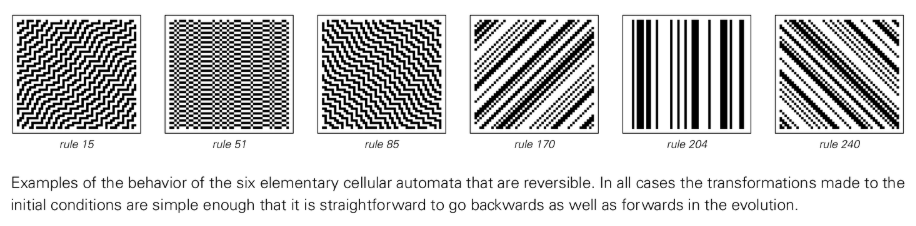

In order to study reversibility systematically, we can build a cellular automaton whose rules themselves have time-reversal symmetry, that is, the rules remain unchanged after being reversed (exchanging the past and the future). Such systems, even starting from simple initial conditions, can generate highly complex and seemingly random patterns while supporting the formation and collision of local structures. Although reversibility imposes certain constraints on the details of collisions, in general reversible systems are capable of exhibiting behavior that is just as complex as ordinary systems.

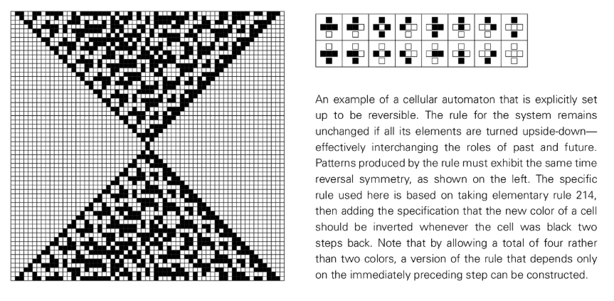

## Irreversibility and the second law of thermodynamics

Although we have ample evidence that the fundamental laws of physics are precisely reversible, everyday experience is rife with seemingly irreversible phenomena. Often, an originally ordered system becomes increasingly random and disorganized over time. This phenomenon can be observed in many simple programs.

A reversible cellular automaton evolves from an ordered initial state (for example, all particles are concentrated in the center of the box), and its particle distribution gradually becomes random. The occurrence of this randomness is not surprising to readers who are accustomed to the ideas of this book. However, this seems to be in conflict with the reversibility of the system.

The key to resolving this contradiction is that if we place the ordered state at an intermediate moment in evolution, then we will observe an increase in randomness whether we move forward or backward in time. In reality, the reason we only see increases in randomness is because actual experiments almost always start with initial conditions that we can simply describe and construct. Creating an initial condition that leads to a reduction in randomness would require a "backward calculation" that is as complex as the system evolution itself, which is not feasible in practice. I believe that this is the fundamental reason why the second law of thermodynamics holds true observationally.

We can build more realistic models, such as a two-dimensional cellular automaton simulating an ideal gas that is not only reversible but also conserves the total number of particles (i.e. energy). In an empty box, the system exhibits simple repetitive behavior. But add a tiny obstacle and the particle arrangement quickly becomes random. This randomization makes it extremely difficult to extract ordered mechanical work from the system, explaining why a perpetual motion machine is impossible.

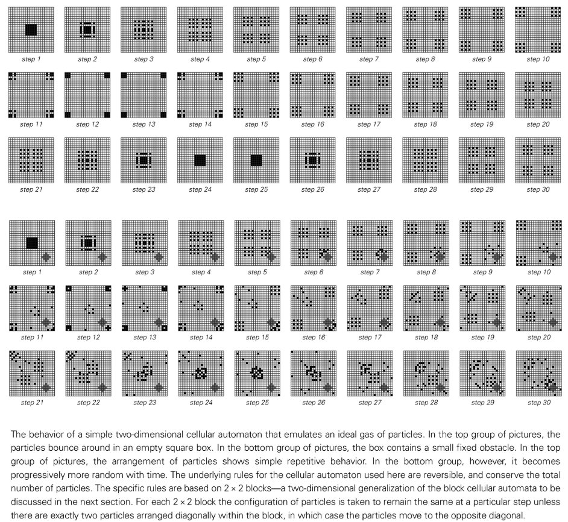

Entropy, as a physical quantity that measures the amount of unknown information in a system, depends on the measurements we make. Another statement of the second law of thermodynamics is that entropy increases with time. This is because as the arrangement of system particles is randomized, the system information we can obtain through limited measurement methods becomes less and less, and the amount of unknown information (ie, entropy) increases.

As with many of the systems we look at in this book, once significant randomness is introduced, the macroscopic properties of the system become largely independent of the details of its initial conditions. This system will evolve to a unique equilibrium state.

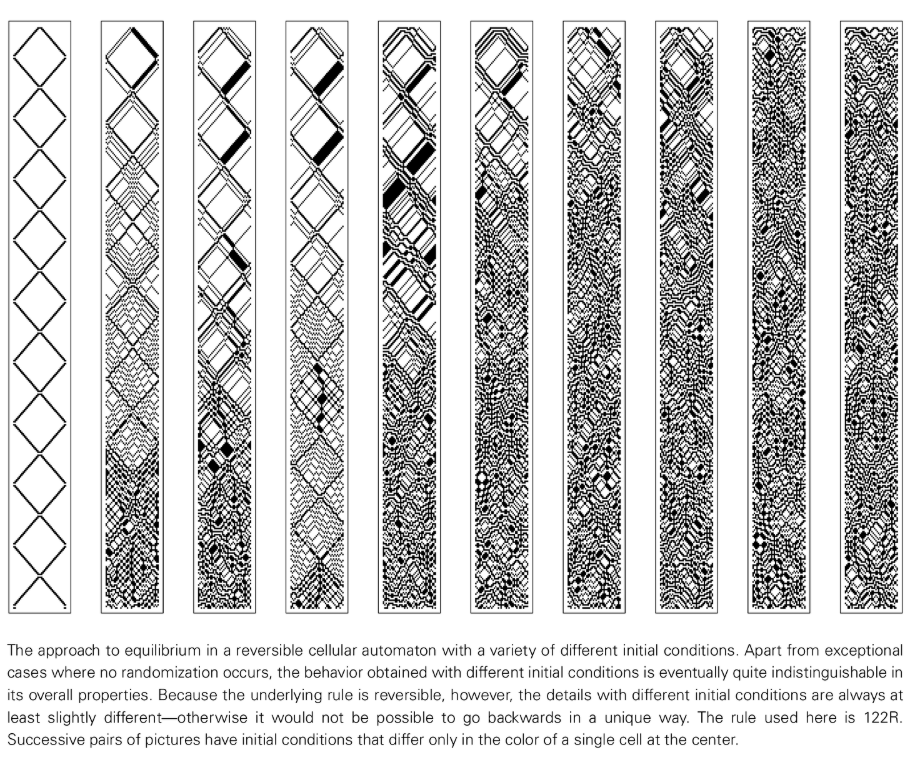

However, the second law of thermodynamics does not apply universally. While it is well established in areas such as gas behavior, many systems, such as Rule 37R cellular automata, do not systematically tend toward randomness, but instead exhibit continuous fluctuations between ordered and disordered states. The universe itself has not reached a completely random equilibrium state, and biological systems and other systems even show temporary increases in order. This is often associated with partitioning of a system, where the system breaks down into parts that evolve relatively independently over long periods of time. For example, in a closed system, Rule 37R will form a kind of "membrane" that separates the system into different regions, and orderly behavior can occur within each region. This may be the primary mechanism by which many biological systems operate.

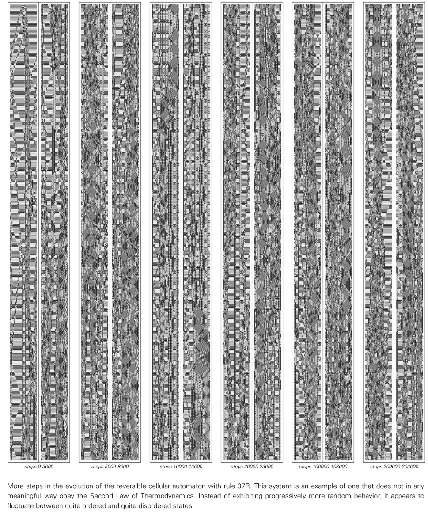

##Conserved quantities and continuous medium phenomena

In addition to reversibility, another universal feature of the fundamental laws of physics is the conservation of certain quantities, such as energy and charge. While most cellular automata do not possess this property, we can indeed find rules that conserve the total number of black dollars. By using Block Cellular Automata, we can easily build systems with conserved quantities. In this system, adjacent blocks of cells are replaced by other blocks of the same size according to rules.

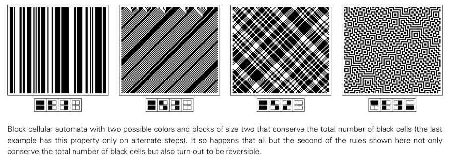

Even in systems with conservative quantities (such as the total number of black and gray elements), starting from simple initial conditions, considerable randomness can be generated. When a system has regions of different densities, these regions gradually mix until the density is uniform. Although the underlying system is composed of discrete cells, its macroscopic density distribution exhibits smooth continuous behavior. This phenomenon arises from apparent randomness at the microscopic level and conserved quantities at the macroscopic level, which is very similar to the situation in physical systems such as fluids. This once again shows that the underlying mechanism of continuum behavior that seems to depend on the particularities of physical systems already exists in programs with extremely simple rules.

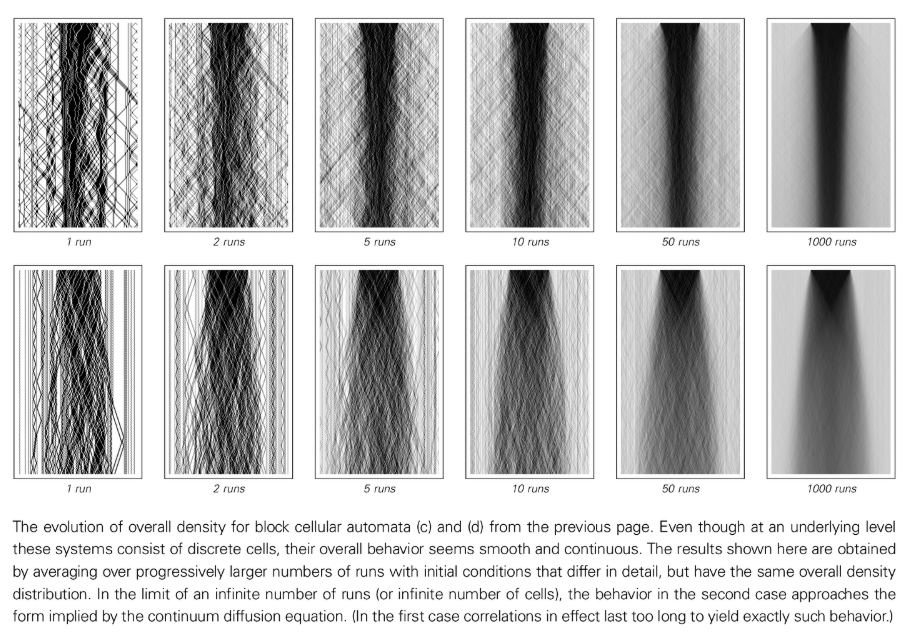

## The ultimate model of the universe

The history of physics is a series of increasingly accurate models of the universe. Will this process end with a final model? Traditional scientific intuition might deny this, as it always seems to follow that more complex phenomena require more complex models. However, a core idea of ​​this book is that more complex phenomena do not necessarily require more complex models. An extremely simple program, if run for a long enough time, may be able to accurately reproduce every detail of our universe.

Finding such a program would be a huge victory for science. But even knowing the underlying program does not mean that all the behavior of the universe can be immediately deduced. There is often a huge gap between underlying rules and macro-level behaviors. Therefore, to verify whether a program is the correct model of the universe, we need to use small-scale simulations and complex logical deductions to see whether it can reproduce the laws of physics we know.

If we try to work backwards from the known laws of physics, it is almost impossible to successfully find that simple ultimate rule. The best strategy is to come up with a suitable rule category and then search for it systematically. If the rules of the universe were simple enough, this seemingly absurd method might be feasible.
This idea is being continued by research programs such as the [Wolfram Physics Project](annotation:wolfram-physics-project).

My guess is that this ultimate rule may be more fundamental than any of the systems we have discussed so far (such as cellular automata), because it may not have any built-in structure, such as a fixed spatial grid. Space itself may just be the emergence of certain connection patterns on a large scale. Features of the universe that we are familiar with, such as motion, may not be directly reflected in the ultimate rules.

Therefore, finding this rule will be a challenge. It is unlikely to be discovered incrementally, as each part of the rule could affect many different features of the universe. But this also means that once we find a rule that reproduces enough characteristics of the universe, it will most likely be the final, correct rule.

Why should we believe that the rules of the universe are simple? One possible view is that there are an infinite number of universes, each with different rules, and we just happen to live in a universe where the rules happen to be simple. However, the physical laws we know are not only limited in number, but also often in their simplest form. This may be because these laws themselves are the emergence of some ultimate rule on a macro scale, and this emergent behavior itself tends to be simple.

Ultimately, and perhaps the simplest explanation is this: the universe does obey a single, simple underlying rule. Finding this rule will be the pinnacle of what human thought can achieve.

## The nature of space

To build the ultimate model of the universe, a crucial first step is to think about the nature of space. Contemporary physics almost always assumes that space is a perfect continuum, but I firmly believe that, like many other physical phenomena, space will eventually be discovered to be made of discrete elements.

If space is not a continuum, what is it? Is it a regular array like a cellular automaton? I doubt it. For this implies a distinction between space and its contents, and an ultimate model as simple as possible would have space and its contents made of the same "stuff." Space itself may be the only thing that exists in the universe.

Most likely, at the lowest level, space is a giant [network-system](annotation:network-systems) composed of nodes. In this network, a node has no inherent position; the only thing that is defined is its connection relationship with other nodes. When the number of nodes is large enough, familiar spatial properties and other physical phenomena can emerge from them.

The simplest non-trivial network is one with three connections to each node. By constructing such networks with a large number of nodes, we can obtain structures corresponding to one-, two-, and three-dimensional spaces. Whether a network corresponds to a d-dimensional space can be judged by calculating the number of nodes within a distance r from any node. The growth of this number should be similar to r^d. However, not all large networks correspond to ordinary spaces of limited dimensions. A randomly connected network, or a tree-structured network, usually does not have this property.

The real spatial network of our universe may appear quite random at the microscopic level of connectivity, but at the macroscopic scale it must correspond to our familiar three-dimensional space.

## The relationship between space and time

To establish the ultimate physical theory, we need to understand not only the nature of space, but also the nature of time. Everyday experience tells us that space and time are very different, but most contemporary models of fundamental physics are based on the idea that they are essentially the same, the so-called "[Spacetime Continuum](annotation:spacetime-continuum)".

However, in program-based systems, such as cellular automata, space and time are handled very differently. I believe that time is also fundamentally discrete. One possibility is that the entire space-time history of the universe can be represented by a vast four-dimensional network, the form of which is determined by a set of constraints. However, experience tells us that it is difficult to find constraints that enforce complex patterns.

Therefore, I prefer to think that the universe evolves explicitly in time like a cellular automaton, creating a new state of the universe at every moment. This seems to contradict the correspondence between space and time, but the correspondence itself may only emerge on a macroscopic scale. The history of the universe can be represented by a space-time network, but the construction process of this network itself treats space and time differently.

## Time and Causality Network

A feature of cellular automata is that all cells update synchronously, which requires a global clock. However, it seems unreasonable that such a global clock exists in the universe. One possible alternative is that the universe operates like an [Mobile Automata](annotation:mobile-automata) or Turing machine with only one active cell being updated at each step.

From the outside, the evolution of mobile automata is serialized. But for an observer inside it, since changes to its own state can only occur when active cells access it, a large number of underlying evolutionary steps may have occurred between the two consecutive points in time perceived by the observer. This means that, to an internal observer, many cells appear to be updating in parallel.

We can understand this more deeply by constructing a network of "update events" and their causal relationships. This "[causal-network](annotation:causal-network)" defines a perceived spatiotemporal structure for the internal observer. In this network, connections are unidirectional and represent a causal relationship from one event to another, leading to a meaningful concept of time.

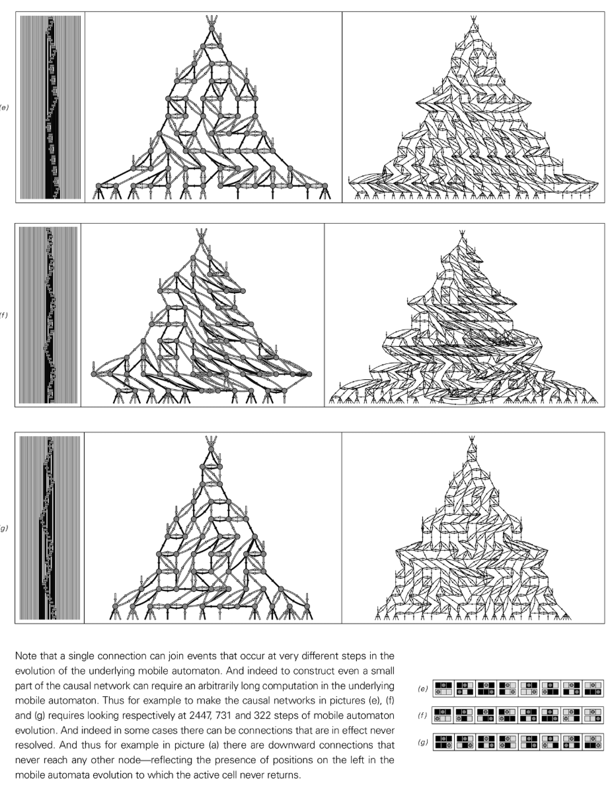

The passage of time in a causal network does not directly correspond to the evolutionary steps of the underlying mobile automaton. An observer can only perceive the existence of a causal network and deduce the properties of time from it. This setup naturally explains why we can move freely in space but can only move forward in time.

Different moving automata rules will produce various causal networks, some are simple and repetitive, and some are complex and random. Importantly, even if the underlying rules treat space and time differently, emergent causal networks often exhibit a uniform randomness in which space and time behave similarly in many ways.

## Sequence of events in the universe

The mobile automaton model enforces the serialization of events through a single active cell. However, the more general [Substitution Systems](annotation:substitution-systems) (Substitution Systems) allow multiple substitutions at each step. A key question is whether the order of substitutions affects the final causal network.

Surprisingly, there exists a class of rules in which the final causal network that emerges is exactly the same no matter in what order, when and where the substitutions are made. The essential feature of such rules is that different replacement operations never interfere with each other, for example, replaced blocks never overlap. This means that, without the need for any global clock or active cell-like mechanism, as long as the appropriate underlying rules are chosen, any sequence of events that conforms to these rules will produce the same causal network, thereby defining a unique perceptual history for the universe.

## Uniqueness and Time Branching

However, do the rules of the universe really enforce a unique perceptual history? [Multiway Systems](annotation:multiway-systems) (Multiway Systems) provides the possibility to allow the existence of multiple histories. In this type of system, each step performs all possible substitutions, resulting in multiple new states (strings).

If we were in a multipath system, we would not be able to observe all parallel history paths from the outside. Our own experiences will form a unique path. This means that many details of our universe's history may not be uniquely determined by underlying rules, but simply "historical accidents" along the paths we happen to take.

A key question is whether different paths in multipath systems produce fundamentally different macroscopic behaviors. Some rules have the property that the final causal network is the same no matter which path is followed. This usually happens when any forked paths can be rejoined at the next step. Even if paths do not converge immediately, if they eventually do, the causal networks they generate will show similarities at sufficiently large scales. This means that, on a macroscopic scale, the universe may appear to have a unique history, although there is considerable arbitrariness at the microscopic level of events.

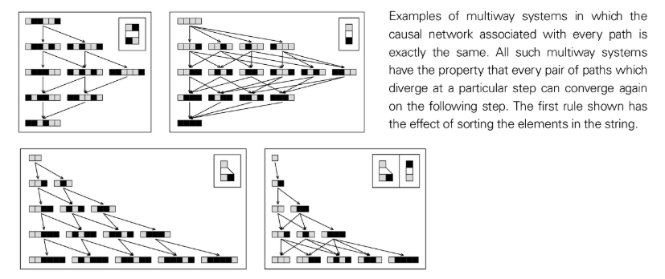

## The evolution of the network

If space is a vast network of nodes, how does it evolve? The most straightforward way is, like [Substitution Systems](annotation:substitution-systems), certain parts of the network are replaced according to fixed rules. The simplest rule is that each node is replaced by a fixed cluster of nodes, but this only produces highly regular nested structures.

More general rules allow the replacement of arbitrary clusters of nodes. Unlike strings, there are some inherent limitations to substitution in the network. For example, the number of connections to the rest of the network must be the same before and after the replacement. We can design different schemes to decide where to replace, for example, replace only one at a time, or replace all non-overlapping clusters simultaneously.

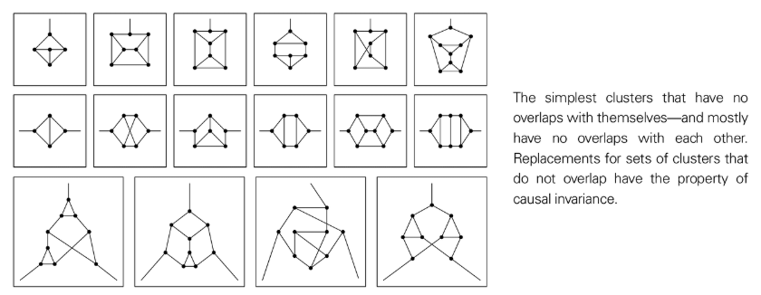

Regardless of the scheme, simple rules can produce simple nested or repetitive behavior, while slightly more complex rules, even starting from a simple initial network, can produce seemingly complex and random behavior. We can construct causal networks for network evolution and find that there is a class of rules that produce the same causal network regardless of substitutions. The replacement targets (node ​​clusters) of such rules never overlap with each other.

I speculate that the ultimate rules of the universe will produce networks that appear essentially random at microscopic scales. But it is this randomness that enables the emergence of a stable three-dimensional space on a macroscopic scale. At the same time, the complex structure of the network also carries all the complex phenomena in the universe.

## Space, time and relativity

As observers inside the universe, everything we can observe is ultimately related only to the network of causal connections between events in the universe. By taking different "slices" of the causal network, we can recover different evolutionary histories, corresponding to what observers moving at different speeds would see.

If the underlying rules of a system have "[Causal Invariance](annotation:causal-invariance)" (Causal Invariance), that is, they produce the same causal network regardless of the order in which they are applied, then a crucial conclusion will emerge: the laws of physics are the same for all observers moving at a constant speed. This is the core principle of special relativity.

Furthermore, the basic structure of a causal network—where each connection represents an effect propagating at the speed of light—naturally explains why the speed of light is the fastest speed in the universe and is constant for all observers. From this, all other effects of relativity can be derived, such as time dilation.

## Elementary particles

All matter in the universe is made of discrete particles, as all instances of a particle (such as an electron) have exactly the same properties. I speculate that these particles are not the most basic entities, but stable structures made of more basic elements, similar to the local structures we see in cellular automata.

Particles are persistent structures that maintain their properties in the context of a vast, random network that represents space. Certain conserved quantities, such as charge, may be related to specific local topologies (annotation:spatial-tangles) in the network that are protected by rules. Different particle types correspond to a small set of discrete, possible "core" structures.

The movement of particles is the result of a series of underlying update steps in a causal network. Causal invariance ensures that particles can move stably at different velocities. The energy and momentum of a particle may be related to the number of nodes around the core of the particle.

## Gravity phenomenon

On large scales, the most significant effect is gravity. General relativity relates gravity to [Spatial Curvature](annotation:spatial-curvature). In a discrete network, curvature can be understood as a change in the pattern of connections. For example, introducing pentagons into a two-dimensional planar hexagonal network will cause it to have positive curvature (like a sphere), while introducing heptagons will cause negative curvature.

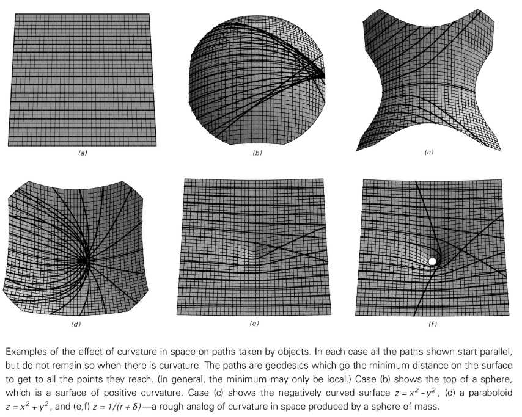

We can quantify this curvature by counting the number of nodes in the network that are within a distance r of a node. The degree to which the growth of this quantity deviates from $r^{d-1}$ is directly related to the Ricci curvature, which is the core quantity in Einstein's equations.

I speculate that if a network substitution rule is causally invariant and maintains fixed dimensions, then it will almost inevitably produce macroscopic behavior that follows Einstein's equations. In such a model, matter and energy (possibly associated with additional nodes in the network) naturally become sources of spatial curvature and do not need to be introduced separately as in traditional theories.

## Quantum phenomena

I firmly believe that programs of the kind discussed in this chapter will eventually prove to exhibit many or all of the key features of [Quantum Theory](annotation:quantum-theory).

My model treats particles such as electrons as persistent structures in a network, which seems to contradict quantum theory that particles do not have definite properties independent of observation. The key point, however, is that we as observers are part of the network and cannot observe the electrons from the outside. All our inferences about electrons must come from processes occurring explicitly within the network.

At the lowest level, I expect the connection patterns of the cosmic web to continually rearrange themselves in ways that are so complex that they appear random. On top of this random background, certain structures will appear that can withstand multiple network updates. These structures are particles. The interaction between different particles is the process in which these structures evolve into different particle configurations due to underlying rules when they overlap.

Many unique features of quantum theory, such as violations of the [Bell Inequality](annotation:bell-inequality), seem to hint at connections between particles that transcend ordinary spatial distances. In the network model, this can be explained as: even if particles are far apart in ordinary space, they can still be directly connected through some "[cues](annotation:threads)" (threads) that do not pass through intermediate space nodes.

All in all, I firmly believe that every detail of our universe ultimately follows a rule that can be represented by a very simple program, and that everything we see is just the result of running this program.