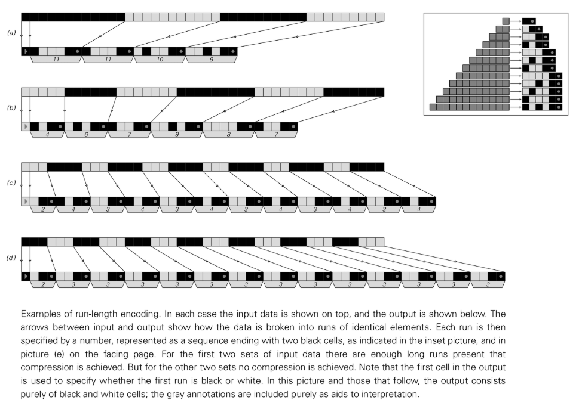

# 第10章 認識と分析のプロセス

＃＃ 導入

ここまでの数章では、自然界のさまざまな現象の背後にある基本的なメカニズムについて説明してきました。しかし、自然界の実際の経験を説明するには、自然現象がどのように発生するかだけでなく、それを私たちがどのように認識し、分析するかを考慮する必要があります。なぜなら、自然界についての私たちの経験は、最終的には自然の働きに直接基づいているのではなく、その行動の認識と分析の結果に基づいているからです。

この本の最初の章で、私は、自然界の多くのプロセスの基本メカニズムは、単純なルールに基づいた単純なコンピューター プログラムで捉えることができると主張しました。認識と分析に関わるプロセスについてはどうですか?この章では、入手可能な証拠が、その基本的な動作メカニズムも単純なルールに基づく単純な手順によって首尾よく捕​​捉できることを示していると主張します。

## 認識と分析の役割

私たちは日常生活の中で、常に大量のデータ（画像、音声など）にさらされています。このデータを活用するには、データをより管理しやすいレベルまで単純化する必要があります。これはまさに認識と分析が行おうとしていることです。実際の役割は、大量の生データから使用可能な概要を抽出することです。

データは通常、2 つの方法で検知および分析されます。まず、現在の目的に関係のないデータの側面は単純に無視できます。第 2 に、観察した規則性を利用することで、データ内のすべての要素を指定する必要がなくなります。

データに規則性が存在するということは、実はデータの一部が冗長であることを意味します。一般に、規則性の存在により、データの文字通りの記述を、再現されたデータに基づく手続き的な記述に置き換えることが可能になります。

認識と分析は、多くの点で、この本の多くの部分が検討しているものとは正反対です。私たちは通常、単純なコンピューター プログラムから始めて、それがどのような動作を生成するかを観察します。しかし、認識と分析では、観察された動作から開始して、どのような手順やプロセスがデータを再現するかを推測しようとします。

## ランダム性の概念を定義する

私はこの本の中で、「ランダムに見える」いくつかのシステムの動作について何度か言及しました。しかし、ランダム性とは正確には何でしょうか?適切な定義を与えるには、認識と分析の問題を考慮する必要があることがわかります。

日常の言葉で、何かがランダムに見えると言うとき、私たちは通常、少なくとも現在の認識と分析の方法では、その中に重大な規則性を識別できないことを意味します。

規則性が特定できないと言うとき、これは、より短い記述が見つからないと言っているのと同じです。実際には各セルの色を明示的に指定する以外に選択肢がないため、物体はランダムに見えます。

しかし、私たちの通常の知覚および分析プロセスの簡単な説明がないからといって、そのような説明が存在しないことを意味するわけではありません。実際、完全にランダムに見えるパターンは、単純な 2 次元セル オートマトンのルールを 250 回進化させるだけで生成される可能性があります。

では、この短い説明の存在は、このパターンがランダムであると考えるべきではないことを意味するのでしょうか?実際的な観点から見ると、利用可能な認識および分析方法のいずれによってもこの短い説明を見つけることができない場合、その存在は問題ではない可能性があります。

したがって、ランダム性の有用な定義には、少なくとも部分的に、これらの短い説明を見つける方法が含まれている必要があります。この章の重要な点は、基本的にすべての標準的な認識と分析の方法は、最終的にはかなり単純な手順に基づいていると見なせるということです。これは、私たちが与えることができるランダム性の定義を示唆しています。つまり、本質的に単純なプログラムがその規則性をうまく検出できない場合、何かはランダムであると見なされるべきです。

## 複雑さの概念を定義する

日常の言葉で、何かが複雑に見えると言うとき、私たちは通常、それについての簡単な説明が見つからないこと、または少なくとも私たちが興味を持っている機能が見つからないことを意味します。私たちが何かが複雑に見えると言うとき、それは実際には私たちの知覚能力と分析能力がそれに対して失敗していると言っているのです。

複雑さの定義には、知覚機能と分析機能の両方を考慮する必要があります。私たちが知りたいのは、何かのあらゆる詳細についての単純または短い説明が見つかるかどうかではなく、たまたま興味を持った機能のそのような説明が見つかるかどうかだけです。

日常用語では、「複雑性」と「ランダム性」がほぼ同じ意味で使用されることがあります。しかし、全体的な特徴だけを見ると、多様な構造を示す特定のパターンは、均一にランダムなパターンよりも複雑であると一般的に言えます。なぜなら、後者は依然として全体的なレベルでかなり単純な説明を持っているからです。それらは本質的に、すべての領域が他のすべての領域とほぼ同じに見える、単なる一様なランダム性です。ただし、前者は全体レベルでも不均一性が見られるため、細部を無視しても簡単に説明することはできません。

実際には、何かが複雑に見えると言うとき、それは人間の視覚に関与する特定のプロセスが簡単な説明を抽出できないことを意味します。

## データ圧縮

最新のコンピュータおよび通信システムでは、より効率的に保存または送信できるようにデータが圧縮されるときに、検出および分析のプロセスと同等の処理が常に行われます。

ランレングス エンコーディング: 基本的な考え方は、データを連続する同一要素の「ラン」に分割し、これらのランの長さを指定することによってのみデータを指定することです。

ブロックベースのエンコーディング: もう 1 つの一般的なデータ圧縮方法は、固定長のブロックを形成し、特定のコードワードを使用してさまざまなブロックの出現を表すことに基づいています。

ポインターベースのエンコーディング: より高い圧縮率を達成するために、特定のシーケンスを 1 回だけ明示的に指定し、同じシーケンスの後続のすべての出現が最初の出現をポイントすることによって指定されるエンコーディングをセットアップすることができます。

これらすべてのデータ圧縮方法は、非常に単純なプログラムに対応すると考えることができます。しかし、これらのメソッドの特性は驚くほど似ていることがわかりました。たとえば、ほぼすべての方法で、均一な色の広い領域を適切に圧縮できます。また、ほとんどの方法は、繰り返しの動作と、ある程度はネストされた動作 (この本で何度か言及した 2 つの単純な動作) を圧縮できます。

ただし、より複雑な動作の場合、これらの方法のいずれも大幅な圧縮を達成できないようです。原理的にはこれを圧縮することは不可能ではありません。実際、非常に短いセル オートマトン プログラムによって多くの複雑なパターンを生成できます。しかし重要なのは、全体的な動作が反復的または入れ子になっているように見えない限り、これまで説明した標準的なデータ圧縮方法はどれも、そのような簡潔な説明を見つけるのにはるかに及ばないということです。

##視覚

人間の視覚システムは、依然として私たちが持つ最も強力で信頼できるツールの 1 つです。ほぼすべての種類の人間の認識で何度も繰り返し使用される基本的なスキームは、特定の種類の細胞をデータ内の特定の固定特徴に応答させ、その後、他のすべての特徴を無視するというもののようです。

パターンや質感と同様、基本的な答えは、私たちの目と脳の神経細胞が、網膜上に形成された画像の特定の局所的なパターンに反応するようにプログラムされているということのようです。これを、網膜上に白と黒の正方形の配列があり、視覚野に対応する細胞の配列があると理想化できます。各セルは 2x2 の正方形ブロックから入力を受け取り、正方形の色が特定のパターンを形成する場合にのみ応答するというルールに従います。

私たちが赤、緑、青の密度によって色を区別するのと同じように、おそらく特定の局所的な特徴の密度によってテクスチャを区別します。

ただし、入れ子構造の場合は状況がまったく異なります。パターンが入れ子になっていることを肉眼で見分けるのは困難です。これは、私たちの視覚認識能力の明らかな制限と見なすことができます。これは、入れ子構造の識別が基本的に難しいということではなく、人間の視覚認識でたまたま発生する特定のプロセスが識別できないことが多いためです。

## 聴覚知覚

基本的に、すべての音は急速に振動するパターンで構成されています。私たちが音をどのように認識するかで最も重要な点は、音に含まれる周波数です。

一連の要素が繰り返される場合、聞こえるのは基本的に特定の周波数の純音です。しかし、シーケンスがランダムな場合、聞こえるのは不定形なヒスノイズだけです。

では、これら 2 つの極端の間で何が起こるのでしょうか?私たちは、特定の周波数の正確な、またはそれに近い繰り返しを簡単に識別し、それ以外は本質的に何も識別しないように思えます。たとえば、ネストされたシーケンスを聞くとき、それがネストされていることを直接知る方法はなく、それらが発生する周波数スペクトルのいくつかの非常に単純な特徴に敏感であるように見えるだけです。

## 暗号化と暗号解析

暗号化の目的は、誰かが特別な復号化キーを取得しない限りメッセージの内容を識別できないように、暗号化によってメッセージの内容を隠すことです。暗号解析の目標は、キーを使わずにメッセージを復号する方法を見つけて暗号を解読することです。

暗号化が機能するには、暗号化されたシーケンスの特定の特徴または部分がわかっている場合でも、元のキーまたは生成されたシーケンスの残りの部分を推定することが困難でなければなりません。

[Additive Cellal Automata](annotation:additive-cellal-automata) に基づくシステム (例: [Rule 60](annotation:rule-60)): その入れ子構造により、この章で説明するさまざまなセンシングおよび分析方法を使用して規則性を識別できます。その相加性により、暗号解析は比較的簡単になります。

ルール 30 に基づくシステム: 単純な初期条件から生成されたシーケンスでさえ、これまで議論したすべての認識および分析方法では完全にランダムに見えます。少なくとも標準的な暗号解読方法やその他のいくつかの方法では、適切に選択された暗号化シーケンスからルール 30 のキーを推定する簡単な方法はないようです。

## 人間の心

人間の心は、この章で議論されている他の知覚と分析の方法をどの程度超越していますか?最も顕著なのはメモリの大量使用です。他の方法は基本的に、新しいデータごとに固定手順を独立して適用することによって動作します。しかし、人間の心の中では、何十億もの過去のデータにさらされて構築された膨大な記憶が日常的に利用されています。

私が強く疑っているのは、記憶の使用は実際には人間の思考のほぼすべての主要な側面の基礎であるということです。一般化、類推、直観などの能力は、類似性に基づいて記憶からデータを取得する能力と密接に関連しているように見えます。しかし、論理的推論などの能力はどうでしょうか?おそらくそれらは、より高度なタイプの人間の思考に対応しているのでしょうか？

私が論理的に推論するとき、実際には経験から学んだ論理的議論のパターンを検索するために記憶を使っているだけではないかという強い疑念があります。

この本の調査結果に基づいて、非常に単純な基本ルールからでも非常に複雑な動作を生成することが完全に可能であることがわかりました。人間の心の根底にはかなり単純なメカニズムがあることがすぐに考えられます。

## より高度な形式の認識と分析

私たちの既存の認識と分析の方法は、本質的に最終的に可能なすべてをカバーしているのでしょうか?それとも、何らかの理由で現在私たちが使用していない、根本的により強力なより高度な形式の認識と分析があるのでしょうか？

この本の中心的な発見の 1 つは、非常に単純な記述を持つルールが、私たちの標準的な方法では規則性を認識できない非常に複雑なデータを生成することが実際に非常に一般的であるということです。

しかし、単純なルールが最終的にデータに影響を与えるという事実は、あるレベルでデータに規則性がなければならないことを意味します。重要なのは、これらの規則性は、まさに私たちの標準的な認識方法や分析方法では検出できないものであるということです。ただし、規則性が存在するということは、少なくとも原理的には、規則性を首尾よく識別できるより高度な形式の認識と分析が存在する可能性があることを意味します。

私は、少なくとも完全に一般的には、これは決して不可能であると強く信じています。しかし、これは、現在の方法では不可能な特定の規則性を少なくとも首尾よく特定できる、より高度な形式の認識と分析が不可能であることを意味するものではありません。