# 第 11 章: コンピューティングの概念

## フレームワークとしてのコンピューティング

この本の最初の章では、単純な基礎ルールを持つセル オートマトンやその他のシステムが生成できるさまざまな動作について説明しました。伝統的な科学の経験から、標準的な数学的分析はそのようなフレームワークの基礎を提供するはずですが、そのような分析は研究対象の全体的な動作がかなり単純な場合にのみ役立つことがわかります。

行動が複雑になると、従来の科学では問題が発生する可能性があります。しかし、本書は、そのような状況下でも進歩できる新しい科学を開発することを目的としています。この新しい科学を支える最も重要なアイデアは、計算の概念でした。セル オートマトンのようなシステムは、計算を実行する単純なコンピューター プログラムと考えることができます。システムの初期条件は計算への入力として見ることができ、いくつかのステップ後のシステムの状態は出力に対応します。重要なのは、その仕組みの詳細に焦点を当てずに、実行される計算を抽象的な言葉で考えるべきであるということです。

この抽象化が役立つのは、主に、まったく異なる基礎となるルールを持つシステムを統一的に議論できるためです。 2 つのシステムの内部動作は大きく異なっていても、実行される計算は非常に似ている場合があります。計算的に考えることで、基礎となるルールの詳細な構造を考慮することなく、さまざまなシステムに適用できる [普遍的な](annotation:universality) 原則を考えることができます。

## セルオートマトンの計算

セルオートマトンなどのシステムの進化は、計算であると考えることができます。たとえば、単純なセル オートマトンは、数値が奇数か偶数かを計算できます。適切な数の初期黒セルを入力として設定すると、最終的に生き残った黒セルの数を観察することで計算の結果を判断できます。

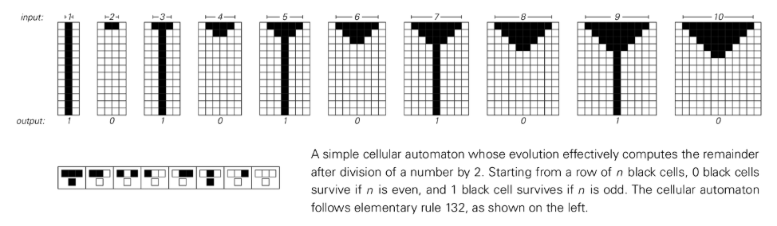

より複雑な計算も可能です。一部のセル オートマトンは、任意の数の 2 乗を計算したり、一連の素数を生成したりできます。これらの例は、単純なセル オートマトンでも任意に複雑な計算を実行できることを示しています。

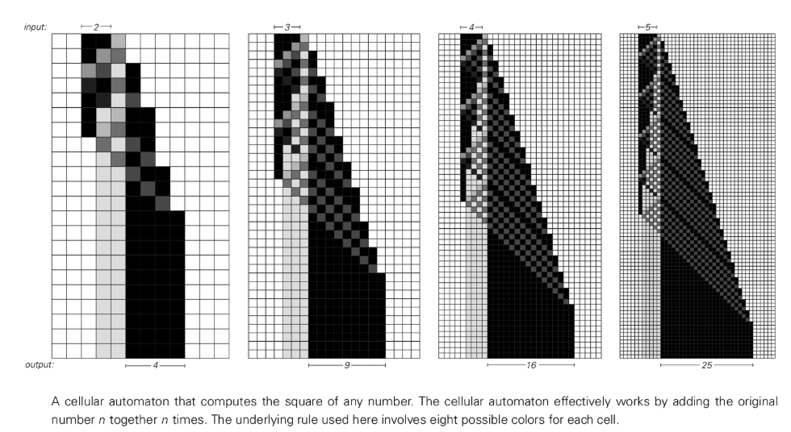

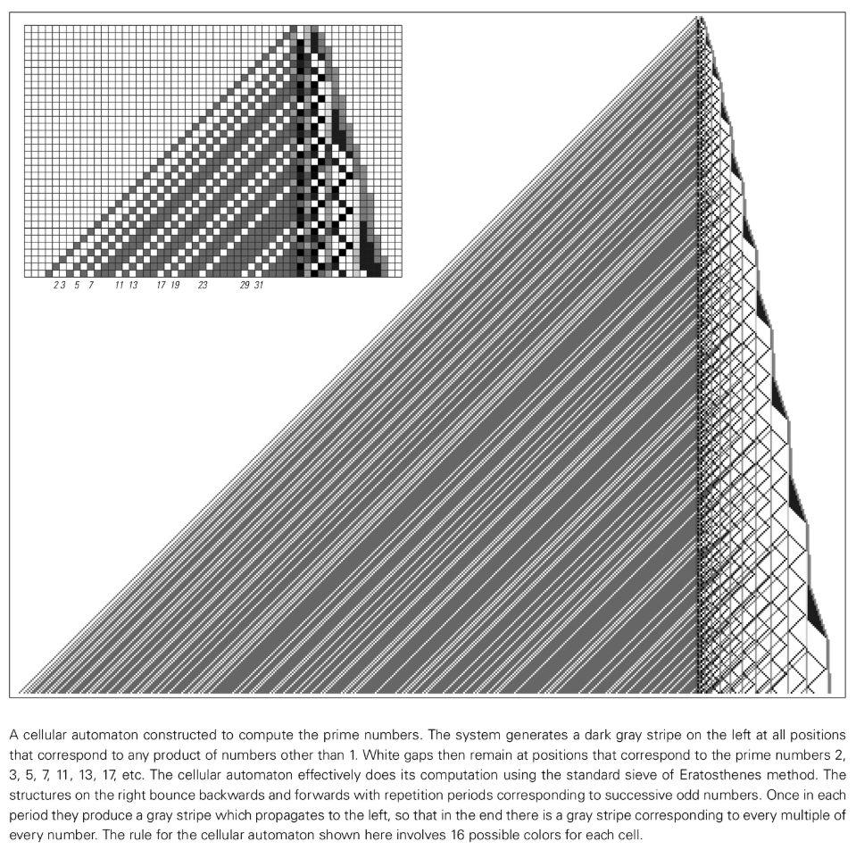

これまでに説明したセル オートマトンの多くは、従来の数学的概念を使用して説明できる動作を持っています。たとえば、ルール 94 は事実上、偶数を列挙するものとして説明できます。ただし、ルール 30、45、および 73 のようなセル オートマトンの場合、その動作を単純な数学的用語やその他の用語で説明するのは不可能と思われます。ここでは伝統的な数学はほとんど役に立ちませんが、実際の計算から得られたいくつかのアイデアは、必要な枠組みを与えてくれます。

## 普遍的な現象

異なる基礎となるルールを使用してセル オートマトンを設定することで、特定の複雑な計算を実行できることがわかりました。機械やその他の機器を使った日常的な経験から、さまざまな種類のタスクを実行するには、さまざまな基礎構造を持つシステムを使用する必要があると考えるようになります。しかし、コンピュータ革命を引き起こした驚くべき発見は、そうではないということでした。実際、基礎となる構造は同じままで、異なるタスクを実行するために異なるプログラムが可能な普及型システムを構築できます。

これが実際のコンピュータの仕組みです。ハードウェアは同じですが、異なるソフトウェアをロードすることで、コンピュータを異なるタスク用にプログラムできます。この[普遍性](annotation:universality)という考え方は、コンピュータ言語の基礎でもあります。

特定のコンピューター システムまたは言語の詳細は、特定のタスクの実行の容易さまたは困難さに影響を与える可能性がありますが、重要な事実は、適切なプログラミングを使用すれば、最終的にはどのコンピューター システムまたは言語でもまったく同じ一連のタスクを実行できるということです。たとえば、任意のシステムを別のシステムをシミュレートするようにプログラムできます。

[普遍性](annotation:universality) の現象は、人間の言語など他の分野にも存在します。任意の言語を使用して、ほぼあらゆる広範な物事を説明でき、任意の 2 つの言語間の翻訳が常に可能です。

自然科学では、普遍性という概念はこれまで真剣に考慮されたことはありませんでした。ただし、一般化可能性は、自然システムに見られる複雑さを特徴づけ、理解するために重要です。システムが [ユニバーサル](annotation:universality) であるためには、他のシステムと同じくらい複雑な動作を生成できるように、他のシステムをシミュレートできなければなりません。

以前は、人々は普遍性を、通常は専用システムにのみ見られる、まれで特別な性質であると考える傾向がありました。しかし、この章の 1 つの結論は、普遍性は実際にはより一般的な現象であるということです。

## 万能セルオートマトン

このセクションでは、その動作が理解しやすいように設定された具体的なユニバーサルセルオートマトンについて説明します。セルオートマトン自体のルールは常に同じです。しかし、これは普遍的なものであるため、適切な初期条件が与えられれば、ルールに関係なく、考えられるあらゆるセル オートマトンをシミュレートするようにプログラムできます。

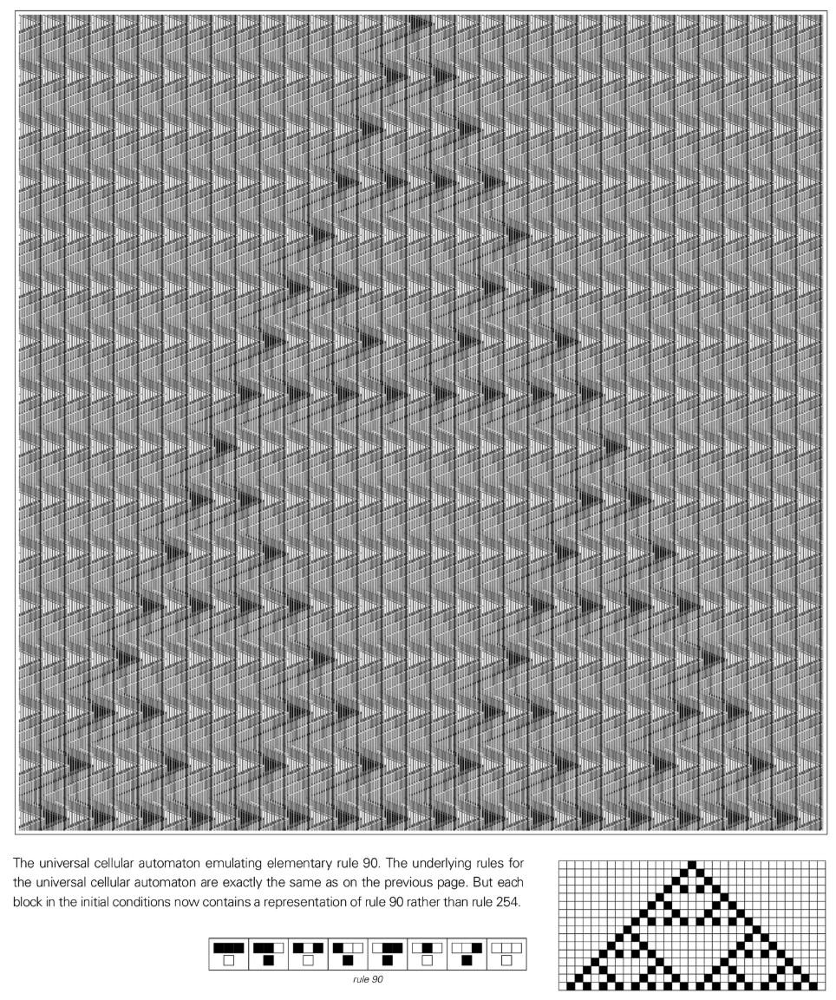

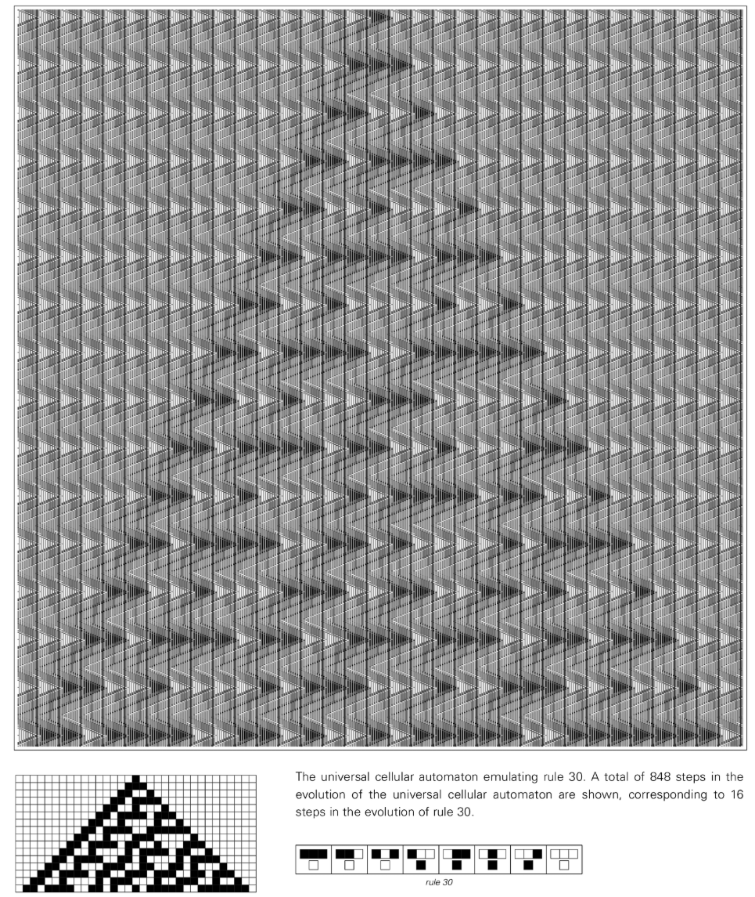

このユニバーサル セル オートマトンは、20 個のセルのブロックを使用して、シミュレートされたセル オートマトン内の個々のセルを表します。このブロックは、表示されているセルの現在の色と、その色を更新するためのルールの両方をエンコードします。ブロックで表されるセルの色を更新するには、ユニバーサル セル オートマトンが 8 つの考えられる状況のうちどれがセルに当てはまるかを判断する必要があります。これは、最終的に 1 つのケースだけが残るまで、適用できないケースを段階的に排除することによって行われます。

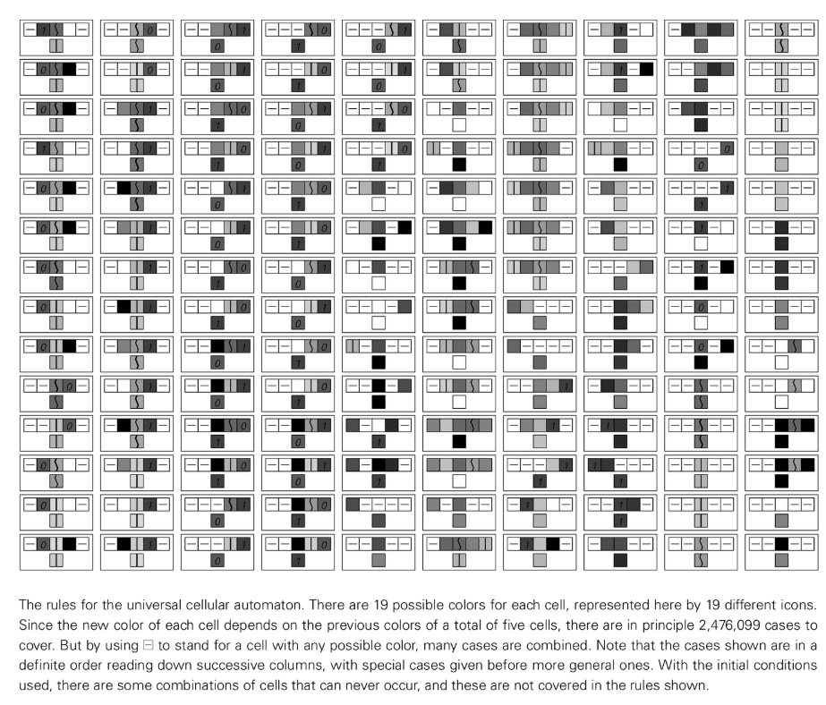

このユニバーサル セル オートマトンは、最近傍に関係するルールのシミュレーションに限定されません。たとえば、最近傍だけでなく次隣を含むルールをモデル化できます。 3 つ以上の色を含むルールの場合は、2 色のみで隣接する色が多数あるルールを使用してシミュレートすることもできます。

この結果は重要であり、一見すると驚くべきものです。これは、ユニバーサル セル オートマトンが、独自のルールよりも複雑なセル オートマトンをシミュレートできることを意味します。 [普遍性](annotation:universality) の基本的な現象を知らなかった場合、より複雑なルールを使用することで、いつでも新しい異なるタイプの動作を生成できると考えてしまうかもしれません。しかし今ではそうではないことが分かりました。

ただし、このセクションで説明する特定の汎用セル オートマトンのルールは非常に複雑です。 [普遍性](annotation:universality) を達成するために実際にこのような複雑なルールが必要な場合、自然系で一般的に見られる [普遍性](annotation:universality) は期待できないでしょう。ただし、後で説明するように、基礎となるルールのこの複雑さは必要ありません。

## セル オートマトンを使用して他のシステムをシミュレートする

前のセクションでは、特定のユニバーサル セル オートマトンがあらゆる可能なセル オートマトンをシミュレートできることを示しました。しかし、他の種類のシステムについてはどうなのでしょうか?セルオートマトンもそれらをシミュレートできるでしょうか?

セル オートマトンはその単純かつ特殊な基礎構造のため、他の非常に広範囲のシステムをシミュレートすることは決してできないだろうと考える人もいるかもしれません。しかし、このセクションでは、そうではなく、セル オートマトンがこの本で説明したほぼすべての種類のシステムを実際にシミュレートできることを示します。

たとえば、セル オートマトンは、[移動オートマトン](annotation:mobile-automata)、[チューリング マシン](annotation:turing-machines)、[置換システム](annotation:substitution-systems)、[逐次置換システム](annotation:sequential-substitution-systems)、[ラベル システム](annotation:tag-systems)、[レジスタ マシン](annotation:register-machines)、さらには実際のコンピュータをシミュレートできます。

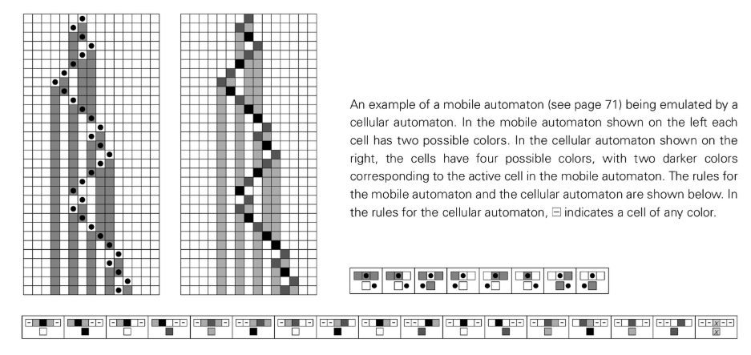

したがって、ユニバーサル セル オートマトンは、任意のセル オートマトンだけでなく、実際のコンピュータを含む幅広い他のシステムもシミュレートできます。

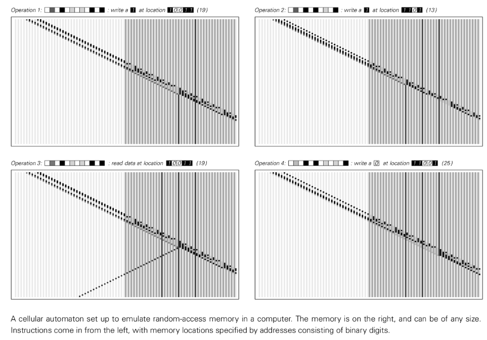

## 他のシステムを使用してセル オートマトンをシミュレートする

前のセクションでは、セル オートマトンをセットアップして、非常に広範囲の他のタイプのシステムをシミュレートできることを発見しました。しかし、これはセルオートマトンの特別な機能なのでしょうか、それとも他のシステムにも同様の機能があるのでしょうか?

このセクションでは、実際、これまでに検討したシステムのほぼすべてが同じ機能を備えていることを発見します。すべてのシステムがセル オートマトンによってシミュレートできることを示したように、次に、これらのシステムもセル オートマトンによってシミュレートできることを示します。

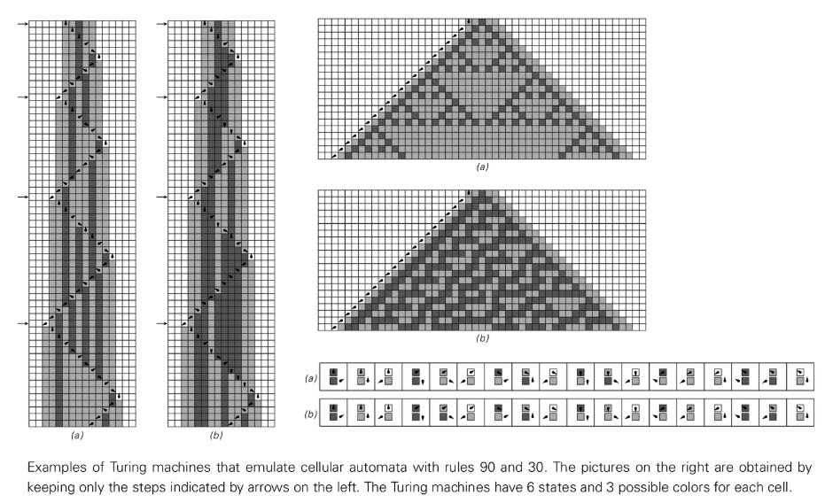

[移動オートマトン](annotation:mobile-automata)、[チューリングマシン](annotation:turing-machines)、隣接依存型 [置換システム](annotation:substitution-systems)、[逐次置換システム](annotation:sequential-substitution-systems)、[ラベルシステム](annotation:tag-systems)、シンボルシステム、ループ [ラベルシステム](annotation:tag-systems) および [レジスタマシン](annotation:register-machines) は次のことができます。すべてセットアップされる セルオートマトンをシミュレートします。少なくとも一部のセル オートマトンは普遍的であることがわかっているため、これは、これらすべてのタイプのシステムも普遍的である可能性があることを意味します。

## 普遍的な啓蒙

セル オートマトン、[チューリング マシン](annotation:turing-machines)、[置換システム](annotation:substitution-systems)、[レジスタ マシン](annotation:register-machines) などのシステムは、その基礎となる構造に大きな違いがありますが、最終的にはすべて相互にシミュレートできます。計算の観点から見ると、これは、根本的な構造が大きく異なるさまざまなシステムが、ある意味で基本的に同等であることを意味します。

これは、特定のタイプのすべてのシステムが同じ計算能力を備えているということではありません。実際、一部のセル オートマトンは非常に単純な計算しか実行できません。しかし、重要な点は、人々がますます強力なコンピューティング機能を備えたセル オートマトンを調べるにつれて、最終的には [普遍性](annotation:universality) のしきい値を超えることになるということです。このしきい値を超えると、実行できる一連の計算は常にまったく同じになります。

システムが普遍的になると、その特性はその構築の詳細からはほとんど独立します。実行できる計算に関しては、システムの基礎となるルールがどれほど複雑であるか、あるいはシステムがセル オートマトンであるか、[チューリング マシン](annotation:turing-machines) であるか、その他のものであるかは関係ありません。

## ルール 110 セルラー オートマトン

普遍性を達成するには、システムの基礎となるルールはどの程度複雑である必要があるでしょうか?この章の前半で説明した汎用セル オートマトンには、かなり複雑な基礎となるルールがあります。しかし、[ルール 110](annotation:rule-110) のような非常に単純なルールを持つセル オートマトンでも汎用性があることが判明しました。

ルール 110 の基礎となるルールは単純ですが、多くの複雑な方法で移動し相互作用するさまざまなローカル構造をサポートしています。これらのローカル構造は、意味のある計算を実行するように配置できます。ルール 110 の普遍性を証明する基本的な考え方は、循環ラベリング システムなど、普遍的であることが知られているシステムの特定のクラスに属するシステムをシミュレートできることを示すことです。注意深く構築すると、ルール 110 は実際にあらゆるループ ラベリング システムをモデル化できるため、それ自体が普遍的なものであることがわかります。

## ルール 110 における普遍性の意味

ルール 110 の普遍性は、普遍性が人々が考えているよりもはるかに一般的な現象であることを示しています。これは、非常に単純なルールを持つシステムであっても普遍的なものになり得ることを示しています。これは、段階的に複雑なルールを持つ一連のシステムでは、[普遍性](annotation:universality) のしきい値に達するまで、結果として生じる全体的な動作がさらに複雑になることを意味します。このしきい値を超えると、それ以上根本的な変化はなくなります。

ルール 110 のようなシステムが普遍的であることを知っているので、このしきい値に非常に簡単に到達できるのではないかと考えています。これは、特定のタイプの最も単純なルールを超えると、私たちが目にする動作はすぐに可能な限り複雑になる必要があることを意味します。

## タイプ 4 の動作と普遍性

ルール 110 の典型的な動作は、複雑な方法で移動し相互作用する多数のローカル構造の存在によって特徴付けられます。この動作は、私がタイプ 4 と呼ぶすべてのセル オートマトンの特徴です。全体的なタイプ 4 の動作を示すセル オートマトンは、最終的にルール 110 のような [普遍的](annotation:universality) になるのではないかと私は強く疑っています。タイプ 4 のルールを十分に研究すれば、最終的には普遍性をサポートするのに十分なローカル構造のセットが見つかると私は信じています。

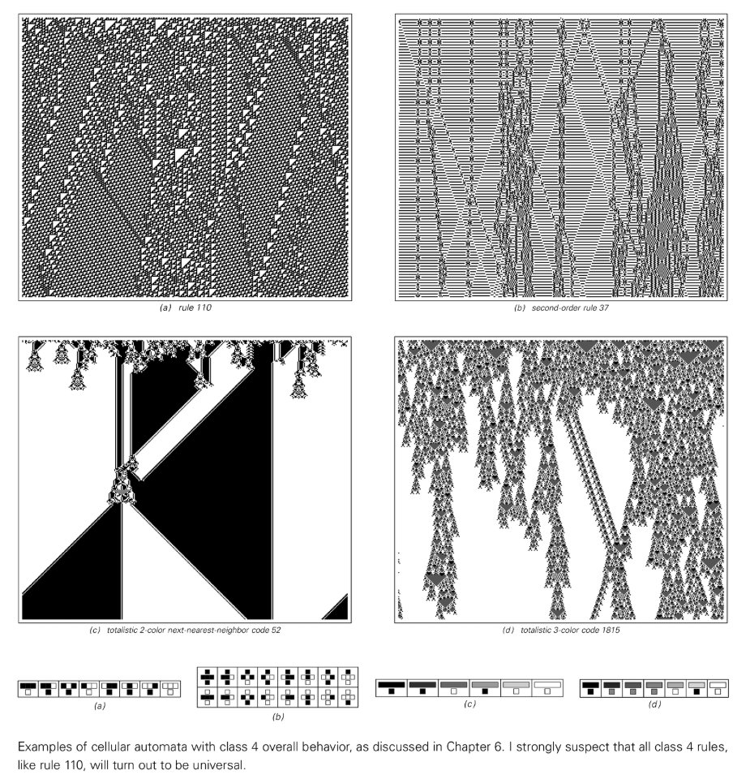

## セルオートマトンにおける普遍的な閾値

システムが普遍的であるためには、適切な初期条件を選択することによって、他のシステムで発生する可能性のあるあらゆるタイプの動作をシミュレートできなければなりません。したがって、単純な均一または反復的な動作パターンを常に生成するタイプ 1 およびタイプ 2 セル オートマトンのようなシステムは、確かに普遍的ではありません。ルール 90 や 150 のような追加ルールは、最終的にはその動作が予測可能であるため、普遍的ではありません。

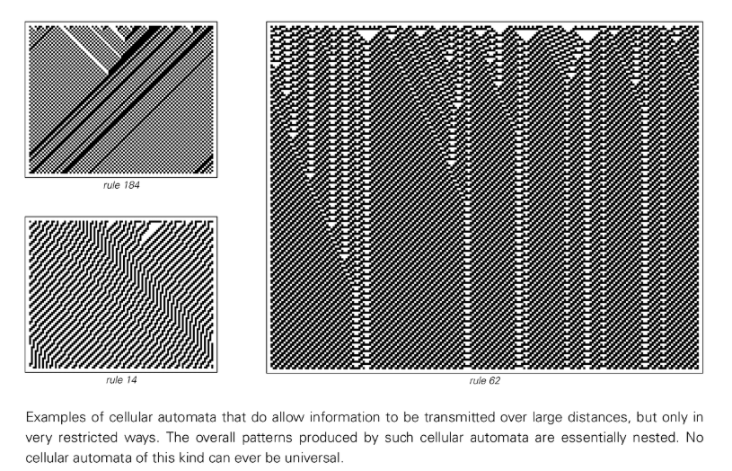

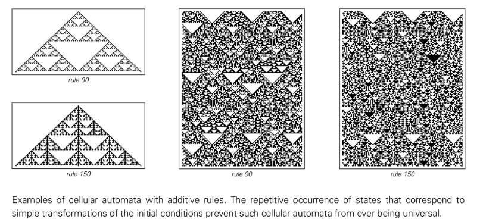

私の一般的な予想は、動作が基本的に反復的または入れ子になっていないほぼすべてのシステムは、最終的には普遍的であることが証明されるということです。ただし、一部のシステムでは、この事実を確認することが他のシステムよりもはるかに難しい場合があります。

## チューリングマシンとその他のシステムの普遍性

セル オートマトンでは、[普遍性](annotation:universality) の閾値は非常に低いです。 [チューリングマシン](annotation:turing-machines) など、他のタイプのシステムにも同じことが当てはまります。最も単純な既知のユニバーサル チューリング マシンの 1 つは、2 つの状態と 5 つの可能な色のみを持っています。私は、より単純な汎用チューリング マシンが存在することを疑いません。

[参考: 最も単純な万能チューリングマシンを証明する](https://writings.stephenwolfram.com/2007/10/the-prize-is-won-the-simplest-universal-turing-machine-is-proved/)

この本の前半で複雑な動作を見たほとんどすべてのケースで、最終的にはそれが [普遍的](annotation:universality) であることを証明できると私は信じています。実際、次の章で詳しく説明しますが、[普遍性](annotation:universality) と複雑な動作の出現の間には強いつながりがあると私は信じています。