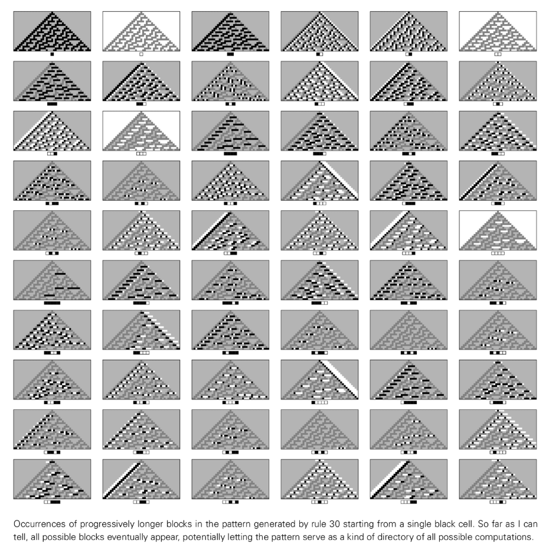
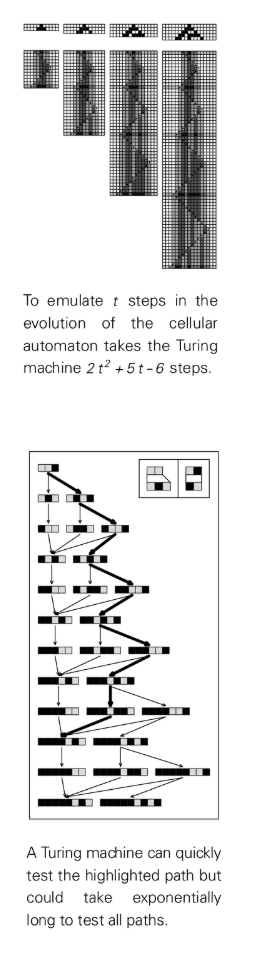
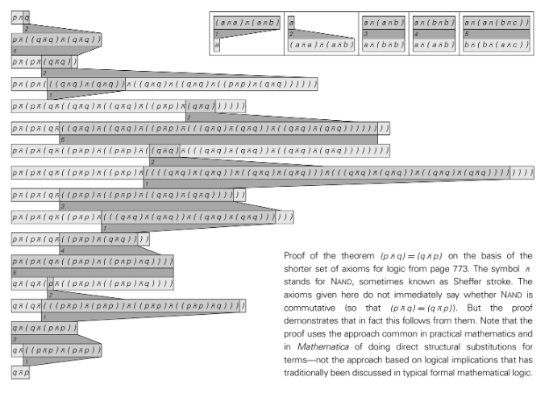
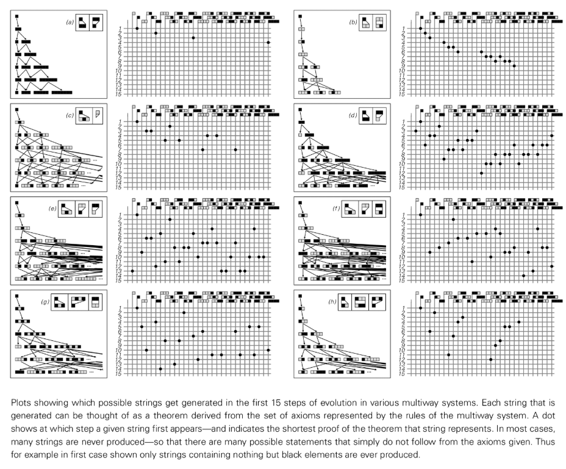

# 第12章 計算上の等価性の原理（計算上の等価性）

## 基本的なフレームワーク

この本の発見に基づいて、私が「[計算上の等価原理](annotation:computational-equivalence)」と呼ぶ大胆な仮説を説明します。この原理は幅広い応用範囲があり、あらゆる自然プロセスまたは人工プロセスをカバーしており、科学、数学、哲学、その他の分野における多くの長期的な問題に重大な影響を与えています。

その中心となる統一的な考え方は、人工か自然発生かにかかわらず、すべてのプロセスは計算と見なすことができるということです。システム (セル オートマトンなど) の進化は、計算とみなすことができます。同様に、自然界のプロセスは計算とみなすことができ、そのルールは自然法則によって定義されます。この統一性により、計算上の等価性の原理を構築することが可能になります。

## 原則の概要

自然界のプロセスと人工システムは大きく異なりますが、あらゆるプロセスを計算として見ることで、プロセスを議論するための統一的な枠組みが得られます。計算等価性の原理は、このフレームワークを使用して、計算の観点から多くの異なるタイプのプロセス間に基本的な等価性があることを主張します。

この原則の最も一般的な記述は、明らかに単純ではないほとんどすべてのプロセスは、同等の複雑さの計算と見なすことができるということです。

さまざまなプロセスの計算の複雑さには大きな違いがあると考える人もいるかもしれませんが、計算の等価性の原則は、実際には本質的に計算の複雑さの最高レベルは 1 つだけであり、一見単純ではないプロセスのほとんどすべてがこのレベルに到達できると主張しています。重要なヒントは「普遍性」という現象にあります。ユビキタス システムはあらゆる計算を実行できるため、すべて最高レベルの計算複雑さを実現します。

伝統的に、普遍性を達成するには、複雑かつ絶妙なルールを設定する必要があると考えられています。しかし、この本の重要な発見は、非常に単純なルールであっても普遍的なものになり得るということです (例: セルラー オートマトン [ルール 110](annotation:rule-110))。計算上の等価性の原則の帰結として、動作が明らかに単純ではないほとんどすべてのルールは、最終的には同じ計算の複雑さを達成し、したがって普遍的になるはずです。したがって、普遍性は珍しい性質ではなく、自然界のさまざまな系で非常に一般的であり、発生すると予想されます。

計算等価性の原理は、単純な初期条件から開始した場合でも、動作が明らかに単純でない限り、ほぼ常に同様に複雑な計算に対応すると主張します。ルールや初期条件がどれほど単純であっても、プロセス自体が単純に見えない限り、ほぼ常に同じように複雑な計算に対応します。これは、自然界およびそれを超えたプロセス間の基本的な統一性を明らかにします。

## 原則の内容

計算上の等価性の原理は、部分的には新しい自然法則、抽象的な事実、および定義です。それは、宇宙でどのような種類の計算が起こり得るのか、そしてどのような計算が起こり得ないのかを教えてくれます。

この原理は新しい自然法則を導入します。つまり、セル オートマトンやチューリング マシンのようなシステムほど複雑な明示的な計算を実行できるシステムはありません。もし最終的な物理理論が発見できれば、それは普遍的なシステムによってシミュレートされ、これより複雑な計算は宇宙のどこでも実行できないことが確認されるだろうと私は信じています。

この原理はまた、基本的で抽象的な事実も主張しています。つまり、動作が明らかに単純ではないすべての可能なシステムの大部分は普遍的であるということです。単純なルールの普遍性を証明することは非常に難しい場合がありますが、動作が明らかに単純ではないほとんどのシステムは、最終的には普遍性があることが証明されると私は確信しています。

単純な全体的な動作を強制する制約がない場合、自然界に生じる規則は特に選択されていないと見なすことができ、そのため、動作が単純でない場合、それらはほとんどの場合普遍性を示します。

計算等価性の原理は、システム全体の計算の複雑さだけでなく、システム内の特定のプロセスの計算の複雑さにも焦点を当てています。それは、明らかに単純ではないほとんどすべての動作は、たとえ単純な初期条件から導出されたものであっても、最終的には同じ複雑さの計算に対応すると主張します。非常に複雑な動作を生成するには、単純な初期条件で十分ですが、初期条件をより複雑にしても、通常は動作が変わることはありません。

## 複雑な現象の説明

この本では、早い段階で驚くべき発見が明らかにされています。非常に単純なルールを持つシステムでも、私たちには非常に複雑に見える動作が生成される可能性があります。計算上の等価性の原理は、これに対する基本的な説明を提供します。重要なのは、研究対象のシステムと、研究に使用するシステム (脳、数学的手法など) の計算の複雑さを比較することです。

計算等価性の原理は、明らかに単純ではないほとんどすべてのプロセスは、計算の複雑さにおいて同等であると主張します。これは、システムの基礎となるルールが単純であっても、その進化は、それを認識し分析するために使用されるプロセスと同じくらい計算的に複雑になる可能性があることを意味します。これが、単純なルールのシステムが複雑な動作を示す根本的な理由です。

結局のところ、私たちが非常に複雑である理由は、計算上の等価性の原則と、実際に遭遇する多数のシステムが計算上等価であるという事実に直接起因する可能性があります。

## 既約性を計算する

従来の理論科学の成功の多くは、数式の使用など、システムの動作を予測するために必要な計算量を削減する近道を見つけることに基づいています。しかし、多くの一般的なシステムには、その全体的な動作を説明する単純な式がないことがわかりました。これは、私が「[計算既約性](annotation:computational-irreducibility)」と呼んでいる、計算上の等価性の原則の基本的な帰結によって引き起こされる現象だと私は考えています。

システムに計算の既約性がある場合、その動作を予測する唯一の方法は、本質的にシステム自体が進化するのと同じだけ多くの計算ステップを実行することであることを意味します。

伝統的な科学は一般に、予測に使用されるシステム (私たちの脳と数学) は、予測されるシステムよりも計算的にはるかに複雑であると想定しています。しかし、計算上の等価性の原理は、これは真実ではないと主張します。動作が単純ではないほとんどすべてのシステムは、計算の複雑さにおいて同等です。したがって、予測に使用されるシステムは、体系的に予測対象のシステムを「上回る」ことはできません。その結果、多くのシステムの動作は計算的に[既約](annotation:computational-irreducibility) で考慮されなければなりません。

これが、伝統的な理論科学がほとんどの非単純なシステムの研究においてあまり成功していない根本的な理由であると私は信じています。計算の既約性が存在する場合、従来の理論科学の一般的な方法は必ず失敗します。

## 自由意志の現象

宇宙が明確な法則に従っているにもかかわらず、私たち人間は自由に決定を下すことができるようであることは、常に大きな謎でした。鍵は計算既約現象にあると私は信じています。

この現象は、システムが明確な基本法則に従っている場合でも、その全体的な動作の一部の側面が依然として合理的な法則によって記述されない可能性があることを意味します。システムの進化が既約計算に対応する場合、その動作を推定する唯一の方法は、この計算を実行することです。その結果、その動作をより直接的に推測できる法則は存在しません。

これが人間の意志の明らかな自由の究極の源であると私は信じています。私たちの脳のすべての構成要素は明確な法則に従っているかもしれませんが、それらの全体的な動作は合理的な法則では結果を予測できない還元不可能な計算に対応しているのではないかと私は強く疑っています。

## 決断不能と不可解さ

計算の既約性は一般的な現象であり、その結果の 1 つは、抽象計算理論で広く研究されているさまざまな現象です。これらの現象は特殊なシステムでのみ発生すると考えられていましたが、私の調査結果は、実際には非常に一般的な現象であることを示しています。

(無限に多くのステップを経た後の) システムの最終結果は何ですか?この質問は「[決定不能](annotation:undecidability)」の影響を受ける可能性があります。システムの動作が計算的に還元できない場合、最終的な動作を決定する近道は存在しません。これは、問題が形式的に決定不可能であることを意味します。私たちにとって動作が複雑に見えるほとんどすべてのシステムでは、無限小のステップ後の動作についての自明でない質問は決定不可能になるのではないかと思います。

有限問題の場合、計算の既約性が存在すると「困難」になる可能性があります。たとえば、一部の計算タスクに必要な計算量は、入力長に応じて指数関数的に増加する場合があります。私の調査結果は、チューリングマシンのような非常に単純なルールを持つシステムであっても、それらを完了するために指数関数的な計算量を必要とする計算タスクを実際に抱えていることを示しています。

## 数学とその基礎への影響

自然と数学の間には、抽象的なレベルでの類似点があります。自然界では、基礎となる単純な法則が豊かで複雑な動作を導きますが、数学では、単純な [公理](annotation:axiom) がさまざまな豊かで複雑な結果をもたらすこともあります。私は、これは最終的には計算上の等価性の原則のもう 1 つの帰結であると信じています。

多元システムと同様に、数学で単純に述べられた定理の中には、計算の既約性を反映して、非常に長い証明が必要になる場合があります。この現象により、特定の無限問題が決定不能になります。たとえば、マルチパス システムでは、「特定の文字列が生成されるかどうか」という疑問が生じます。通常は決定不可能です。これは、与えられた公理系に対して、その真実性を証明できない記述が存在する可能性がある数学の状況と似ています。

これが [ゲーデルの不完全性定理](annotation:godel-theorem) の本質であり、この本の発見によってそれがほぼ明らかになります。システムの進化が計算的に還元できない場合、つまりシステムの最終的な動作の問題が決定できない場合、システムは完全であり、調整されていることもできません。

計算上の等価性の原理は、ほとんどすべての公理系は、非常に低いしきい値を超える限り普遍的であるべきであることを意味します。これは、算術、集合論、群論など、現代の数学研究のほとんどで使用される公理系が普遍的な理由を説明します。したがって、ゲーデルの定理によって明らかにされる不完全性は、数学では一般的な現象であるはずです。

数学がここまで発展してきたのは、数学がその方法でうまく解決できる問題のみに焦点を当てると定義する傾向があり、それによって決定不可能性や証明不可能性を伴う問題を必然的に回避してきたからだと私は信じています。数学的伝統の枠から一歩外に出ると、決定不可能性と証明不可能性が非常に一般的になります。

## 宇宙の知性

もし知能が複雑な計算を実行する能力に関係しているのであれば、計算等価性の原則によれば、この能力は何十億年もの生物学的進化を必要とせずに出現することになる。それは遍在し、さまざまな生物系および非生物系に遍在しているはずである。

私たちが知性を判断するために使用する基本的な基準は、それが「意味を成す」か、「伝える」かどうかです。しかし、共通の背景や文脈がなければ、意味を識別することは非常に困難になります。

同様に、物体が知性の産物（つまり、人工物）であるかどうかを見分けることは困難です。従来、アーティファクトはそのシンプルさゆえに簡単に識別できました。目的を達成するにはアーティファクトの動作を予測する必要があるからです。ただし、より高度なテクノロジーでは、単純な目的を達成するために、複雑な動作を持つシステムを利用する場合があります。この場合、特定の目的のために作成されたシステムは、人工物というよりも自然の産物のように見えるかもしれません。

最終的に私は、重要なのは、十分に複雑な計算を実行できるシステムを見つけることではなく、詳細が私たちのものと非常によく似ており、その動作がインテリジェントであると認識できるシステムを見つけることであると結論付けました。

## テクノロジーへの影響

この本の中心的な発見の 1 つは、非常に単純なルールを持つシステムが非常に複雑な動作を生成する可能性があるということです。このようなシステムを活用することで可能になる新しい技術はたくさんあると思います。

従来のエンジニアリング手法では、動作が単純で簡単に予測できるシステムを構築することが好まれていましたが、この本で私が研究するシステムの多くは不可能でした。しかし、計算上の等価性の原理は、ルールは全く異なるが計算能力はまったく同じシステムが実際には多数存在し、原理的にはそれらがコンピューター構築の基礎として機能できることを意味します。

基礎となるルールは非常に単純なものでよいため、ルールの実装に使用できるコンポーネントの範囲が大幅に広がります。たとえば、従来のコンピュータを原子から自己組織化することは非現実的であるように思えますが、[ルール 110](annotation:rule-110) のようなセル オートマトンに対して自己組織化することはかなり実現可能であるように思えます。

## 歴史的展望

科学の歴史における大きな進歩の多くは、私たち人間が特別な存在ではないという発見によってもたらされました。計算上の等価性の原則も同様に、知性や複雑さの点でも、私たちには基本的に特別な点は何もない、と述べています。人間の脳であれ、乱流であれ、セルオートマトンであれ、それらが示す動作は同じ複雑さの計算に対応します。

したがって、私たち人間の計算能力は、非常に単純なルールを持つセル オートマトンと同じです。しかし、計算上の等価性の原理は、これが最終的には宇宙全体にも当てはまることも意味します。私たちの内部で起こっているプロセスは、最終的には宇宙全体と同じ計算量に達する可能性があります。

結局のところ、計算上の等価性の原理は、科学の究極的な力とその究極的な弱点の両方を明らかにします。それは、私たちの宇宙のすべての驚異が実際には単純な規則によって捉えられることを意味しますが、同時に、それらの規則が展開するのを見ない限り、それらの規則の結果のすべてを知ることはできないことも示しています。