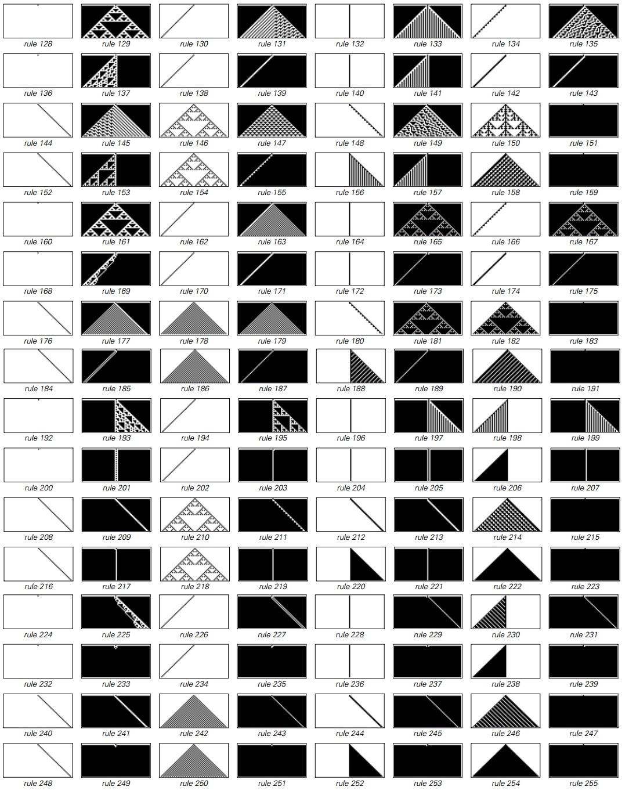
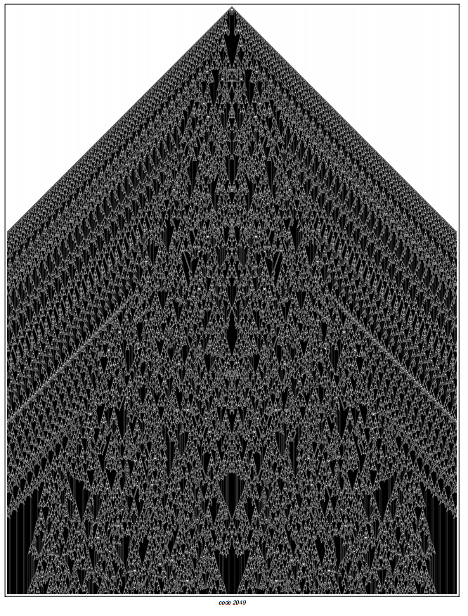
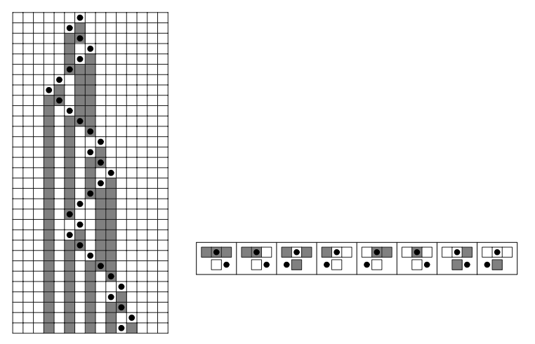
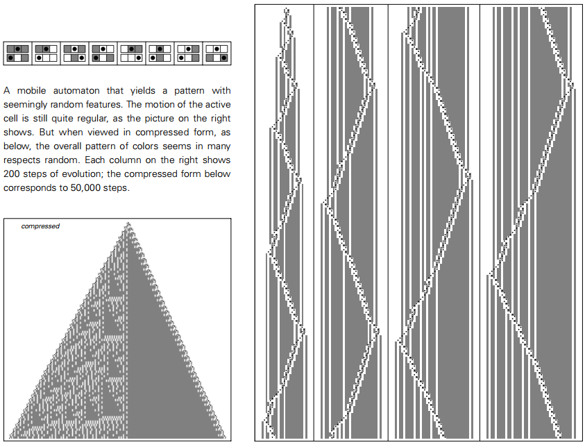
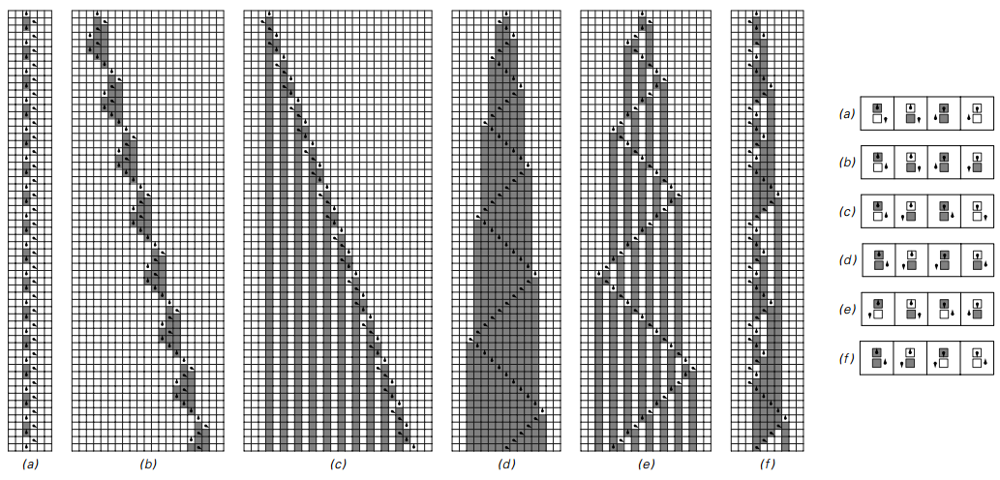
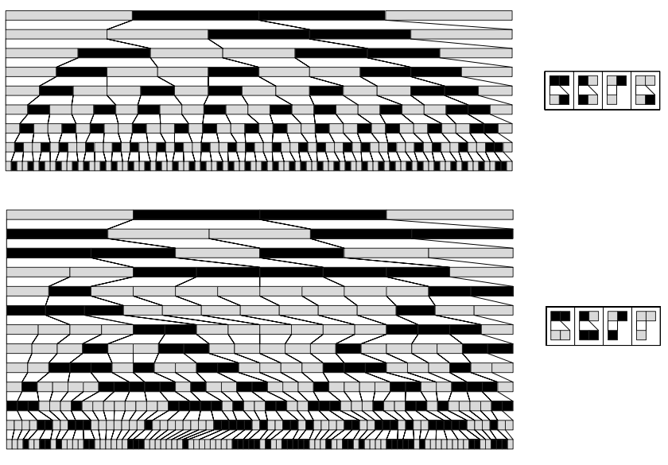
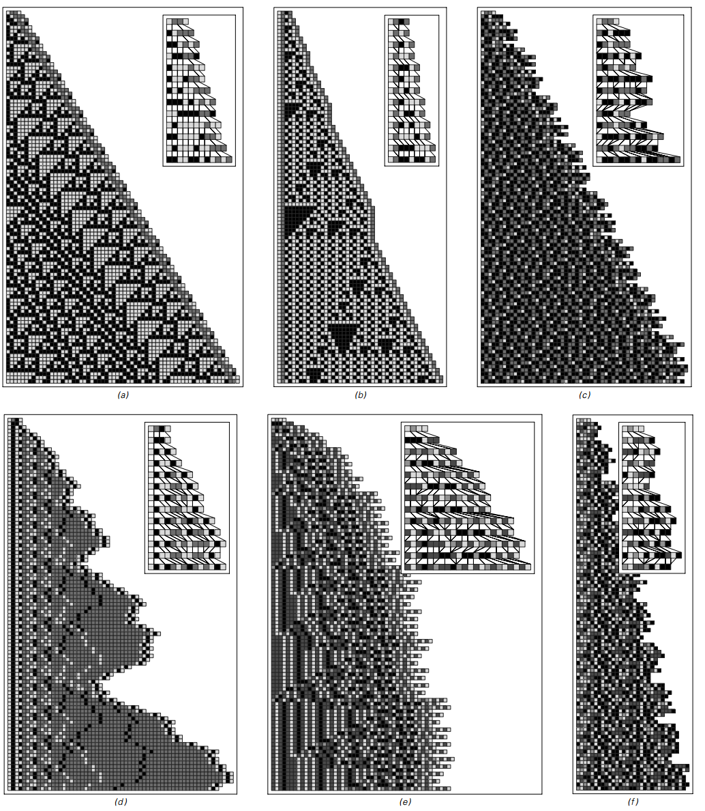
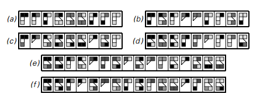
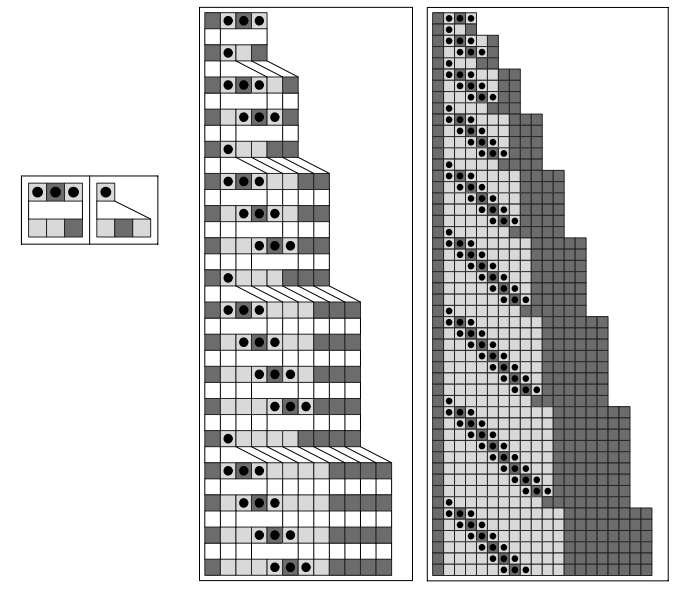
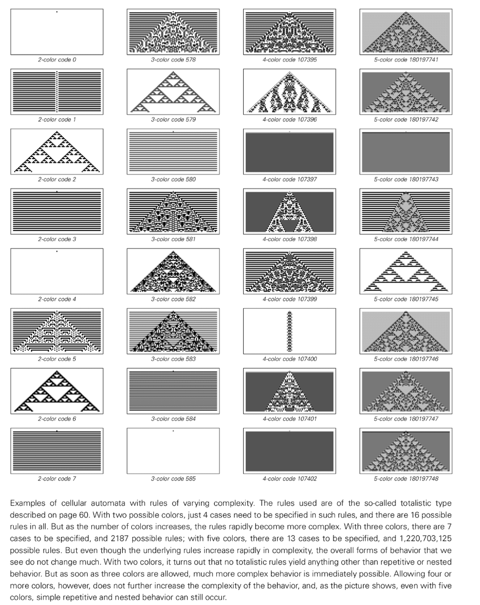

# 第 3 章: 簡単なプログラムの世界

前の章では、セルオートマトンという単純なアノテーションが生成できる驚くほど複雑な動作を垣間見ました。しかし、これは偶然なのでしょうか、それともより深い普遍的な法則を明らかにしているのでしょうか？この問いに答えるためには、第1章の具体例を超えて、自然科学者が生物の多様性を探求するのと同じように、単純なルールで構成される「計算宇宙」の中に、他にどのような「種」が隠されているのかを体系的に検討する必要がある。

## セルオートマトンの再探索

### 基本的な動作タイプ
私たちはまず [注釈: セルオートマトン] の世界に戻り、より包括的な国勢調査を実施しました。 256 個の最も基本的な (2 色、近傍 1) ルールをすべて 1 つずつ検証することにより、詳細は大きく異なりますが、行動パターンは依然として 4 つのカテゴリに明確に分類できることがわかりました ([注釈:行動の 4 つのクラス] を参照)。
- ルール 0 など、すぐに安定する繰り返し構造。
- 固定サイズの可動部分構造を形成します。
- ルール 90 など、無限の詳細を持ちながら規則性の高いネストされたパターンまたはフラクタル パターンを生成します。
- [ルール 30](注釈:ルール-30) のような、一見完全にランダムで無秩序なパターンを表示します。

これらのカテゴリは、典型的なパフォーマンスを迅速に特定するのに役立つだけでなく、その後のシステム間比較のための参照フレームを形成するのにも役立ちます。

### 基本ルール パノラマ
256 個のルール間の差異を定量化するために、各ローカル近傍の「真理値表」を 8 ビットのバイナリ シーケンスにエンコードし、ルール空間のコンパクトなビューが得られます。画像のコラージュは、表紙の一般的なルールを対比し、すべての組み合わせのパノラマ、つまり「計算の世界」の多様性を一目で明らかにするサムネイルを表示します。

マクロな分類に加えて、個々のルールの進化により、より微妙な違いも明らかになります。あるものはすぐに統一に陥り、あるものは移動する局所構造を解放し、あるものは広がりながら再配置を続けます。

<button class="expand-toggle" data-target="simplified" data-expanded="false">
  詳細を展開
  ▼
</button>

### フラクタルとランダムの例
多くのルールは繰り返し構造または有限構造を持つ傾向がありますが、入れ子になったフラクタルやほぼランダムな複雑なテクスチャを生成するルールもまだ数多くあります。たとえば、ルール 22、159、および 225 は異なるフラクタル次元を示しますが、ルール 30、45、106 などは、長期間にわたって明らかな周期のないランダムな背景を維持します。

進化時間を延長することで混合行動を観察することができます。規則的な背景と不規則な紛争の絡み合い、局所構造のゆっくりとした成長や衰退、非常に長い時間スケールでのみ現れる傾向の単純化などです。

<button class="expand-toggle" data-target="simplified" data-expanded="false">
  詳細を展開
  ▼
</button>

### 合計ルールとマルチカラー拡張機能
ルールの複雑さが根本的に動作を変えるかどうかをテストするために、セルの色を 2 (黒/白) から 3 (黒/白/灰色) に拡張し、「極端」または [totalistic-cellular-automata] ルール (注釈:totalistic-cellular-automata) を試しました (新しい色は隣接する色の合計にのみ依存します)。この設定により、ルールの数は 256 から 2187、またはそれ以上に増加しますが、その中心となる動作は依然として、繰り返し、ネスト、ランダム性の 3 つのテーマに従います。

より高い色数またはより大きな近傍を調べ続けたとしても、画像は、複雑さに必要な主要な要素がルールの複雑さの非常に低いしきい値ですでに満たされていることを示しています。

<button class="expand-toggle" data-target="simplified" data-expanded="false">
  詳細を展開
  ▼
</button>

## 異なる星系にわたる遠征

これらの現象がセル オートマトンに限定されないことを確認するために、同じ探索的アプローチを複数の計算モデルに一般化し、それらの代表的な進化を画像に記録しました。

### [モバイル オートマトン](注釈:モバイル オートマトン)
オートマトンを移動すると、グローバル同期からローカル更新および個々の「アクティブ セル」の移動に更新が変更されます。 65,536 の最も単純なルールのうち、ほとんどのケースでは限定的または周期的な動作のみが生成されますが、入れ子構造やほぼランダムなカラー パッチは依然として観察されます。複数のアクティブなセルまたはより豊富な状態が許可されると、複雑な進化が出現する可能性が高くなります。

ルールの複雑さが増し、活発な細胞分裂が可能になるにつれて、モバイルオートマトンもネストとランダム性の多様なテクスチャーを示すようになります。

<button class="expand-toggle" data-target="simplified" data-expanded="false">
  詳細を展開
  ▼
</button>

### [チューリングマシン](注釈:チューリングマシン)
チューリング マシンは、一次元テープ上のアクティブ セル (ヘッド) も移動させるという点で、移動オートマトンに似ていますが、ヘッドは複数の状態を持つことができます。 2 つの状態と 2 つの色の最も単純な組み合わせでは、繰り返しまたはネストされた動作のみが生成されます。ヘッド状態が 4 つに拡張されると、ランダムなテクスチャが表示され、「複雑さのしきい値」の存在が再度確認されます。

2 状態チューリング マシンの典型的な動作

マルチステートチューリングマシンの動作比較

4状態チューリングマシンの確率的進化

<button class="expand-toggle" data-target="simplified" data-expanded="false">
  詳細を展開
  ▼
</button>

### [置換システム](注釈:置換システム)
置換システムにより、ルールの変更に応じて要素の数を増減できます。ルールが要素自体の色のみに依存する場合、非常に規則的なネストされたフラクタルが生成されます。ルールが隣接要素に依存し、要素の作成または破棄を許可する場合、その動作はランダム拡散に近くなり、セル オートマトンのパフォーマンスと区別がつきません。

!【部分置換システムの進化例】(../../images/chapter3/p82.png)

システムをツリー視覚化に置き換える

作成と破壊を含む置換システム

<button class="expand-toggle" data-target="simplified" data-expanded="false">
  詳細を展開
  ▼
</button>

### [逐次置換システム](注釈:逐次置換システム)
置換システムを「左から右に最初に一致するものを見つけて置換する」ように変更すると、テキスト エディタの「検索と置換」に似たモデルが得られます。少数のルールでは重複または入れ子が生成されるだけですが、ルールのセットが拡大すると、セル オートマトンに匹敵する予測不可能なシーケンスも発生する可能性があります。

<button class="expand-toggle" data-target="simplified" data-expanded="false">
  詳細を展開
  ▼
</button>

### [識別システム](注釈:タグシステム)
マーキング システムは、各ステップでシーケンスの先頭から固定数のシンボルを削除し、削除のパターンに従って特定のシンボル ブロックを末尾に追加します。 1 つのシンボルが削除されると、そのシンボルは近隣に依存しない置換システムとして機能します。 2 つのシンボルが削除されるか、ラウンドロビン ルールが使用されると、複雑な相互作用とランダムな変動が現れます。

<button class="expand-toggle" data-target="simplified" data-expanded="false">
  詳細を展開
  ▼
</button>

### 周期識別システム

!【サイクル識別システムの動作図】(../../images/chapter3/p95.png)

サイクル識別システムの成長変動

<button class="expand-toggle" data-target="simplified" data-expanded="false">
  詳細を展開
  ▼
</button>

### [マシンの登録](注釈:マシンの登録)
レジスタ マシンは、基礎となる CPU がインクリメントおよびデクリメント ジャンプ命令を通じてレジスタを操作する方法を抽象化します。 4 命令以内のプログラムは最終的に反復動作に戻り、命令数が 8 に達すると、ほぼランダムな複雑なシーケンスが表示され、複雑さのしきい値がまだ非常に低いことがわかります。

<button class="expand-toggle" data-target="simplified" data-expanded="false">
  詳細を展開
  ▼
</button>

### [シンボル システム](注釈:symbolic-systems)
同様の実験は型書き換えシステムでも実行できます。簡潔な括弧式と置換ルール(Mathematica の `/.` 一致置換など)を使用して記号導出をシミュレートします。ルールは非常に非局所的ですが、これらのシステムは、単純な設定の下で反復的、ネストされた、さらにはランダムな動作も示します。

<button class="expand-toggle" data-target="simplified" data-expanded="false">
  詳細を展開
  ▼
</button>

> 詳細資料: [コンビネーター: 100 周年の展望](https://writings.stephenwolfram.com/2020/12/combinators-a-centennial-view/)

## 方法論に関する結論と考察

多くの計算モデルにわたるこの旅は、最終的に、非常に単純なルールが非常に複雑な動作を生み出す可能性があるという、確かで奥深い結論に導きました。これは偶然でも特別なケースでもなく、普遍的なコンピューティング現象です。基礎となる構造が並列セル アレイ、可動ヘッド、または動的ストリングであるかどうかに関係なく、ルールが十分な情報処理能力を許可する (しきい値が非常に低い) 限り、ルールは 4 つの共通の動作パターンを示します。

発見自体は新しい科学的手法、[コンピューター実験](注釈: 科学的方法論) に依存しています。従来の数学のように目標を設定してそれを達成できるシステムを構築するのではなく、最も直接的な方法でそれを行います。つまり、最も単純なプログラムを系統的にバイアスなく実行し、その動作を詳細に観察するということです。この方法により、直感の制約を取り除き、純粋な理論では演繹するのが難しい現象を捉えることができます。また、新しい現象を発見する最善の方法は、多くの場合、最も単純かつ直接的な実験を実施し、実験によって生成された膨大な量の生データを広い心で見ることであることも思い出させてくれます。多くの場合、画像は統計的な要約よりもはるかに多くの情報を明らかにします。