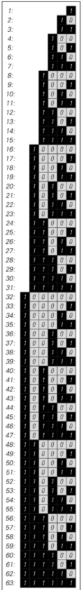
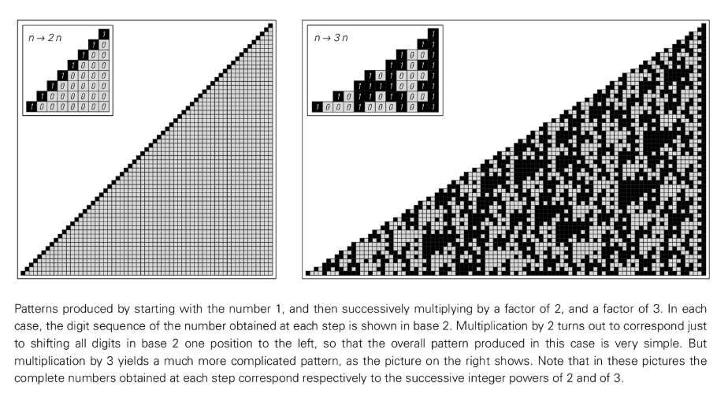
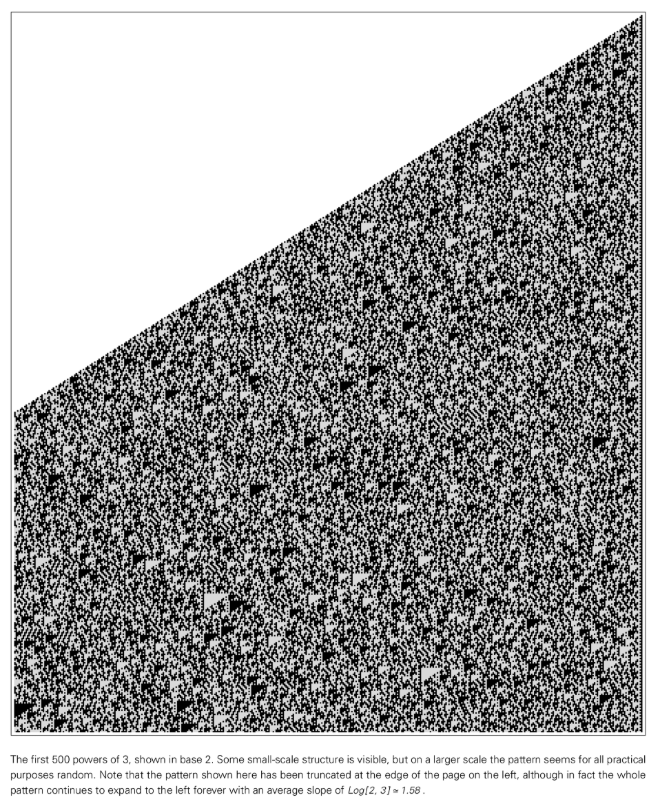
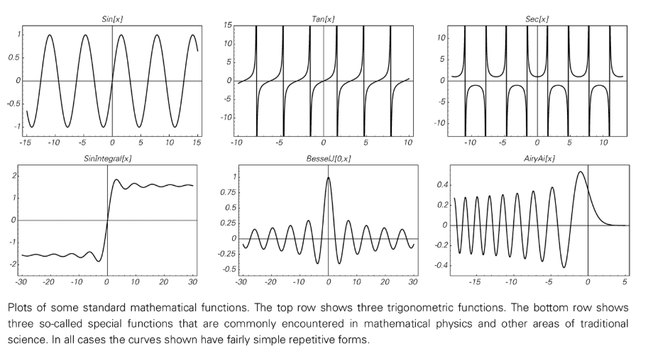
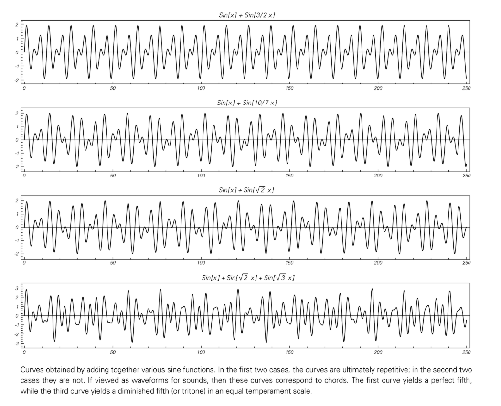

# 第 4 章: 数値ベースのシステム

## 数字の概念
伝統的な科学は長い間、数値を使用して自然システムを説明することに焦点を当ててきましたが、このアプローチは多くの場合、数値を理想化し、そのサイズのみに焦点を当てていました。この観点では、数は基本的な分割不可能な実体とみなされ、その唯一の重要な特性は数直線上での位置です。ただし、コンピューターでは、数値は一連の数値 (2 進数の 0 と 1 など) によって明示的に表現される必要があり、これによりより深い構造が明らかになります。

この違いは重要です。コンピューター内で数値が表現される方法 (つまり、一連の数値) を見ると、最も単純な数値ルールに基づいたシステムでも、 [Numeric Cellal Automata](annotation:numeric-cellal-automata) などの他の [Numeric Simple Programs](annotation:numeric-simple-programs) によって生成されるパターンと驚くほど似た複雑な動作を生成する可能性があることがわかります。伝統的な数学は、動作が本質的に単純で、簡潔で閉じた形式の解を生成するシステムを求める傾向があるため、この点が見落とされることがよくあります。しかし、この制限を放棄し、数値を操作可能なデータ構造として考えると、アノテーションの起源である数値の複雑さがこれらの数値シーケンスの詳細から現れます。

## 基本的な算術
一見最も単純な算術手順が、非常に複雑な動作につながる可能性があります。たとえば、1 から始めて 1 を繰り返し加算すると、生成される数列 (1、2、3、...) は、バイナリ表現の下で複雑な入れ子構造を持つパターンを形成します。これは、基礎となる構造が単純な累積プロセスではないことを示しています。

 

乗算により、より劇的な結果が得られることがあります。 1 から始まる 2 の乗算を繰り返すと (2 進数では単純な左シフト演算にすぎません)、非常に単純で予測可能なパターンが生成されます。ただし、繰り返し 3 を乗算すると、結果として得られる数列パターンは非常に複雑になり、小さな三角形の構造は依然として表示されますが、マクロ スケールではほぼ [ランダム](注釈: 数値ランダム性) のように見えます。

この複雑さは、単なる数値表現の産物ではありません。たとえば、繰り返し 3/2 を乗算するプロセスは、それ自体が複雑さと明白な注釈、つまり数値ランダム性を示す 10 進数サイズのシーケンスを生成し、複雑さがバイナリの視覚的表現だけでなく値自体に存在することを証明します。数値のパリティに基づいて異なるルールを適用するシステムなど、整数のみを含むシステムであっても、一見ランダムな動作や予測不可能な増加が発生する可能性があります。これらの例をまとめると、基本的な算術演算であっても、アノテーションのような単純なルールから非常に複雑で一見ランダムな動作を生成できることがわかります: 数値セルオートマトン。

> 追加読み物: [100 年を経て、ポストのラベル付け問題をついに解決できるか?計算上の還元可能性の物語、その他](https://writings.stephenwolfram.com/2021/03/after-100-years-can-we-finally-crack-posts-problem-of-tag-a-story-of-computational-irreducibility-and-more/)

## 再帰シーケンス
[再帰シーケンス](注釈: 自己参照再帰)、つまりシーケンス内の各項目が前の項目によって決定されることも、複雑さの原因です。フィボナッチ数列 `f(n) = f(n-1) + f(n-2)` などの標準的な線形漸化関係には固定ルールがあるため、多くの場合、単純な増加や反復的な動作が発生します。

ただし、ルールによって項目のインデックスがシーケンス内の以前の値 (`f(n) = f(n - f(n-1)) + f(n - f(n-2))` など) に依存することが許可されている場合、動作はさらに複雑になります。ここで重要なのは、システムがどの程度遡って情報を取得するかは、システムが生成する値によって決まるということです。この自己参照フィードバック ループは、単純な予測可能性を打ち破ります。このようなルールには加算と減算のみが含まれますが、全体的な成長傾向に暴力的で一見ランダムな変動を重ね合わせるシーケンスが生成されます。これは、最も基本的な操作を再帰的に適用すると、非常に複雑になる可能性があることを示しています。

## プライムシーケンス
[素数列](アノテーション:prime-distribution-spectrum)は非常に単純なルール(エラトステネスの篩)によって生成されますが、その分布は非常に複雑です。一連の素数 (2、3、5、7、11、...) はさまざまな点でランダム性を示します。たとえば、素数の間隔、素数の特定の形式の分布、およびその他の関連する特性はすべて、予測できない変動を示します。この事実は深い意味を持っています。数学において非常に基本的であり、非常に決定論的に定義されているシーケンスは、ランダムなプロセスと区別できないように動作します。

この現象は素数に限ったものではありません。数値の約数の数や二乗和として記述する方法の数など、単純な数値特性に基づく他の多くのシーケンスも、非常に複雑です。整数論者による何世紀にもわたる研究にもかかわらず、これらの数列の多くの側面は未解決の謎のままであり、単純な算術規則によって定義されるこれらのシステムの複雑さは例外ではなく、本質的な特徴であることを強く示唆しています。

## 数学的定数
[数学定数](注釈:超越数字パターン) の数値シーケンスは、複雑さのもう 1 つの顕著な例です。有理数 (1/3 や 1/7 など) の数列は常に単純に繰り返されます。しかし、単純な幾何学的な定義 (円の円周と直径の比) から得られる π のような数値のシーケンスは、完全にランダムであるように見え、これまでに計算された数兆桁の中にパターンは見つかりません。

同様に、√2 のような数字の順序もランダムに見えます。この複雑さは、これらの数値が表現される基数とは無関係に、これらの数値に固有の特性です。表現の変更は強力なテストです。たとえば、annotation:Continuous-fraction では、有理数と 2 次無理数 (√2 など) には単純または繰り返しのパターンがありますが、π や $\sqrt[3]{2}$ のような数値は一見ランダムなシーケンスを生成します。複雑さがさまざまな基本表現にわたって持続する場合、この複雑さは数値自体の固有の特性であると結論付けることができます。

## 数学関数
`Sin[x]` や [Bessel Function](annotation:bessel-function) などの標準的な数学関数は、多くの場合、単純な反復可能な曲線を生成します。ただし、これらの単純な関数を組み合わせることで (注釈: 関数の重ね合わせ)、複雑な非反復的な動作を生成することができます。たとえば、`Sin[x] + Sin[√2 x]` の曲線は多くの点で複雑かつランダムに見え、その波形は決して繰り返されません。

さらに、単一の関数が複雑な動作を生成する場合があります。代表的な例は[リーマンゼータ関数](注釈:riemann-zeta-function)で、素数の分布と密接な関係があり、その挙動曲線は非常に複雑です。ゼータ関数のゼロ位置は、素数の分布に関する深い情報をコード化しているため、その曲線の複雑さと予測不可能性は、素数シーケンス自体の複雑さを直接反映しています。今日に至るまで、その基本特性の多くは数学における未解決の大きな問題のままです。

## [反復マッピング](annotation:iterative-map-behavior) および [Chaos](annotation:iterative-chaos) 現象
反復マッピングは、固定ルールに基づいて値 (通常は 0 と 1 の間) を繰り返し更新するプロセスです。このようなシステムでは、2 つの異なるタイプの複雑さが明らかになる可能性があります。

`x → FractionalPart[2x]` (シフト マップ) などの一部のマップは、いわゆる「カオス」、つまり初期条件に対する敏感な依存性を示します。初期値への小さな変更 (つまり、シーケンスの後半での数値の変更) は、繰り返しの中で徐々に増幅され、最終的には結果に大きな違いが生じます。ただし、そのようなシステム自体はランダム性を生成しません。それは単に初期条件にすでに存在するランダム性を増幅して明らかにするだけです。これはベルトコンベアのように機能し、最初の数字からより深い数字のシーケンスを目立つように運びます。 1/2 などの単純な初期数値から始めると、動作は単純で反復的になります。

対照的に、`x → FractionalPart[3/2x]` のようなマッピングは本質的に複雑さを生み出します。非常に単純な初期条件から始まったとしても、システムは複雑な数列と数値の大きさに進化しました。ここでの算術演算自体は、数値の新しく複雑な配置を継続的に作成します。これは、初期条件にすでに存在するランダム性を単に増幅するのではなく、システム自体の進化のプロセスから複雑さが生じる可能性があることを示しており、これが情報を明らかにすることと情報を作成することの根本的な違いです。

## 連続セルオートマトンと偏微分方程式
複雑さは、整数や数値などの離散要素で構成されるシステムに限定されません。複雑さは連続システムにも見られます。これは、複雑さは「デジタル化」や離散化の副産物ではなく、動的システムのより一般的な特性であることを意味します。

たとえば、各ユニットが連続的なグレー値を取ることができるアノテーション: 連続セル オートマトンでは、単純なローカル ルールによって、単一の黒いユニットの初期状態から、一見ランダムなテクスチャや離散的なローカル構造などの非常に複雑なパターンを生成できます。

さらに、[注釈: pde](PDE) で記述されるシステムなど、現代物理学の基礎である完全に連続したシステムでも複雑さが発生する可能性があります。歴史的に研究されてきたほとんどの偏微分方程式 (波動方程式や拡散方程式など) は単純に動作しますが、検索すると、形式は単純でも、その解が非常に複雑な偏微分方程式がいくつか見つかることがあります。これらの連続システムは、離散システムで見られるものと非常によく似た複雑なパターンを生成し、計算と物理の橋渡しと伝統的な物理学の数学的世界という注釈を提供します。

## 結論: 連続システムと離散システム
この本で発見された複雑さの現象は、離散システムに特有のものではありません。それらは連続システムにも存在します。ただし、この現象は、離散システムで発見および研究する方がはるかに簡単です。離散システムのシミュレーションは単純かつ明確であり、経験的で実験的な数学的探索を行うことができます。対照的に、連続システムの数値解析では多くの場合、近似やアーチファクトが導入されるため、見られる複雑さがシステムの真の特性なのか、それとも計算手法のアーチファクトなのかを判断することが困難になります。

それにもかかわらず、核となる結論は、システムが離散的であるか連続的であるかにかかわらず、単純なルールからの複雑な動作の生成は遍在するということです。この発見はまさに、離散システムがこの深遠で普遍的な原理を観察できる明確な窓を提供するために可能でした。