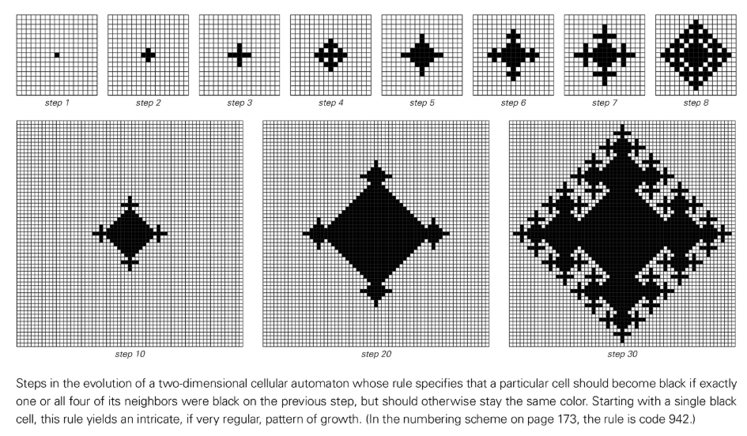
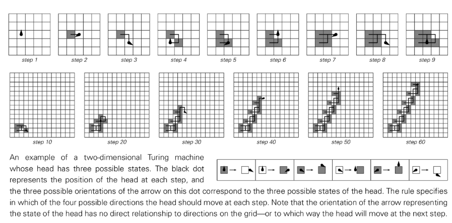
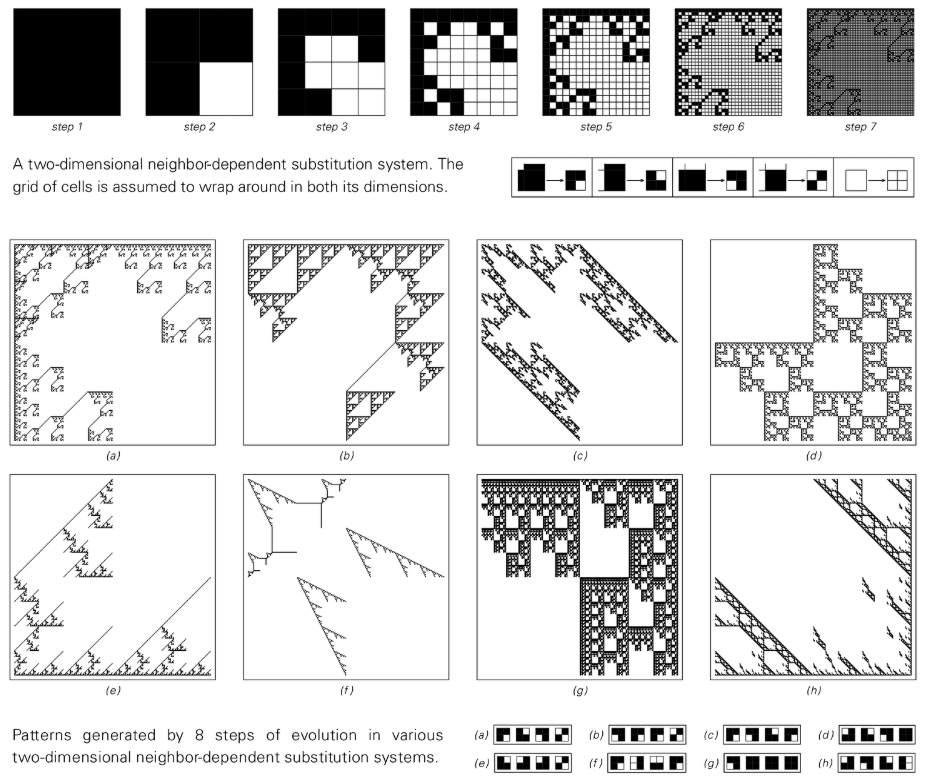
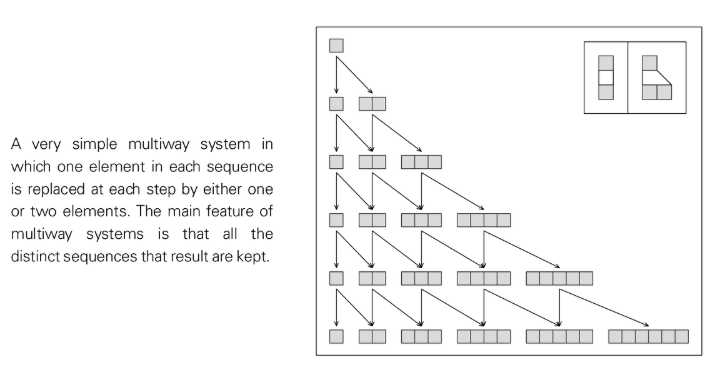
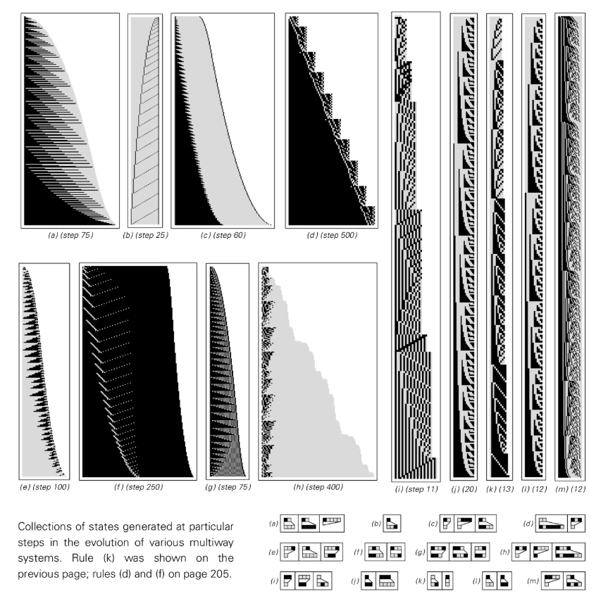
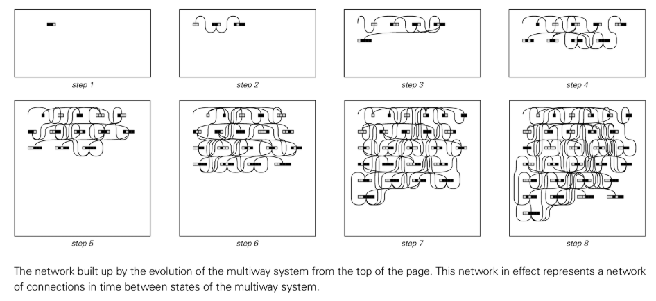
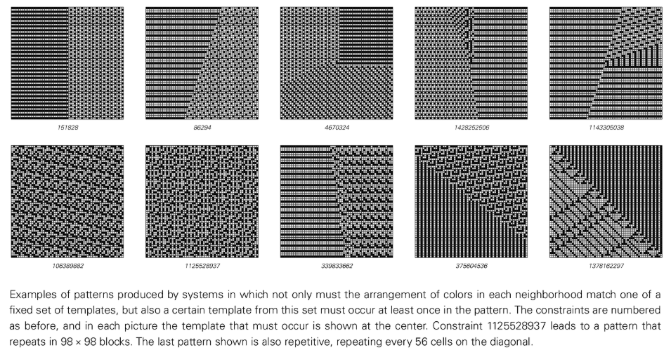

# 第5章：二次元以上

＃＃ 導入

私たちが住む物理世界は 3 次元ですが、本書でこれまでに説明したシステムは基本的に 1 次元に限定されています。この章の目的は、複数の次元を考慮するとどれだけの違いが生じるかを調査することです。従来の科学、特に物理学や数学の分野では、次元の追加が根本的で重大な結果をもたらすと想定することがよくあります。複雑な形状を含む流体力学や、3 次元の存在を必要とする [トポロジカルキンク構造](annotation:topological-knots) など、よく研究されている現象の多くは、1 次元では発生しません。ただし、次元の追加は、本書の中心テーマである複雑さの現象、つまり単純なルールが予測不可能な動作を生み出す能力に根本的な影響を与えているようには見えません。探査プロセス中に複数の次元に依存するいくつかの特定の効果に遭遇することになりますが、全体的な動作特性は 1 次元システムの動作特性と本質的に異なるものではなく、複雑さの基本的な現象の出現は次元が増加しても大きく変化しません。

## セルオートマトン

セル オートマトンを 1 次元の線形配置から 2 次元のグリッドに簡単に拡張できます。各セルの色は周囲のセルの状態に基づいて更新されます。これらの近傍を定義すること自体が、新たな可能性をもたらします。最も単純な近傍 ([フォン ノイマン近傍](annotation:von-neumann-neighborhood)) は、上下左右の 4 方向のセルのみを考慮します。

隣接するセルのいずれかが黒である場合、中央のセルが黒になるという非常に単純なルールにより、予測可能な形態を持つ均一に拡大する菱形が生成されます。ただし、隣接するセルの 1 つまたは 4 つすべてが黒の場合にのみセルが黒になると規定するなど、ルールをわずかに変更するだけで、驚くほど複雑だが規則性の高い雪の結晶のようなパターンが生成され、さまざまなスケールで自己相似性を示します。さらに興味深いのは、これらの 2 次元パターンをレイヤーごとに積み重ねると、規則的な [ネストされた](annotation:nested-patterns) 構造を持つ 3 次元オブジェクトを構築して、時間次元を視覚化できることです。

さまざまな 2D セル オートマトンのルールを調査すると、生成される複雑さは 1D の場合と非常に似ていることがわかります。このことの強力な実証は、これらの 2 次元パターンの 1 次元スライスを観察すると、時間の経過に伴うその進化が、1 次元のセル オートマトンで見られる単純な、入れ子になった、または複雑な動作と驚くほど一致しているということです。

多くのルールは幾何学的に規則的なパターンを生成しますが、不規則な形状を生成するルールも見つかります。たとえば、特定のルールによって、表面が粗いパターンや完全な円に近い全体的な形状が生成される場合があり、ローカル ルールとグローバル形態の間に深い関係があることがわかります。 8 つの隣接セル (対角線上、つまり [ムーア近傍](annotation:moore-neighborhood) を含む) のうち 3 つが黒である場合にセルが黒になるなど、より複雑なルールは、非常に単純な初期条件 (黒いセルの行など) から、全体的な形態が単純ではない継続的に変化する複雑な巨視的構造に進化する可能性があります。これは、複雑さが細胞の詳細の微視的な配置だけでなく、パターンの全体的な巨視的な形状にも反映されていることを明確に示しています。

この概念を 3 次元のセル オートマトンに拡張すると、いくつかの新しい特定の現象を観察できますが、基本的な動作タイプは 1 次元や 2 次元のセル オートマトンと同じです。最終的な結論は、複雑さの基本的な現象の出現はシステムの次元に決定的に依存していないようだということです。

## [チューリングマシン](annotation:turing-machines)

セル オートマトンと同様に、チューリング マシンも 1 次元のストリップから 2 次元のグリッドに一般化できます。この設定では、読み書きヘッドは前後の移動に限定されず、グリッドの上下左右の 4 方向に自由に移動できます。各ステップで、読み書きヘッドは現在のセルの色を読み取り、新しい色の書き込み、自身の状態の変更、および自身の内部状態に基づいた次の移動方向の選択を決定します。私たちは、マシンに平面全体を移動する自由を与えると、複雑な動作を生成しやすくなるだろうと直感的に期待するかもしれませんが、実際には、状況は 1 次元の場合と非常に似ています。

2 つまたは 3 つの状態を持つチューリング マシンの場合、その動作軌跡は、繰り返しのネストされたパターンのみを示すことがよくあります。状態の数が 4 つに増えると、より複雑な動作が可能になりますが、これはまだかなりまれな現象です。多数のランダム ルールを探索すると、大部分の動作は極めて単純であり、完全にランダムに見えるパスを持つ複雑な動作を示すものはほんのわずかです。これは、核心的な点を再度確認します。システムの自由度 (ここでは空間次元など) を単に増加させるだけでは、必ずしも複雑さの増加につながるわけではありません。

## [置換システム](annotation:substitution-systems) とフラクタル

1 次元の置換システムは、各ステップで要素をより小さな要素に再分割することで機能します。この概念は自然に 2 次元にも拡張されます。 2 次元置換システムでは、各ステップで各正方形が小さな正方形のセットに置き換えられます。これは再帰的なプロセスであり、多くの場合、細かく入れ子になった構造を持つ複雑なパターンが生成されます。この入れ子構造は必然的に発生します。なぜなら、新しく生成された各正方形がまったく同じ方法で再び置き換えられ、パターン全体の縮小コピーが異なるスケールで繰り返され、いわゆる「自己相似性」が生じるからです。パターンのどの部分を拡大しても、全体の構造に似たミニチュアが表示されます。

このプロセスは厳格なグリッドに依存しません。単純な幾何学的ルールを使用して正方形を置き換えます。正方形間に重なりがある場合でも、結果として得られるパターンは非常に規則的で入れ子になっています。幾何学的なルールを繰り返し適用してパターンを構築するというこの考え方が、「フラクタル幾何学」の核心です。ルールがコンテキストフリーである限り、つまり、要素の置換がその要素自体にのみ依存し、隣接要素には依存しない限り、結果として得られるパターンは必然的にネストされます。

より複雑で入れ子になっていない構造を取得するには、要素間に相互作用を導入する必要があります。つまり、要素の置換ルールは隣接する要素のステータスに依存します。グリッドベースのシステムでは、これは実装が簡単で、純粋にネストされていないさまざまな複雑なパターンを即座に生成できます。ただし、逐次置換システム (つまり、1 つのステップで要素の 1 ブロックのみを置換する) を高次元に一般化することは、より困難です。1 次元では、自然な左から右へのスキャン順序があるのに対し、2 次元では、あらかじめ設定されたスキャン パス (スパイラルなど) が効果的に問題を 1 次元に戻すためです。

## [ネットワーク システム](annotation:network-systems)

セル オートマトンのようなシステムでは、その要素が常に固定された既存の規則的な配列に配置されます。ただし、その構造自体が進化する可能性がある、より基本的なシステム、いわゆるネットワーク システムを構築することはできます。ネットワーク システムはノードとノード間の接続で構成され、そのルールはこれらの接続が時間の経過とともにどのように変化するかを決定します。このようなシステムでは、固定された背景スペースはありません。空間自体はノードの接続パターンによって定義されます。システムのプロパティは、ノードがどのように接続されているかによってのみ決まり、空間内のノードの特定の視覚的な配置には依存しません。

ノード間の接続パターンを巧みに変えることで、有効寸法の異なる構造を構築できます。たとえば、各ノード ブロックを 2 つの隣接ノード ブロックに接続して、1 次元の線を形成します。 4 つの近傍に配置して 2 次元グリッドを形成します。 6 個までにして 3 次元配列を形成します。無限のツリーや入れ子になった幾何学的構造を構築することも可能です。

ネットワークの進化ルールにより、各ノードの周囲のローカル構造に基づいてネットワークがどのように再配線されるかが決まります。すべてのノードがまったく同じアクションを実行するなどの単純なルールは、多くの場合、単純な反復的な拡張につながります。ただし、ノードのローカル ネットワーク構造に基づいてさまざまなアクションの実行がルールで許可されている場合、動作はより複雑になります。特に、ルールを判断する根拠がわずかに離れたネットワークの特徴 (たとえば、2 ～ 3 ステップ以内など) に依存する場合、複雑な動作が即座に可能になります。この場合、ネットワーク内のノードの総数は一見完全にランダムに劇的に変化する可能性があり、システムの「空間」自体の構造が予測不可能に進化していることを意味します。

## [マルチチャンネル システム](annotation:multiway-systems)

これまで説明してきたすべてのシステムには、時間の経過とともに変化する決定的な状態が 1 つだけあります。マルチウェイシステムは異なります。デシジョン ツリーのすべての分岐を同時に探索するのと同様に、各ステップで複数の可能な状態を持つことができます。システム内の各状態は要素のシーケンスで構成され、ルールはシーケンス内の要素のさまざまな可能な置換を指定します。 1 つの置換のみを実行する逐次置換システムとは異なり、多重化システムは各ステップで可能なすべての置換を実行し、結果として生じるすべての新しい非反復シーケンスを保持します。

単純なルールにより、状態の数が予測可能な方法 (線形または二次など) で着実に増加する可能性があります。しかし、他のルールは、状態の数に複雑な変動を引き起こす可能性があり、場合によっては驚くほど長期的な周期性を伴う場合もあれば、より高度なランダム性を伴う場合もあります。一部のシステムは、初期段階ではランダムに見えるかもしれませんが、最終的には壮大な繰り返しパターンに落ち着く可能性があります。状態の数が指数関数的に増加するシステムの場合、すべての状態を完全に追跡することは困難ですが、初期段階で生成されたシーケンスのセット自体が、繰り返し、入れ子になった、またはより複雑な構造を示す可能性があります。

マルチパス システムの完全な進化は、それぞれの固有のシーケンス (状態) がノードとして 1 回だけ現れるネットワークとしてエレガントに表現できます。このネットワークは、時間の経過とともに進化する状態間の因果関係を示し、異なる進化経路が同じ状態に再び加わる可能性があります。この「状態空間」ネットワークの構造自体も、進化するにつれて非常に複雑になる可能性があり、分岐と合流が共存する非線形の時間概念が明らかになります。

> 参考資料: [数値によるマルチ計算: 単純なマルチウェイ システムの場合](https://bulletins.wolframphysics.org/2021/10/multicomputation-with-numbers-the-case-of-simple-multiway-systems/)

## [制約ベースのシステム](annotation:constraint-based-systems)

この本に登場するシステムのほとんどは、「A を見つけたら B を実行する」という明示的で命令的な進化のルールに基づいています。ただし、伝統的な科学で一般的な別の方法は、システムが満たさなければならない制約、つまり「A が最終パターンに現れてはいけない」を定義することによってシステムを設定することです。

たとえば、1 次元の行内のすべてのセルには、黒と白の隣接セルが 1 つずつ存在する必要があるという制約が考えられます。この一見単純なローカル制約は、グローバルな相互作用を通じて、最終的には ABAB の単純な交互反復シーケンスという 1 つのグローバル パターンのみの存在を許可します。他の制約によってさらに多くのパターンが可能になる場合もありますが、いずれの場合も、任意の 1 次元におけるローカルな制約は、単純な繰り返しパターンによって常に満たされます。これは、1 次元では、局所的な制約だけでは複雑なパターンを強制できないことを意味します。

二次元では状況が異なります。ほとんどの単純なローカル制約 (各セルに隣接する黒または白のセルの数など) は依然として単純な繰り返しパターンによってのみ満たすことができますが、理論的には複雑なパターンを強制する可能性があります。このような制約を見つけることは、直接実行して結果を観察できる進化規則とは異なり、系統的かつ大規模な計算による探索を必要とするため、非常に困難です。ほとんどの場合、制約を満たすことができれば、単純な繰り返しパターンで十分です。

ただし、制約タイプを巧妙に拡張すると (たとえば、すべてのローカル テンプレートが正当であることを要求するだけでなく、特定のテンプレートがパターン全体で少なくとも 1 回出現する必要があるなど)、状況は根本的に変わります。大規模な計算による検索の後、入れ子構造で非反復パターンを強制する単純な制約システムが見つかります。さらに一歩進んで、3 × 3 の近傍に基づいてより複雑なテンプレートを構築することによって、唯一許可される満足のいくパターンが複雑でほぼランダムに見える制約を設計することも可能になります。たとえば、1 次元の規則的な 30 個のセル オートマトンによって生成されるパターンに 1 対 1 で対応する複雑なパターンなどです。

この発見は深遠であり、明示的な時間進化メカニズムがない場合でも、システムが一連の単純なローカル条件を同時に満たすために達成しなければならない、避けられないグローバルな結果として複雑さが現れる可能性があることを示しています。ただし、これはかなり珍しいことのようです。本書で説明されている多くの単純な進化の法則とは異なり、単純な制約の大部分は、単純で予測可能なパターンをもたらします。