# 第6章: ランダムから始める

## 秩序の出現

前の章では、単純なプログラムが生成できる多くの動作を見てきましたが、主に、単一の黒セルから開始するなど、最も単純な初期条件について検討しました。この章は、もう一方の極端な条件、つまり各セルの色がランダムに選択される完全にランダムな初期条件を探ることを目的としています。

このランダム性からは秩序は生まれないと考える人もいるかもしれない。しかし、多くの系は自発的に組織化され、完全にランダムな初期条件下であっても、最終的にはランダムではない多くの特性を持つことがわかります。

簡単な例は、「隣接するセルが黒であれば、そのセルも黒になる」というルールに従って進化するセル オートマトン (CA) です。ランダムな初期条件から始まり、すべての白い領域が徐々に黒で埋められ、最終的にシステムはすべてのセルが黒になる均一な状態に達します。他のいくつかの単純なルールによっても、システムは均一な白または黒の状態に急速に発展します。

動作がもう少し複雑なセル オートマトンもあります。また、ランダムな初期条件から急速に安定しますが、その安定状態は均一ではなく、一連の固定構造または周期的に繰り返される構造で構成されます。

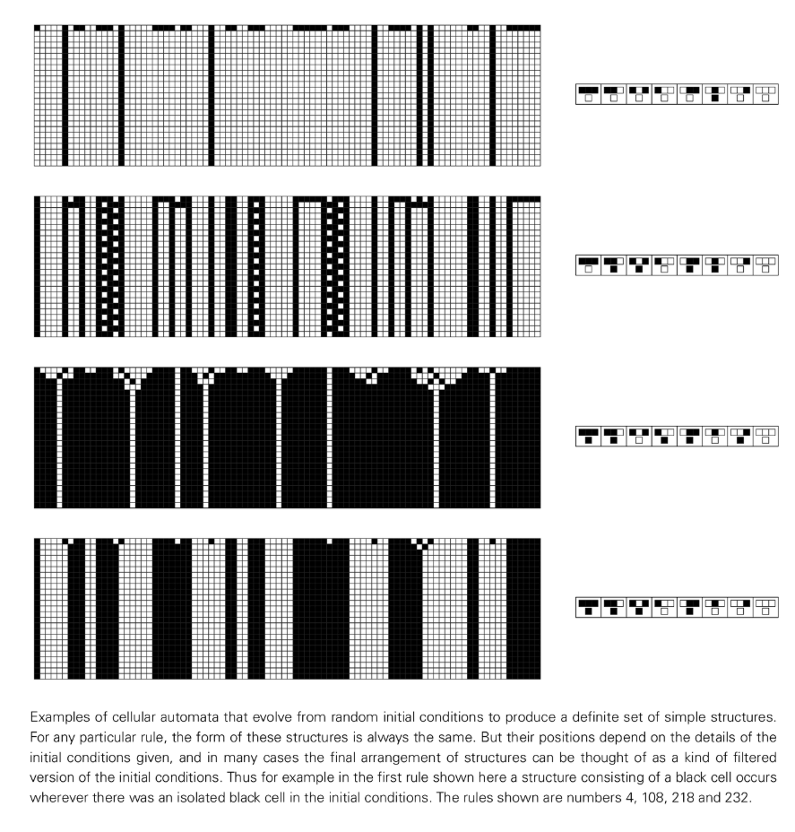

ただし、単純なルールを持つすべてのセル オートマトンがこれを行うわけではありません。 [ルール 126](annotation:rule-126) などの多くのシステムは、たとえランダムな初期条件から開始したとしても、複雑な動作を永遠に示し続けます。多くの点で、この動作は完全にランダムに見えますが、パターン全体に点在する白い三角形などの構造も、ある程度の組織化を示しています。

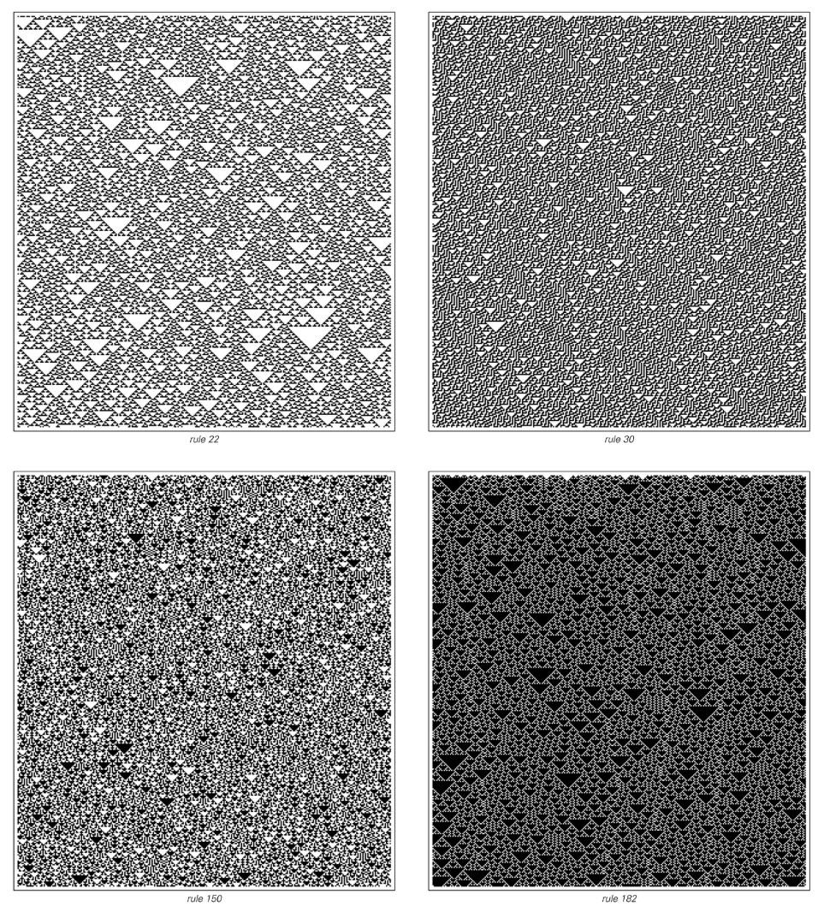

では、ランダムな初期条件から始まるセル オートマトンの動作の複雑さの限界は何でしょうか?急速に安定するシステムもあれば、永遠にランダムなままのシステムもあることがわかりました。しかし、最大の複雑さはその間のどこかにあります。 [ルール 110](annotation:rule-110) を例にとると、システムはランダムな初期条件から始まり、すぐに一連の明確なローカル構造に組織化されます。これらの構造は静的なものではなく、動き回って複雑な方法で相互作用し、最終的には、この本で見たものと同じくらい複雑な、秩序とランダム性が混在する精巧なパターンを形成します。

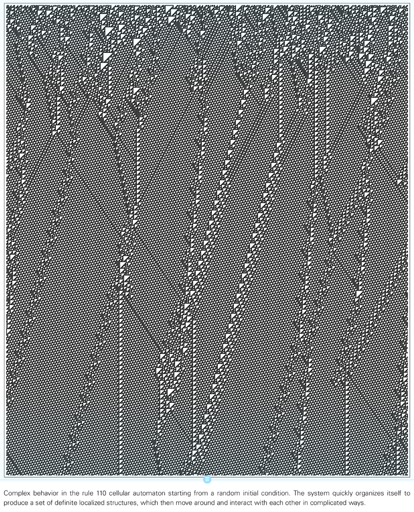

## [4 つの動作タイプ](annotation:four-classes-of-behavior)

任意のセル オートマトンの動作を調べると、各ルールによって生成される特定のパターンは異なるものの、これらのパターンは基本的に非常に限られた数のタイプに分類できるという驚くべき発見が得られます。実際、ほぼすべてのセル オートマトンの動作は、4 つの基本カテゴリに簡単に分類できます。

- [**カテゴリ 1**](annotation:class-1): 動作は非常に単純で、ほとんどすべての初期条件がまったく同じ均一な最終状態に発展します。
- [**カテゴリ 2**](annotation:class-2): 考えられる最終状態は多数ありますが、それらはすべて、同じままであるか、短いサイクルで繰り返される単純な構造のセットで構成されています。
- [**カテゴリ 3**](annotation:class-3): 三角形やその他の小規模な構造は常にある程度のスケールで観察されますが、動作は多くの点でランダムに見えます。
- [**カテゴリ 4**](annotation:class-4): 順序とランダム性が混在します。システムは、それ自体は非常に単純なローカル構造を作成しますが、非常に複雑な方法で移動し、相互作用します。

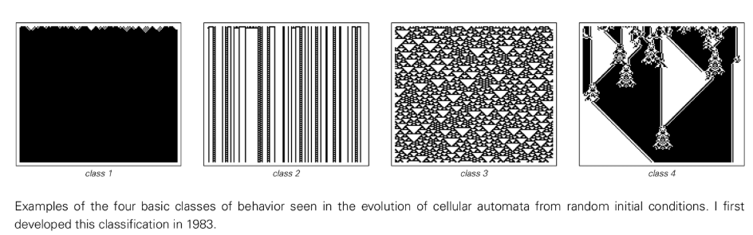

この分類は当初、パターンの視覚的な外観に基づいていましたが、その後の研究により、セル オートマトンの多くの詳細な特性がこれらのカテゴリに密接に関連していることが判明しました。この状況は、物質が固体、液体、気体状態に分割されること、または生物が植物と動物に分割されることに似ています。この分類スキームは、1 次元セル オートマトンだけでなく、2 次元セル オートマトンや連続セル オートマトンにも適用されます。

## 初期条件に対する感度

4 つのカテゴリは、初期条件の小さな変化にどのように反応するかにも大きな違いがあることも示しており、情報の処理方法における根本的な違いが明らかになりました。

- **カテゴリー 1**: すべての変更は最終的には失われ、システムは初期状態を忘れます。
- **カテゴリー 2**: 変更は持続する可能性がありますが、常に狭い領域に局所化されており、情報はシステムの部分間で伝播しません。
- **カテゴリー 3**: 長距離の情報通信を示します。システムのどの部分でも小さな変化があれば、最終的には最も遠い部分にまで伝播します。
- **カテゴリー 4**: 長距離の情報通信は可能ですが、常に行われるわけではありません。変更は、システム内で移動できるローカル構造に影響を与える場合にのみ伝播されます。

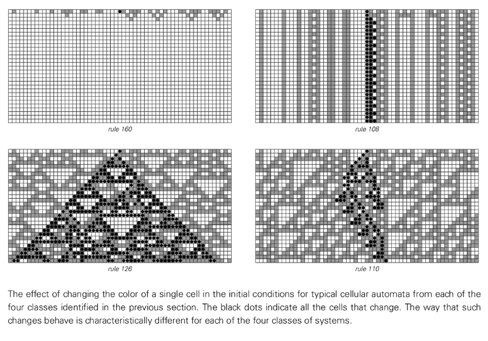

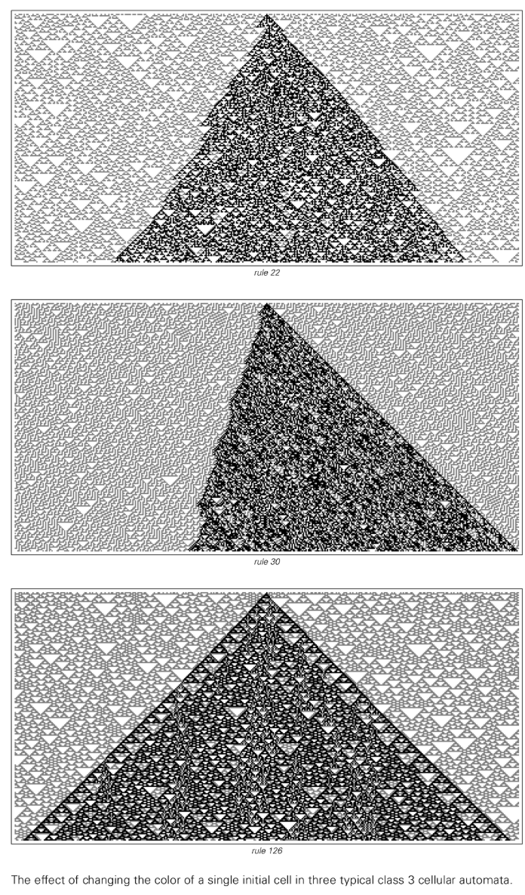

## 有限サイズのシステムとカテゴリ 2 の動作

カテゴリ 2 システムは常に反復的な動作を示し、長距離通信をサポートしません。この 2 つの関係は、長距離通信ができないため、実際にはシステムのあらゆる部分が制限されたサイズのシステムのように動作することを強いられるということです。そして、離散要素で構成され、決定論的なルールに従う有限サイズのシステムは、最終的には反復的な動作を示す必要があります。これは、システムの状態の総数が限られているため、進化の過程で必然的に一度出現した状態に戻り、それが繰り返され始めるためです。

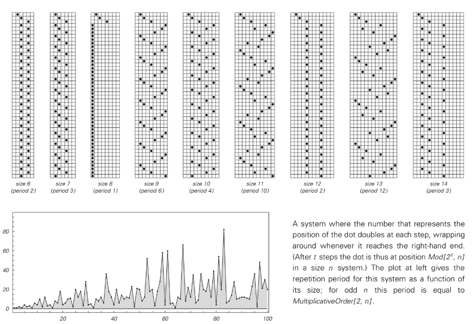

## カテゴリ 3 システムのランダム性

カテゴリ 3 システムの最も顕著な特徴は、その動作がランダムであることです。このランダム性は単に初期条件のランダム性を反映しているのでしょうか?重要な点は、初期条件にランダム性がない場合でも、ランダムな動作が発生する可能性があるということです。たとえば、[ルール 30](annotation:rule-30) はすぐに区別がつかなくなるパターンを生成し、ランダムな初期条件から開始するか単一の黒セルから開始するかにかかわらず、典型的なランダムな動作を示します。

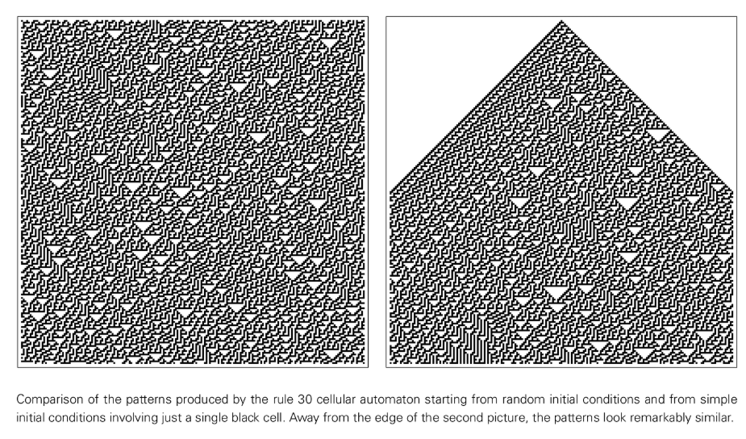

これは、このランダム性がシステムの進化のプロセスによって本質的に生成されることを示唆しています。このランダム性を生成する固有の能力は、システムに一種の安定性を与えます。システムの全体的な確率的挙動と巨視的特性は、初期条件に関係なく変化しません。ただし、初期条件の構造を単純に重ね合わせたパターンを生成する加法性 [ルール 90](annotation:rule-90) などの例外もあり、そのランダム性は完全に初期条件のランダム性に由来します。

## 特別な初期条件

[ルール 30](annotation:rule-30) のようなセル オートマトンは、ランダムな初期条件から開始しても、単純な初期条件から開始しても、一見ランダムな動作を生成できることがわかりました。しかし、これは、いかなる場合でも単純な動作を生成できないことを意味するのでしょうか?これは事実ではありません。ルール 30 であっても、セルの特定のブロックの無限の繰り返しからなる特別な初期条件を設定することによって、単純な繰り返し動作を生成できます。

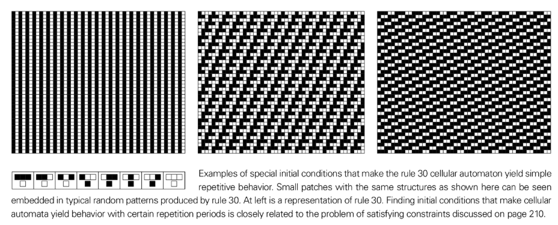

さらに興味深いのは、特別な初期条件を設定することによって、あるセル オートマトンが別のセル オートマトンの動作をシミュレートできることです。たとえば、[ルール 126](annotation:rule-126) は、特定の条件下では [ルール 90](annotation:rule-90) とまったく同じように動作する可能性があります。これは、単純な初期条件から開始するときに、多くの異なるルールが同じネストされたパターンを生成する理由を説明します。

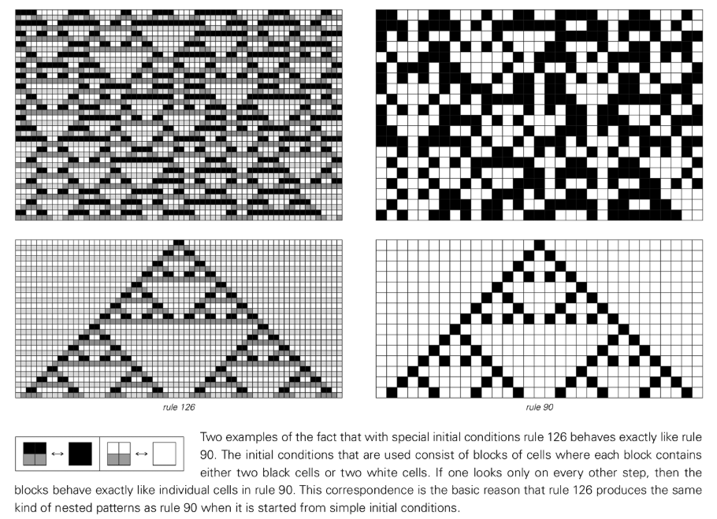

## アトラクターの概念

セル・オートマトンがランダムな初期条件から進化するにつれて、出現する可能性のあるセル・シーケンスは時間の経過とともにますます制約されていきます。最終的なシステムが進化する可能性のある状態のセットは、アトラクターと呼ばれます。

[状態ネットワーク](annotation:state-network) を使用して、進化プロセスの各ステップで出現する可能性のあるすべてのセル シーケンスを表すことができます。カテゴリ 1 およびカテゴリ 2 システムの場合、このネットワークの複雑さは徐々に増加し、制限されます。ただし、カテゴリ 3 およびカテゴリ 4 のシステムでは、ネットワークの動作の複雑さを反映して、ネットワークの複雑さが急速に増加します。

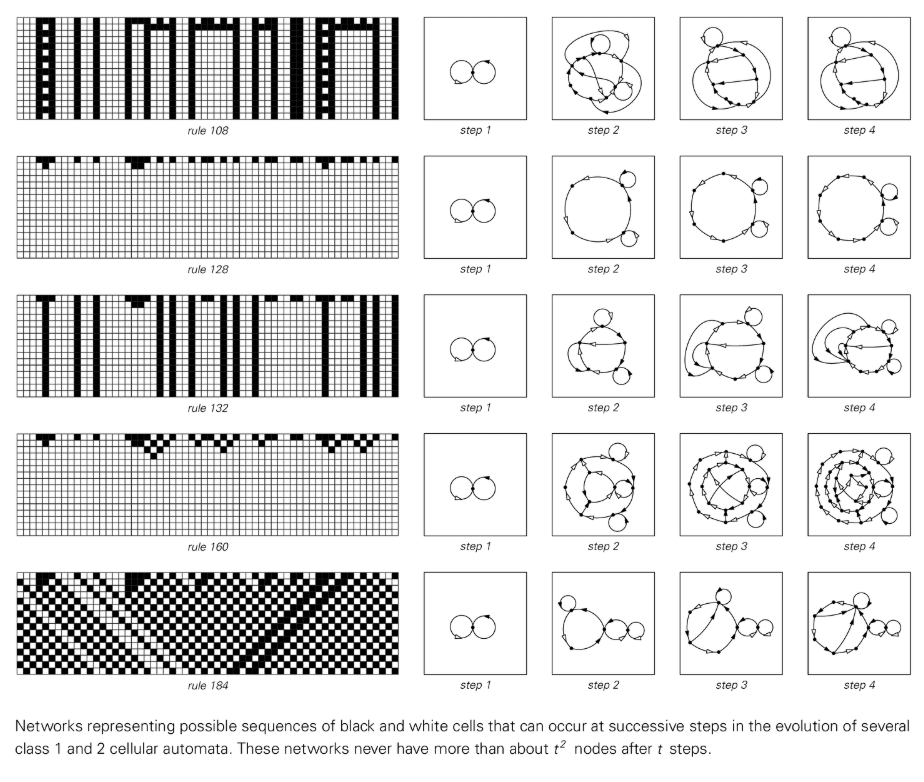

## カテゴリ 4 システムの構造

カテゴリ 4 のシステムは通常、確率的背景における明確に定義された永続的なローカル構造の出現によって特徴付けられます。これらの構造は移動してシステムの異なる部分間で情報を受け渡すことができるため、カテゴリ 4 の複雑さの鍵となります。

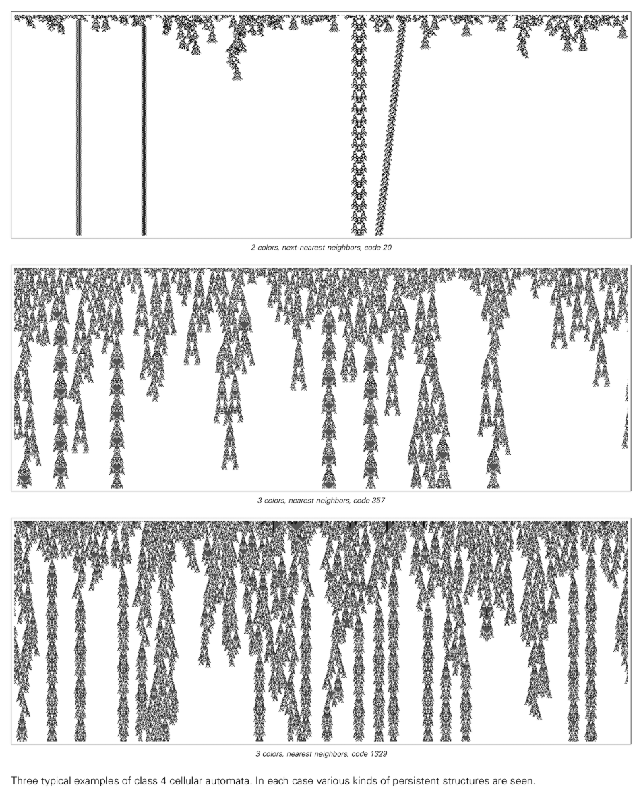

特定のカテゴリ 4 ルールによってサポートされる「構造の動物園」は、多数の初期条件を系統的に検索することで発見できます。たとえば、[ルール 110](annotation:rule-110) は、静止しているものもあれば、異なる速度で移動しているものなど、さまざまな構造をサポートしています。これらの構造が衝突すると、相互作用が非常に複雑になる可能性があり、最終結果を確認するまでに数千の手順が必要になる場合があります。

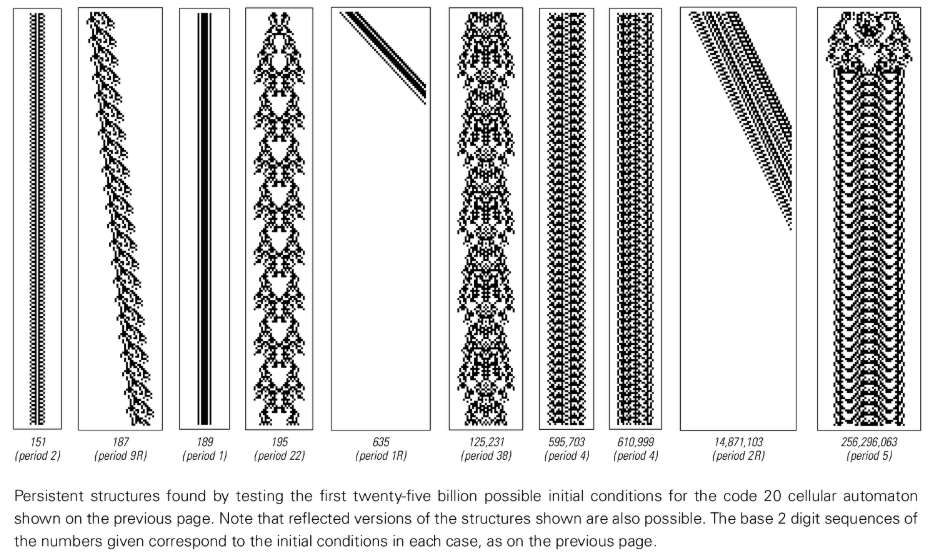

さらに、一部のカテゴリー 4 システムは、「グライダーガン」と呼ばれることもある無限の成長が可能な構造もサポートしています。これらの構造が移動すると、新しい永続的な構造が継続的に作成され、全体のパターンが永久に成長することが可能になります。この現象は、単純な決定論的規則と有限の初期条件から無限かつしばしば複雑な成長が現れることであり、これらのシステムの計算能力と複雑性を深く表しています。

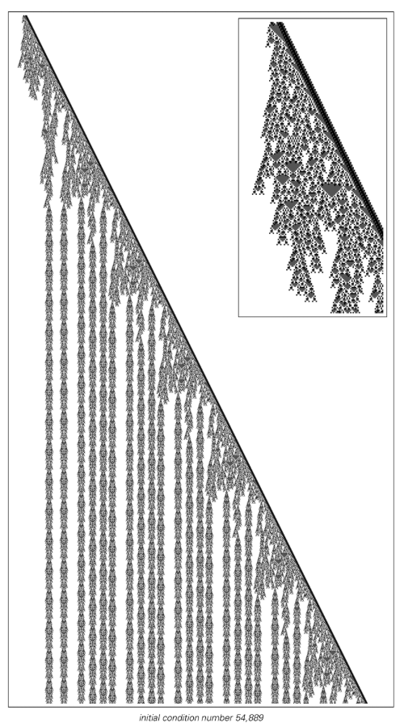