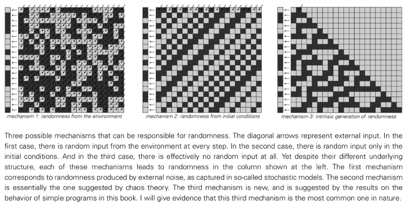
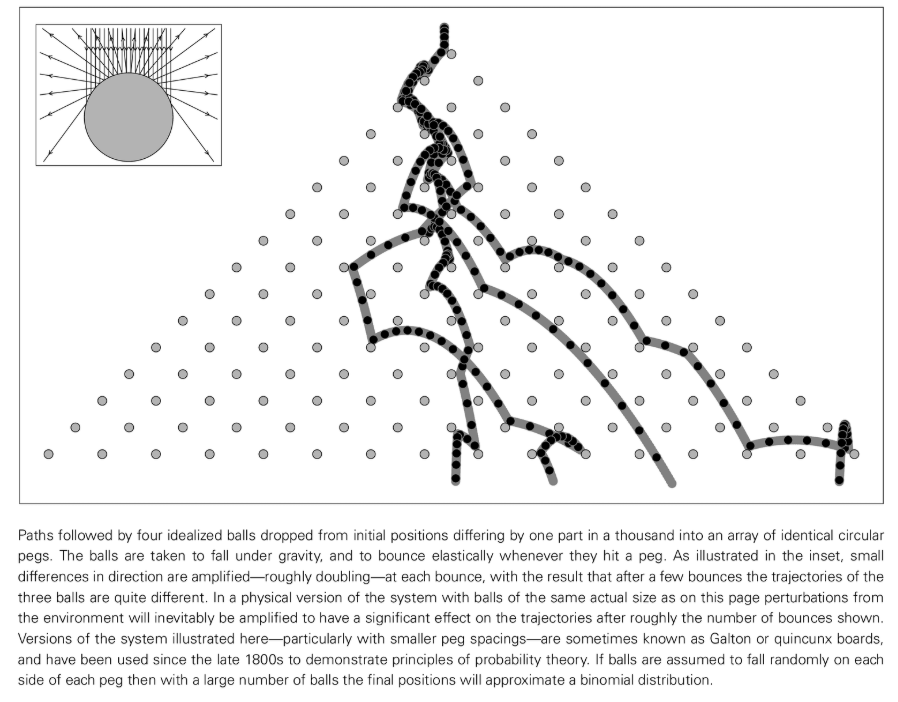
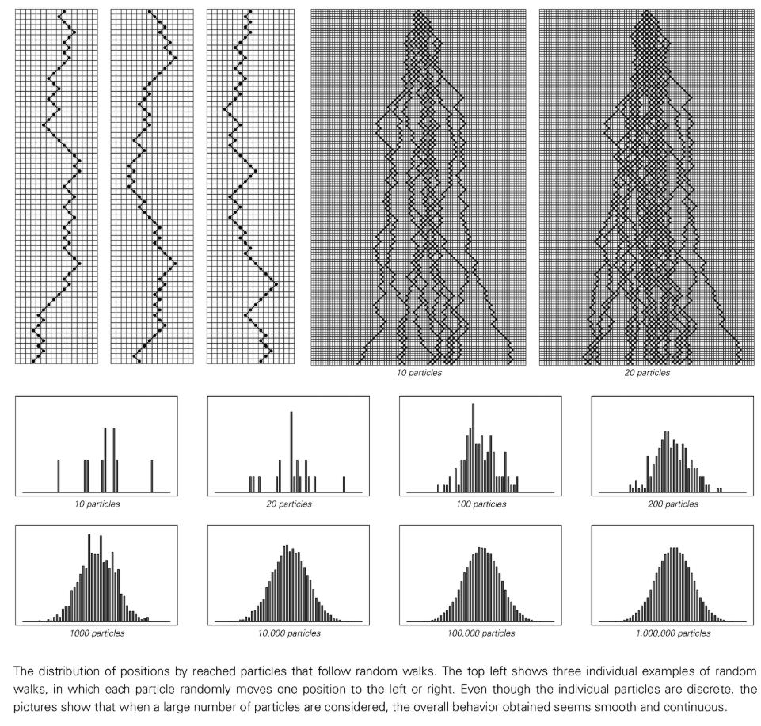
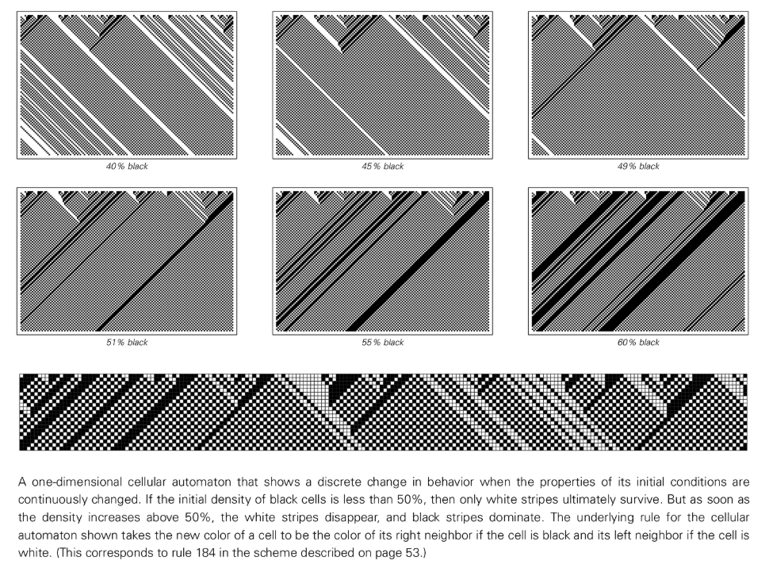
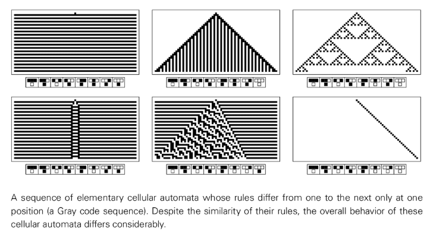
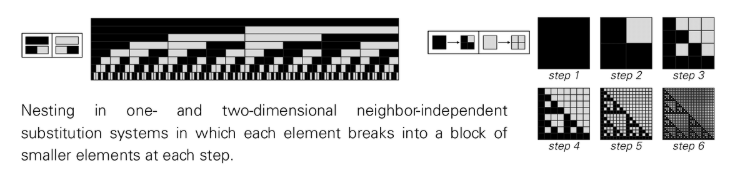
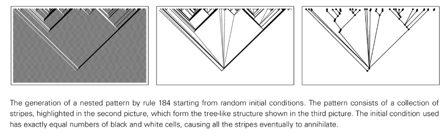

# 第7章: プログラムと自然の仕組み

## 行動の普遍性

単純なプログラムは、ルールが非常に単純であっても、信じられないほど複雑な動作を生成する可能性があります。これは、この本の中心的な発見の 1 つです。さらに驚くべきことは、これらの単純な手順によって生成される動作が、私たちが自然界で広く観察している現象と驚くほどの類似性を示しているということです。この類似性は偶然の一致や目の錯覚ではなく、単純なプログラムと自然システムの間の基本的な対応関係を深く反映しています。

自然界を観察すると、共通の現象が見つかります。多くのシステムは、基礎となる物理的、化学的、生物学的構成が大きく異なっていても、巨視的レベルでは非常によく似た動作パターンを示します。同様に、単純なプログラムの研究では、プログラムの基礎となるルールが大きく異なっていても、プログラムが生成する全体的な動作は非常に一貫している可能性があることも観察できます。これは、システムを構成する特定の詳細とは無関係に、特定の種類の行動パターンが繰り返し現れる、一種の「行動普遍主義」を明らかにします。

この洞察は、単純なプログラムの動作を研究することで自然システムがどのように機能するかを深く理解できることを意味するため、非常に重要です。自然現象の背後にある基本的な原動力は、単純なプログラムで見られるメカニズムと本質的に同じです。したがって、この章は、自然界のいくつかの一般的な現象を掘り下げ、それらが単純なプログラムの動作にどのように対応するかを明らかにし、伝統的な科学的枠組みを使用して完全に説明することが難しい複雑な現象に特に注意を払い、新しい科学的手法がそれらに対してどのように明確で強力な説明を提供できるかを示すことを目的としています。

## ランダム性の 3 つのメカニズム

自然界では、ランダム性は遍在する現象です。単純なプログラムに関する体系的な研究を通じて、ランダム性の生成は主に 3 つの基本メカニズムに起因していることがわかりました。

### 環境からのランダム性

これは伝統的な科学において最も古典的で広く受け入れられている見解です。システムのランダム性は、不確実性に満ちた外部環境との継続的な相互作用の結果であると考えられます。日常生活では、水上での船の衝突が良い例です。船の動きはランダムに見えますが、実際にはランダムな波に受動的に従っています。顕微鏡の世界では、ブラウン運動における花粉粒の不規則な鼓動は、液体中の多数の分子の終わりのない予測不可能な衝突によって引き起こされます。このメカニズムの本質は、ランダム性が一種の外部「ノイズ」としてシステムに継続的に入力されることです。しかし、この見解はランダム性の究極の原因を実際には説明しておらず、たまたまそれを私たちが研究していないより大きな「外部システム」に帰しているだけです。さらに、現実の物理的なランダム発生源 ([電子ノイズ発生器](annotation:electronic-noise-generator) など) は、内部状態の「記憶効果」(緩和時間) と環境に存在する微妙な相関関係により、完全なランダム性を生成できないことがよくあります。

### 初期条件からのランダム性 ([カオス理論](annotation:deterministic-chaos))

このメカニズムは、ランダム性がシステムの進化中にシステムに継続的に注入されるのではなく、無限に正確に測定できないシステムの初期条件に根ざしていると考えています。システム自体は完全に決定論的な規則に従いますが、その進化の軌跡は初期条件に対して非常に敏感です。初期の小さな差は時間の経過とともに指数関数的に増幅され、最終的には巨視的な動作にランダム性が生じます。たとえば、コインやサイコロを投げた最終結果は、初速度、回転、角度の一連の小さなランダムな変化に大きく依存しており、人間の手では正確に再現できません。しかし、このメカニズムの本質は一種の「転写」であり、初期条件にすでに存在するランダム性（無限数列のランダム性として示されます）を明らかにするだけであり、その動作のランダム性は初期条件のランダム性によって完全に制限されます。したがって、これもランダム性のソースに関する質問には答えておらず、単に質問を「元のイニシャル」に押し付けているだけです。

[三体問題](annotation:three-body-problem)

### 乱数の固有生成

これはこの本でなされた革命的な発見です。これは、ランダムな入力がない場合でも、非常に単純なルールと初期条件を備えたシステムが、独自の完全に決定論的な進化を通じて、すべての実際的なテスト基準の下でランダムに見える非常に複雑な動作をゼロから作成できることを明らかにしています。 「[ルール 30](annotation:rule-30)」セル オートマトンは、このメカニズムの一例です。単一の黒ドルから始まり、単純なルールに従いながら、統計的に完璧なランダム シーケンスを生成します。このメカニズムは外部のランダム性源に依存せず、本質的かつ自発的にランダム性を生み出します。この現象はさまざまな単純なプログラムで非常に一般的であることがわかります。したがって、自然界で観察されるランダム現象のすべてではないにしても、そのほとんどが最終的なルーツをここに持っていると信じる十分な理由があります。このメカニズムの重要でユニークな特徴は、生成されるランダムな動作が詳細に再現可能であることです。実験設定 (ルールと初期条件) がまったく同じである限り、すべての実行でまったく同じランダム シーケンスが生成されます。これは、前の 2 つのメカニズムによって生成される予測不可能で反復不可能なランダム性とは対照的です。

## 連続現象

自然界では、水流や空気流などの多くのシステムは、連続的で滑らかな巨視的特性を示します。ただし、セル オートマトンなど、モデル化に使用するプログラムの基本コンポーネントは個別です。両者の間に存在するように見える溝はどのように統一されるべきでしょうか？

重要なのは、巨視的スケールでの多数の個別コンポーネントの平均的な動作が完全な連続性を示すことができるということです。ランダム性は、離散から連続への移行を実現するための中心的な要素です。多数の離散粒子（分子や砂粒など）が不規則なランダム運動（つまり「ランダムウォーク」）を行うと、それらの離散的でギザギザの軌道が全体として「平均化」され、流体のような滑らかな巨視的運動が得られます。

同様に、単純な「[集約モデル](annotation:aggregation-model)」では、既存のクラスターの端に離散ユニットを一度にランダムに追加するだけですが、数千のステップを経ると、形成されたクラスターも巨視的にはほぼ滑らかな円として表示されます。重要なのは、この平滑化効果を達成するためのランダム性は外部から来る必要はないということです。システムによって「本質的に生成される」ランダム性も、この滑らかな巨視的結果を効果的に推進することができます。

## 離散性の起源

連続的な現象に対応して、自然には、連続的な灰色のグラデーションではなく、動物の毛皮の白と黒の縞模様など、さまざまな異なる離散的な現象も溢れています。この離散性はどのようにして生じるのでしょうか?

重要なメカニズムは、システムの基礎となるルールが完全に連続的であっても、その巨視的な動作が離散的な特性を示す可能性があることです。これは通常、「[相変化](annotation:phase-transition)」と呼ばれるものを通じて実現されます。システムの制御パラメータが連続的かつ滑らかに変化すると、システム自体の挙動が特定の臨界点で突然不連続な状態遷移を起こす場合がある。

同様の現象がプログラム モデルでもはっきりと観察できます。たとえば、1 次元のセル オートマトンで、初期の黒いセルが占める密度をパラメータとして 0 から連続的に増加させた場合、密度が 50% 未満である限り、特定の値に関係なく、システムは最終的に完全な白い状態に進化することがわかります。ただし、濃度が 50% を超えると、システムの動作は急激に変化し、最終的には完全に黒い状態に落ち着きます。滑らかに変化するパラメーターから離散的な結果が得られるこの現象は、自然界では非常に一般的です。

## 制約を満たす問題

伝統的な科学、特に生物学と物理学では、自然形態の原因を「制約」の観点から説明する傾向があります。この見解では、システムは何らかの方法で自発的に進化し、特定の最適な制約 (最小エネルギー、最小表面積、最大充填密度など) を満たす最終状態に到達すると考えられます。しかし、複雑な形態を前にするとこの説明は成り立たない、というのが本書の見解である。

自然システムの場合、盲目的なランダムな試みやローカル情報に基づく段階的な反復改善によって、グローバルな制約を満たす正確な解決策を見つけることはほとんど不可能です。反復プロセスは、いわゆる「局所最適解」に陥ることが非常に簡単です。谷の最下点まで転がろうとするボールと同じように、小さな穴にはまり込み、実際の谷の底に到達できないことがよくあります。これらの小さな穴から抜け出して全体的な最適解に近づくために追加の「ショック」を人為的に加えたとしても、この方法は依然として計算コストが非常に高く、多くの場合、成功の保証はありません。

したがって、より合理的で強力な説明は、自然界で見られる複雑なパターンは、システムが複雑な最適化問題を「解決」した結果ではなく、（コンピューター プログラムと同様に）比較的単純で明確な一連の進化規則に従った直接の結果である、というものです。進化ルールは明確な段階的な生成プロセスを提供しますが、制約は最終的な形式を記述する単なる手段です。

## 単純な動作の起源

複雑な動作が単純なルールによって生成されるのと同様に、自然界で一般的な単純な動作 (均一性、繰り返し、入れ子など) も、さまざまな単純なルールベースのメカニズムによって生成できます。あらゆる単純な動作について、独自の複雑な説明を探す必要はありません。

### 均一性

システムの均一な状態を実現するには、いくつかの方法があります。たとえば、初期点から始まり結晶のように外側に広がる均一な成長。システムの孤立した各部分が独立して同じ安定状態に進化します。または、これが非常に重要ですが、システムはミクロレベルでは高度なランダムな動作を示しますが、マクロスケールでは、これらのランダムな変動は平均化され、最終的には一見完全に均一な状態を示します。

### 再現性

決定論的システムが取り得る状態の数が限られている場合、その動作は最終的にサイクルに入り、時間の経過とともに再現性が示されます。宇宙では、局所的な周期構造の動き（波の形成）や、単純な「シード」構造からの規則的な成長によって再現性が生じることがあります。完全にランダムな初期条件から開始した場合でも、システム独自の進化メカニズムを通じて、非常に反復的なパターンが自然に出現する可能性があります。

### 入れ子性 (フラクタル)

美しい入れ子構造は、さまざまなメカニズムを通じて作成することもできます。 1 つは、直感的な「トップダウン」分割プロセスです。このプロセスでは、要素が、固定ルールに従って、それ自体のいくつかの小さな縮小バージョンに分割されます。このプロセスは、植物の枝分かれと同じように再帰的に続きます。ただし、別のより一般的で奥深いアプローチは、「ボトムアップ」構築です。つまり、単純なローカル ルールから始まり、システムは継続的な反復を通じてマクロ スケールでネストされた自己相似構造を自然に出現させます。

最終的に、単純な動作であっても複雑な動作であっても、その背後には複数の生成メカニズムが考えられることがわかりました。メカニズム自体は複雑ではなく、非常に単純なプログラム モデルですべてを捉えて再現できます。