# 第 8 章: 日常システムへの影響

## モデリングの問題

この章では、単純なプログラムのアイデアを使用して、自然界やその他の分野におけるさまざまな特定のシステムを調査し、その行動特性の根源を説明します。これらのシステムのほとんどは日常生活によく見られるものですが、その動作の根本的な原因はほとんど未解決のままです。単純なプログラムのレンズを通して、これらの動作の起源がそれほど謎ではなくなることがわかります。

私の目的は、すべての詳細を詳細に説明することではなく、さまざまなタイプのシステムの最も顕著な動作特性につながる基本的なメカニズムを特定することです。可能な限り単純なモデルを構築します。この本の中心となる発見は、特に従来の数学方程式ではなくプログラムの観点から考える場合、複雑な動作が非常に単純なルールから生じる可能性があるということです。

結局のところ、モデルとは理想化されたものです。従来の科学は、モデルを検証するために少数の数値に依存しすぎて、全体的な動作を無視することがあります。私の意見では、モデルを評価するための最良の最初のステップは、モデルによって生成された画像とシステム自体の画像を視覚的に比較することです。優れたモデルはシンプルであると同時に、システムのさまざまな特性を大まかに再現できる必要があります。

明確にするために、モデルはシステムの抽象表現であり、その内部要素はシステム自体の物理コンポーネントに直接対応する必要はありません。たとえば、セル オートマトン モデルはシステムの動作をうまく再現できますが、これはシステム自体がセル オートマトンの規則に従う個別のユニットで構成されていることを意味するわけではありません。モデルの鍵は、システムの動作を決定する重要な影響を捉え、他の二次的な要因を無視することです。ここにモデル構築の課題があります。私は常に、全体的な動作の根底にあるメカニズムを理解するために最も重要であると考えるいくつかの効果の最小限のモデルを構築します。

## 結晶成長

結晶は、顕微鏡レベルで規則的に配置された原子で構成されています。成長プロセスは「シード」から始まり、原子が徐々に表面に蓄積されます。単純なセル オートマトン モデル (黒いセルに隣接するセルも次のステップで黒に変わります) を使用すると、多くの天然宝石の形状に似た単純な多面体の結晶形態を生成できます。

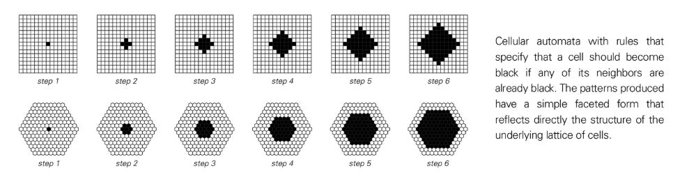

しかし、雪の結晶の形は非常に複雑です。その複雑さの主な理由は、氷の結晶が雪の結晶に付着すると熱を放出し、近くの領域に新しい氷の結晶が付着するのを妨げることです。この効果はセル オートマトンのルールで捉えることができます。セルは、黒の隣接セルが 1 つだけある場合にのみ黒になります。この単純なルールにより、驚くほど本物の雪の結晶に似た複雑なパターンを生成できます。これは、雪の結晶の形態の複雑さが単純な成長阻害規則から生じていることを示唆しています。

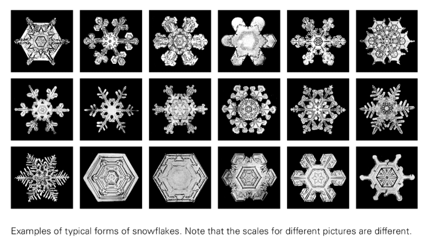

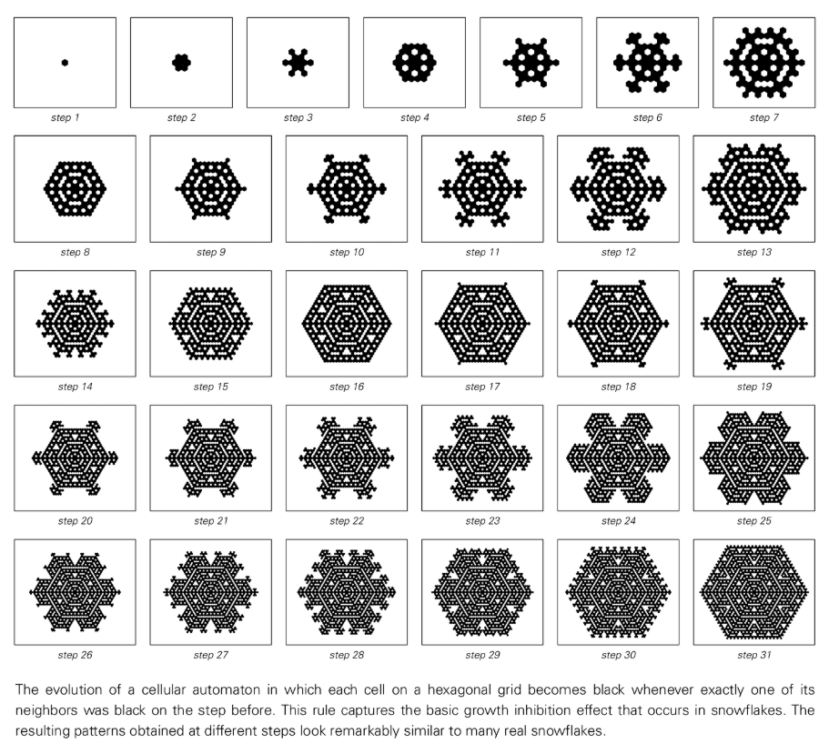

同様に、他の種類の結晶は、針状、樹状突起、さらにはランダムに見える形状など、さまざまな形態を示します。これらの複雑でランダムな形態は、非常に単純なセル オートマトンのルールによっても生成できます。これは、結晶の形状に観察されるランダム性は、外部環境やシードのランダム性によるものではなく、単純な基礎となる規則によって本質的に生成される可能性が高いことを示唆しています。

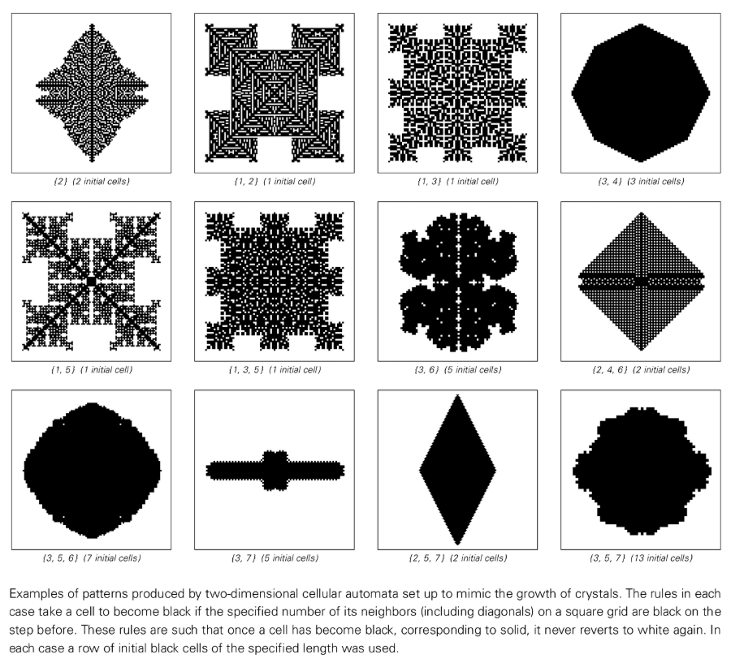

## マテリアルブレイク

日常生活では、固体オブジェクトを破壊することがランダム性を生成する一般的な方法です。破壊によって生じる粗くてランダムな亀裂の根本原因は何ですか?完全な単結晶であっても、破壊パターンはランダムに見え、根底にあるメカニズムが特定の材料の詳細から独立していることを示唆しています。

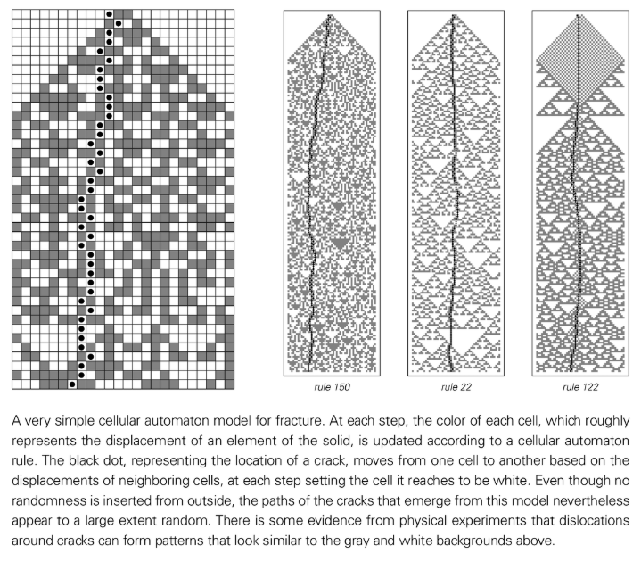

固体が壊れると、亀裂は急速に広がります。固体の構成要素はバネによって接続されており、亀裂の伝播経路はバネが伸びて破断する点によって決定されると考えることができます。ミニマリストのセル オートマトン モデルは、このプロセスをシミュレートできます。セルの変位状態は隣接するセルの状態に基づいて更新され、亀裂 (特別なマーカー) は周囲のセルの変位に基づいて移動します。外部のランダム性はモデルに導入されていませんが、生成された亀裂の経路は重大なランダム性を示します。これは、材料破壊のランダム性がシステム内の動的プロセスによって本質的に生成される可能性が高いことを示唆しています。

## 流体の流れ

[流体の流れ](annotation:fluid-flow) は、遅い水流の滑らかな層流から、高速水流の中で物体の背後に形成される複雑な渦列や [乱流](annotation:turbulence) まで、幅広い複雑な現象を示します。流量が増加すると、規則的な渦に不規則な「グリッチ」が現れ始め、最終的にはランダムに見える乱流が発生します。

従来の科学は、乱流の起源について説得力のある説明を提供することができませんでした。しかし、単純な手順が複雑でランダムな動作を引き起こす傾向があるという発見を考慮すると、乱流現象はもはやそれほど驚くべきことではありません。私たちは単純なセル オートマトン システム、つまり離散グリッド上を移動し、単純なルールに従って衝突する多数の粒子を使用して流体をシミュレートできます。顕微鏡スケールでは、個別の粒子の動きが見られます。しかし、巨視的なスケールでは、大量の粒子を平均化することにより、システムは滑らかで連続的な流体挙動を示します。

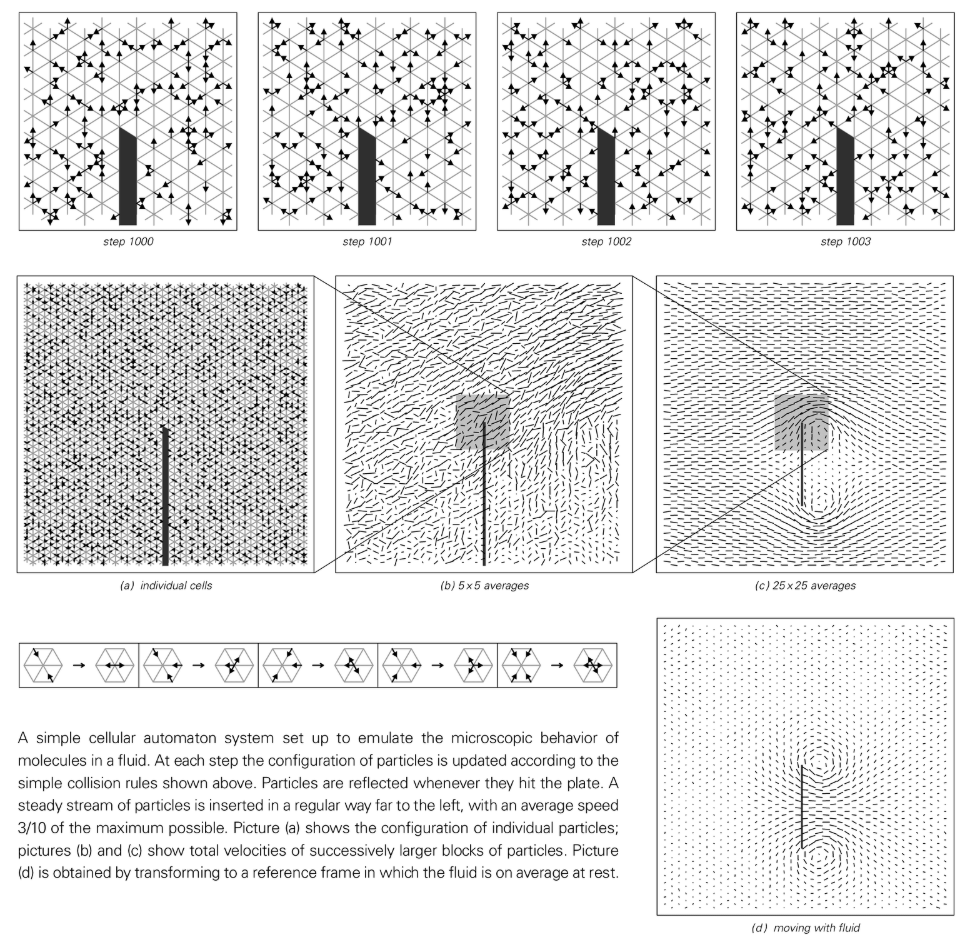

安定した渦の形成から不規則な乱流への変化までの全過程を再現することに成功しました。このランダム性はどこから来るのでしょうか?以前は、これは「カオス理論」の「初期条件への敏感な依存性」に関連していると一般に信じられていました。ただし、このモデルでは、初期条件の小さな変化は、巨視的な流体挙動レベルではほとんど認識できる効果を持ちません。これは、流体内のランダム性が初期条件のランダム性によって単純に増幅されるわけではないことを意味します。

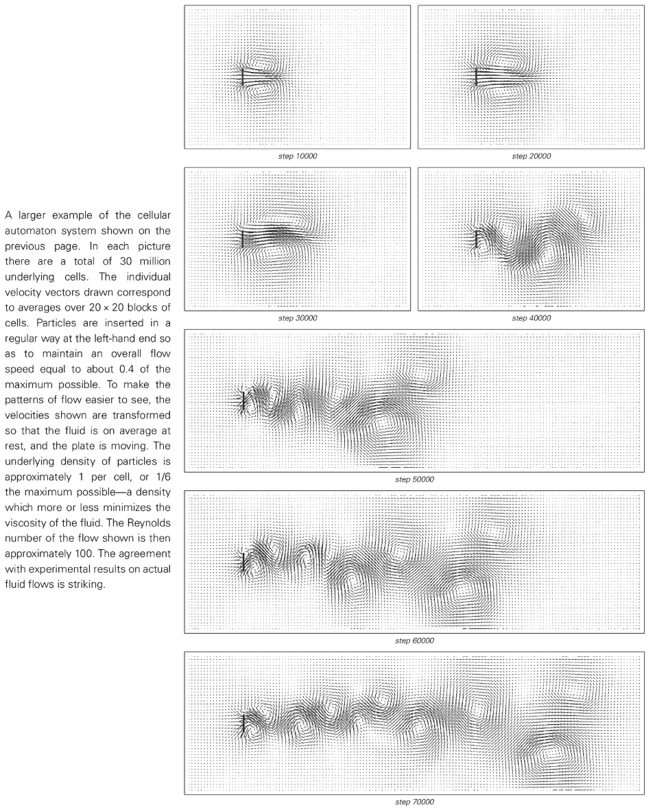

結論は、乱気流のランダム性の多くはシステム自体によって本質的に生成されるということです。ランダム性は微視的な粒子のレベルでのみ存在するのではなく、巨視的な流体の動きのレベルでも直接生成されます。

## 生物学の基本的な質問

生物学的システムは、多くの場合、適応と自然選択に起因する自然界の複雑さの頂点とみなされます。しかし、私は、生物学的システムの複雑さの最も顕著な例の多くは、実際には適応や自然選択とはほとんど関係がないと信じるようになりました。これらは、私がこの本で発見した基本的な現象のさらに別の例である可能性が高く、ほとんどどのような種類のシステムでも、多くの基礎となるルールを選択すると、必然的に非常に複雑な動作が発生します。

生物の遺伝物質は、その発達を指示するプログラムとして直接見ることができます。完全な生物の遺伝的プログラムは非常に大規模ですが、ローカル サブルーチンの制御は非常に簡単です。 [葉の形態](annotation:leaf-morphogenesis) や色素沈着パターンなど、私たちが見ている複雑な生物学的形態の多くは、少数の細胞タイプのみを含む傾向があり、それらが単純なプログラムによって生成される可能性があることを示唆しています。

以前は、生物のあらゆる特性は、その適応度を最大化するための自然選択による慎重な最適化の結果であると一般に信じられていました。たとえば、植物の枝や葉の [黄金分割螺旋](annotation:golden-spiral) は光を最大化するために解釈され、軟体動物の殻の複雑なパターンは天敵を混乱させるためのカモフラージュとして見られます。しかし、これらの「目的」は、これらの機能が存在する本当の理由とはほとんど関係がないのではないかと私は強く疑っています。こういった特徴は、単純な手順で簡単に作れるからこそ生まれるものだと思います。

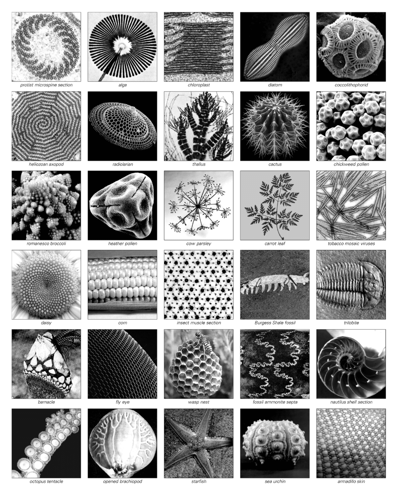

ランダム突然変異は生物進化の過程で多数のプログラムを試みることになりますが、これは[遺伝的アルゴリズム](annotation:genetic-algorithm)などの進化計算手法の戦略と非常によく似ています。本書の調査結果に基づくと、これらのプログラムのかなりの数が複雑な動作を生成するはずです。自然選択によって、うまく生き残るプログラムが選別されますが、多くの場合、生物の成功を決定するのは、複雑な行動のすべての詳細ではなく、より大まかな形質です。したがって、たまたま複雑なパターンを生成するプログラムが、「混合色を生成する」という粗雑な生存上の利点を満たすという理由だけで選択される可能性があります。

私たちが生物システムで見ている複雑さの多くは、純粋に抽象的な事実に根ざしていると思います。つまり、ランダムに選択されたプログラムの中には、多くのプログラム自体が複雑な動作を生成する可能性があるということです。複雑さを得るのは実際には非常に簡単です。

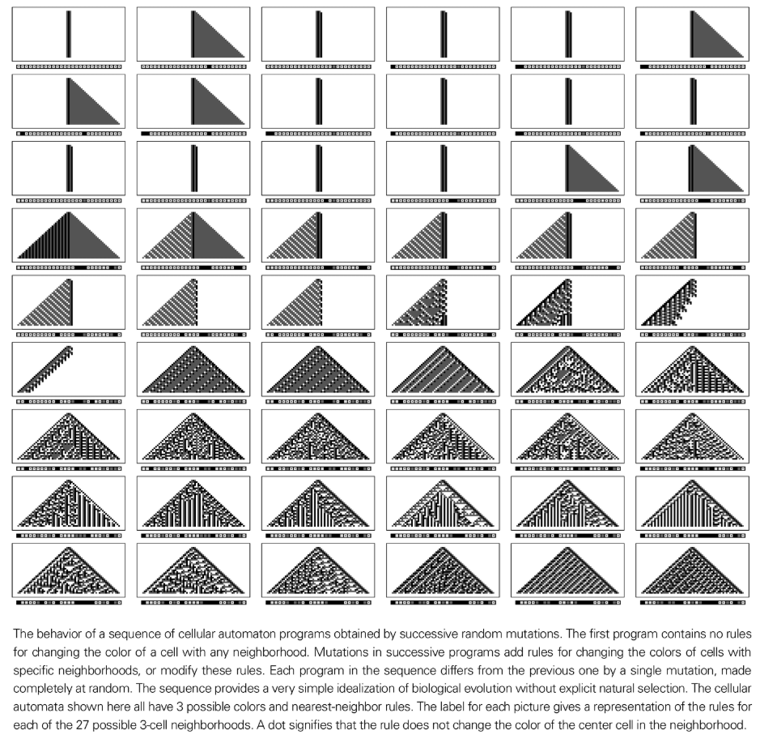

それでは、自然選択の役割は何でしょうか?自然選択の主な効果は、ほぼ逆であり、複雑さを制限する傾向があるのではないかと私は考えています。単純な動作 (線形成長など) を持つシステムの場合、自然選択により効果的に最適化できます (最適な長さの選択など)。しかし、自然選択は、基盤となるプログラムへの小さな変更が全体の複雑な動作に体系的に有益な影響を与えるかどうかを予測できないため、複雑な動作をするシステムに対してほとんど力を持ちません。

したがって、自然選択により、生物学的システムはある面で人工システムに似たものになり、その動作が比較的単純で予測可能なモジュールで構成されており、調整や最適化が容易になります。物理システムで観察されるように、自然選択によって厳密に制限されていない側面は、単純なプログラムによって本質的に生成される無制限の複雑さを示す可能性があります。

### 動植物の成長

植物や動物の複雑な形は、おそらく極めて単純な成長法則から生まれたものと考えられます。

植物を例にとると、その分岐構造は、単純な近傍に依存しない置換システムによってモデル化できます。各ステップで、成長する各茎の先端が、特定の形態の小さな新しい茎のセットに置き換えられます。基礎となるルールは非常に単純ですが、結果として得られる幾何学的配置は、すぐに非常に複雑であることが明らかになります。この単純な分岐プロセスは、藻類から樹木に至るまで、さまざまな植物の全体的な形状を生成するだけでなく、さまざまな [葉の形状](annotation:leaf-morphogenesis) も生成します。葉の形の多様性は、おそらくこれらの単純な成長規則を直接反映していると考えられます。

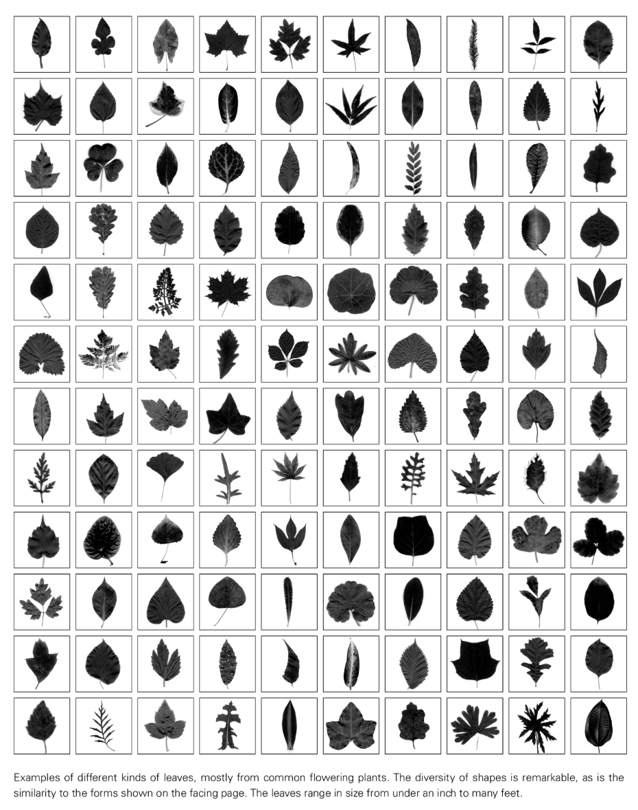

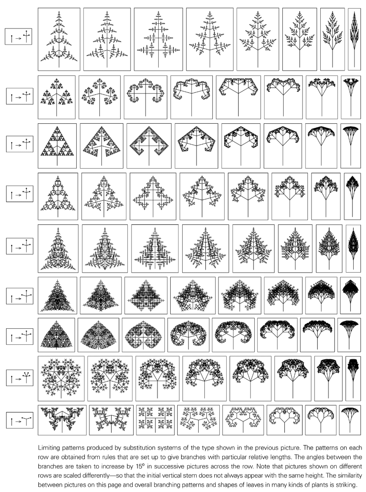

別の例は、植物の「葉序」、つまり茎の周りの葉、花びら、その他の要素の配置です。ほとんどの植物では、新しい要素の間に形成される角度はほぼ正確に 137.5° ([黄金角](annotation:golden-angle)) です。この正確な角度は、複雑な最適化プロセスから得られるものではなく、単純な自己組織化プロセスの必然的な結果です。既存の要素によって最大のギャップが残された場所に新しい要素が形成される傾向があり、このプロセスは自然に黄金角に収束します。

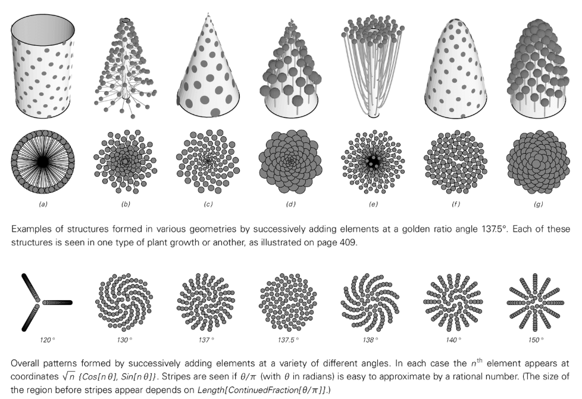

動物の成長メカニズムは異なります。たとえば、角や貝殻は基部に材料を追加することで成長しますが、その結果、枝分かれするのではなくコイル状になります。軟体動物の殻の多様な形態は、開口部に沿ったさまざまな点で物質の分泌速度を変える単純な幾何学的規則によって生成できます。自然界で考えられるほとんどすべてのシェル形式は、この単純なモデルのパラメーター空間で見つけることができます。

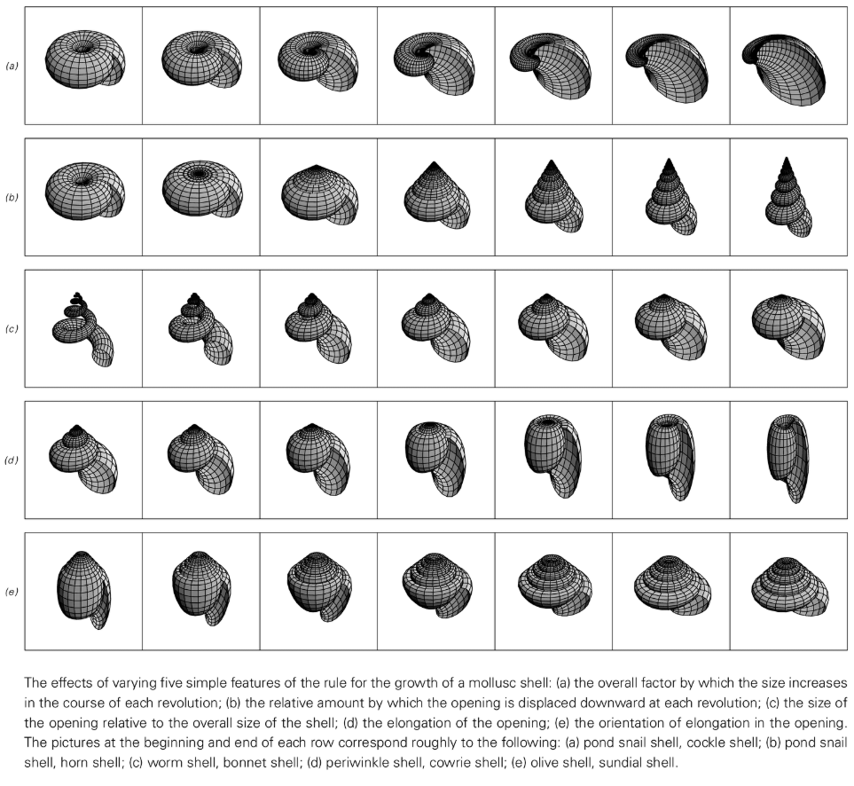

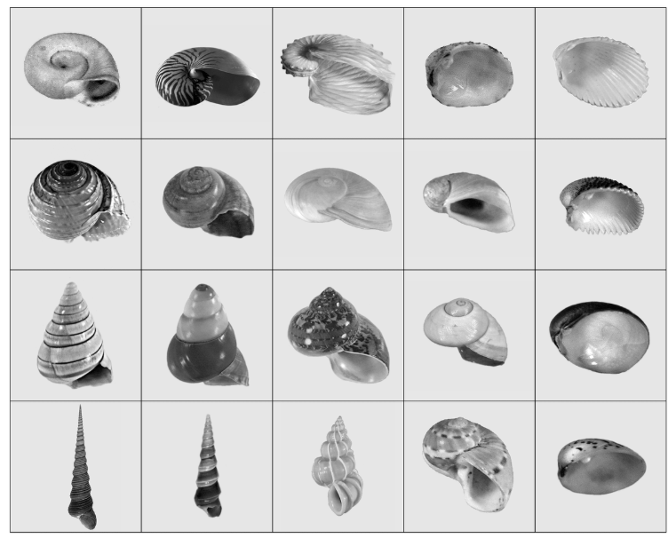

体がさまざまな部分で構成されているより複雑な動物の場合、これは、遺伝プログラムのさまざまな部分が胚発生のさまざまな段階や場所で活性化されるためです。動物の胚は発生の初期段階では剛性が低いため、組織は折りたたまれたり丸まったりするなどの複雑な変形を起こしてさまざまな内臓を形成します。動物の形態の違いは主に、さまざまな部分の相対的な成長速度の変化の結果です。

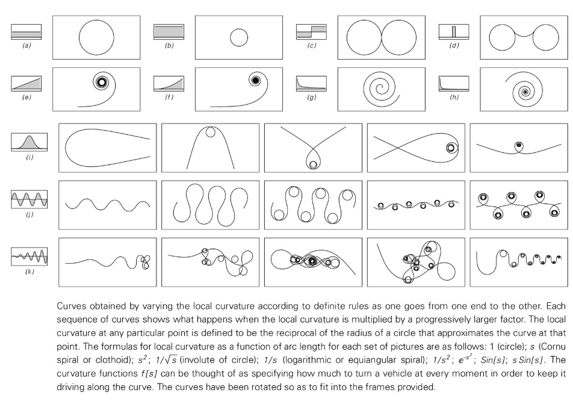

全体として、植物や動物の形態に見られる驚くべき多様性と複雑さには、基礎となる複雑な規則は必要ないようです。むしろ、それらは種間で微妙な差異を生み出す非常に単純な成長ルールの結果であり、これらの単純な手順ルール自体が非常に複雑になる可能性を含んでいます。

### 生体色素沈着パターン

生物学的色素沈着パターンは、複雑さの最も視覚的に明らかな例の 1 つです。軟体動物の殻のパターンの多様性は、ランダムな初期条件から一次元のセル オートマトンによって進化したパターンに驚くほど似ています。シェルの成長は行ごとに累積されるため、これは、そのパターンが 1 次元セル オートマトンと同様の単純なローカル ルールによって生成されることを強く示唆しています。これらのルールは種間でランダムに選択される可能性があり、複雑なパターンは特定の目的のためではなく、単純なルールの偶然の産物として現れます。多くの軟体動物の殻の模様は生涯を通じて不透明な皮膚で覆われており、これらの模様が自然選択によって慎重に最適化されたものではないことも証明されています。

他の動物 (哺乳類、魚類、爬虫類など) の 2 次元の皮膚パターンも、単純なモデルで説明できます。 2次元セルオートマトンは、各セルの色が近くのセルの平均色によって決まる（近い色は促進され、遠くにあると抑制される）というルールを持っており、ランダムな初期条件からスポットやストライプ、迷路のような構造を素早く生成することができます。これらの構造は、多数の異なる動物に繰り返し現れるパターンに非常に似ています。

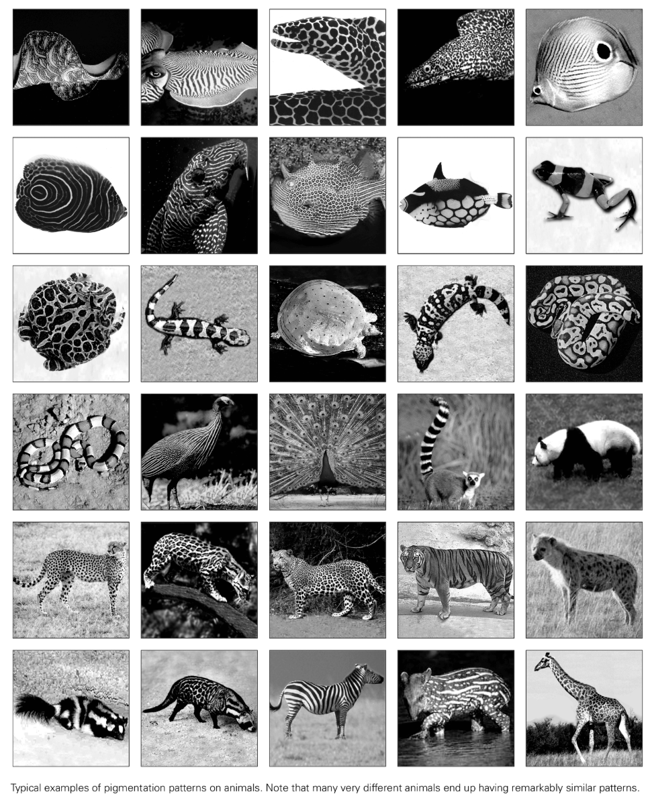

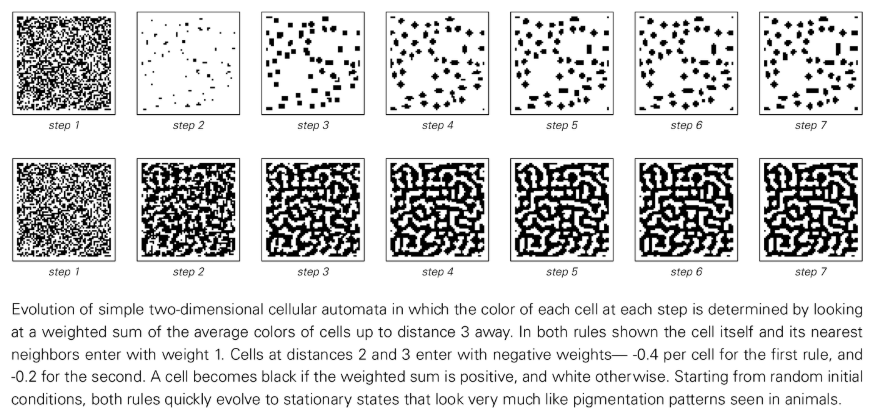

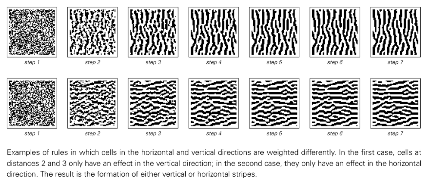

これは、生物界の多くの驚くほど複雑なパターンが複雑な適応メカニズムに根ざしているのではなく、セル オートマトンと同様の非常に単純なローカル ルールによって本質的に生成されることを再度示しています。

## 金融システム

金融市場価格の変動は、特に短期間のスケールでは明らかなランダム性を示します。このランダム性はどこから来るのでしょうか?それが外界のランダムな出来事を完全に反映しているとは考えにくいです。おそらく、このランダム性は主に市場の内部力学の産物です。

市場は、多数のエンティティ (トレーダー) で構成されるシステムとして考えることができ、各エンティティは他のエンティティの行動に基づいた単純なルールに従います。最小限の理想化されたモデルは、市場を 1 次元のセル オートマトンとして考えることです。各セルは取引エンティティを表し、その色 (買いまたは売り) は、前のステップでの隣接するセルの行動によって決まります。

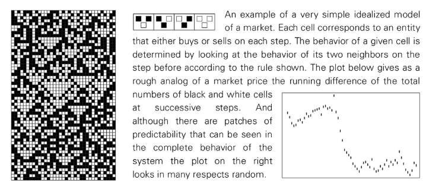

本書で繰り返し述べてきたように、単純なモデルは複雑な動作を生成する可能性があります。基礎となるルールが決定論的であり、初期条件が単純である場合でも、そのようなモデルは、（たとえば、各ステップで売買されたユニットの合計数の累積差を計算することによって）一見ランダムな一連の価格変動を生成する可能性があります。

これは、金融市場で観察されるランダム性の多くは、外部からのランダムな入力や予測不可能な人間の行動に起因するものではなく、単純なルールに従う多数の相互作用するエンティティのシステムとしての市場自体によって本質的に生成されることを意味します。