# 第9章: 基礎物理学

## 物理学の質問

従来の数学的手法は基礎物理学において大きな成功を収めてきましたが、多くの中核的な疑問は未解決のままです。この章は、単純なプログラムの研究から得た洞察を使用して、これらの問題のいくつかを調査することを目的としています。エネルギー保存や空間方向の等価性などの物理システムの特性は、本書でこれまでに説明したほとんどのプログラムには明確に対応するものはありませんが、単純なプログラムはこれらの特性を示します。さらに、物理学における最も重要な未解決の謎の中には、より普遍的な基礎現象があり、簡単な手順でその核心を捉えることができます。

たとえば、[熱力学第二法則](annotation:second-law-thermodynamics)、または[エントロピー増大の原理](annotation:entropy-increase) では、多くの物理システムが不可逆的によりカオスな状態に向かう傾向があると説明されています。この章では、この動作の性質が単純なプログラムで簡単に観察できることを明らかにします。簡単なプログラムのコンテキストで第 2 法則を研究することにより、それが一般的に成り立つ理由だけでなく、それが失敗する条件についても明確に理解することができます。

私のアプローチは、単純なプログラムを物理システムのメタファーとして使用することです。しかしさらに進んで、物理システム自体があるレベルの単純なプログラムによって直接操作される可能性はあるでしょうか?私たちが現在知っている物理法則は複雑に見えるかもしれませんが、この本の重要な発見は、最小限のルールを持つプログラムでも非常に複雑な結果を生み出す可能性があるということです。同じことが基礎物理学にも当てはまるかもしれません。私たちが知っている物理法則の下には、宇宙のすべての複雑な現象が導き出される非常に単純なプログラムがあるかもしれません。

私たちの宇宙が本質的に単なる単純なプログラムであると仮定するのは大胆な仮説です。この章の後半では、この仮説の研究において私が成し遂げた重要な進歩について説明します。まだまだ道のりは長いですが、この本の考え方を使えば、物理学における最も基本的な問題、さらには科学全体における究極の問題の 1 つさえも最終的に解決されるかもしれないと私は非常に楽観的に思っています。

## 可逆性の概念

現在のすべての証拠は、物理学の基本法則が可逆的であること、つまり、物理システムの現在の状態が正確に理解されている限り、その未来と過去を推定できることを示しています。

ルール 51 のように、一部のセル オートマトンは可逆的であり、その進化は追跡可能な十分な情報を保持します。しかし、ルール 254 のように、他のものはそうではありません。ルール 254 はすぐに完全な黒の状態に発展し、以前の状態に関するすべての情報が消去されます。

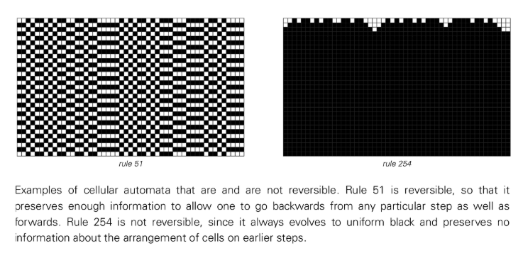

自然界の多くのシステムは自己組織化しているように見えますが、これは基礎となる物理法則の可逆性に矛盾しており、これが次のセクションのトピックにつながります。 256 個の基本的なセル オートマトンのうち、可逆的なものは 6 個だけであり、その動作は非常に単純です。しかし、3 色ルールと最近傍ルールを備えたセル オートマトンを見ると、7 兆を超える可能性の中から 1,800 の可逆ルールが見つかります。それらの中には複雑な動作を示すものもあります。つまり、初期条件が「乱れた」場合でも、システムは依然として可逆的です。

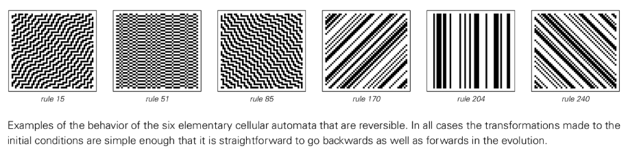

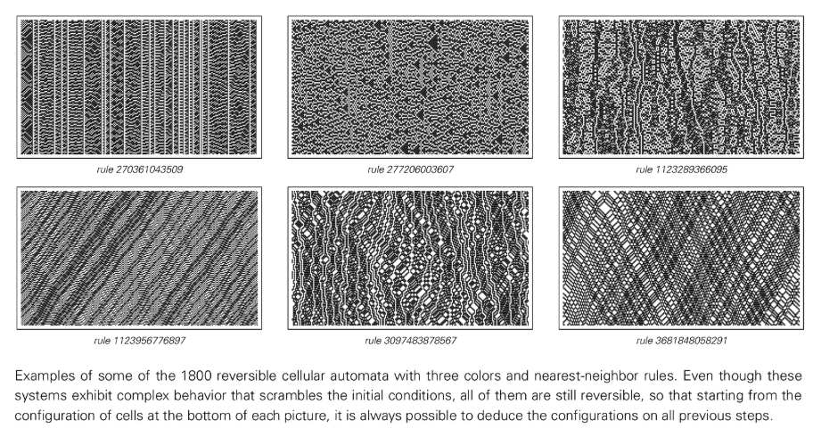

可逆性を体系的に研究するには、ルール自体が時間反転対称性を持つセル オートマトンを構築できます。つまり、ルールが逆転（過去と未来が入れ替わる）後も変化しないということです。このようなシステムは、単純な初期条件から開始した場合でも、局所構造の形成と衝突をサポートしながら、非常に複雑で一見ランダムなパターンを生成できます。可逆性は衝突の詳細に一定の制約を課しますが、一般に可逆システムは通常のシステムと同じくらい複雑な動作を示すことができます。

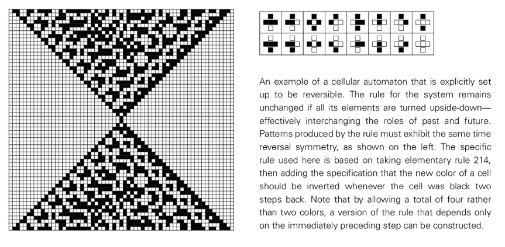

## 不可逆性と熱力学第二法則

物理学の基本法則が正確に可逆的であるという十分な証拠はありますが、日常の経験には一見不可逆的な現象が溢れています。多くの場合、最初に順序付けられたシステムは、時間の経過とともにますますランダムになり、組織化されなくなります。この現象は、多くの単純なプログラムで観察できます。

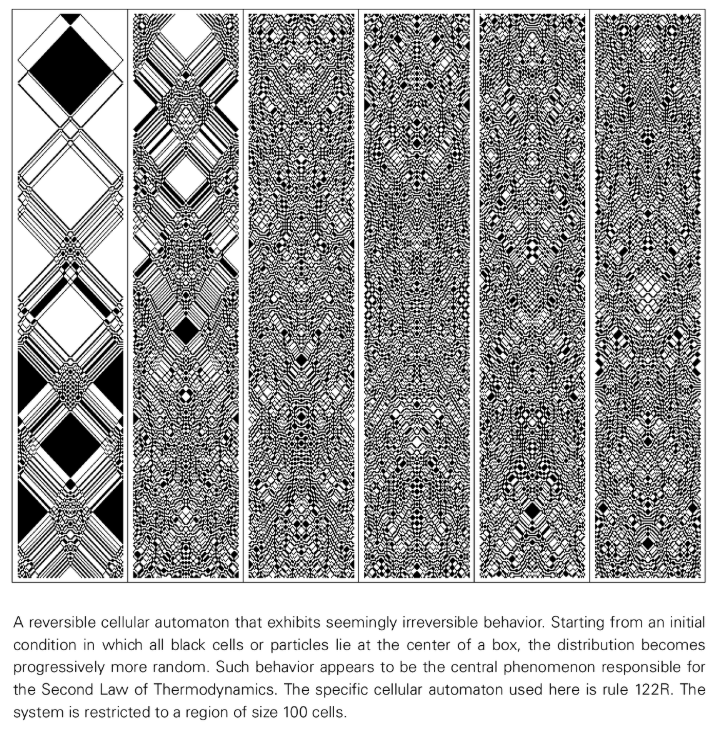

可逆セルオートマトンは、秩序ある初期状態 (たとえば、すべての粒子が箱の中心に集中している) から進化し、その粒子分布は徐々にランダムになります。この本の考え方に慣れている読者にとって、このランダム性の発生は驚くべきことではありません。しかし、これはシステムの可逆性と矛盾しているように思えます。

この矛盾を解決する鍵は、進化の中間瞬間に秩序ある状態を置くと、時間が前に進んでも後ろに進んでもランダム性の増加が観察されることです。実際には、ランダム性の増加のみが見られる理由は、実際の実験がほとんどの場合、単純に記述して構築できる初期条件から始まるためです。ランダム性の低減につながる初期条件を作成するには、システムの進化自体と同じくらい複雑な「逆算」が必要ですが、実際には不可能です。これが、熱力学第二法則が観測的に成り立つ根本的な理由であると私は考えています。

可逆的であるだけでなく、粒子の総数 (つまり、エネルギー) が保存される理想気体をシミュレートする 2 次元セル オートマトンなど、より現実的なモデルを構築できます。空のボックスでは、システムは単純な反復動作を示します。しかし、小さな障害物を追加すると、粒子の配置はすぐにランダムになります。このランダム化により、システムから順序付けられた機械的仕事を抽出することが非常に困難になり、永久機関が不可能である理由が説明されます。

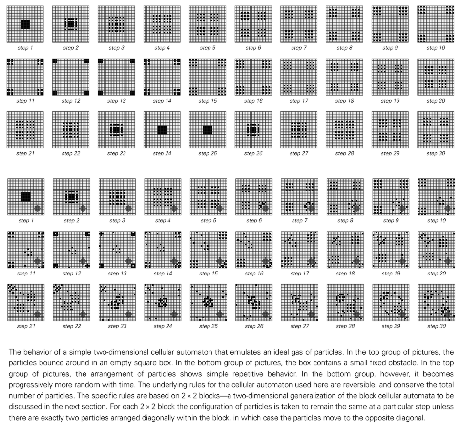

エントロピーは、システム内の未知の情報の量を測定する物理量であり、私たちが行う測定に依存します。熱力学第 2 法則のもう 1 つの記述は、エントロピーは時間とともに増加するというものです。これは、系の粒子の配置がランダムになると、限られた測定方法で得られる系の情報が少なくなり、未知の情報（エントロピー）が増加するためです。

本書で取り上げるシステムの多くと同様、大幅なランダム性が導入されると、システムの巨視的特性は初期条件の詳細からほとんど独立したものになります。このシステムは独自の平衡状態に進化します。

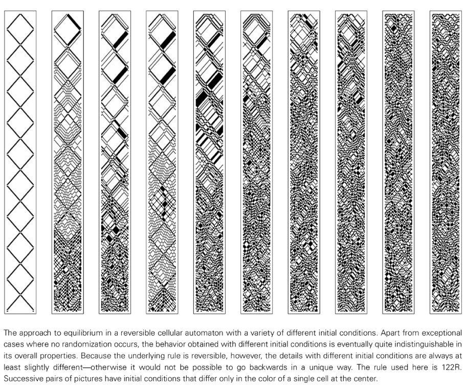

ただし、熱力学の第 2 法則は普遍的に適用されるわけではありません。これはガスの挙動などの分野では十分に確立されていますが、ルール 37R セル オートマトンなどの多くのシステムは体系的にランダムになる傾向はなく、代わりに秩序状態と無秩序状態の間で連続的な変動を示します。宇宙自体は完全にランダムな平衡状態には達しておらず、生命システムやその他のシステムも一時的に秩序の増加を示します。これは多くの場合、システムの分割に関連しており、システムは長期間にわたって比較的独立して進化する部分に分割されます。たとえば、閉じたシステムでは、ルール 37R はシステムをさまざまな領域に分離する一種の「膜」を形成し、各領域内で秩序ある動作が発生する可能性があります。これは、多くの生物学的システムが機能する主要なメカニズムである可能性があります。

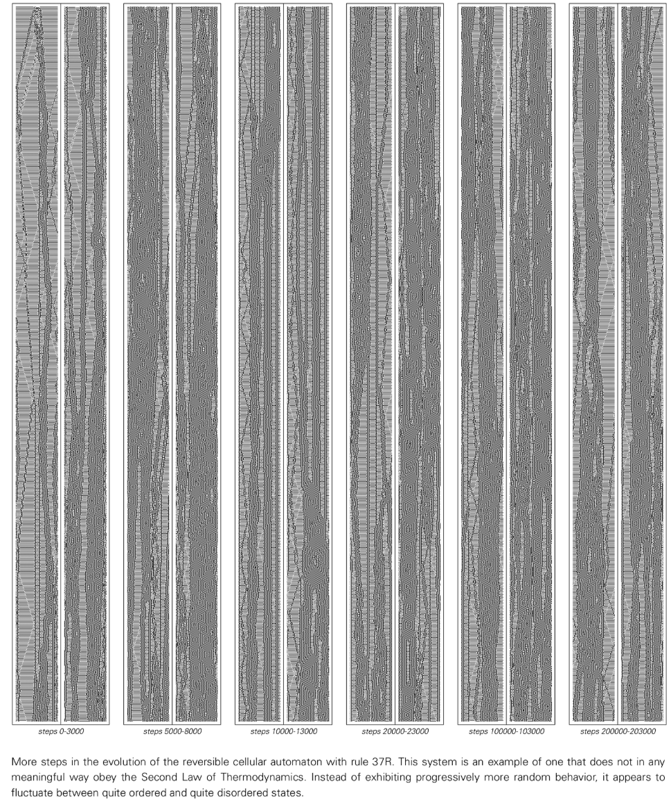

##保存量と連続媒体現象

可逆性に加えて、物理学の基本法則のもう 1 つの普遍的な特徴は、エネルギーや電荷などの特定の量の保存です。ほとんどのセル オートマトンはこの特性を持っていませんが、ブラック ドルの総数を保存するルールを実際に見つけることができます。ブロック セルラー オートマトンを使用すると、量を保存したシステムを簡単に構築できます。このシステムでは、ルールに従って、隣接するセルのブロックが同じサイズの他のブロックに置き換えられます。

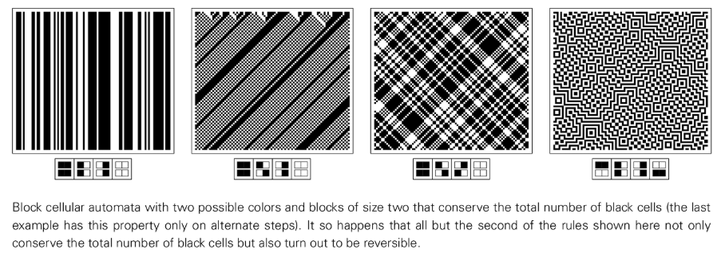

控えめな量（黒と灰色の要素の総数など）を持つシステムであっても、単純な初期条件から開始すると、かなりのランダム性が生成される可能性があります。システムに異なる密度の領域がある場合、これらの領域は密度が均一になるまで徐々に混合されます。基礎となるシステムは個別のセルで構成されていますが、その巨視的な密度分布は滑らかな連続的な挙動を示します。この現象は、微視的レベルでの見かけのランダム性と巨視的レベルでの保存された量から生じます。これは、流体などの物理システムの状況と非常によく似ています。これは、物理システムの特殊性に依存しているように見える連続体の動作の基礎となるメカニズムが、非常に単純なルールを持つプログラムにすでに存在していることを再度示しています。

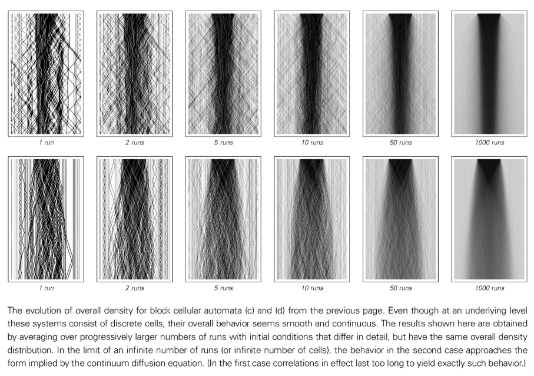

## 宇宙の究極のモデル

物理学の歴史は、ますます正確になっていく宇宙の一連のモデルです。このプロセスは最終モデルで終了するのでしょうか?複雑な現象にはより複雑なモデルが必要であると常に考えられるため、伝統的な科学的直観はこれを否定するかもしれません。ただし、この本の中心的な考え方は、より複雑な現象には必ずしもより複雑なモデルが必要ではないということです。非常に単純なプログラムを十分な時間実行すれば、宇宙のあらゆる細部を正確に再現できる可能性があります。

そのようなプログラムを発見できれば、科学にとって大きな勝利となるでしょう。しかし、基礎となるプログラムがわかったからといって、宇宙のすべての挙動をすぐに推測できるわけではありません。多くの場合、基礎となるルールとマクロレベルの動作の間には大きなギャップがあります。したがって、プログラムが宇宙の正しいモデルであるかどうかを検証するには、小規模なシミュレーションと複雑な論理的推論を使用して、私たちが知っている物理法則を再現できるかどうかを確認する必要があります。

既知の物理法則から逆算しようとしても、その単純な究極の法則をうまく見つけ出すことはほぼ不可能です。最善の戦略は、適切なルール カテゴリを考え出し、それを体系的に検索することです。宇宙の法則が十分に単純であれば、この一見不条理な方法も実現可能かもしれません。
このアイデアは、[Wolfram Physics Project](annotation:wolfram-physics-project) などの研究プログラムによって継続されています。

私の推測では、この究極のルールは、固定された空間グリッドなどの組み込み構造を持たない可能性があるため、これまで議論したどのシステム (セル オートマトンなど) よりも基本的なものである可能性があります。空間そのものは、大規模な特定の接続パターンの出現にすぎないのかもしれません。運動など、私たちがよく知っている宇宙の特徴は、最終的な規則に直接反映されていない可能性があります。

したがって、このルールを見つけるのは困難です。ルールの各部分は宇宙のさまざまな特徴に影響を与える可能性があるため、段階的に発見される可能性は低いです。しかしこれは、宇宙の特徴を十分に再現する規則を見つけたら、それが最終的な正しい規則になる可能性が高いことも意味します。

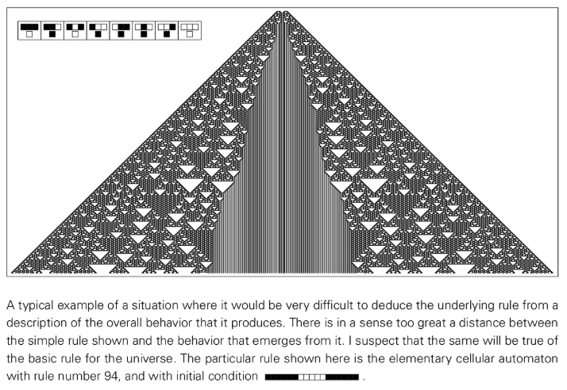

なぜ宇宙の法則は単純だと信じるべきなのでしょうか?考えられる考え方の 1 つは、宇宙は無限に存在し、それぞれに異なるルールがあり、私たちはたまたまそのルールが単純な宇宙に住んでいるということです。しかし、私たちが知っている物理法則は数が限られているだけでなく、最も単純な形であることもよくあります。それは、これらの法則自体が、マクロなスケールでの何らかの究極的な法則の創発であり、その創発的な行動自体が単純である傾向にあるからかもしれない。

最終的に、そしておそらく最も単純な説明は次のとおりです。宇宙は、単一の単純な基礎となる規則に従います。この法則を見つけることは、人間の思考が達成できることの頂点となるでしょう。

## 宇宙の性質

宇宙の究極のモデルを構築するための重要な最初のステップは、宇宙の性質について考えることです。現代物理学では、ほとんどの場合、空間は完全な連続体であると想定されていますが、他の多くの物理現象と同様に、空間も最終的には個別の要素で構成されていることが発見されるだろうと私は強く信じています。

空間が連続体でないとしたら、それは何でしょうか?セルオートマトンのような規則的な配列でしょうか？私はそれを疑う。なぜなら、これは空間とその内容物との区別を意味しており、できるだけ単純な究極のモデルは、空間とその内容物が同じ「物質」でできていることになるからである。宇宙に存在するのは空間そのものかもしれない。

おそらく、最も低いレベルでは、宇宙はノードで構成される巨大な [ネットワーク システム](annotation:network-systems) です。このネットワークでは、ノードには固有の位置がありません。定義されているのは、他のノードとの接続関係だけです。ノードの数が十分に多い場合、そこからよく知られた空間特性やその他の物理現象が現れることがあります。

最も単純な重要なネットワークは、各ノードに 3 つの接続があるネットワークです。このようなネットワークを多数のノードで構築することで、1次元、2次元、3次元の空間に対応した構造を得ることができます。ネットワークが d 次元空間に相当するかどうかは、任意のノードから距離 r 以内にあるノードの数を計算することで判断できます。この数値の増加は r^d と同様になるはずです。ただし、すべての大規模ネットワークが限られた次元の通常の空間に対応するわけではありません。ランダムに接続されたネットワーク、またはツリー構造のネットワークには通常、この特性がありません。

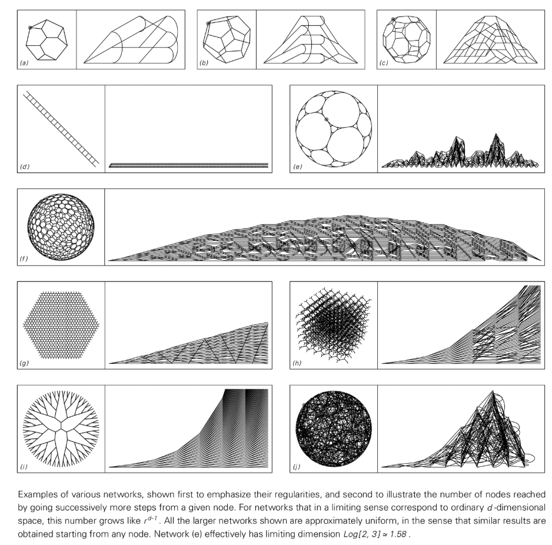

私たちの宇宙の実際の空間ネットワークは、接続性の微視的なレベルでは非常にランダムに見えるかもしれませんが、巨視的なスケールでは、それは私たちのよく知っている三次元空間に対応している必要があります。

## 空間と時間の関係

究極の物理理論を確立するには、空間の性質だけでなく時間の性質も理解する必要があります。日常の経験から、空間と時間は大きく異なることがわかりますが、現代の基礎物理学のモデルのほとんどは、両者は本質的に同じである、いわゆる「[時空連続体](annotation:spacetime-continuum)」という考えに基づいています。

ただし、セル オートマトンなどのプログラムベースのシステムでは、空間と時間はまったく異なる方法で扱われます。時間も根本的には離散的だと私は考えています。可能性の 1 つは、宇宙の時空史全体が広大な 4 次元ネットワークで表現され、その形式が一連の制約によって決定されるということです。ただし、経験上、複雑なパターンを強制する制約を見つけるのは困難です。

したがって、私は宇宙がセルオートマトンのように時間の経過とともに明示的に進化し、あらゆる瞬間に宇宙の新しい状態を作り出していると考えることを好みます。これは空間と時間の対応に矛盾しているように見えますが、対応自体は巨視的スケールでのみ現れる可能性があります。宇宙の歴史は時空ネットワークで表すことができますが、このネットワークの構築プロセス自体は、空間と時間を別の方法で扱います。

## 時間と因果関係のネットワーク

セル オートマトンの特徴は、すべてのセルが同期して更新されることであり、これにはグローバル クロックが必要です。しかし、このような地球時計が宇宙に存在するのは無理があるように思えます。考えられる代替案は、ユニバースが [移動オートマトン](annotation:mobile-automata) またはチューリング マシンのように動作し、各ステップで 1 つのアクティブ セルだけが更新されるというものです。

モバイルオートマトンの進化を外側からシリーズ化。しかし、内部の観察者にとって、それ自体の状態への変化は、アクティブな細胞がアクセスしたときにのみ発生するため、観察者が認識する連続する 2 つの時点の間に、多数の根本的な進化ステップが発生した可能性があります。これは、内部観察者にとっては、多くのセルが並行して更新されているように見えることを意味します。

「更新イベント」とその因果関係のネットワークを構築することで、これをより深く理解できます。この「[因果ネットワーク](annotation:causal-network)」は、内部観察者が知覚する時空構造を定義します。このネットワークでは、接続は一方向であり、あるイベントから別のイベントへの因果関係を表し、意味のある時間の概念につながります。

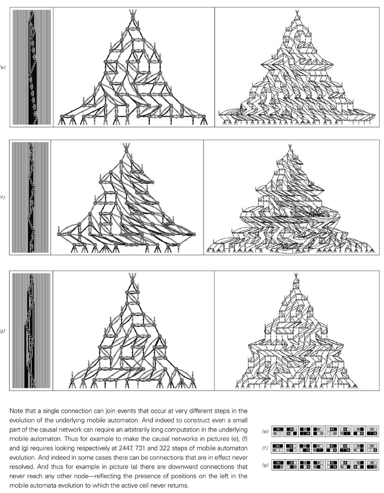

因果ネットワークにおける時間の経過は、基礎となるモバイル オートマトンの進化のステップに直接対応しません。観察者は因果関係のネットワークの存在を認識し、そこから時間の特性を推測することしかできません。この設定は、私たちが空間内では自由に移動できるのに、時間内では前にしか進めない理由を自然に説明します。

異なる移動オートマトンのルールにより、さまざまな因果ネットワークが生成されます。単純なものや反復的なもの、複雑でランダムなものもあります。重要なのは、たとえ基礎となるルールが空間と時間を異なる方法で扱っていたとしても、創発的な因果ネットワークは多くの場合、空間と時間が多くの点で同様に動作する均一なランダム性を示すことです。

## 宇宙における一連の出来事

モバイル オートマトン モデルは、単一のアクティブ セルを通じてイベントのシリアル化を強制します。ただし、より一般的な [置換システム](annotation:substitution-systems) (置換システム) では、各ステップで複数の置換が可能です。重要な問題は、置換の順序が最終的な因果ネットワークに影響を与えるかどうかです。

驚くべきことに、置換がどのような順序で、いつ、どこで行われたとしても、最終的に現れる因果関係のネットワークがまったく同じになる規則のクラスが存在します。このようなルールの重要な特徴は、異なる置換操作が互いに干渉しないことです。たとえば、置換されたブロックが重複しないことです。これは、地球時計や活動細胞のようなメカニズムを必要とせず、適切な基礎となる規則が選択されている限り、これらの規則に準拠する一連の出来事が同じ因果ネットワークを生成し、それによって宇宙の固有の知覚歴史を定義することを意味します。

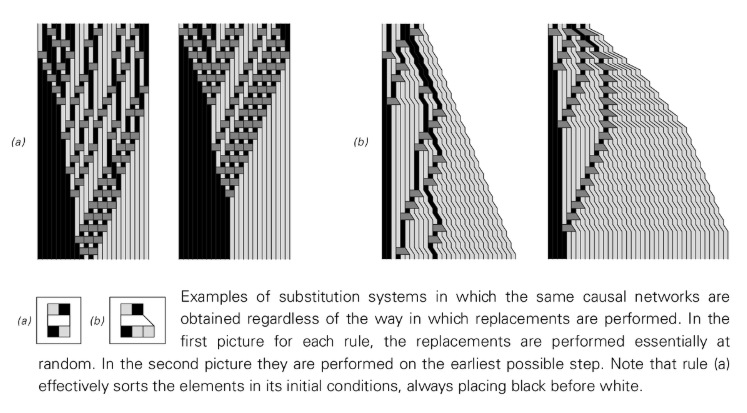

## 独自性と時間分岐

しかし、宇宙の法則は本当にユニークな知覚の歴史を強制するのでしょうか？ [Multiway Systems](annotation:multiway-systems) (Multiway Systems) は、複数の履歴の存在を許可する可能性を提供します。このタイプのシステムでは、各ステップで可能なすべての置換が実行され、その結果、複数の新しい状態 (文字列) が生成されます。

マルチパス システム内にある場合、すべての並列履歴パスを外部から観察することはできません。私たち自身の経験が独自の道を形成します。これは、私たちの宇宙の歴史の多くの詳細は、基礎となる法則によって一意に決定されるのではなく、単に私たちがたまたまたどる道に沿った「歴史的偶然」にすぎない可能性があることを意味します。

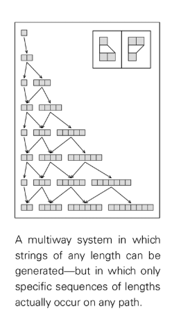

重要な問題は、マルチパス システム内の異なるパスが根本的に異なる巨視的な動作を生み出すかどうかです。一部のルールには、どのパスをたどっても最終的な因果ネットワークが同じになるという特性があります。これは通常、分岐したパスが次のステップで再結合できる場合に発生します。パスがすぐに収束しない場合でも、最終的に収束した場合、生成される因果ネットワークは十分に大きなスケールで類似性を示します。これは、出来事の微視的なレベルではかなりの恣意性が存在するにもかかわらず、巨視的なスケールでは宇宙は独特の歴史を持っているように見える可能性があることを意味します。

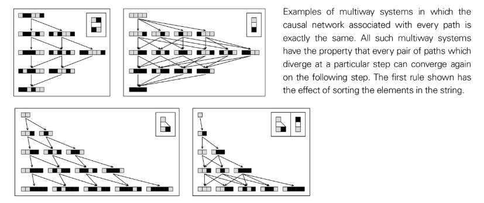

## ネットワークの進化

宇宙がノードの広大なネットワークである場合、それはどのように進化するのでしょうか?最も簡単な方法は、[置換システム](annotation:substitution-systems) のように、ネットワークの特定の部分が固定ルールに従って置換される方法です。最も単純なルールは、各ノードがノードの固定クラスターに置き換えられるというものですが、これでは規則性の高い入れ子構造のみが生成されます。

より一般的なルールにより、ノードの任意のクラスターを置き換えることができます。文字列とは異なり、ネットワークでの置換には固有の制限がいくつかあります。たとえば、ネットワークの残りの部分への接続数は、交換の前後で同じでなければなりません。どこを置き換えるかを決定するためのさまざまなスキームを設計できます。たとえば、一度に 1 つだけ置き換えたり、重複しないクラスターをすべて同時に置き換えたりできます。

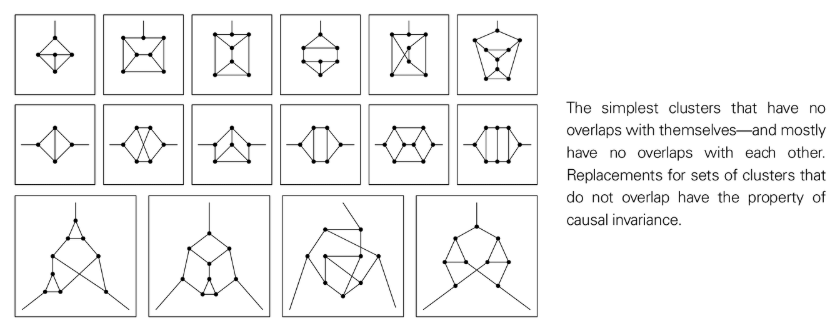

スキームに関係なく、単純なルールは単純なネストされた動作または反復的な動作を生成する可能性がありますが、少し複雑なルールは、単純な初期ネットワークから開始した場合でも、一見複雑でランダムな動作を生成する可能性があります。ネットワーク進化のための因果ネットワークを構築すると、置換に関係なく同じ因果ネットワークを生成する規則のクラスが存在することがわかります。このようなルールの置換対象（ノードクラスタ）が重複することはありません。

私は、宇宙の究極的な規則によって、微視的なスケールでは本質的にランダムに見えるネットワークが生成されるのではないかと推測しています。しかし、このランダム性こそが、巨視的スケールでの安定した三次元空間の出現を可能にするのです。同時に、ネットワークの複雑な構造は、宇宙のあらゆる複雑な現象も運びます。

## 空間、時間、相対性理論

宇宙の内部の観察者として、私たちが観察できるものはすべて、最終的には宇宙内の出来事間の因果関係のネットワークにのみ関係しています。因果ネットワークのさまざまな「スライス」を取得することで、さまざまな速度で移動する観察者が見るものに対応する、さまざまな進化の歴史を復元できます。

システムの基礎となるルールに「[因果不変](annotation:causal-invariance)」（因果不変）がある場合、つまり、ルールが適用される順序に関係なく、同じ因果ネットワークを生成する場合、重要な結論が得られます。物理法則は、一定の速度で移動するすべての観測者にとって同じです。これが特殊相対性理論の中心原理です。

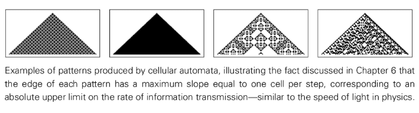

さらに、因果ネットワークの基本構造 (各接続が光の速度で伝播する効果を表す) は、光の速度が宇宙で最速であり、すべての観測者にとって一定である理由を自然に説明します。これから、時間の遅れなど、相対性理論の他のすべての効果を導き出すことができます。

## 素粒子

粒子 (電子など) のすべてのインスタンスがまったく同じ特性を持っているため、宇宙のすべての物質は個別の粒子で構成されています。これらの粒子は最も基本的な実体ではなく、セル オートマトンで見られる局所構造に似た、より基本的な要素で構成される安定した構造であると私は推測しています。

粒子は、空間を表す広大でランダムなネットワークの中でその特性を維持する永続的な構造です。電荷などの特定の保存量は、ルールによって保護されているネットワーク内の特定のローカル トポロジ (「[Tangle](annotation:spatial-tangles)」) に関連している可能性があります。さまざまな粒子タイプが、個別の「コア」構造の可能性のある小さなセットに対応します。

粒子の動きは、因果ネットワークにおける一連の基礎的な更新ステップの結果です。因果的不変性により、パーティクルはさまざまな速度で安定して移動できます。粒子のエネルギーと運動量は、粒子のコアの周囲のノードの数に関連している可能性があります。

## 重力現象

大規模なスケールでは、最も重大な影響は重力です。一般相対性理論は重力を [空間の曲率](annotation:spatial-curvature) に関連付けます。離散ネットワークでは、曲率は接続パターンの変化として理解できます。たとえば、二次元平面六角形ネットワークに五角形を導入すると、(球のような) 正の曲率が生じますが、七角形を導入すると、負の曲率が生じます。

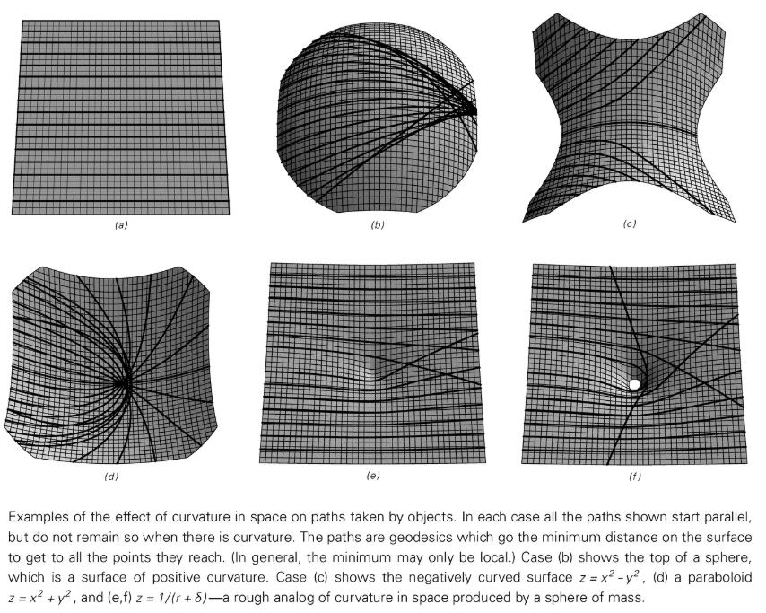

この曲率は、ノードから距離 r 以内にあるネットワーク内のノードの数を数えることで定量化できます。この量の増加が $r^{d-1}$ からどの程度逸脱するかは、アインシュタイン方程式の中核量であるリッチ曲率に直接関係します。

ネットワーク置換ルールが因果的に不変であり、固定次元を維持する場合、ほぼ必然的にアインシュタインの方程式に従う巨視的動作が生成されるのではないかと私は推測しています。このようなモデルでは、物質とエネルギー (ネットワーク内の追加のノードに関連している可能性がある) が自然に空間曲率の原因となり、従来の理論のように個別に導入する必要はありません。

## 量子現象

私は、この章で説明する種類のプログラムは、最終的には [量子理論](annotation:quantum-theory) の主要な機能の多く、あるいはすべてを示すことが証明されると強く信じています。

私のモデルは電子などの粒子をネットワーク内の永続的な構造として扱いますが、これは粒子が観測に関係なく明確な特性を持たないという量子理論と矛盾しているように思えます。ただし、重要な点は、観察者である私たちはネットワークの一部であり、外部から電子を観察することはできないということです。電子に関するすべての推論は、ネットワーク内で明示的に発生するプロセスから得られる必要があります。

最も低いレベルでは、宇宙の網の接続パターンが、ランダムに見えるほど複雑な方法で継続的に再配置されると私は予想しています。このランダムな背景に加えて、複数のネットワーク更新に耐えられる特定の構造が表示されます。これらの構造は粒子です。異なる粒子間の相互作用は、これらの構造が重なり合うとき、基礎となる規則によって異なる粒子構成に進化するプロセスです。

[ベルの不等式](annotation:bell-inequality) の違反など、量子論の多くのユニークな特徴は、粒子間に通常の空間距離を超えたつながりがあることを暗示しているようです。ネットワーク モデルでは、これは次のように説明できます。粒子が通常の空間で遠く離れていても、中間空間のノードを通過しないいくつかの「[cues](annotation:threads)」(スレッド)を通じて直接接続することができます。

全体として、私は、宇宙のあらゆる細部は、最終的には非常に単純なプログラムで表現できる規則に従っており、私たちが目にするものはすべて、このプログラムを実行した結果にすぎないと強く信じています。