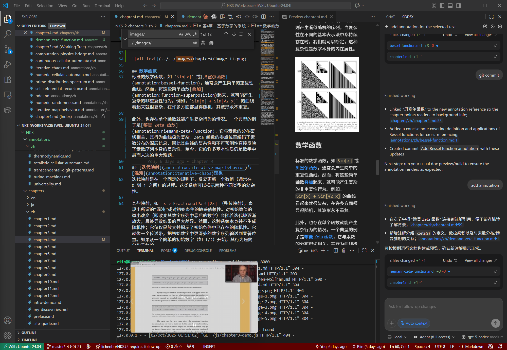

#私の発見

> 「新しい科学」に関連するトピックに関する私のインスピレーション、コレクション、実験結果を記録し、いつでも簡単に確認したり拡張したりできるようにします。

## セルラー オートマトン コレクション

1. [成長するニューラル セル オートマトン](https://distill.pub/2020/growing-ca/) - Distill の詳細な記事では、微分可能なセル オートマトンのフレームワークを通じてシステムをトレーニングし、成長、修復、形状を維持する方法を示しています。

## 研究ノート

- 個人的な実験、考え、または読書の抜粋をここに記録して、研究の記録を継続的に補足することができます。
- 長期的に追跡する価値のあるトピックがある場合は、カテゴリーごとに新しいセクションに分割して、構造を明確に保つことができます。

## フォローアップ計画

- セルオートマトン、複雑なシステム、自動モデリングに関連するより優れたリソースを整理します。
- このサイトのインタラクティブなデモンストレーションと組み合わせて、独自の探索ステップと経験を記録します。

<iframe width="560" height="315" src="https://www.youtube.com/embed/PdE-waSx-d8?si=GBzN2wRzHuttMZlS" title="YouTube ビデオ プレーヤー" Frameborder="0" allowed="加速度計; 自動再生; クリップボード書き込み; 暗号化メディア; ジャイロスコープ; ピクチャー・イン・ピクチャー。 web-share" Referrerpolicy="strict-origin-when-cross-origin"allowfullscreen></iframe>