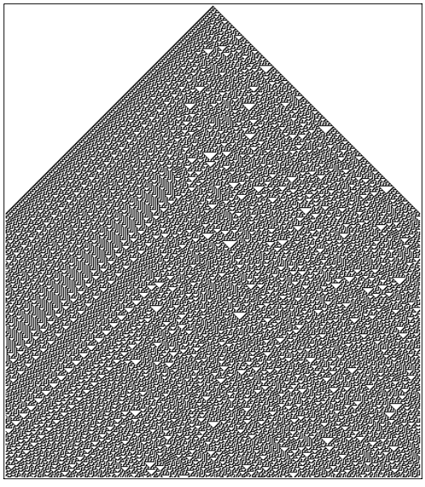

# 第2章：关键实验

二十年前，我脑海中冒出了一个关键的想法，它最终引导我写下了这本书：如果我们不为程序设定任何特定目标，只是随机选一个非常简单的程序，然后运行它，看看它会做什么，结果将会怎样？

这个问题用传统的数学方法很难回答，但用计算机做实验就再直接不过了。于是，我选择了一种我称之为[元胞自动机](annotation:cellular-automata)的极简程序开始了我的探索。它的规则简单到极致：想象有一行由黑白两种颜色组成的元胞，在时间流逝的每一步中，一个元胞的下一代颜色，只由它自己和它左右两个邻居在前一步的颜色共同决定。

## 实验的发现：从符合直觉到颠覆认知

一开始，一些规则产生的行为和我们想的差不多，非常简单：有些规则产生了一片均匀的黑色，另一些则产生了像棋盘格一样重复的图案。这完全符合我们的直觉。

但很快，我就迎来了第一个惊喜。一个稍微不同的规则，产生了一个虽然复杂但非常有规律的嵌套图案。你仔细看就会发现，它是由许多不断缩小的三角形碎片组成的，每一个小碎片都像是整个图案的微缩复制品。这已经很有趣了，说明简单的规则至少能产生有序的复杂性。

然而，真正让我震惊、并构成这门新科学核心的，是接下来这个我称之为[规则30](annotation:rule-30)的家伙。它的规则描述起来甚至有些古怪：首先，看每个元胞自己和它的右邻居，如果它们俩都是白色，那么这个元胞的新颜色就跟它左邻居的颜色一样；否则，就变成跟它左邻居相反的颜色。

规则本身并不复杂，可一旦从一个孤零零的黑元胞开始运行，产生的图案却让我大吃一惊。它极度复杂，毫无规律可循，看起来完全是随机的。

<!-- 可替换为交互式 Demo： demos/wolfram-rules-explorer/ 或者使用 ../../images/cellular-automata/cellular-automata-rule-30.svg -->

这股复杂性是从哪来的？我没有给它任何复杂的设计，规则和初始条件都简单得不能再简单。我用尽了各种数学和统计学方法去分析它，结果显示，中心那一列元胞的颜色序列，在数百万步之内都没有任何重复，其随机性与真正的随机过程几乎无法区分。虽然图案的左侧边缘有一些明显的斜条纹规律，但主体部分却是一片混沌。

那一刻我意识到，我可能触及了一个非常普遍且根本的现象：即使规则简单，系统也能自发地产生出看起来无穷无尽的复杂行为。

事情还没完。我又发现了像[规则110](annotation:rule-110)这样的系统。它的行为更加奇妙和微妙。图案的一部分是相当规律的、由小三角形构成的重复背景，但另一部分又是混乱的随机区域。最不可思议的是，在这个背景上还出现了一些稳定的局部“结构”，有些静止不动，有些则以固定的速度移动。当这些结构相遇时，它们会像粒子一样发生碰撞、反应，有时会湮灭，有时会产生新的结构。

<!-- 交互式 Demo 可链接到 demos/chapter3/turing-machine-demo.html 或 ../../images/computational-art/rule-110-pattern.png -->

这让我不禁思考：这些结构最终会全部消失，只留下规律的背景吗？还是会产生越来越多的结构，让整个系统变得完全随机？为了找到答案，我只能让计算机一直运行下去。最终，在近三千步之后，一个稳定的结构存活了下来，并与背景产生了周期性的互动。

## 一种新直觉的诞生

这些实验结果彻底颠覆了我的直觉。在日常经验里，尤其是在工程学中，我们总觉得要造出复杂的东西，背后的设计图纸也必须同样复杂。为了确保一个机器能完成我们想要的任务，我们必须能够理解和预测它的行为，因此我们会刻意避开那些行为难以预测的系统。

但大自然在运作时，可没有我们人类工程师的那种约束。它完全可能普遍地在使用这种由简生繁的机制，来创造我们在世界上看到的无穷复杂性。
其实，在实用计算领域，我们早就对这种现象有所体会。程序员都知道，一段很简单的代码，有时会产生极其难以预料的“bug”。这就是简单规则产生意外复杂行为的例子。但长久以来，这种来自实践的直觉，从未被应用到基础科学的层面。

简单规则能够产生复杂行为，这一现象之所以最初难以理解，是因为它与我们基于日常经验形成的直觉背道而驰。我们的经验，尤其是在工程和制造领域，几乎总是告诉我们：一个看起来复杂的事物，必然源于一个同样复杂的建造计划或设计蓝图。

这种直觉的根源在于工程学的基本方法：我们为了实现一个特定的、可预期的目标，而去设计和构建一个系统。为了确保系统能完成我们想要的任务，我们必须能够理解和预测它的行为，因此会有意地避开那些会产生不可控复杂性的系统。但自然界的运作没有这种人为的约束，所以它可以自由地从简单规则中演化出复杂行为，而这正是本书试图阐明的一个核心观点。

我们或许会想到用实用计算来类比，计算机确实能用简单的底层指令执行复杂任务。但这里的关键区别在于，虽然指令简单，但指令串所组成的程序通常是冗长且复杂的，这又回到了“复杂设计产生复杂结果”的工程模式。然而，元胞自动机所揭示的现象更为深刻：不仅其规则是简单的，其初始条件（程序）也可以极为简单——比如仅从一个黑色元胞开始——但其产生的行为却可以达到高度复杂。这令人困惑，因为它似乎是从“无”中凭空产生了“有”。

正因为如此，我们无法唤起任何现有的经验来帮助理解这一基本现象。我们别无选择，只能去尝试开发一种全新的直觉。而唯一合理的方法，就是让自己沉浸在大量的实例中，通过观察元胞自动机以及后续章节中其他各种系统的行为，最终培养出一种能够自然地、不可避免地认识到这一现象普遍性的新思维方式。

<button class="expand-toggle" data-target="simplified" data-expanded="false">
  展开详细内容
  ▼
</button>

## 为什么现在才发现？

你可能会问：这么基础的现象，为什么以前没人发现？

我想，一个关键原因是技术。在计算机出现之前，靠手工去画这些图实在是太枯燥了。画一张**规则30**的初步图像可能要一个小时，而要画出展示其长期行为的图，可能得花上好几周。没有大规模的实验，很难从一两个例子中发现普遍的规律。

更重要的原因是思维定势。传统科学的直觉会告诉我们，这种简单的“游戏”里不会有什么深刻的科学价值。纵观历史，无论是古人精美的装饰艺术，还是早期数学中发现的质数分布、π的数字序列，虽然都曾显露出“简单规则产生复杂表象”的蛛丝马迹，但它们往往被当作孤立的奇特现象，没有人将其提升为一个普遍的科学原理。

回过头看，是计算机这种强大的实验工具，和一种源于“计算”的全新思维方式，才让我有机会打开了这扇通往新科学的大门。它告诉我，宇宙中最深刻的秘密，也许就隐藏在那些最简单的规则背后。

这一章的核心发现——基于简单规则的程序能产生复杂结果——看似相当基础，我们或许会认为它早就该被发现了。然而事实并非如此，而其背后的原因，对于理解科学的进程本身是很有用的。

首先，一个主要原因是进行必要的实验需要相应的技术。在科学史中，新技术常常是基础科学发展的催化剂。就像望远镜引导了现代天文学，计算机技术则是引导本书所描述这门新科学的关键。原则上，在计算机出现之前手工模拟元胞自动机是可能的，但这会极为沉闷和耗时——模拟一幅简单的图样可能需要一小时，而更复杂的则要数周。更关键的是，要发现其普遍现象，不能只看一两个例子，而必须进行大规模的、不带任何偏见的系统性实验，而这直到20世纪70年代计算机时间变得廉价易得之后才成为现实。

但一个更深刻、更根本的原因在于，传统科学的标准直觉会让人认为这类实验根本不值得去做。自17世纪微积分取得巨大成功以来，科学界形成了一种根深蒂固的观念：要解释自然界中的复杂现象，就必须依赖同样复杂的数学方程。在这种思想主导下，几乎没人会相信，简单规则能产生任何有意义的复杂性，因此系统地研究它们也就无从谈起。

要打破这种思维定式，需要开发出一种全新的“计算”直觉，而这种直觉恰恰源于与计算机打交道的实践经验。例如，使用计算机显示器的经验告诉我们，由离散像素组成的简单网格完全可以显示出逼真的复杂图像；而编写程序的经验，尤其是调试（debug）的困难，则让我们深刻体会到，即使是简单程序的行为也常常是难以预测的。在没有这些实践经验之前，科学的直觉几乎在每一步都会把人引向错误的方向。

回顾历史，其实有过许多次接近这一发现的时刻。从古老的装饰艺术，到对质数分布随机性的忽视，再到将π的小数看作单纯的奇闻，甚至在“生命游戏”中人们努力回避和消除复杂行为，都反映出同一个问题：虽然基于简单规则的复杂现象被反复观察到，但在一个认为“简单只会产生简单”的框架下，它们要么被忽略，要么被当作没有普遍意义的特例或需要消除的干扰。因此，尽管暗示无处不在，这一普遍现象却最终等待着新工具和新思想的共同出现才得以被揭示。

<button class="expand-toggle" data-target="simplified" data-expanded="false">
  展开详细内容
  ▼
</button>
