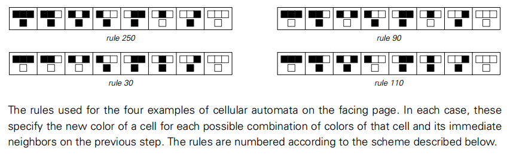
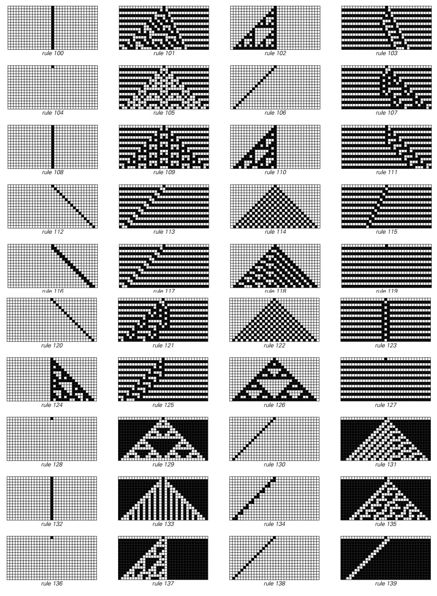
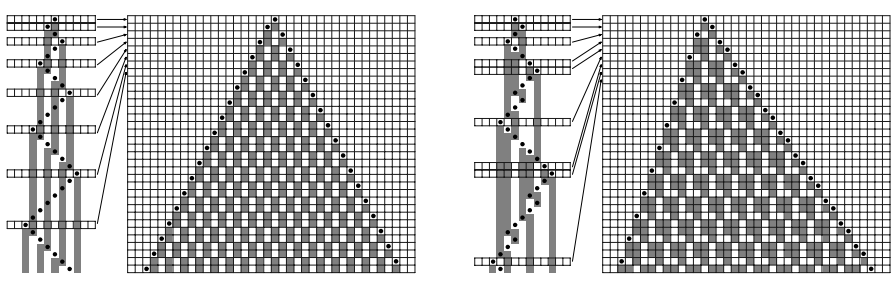
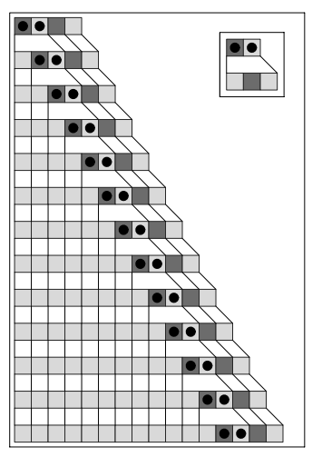
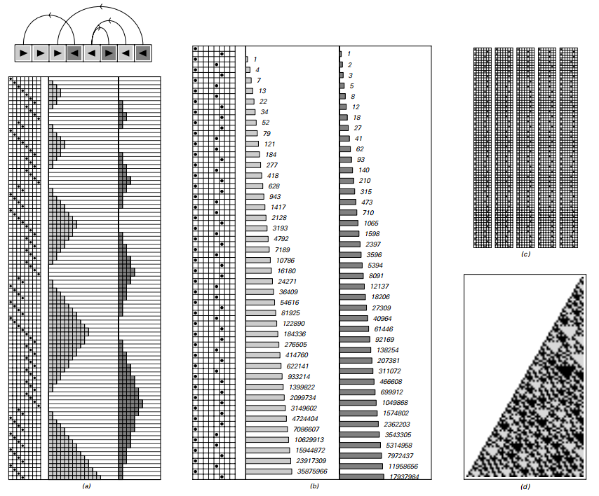
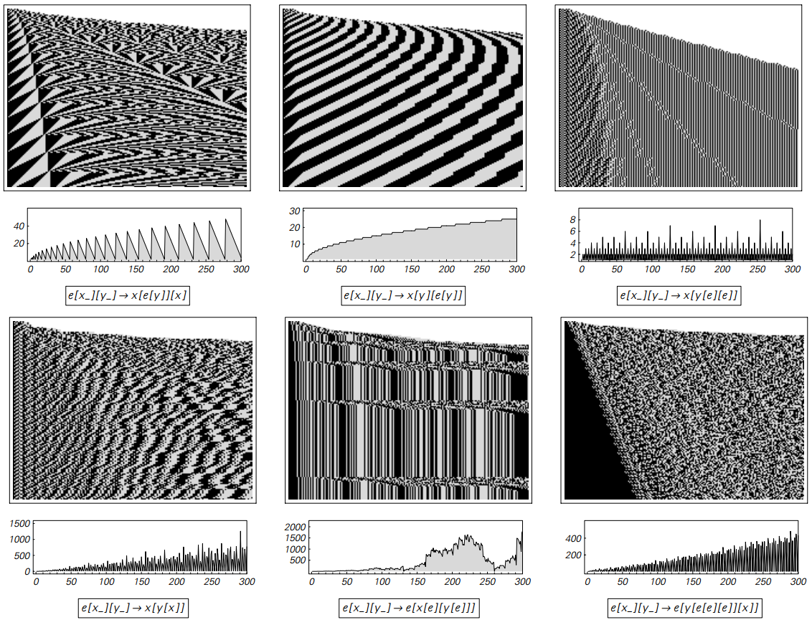

# 第3章：简单程序的世界

在上一章中，我们初步窥见了简单[元胞自动机](annotation:cellular-automata)所能产生的惊人复杂的行为。但这究竟是一种偶然，还是揭示了更深层的普遍规律？为了回答这个问题，我们必须走出第一章的特定例子，像自然科学家探索生物多样性那样，系统性地考察由简单规则构成的“计算宇宙”里还潜藏着哪些“物种”。

## 对元胞自动机的再探索

### 基本行为类型
我们首先回到了[元胞自动机](annotation:cellular-automata)的世界，开展更全面的普查。通过逐一检视全部 256 种最基础的（两种颜色、邻域为 1）规则，我们发现细节虽然千差万别，但行为模式依然可以清晰地归为四类（参见[四类行为](annotation:four-classes-of-behavior)）：
- 迅速趋于稳定的重复结构，如规则 0；
- 形成固定尺寸、可移动的局部结构；
- 生成具有无限细节却高度规律的嵌套或分形图案，例如规则 90；
- 呈现看似完全随机、无序的图案，例如[规则30](annotation:rule-30)。

这些类别不仅帮助我们快速定位典型表现，也构成后续跨系统比较的参照系。

### 基本规则全景
为了量化 256 条规则的差异，我们将每个局部邻域的“真值表”编码成一个 8 位二进制序列，从而形成一个紧凑的规则空间视图。图像拼贴展现了封面常见规则的对照，并展示了将所有组合串联后的全景图，这些缩略图让“计算宇宙”的多样性一目了然。

在宏观分类之外，个别规则的演化也揭示了更多细腻差异：有的迅速陷入统一，有的释放出移动的局部结构，还有的在扩散时不断重排。

<button class="expand-toggle" data-target="simplified" data-expanded="false">
  展开详细内容
  ▼
</button>

### 分形与随机示例
尽管许多规则走向重复或有限结构，依然有一批规则生成了嵌套分形或近似随机的复杂纹理。例如规则 22、159 与 225 呈现不同分形维度，而规则 30、45、106 等则在漫长的时间里维持无明显周期的随机背景。

延长演化时间可以观察到混合行为：规律背景与不规则冲突交织、局部结构缓慢增长或衰减，以及仅在极长时间尺度下才显现的简化趋势。

<button class="expand-toggle" data-target="simplified" data-expanded="false">
  展开详细内容
  ▼
</button>

### 总和规则与多色扩展
为了测试规则复杂性是否会根本改变行为，我们把元胞颜色从两种（黑 / 白）扩展到三种（黑 / 白 / 灰），并尝试“极端”或[总和规则](annotation:totalistic-cellular-automata)（新颜色仅取决于邻域颜色之和）。这样的设定将规则数量从 256 推升至 2187 乃至更高，但其核心行为依旧沿着重复、嵌套与随机三大主题展开。

即便继续考察更高色数或更大邻域，图像依旧表明：复杂性所需的关键要素早已在极低的规则复杂度阈值处得到满足。

<button class="expand-toggle" data-target="simplified" data-expanded="false">
  展开详细内容
  ▼
</button>

## 跨越不同系统的远征

为了确认这些现象不局限于元胞自动机，我们将同样的探索方法推广至多种计算模型，并在图像中记录它们的代表性演化。

### [移动自动机](annotation:mobile-automata)
移动自动机把更新从全局同步改为单个“活跃元胞”的局部更新与移动。在 65,536 条最简单规则中，大多数案例都只产生有限或周期行为，但依旧能观察到嵌套结构与近似随机的色块。当允许多个活跃元胞或更丰富的状态时，复杂演化变得更容易出现。

随着规则复杂度提高乃至允许活跃元胞分裂，移动自动机也会呈现嵌套与随机的多样纹理。

<button class="expand-toggle" data-target="simplified" data-expanded="false">
  展开详细内容
  ▼
</button>

### [图灵机](annotation:turing-machines)
图灵机与移动自动机类似，也在一维磁带上移动活跃元胞（磁头），但磁头可以拥有多种状态。两状态两颜色的最简单组合只会产生重复或嵌套行为，而当磁头状态拓展到四种时，随机纹理便显现出来，再次印证了“复杂度阈值”的存在。

两状态图灵机的典型行为

多状态图灵机的行为对比

四状态图灵机的随机演化

<button class="expand-toggle" data-target="simplified" data-expanded="false">
  展开详细内容
  ▼
</button>

### [替换系统](annotation:substitution-systems)
替换系统让元素数量随规则变化而增减。若规则只依赖元素自身颜色，就会生成高度规律的嵌套分形；当规则依赖邻居、允许元素被创建或销毁时，行为会向随机扩散靠近，与元胞自动机的表现难以区分。

用树形可视化的替换系统

包含创造与毁灭的替换系统

<button class="expand-toggle" data-target="simplified" data-expanded="false">
  展开详细内容
  ▼
</button>

### [有序替代系统](annotation:sequential-substitution-systems)
将替换系统改为“从左到右查找第一个匹配并替换”，就得到类似文本编辑器“查找-替换”的模型。少量规则只会产生重复或嵌套，但当规则集合扩大时，也会出现与元胞自动机相当的不可预测序列。

<button class="expand-toggle" data-target="simplified" data-expanded="false">
  展开详细内容
  ▼
</button>

### [标识系统](annotation:tag-systems)
标识系统每步从序列前端移除固定数量的符号，再根据移除的模式把特定符号块接到尾部。移除一个符号时，它相当于近邻独立的替换系统；移除两个符号或使用循环规则后，复杂互动与随机波动就此出现。

<button class="expand-toggle" data-target="simplified" data-expanded="false">
  展开详细内容
  ▼
</button>

### 循环标识系统

循环标识系统中的增长波动

<button class="expand-toggle" data-target="simplified" data-expanded="false">
  展开详细内容
  ▼
</button>

### [寄存器机](annotation:register-machines)
寄存器机抽象了底层 CPU 通过自增与自减-跳转指令操作寄存器的方式。四条指令以内的程序最终都回到重复行为，而当指令数达到八条时，才会出现近似随机的复杂序列，说明复杂性阈值依然很低。

<button class="expand-toggle" data-target="simplified" data-expanded="false">
  展开详细内容
  ▼
</button>

### [符号系统](annotation:symbolic-systems)
类似的实验还可以在类型重写系统中进行：我们用简洁的括号表达式和替换规则来模拟符号推导（例如 Mathematica 中的 `/.` 匹配替换）。尽管规则高度非局部，这些系统同样在简单设定下呈现重复、嵌套乃至随机的多样行为。

<button class="expand-toggle" data-target="simplified" data-expanded="false">
  展开详细内容
  ▼
</button>

> 扩展阅读：[组合子：百年回顾](https://writings.stephenwolfram.com/2020/12/combinators-a-centennial-view/)

## 结论与方法论的反思

这场跨越众多计算模型的旅程，最终带我们得出一个坚实而深刻的结论：极其简单的规则能够涌现极端复杂的行为，这既非偶然，也非特例，而是普遍的计算现象。无论底层结构是并行的元胞阵列、移动磁头，还是动态字符串，只要规则允许足够的信息处理能力（门槛非常低），它们都会展现出那四种共通的行为模式。

这一发现本身依赖一种新的科学方法——[计算机实验](annotation:scientific-methodology)。我们没有像传统数学那样先设定目标再构造能实现它的系统，而是以最直接的方式：系统性地、不带偏见地运行最简单的程序，并细致观察它们的行为。正是这种方法，让我们摆脱了直觉束缚，捕捉到那些难以由纯理论推演的现象。它也提醒我们，发现新现象的最佳途径，往往是进行最简单直接的实验，用开放的心态审视实验产生的海量原始数据——很多时候，一幅图像透露的信息远胜于任何统计摘要。
