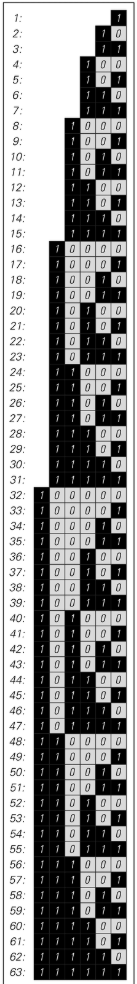
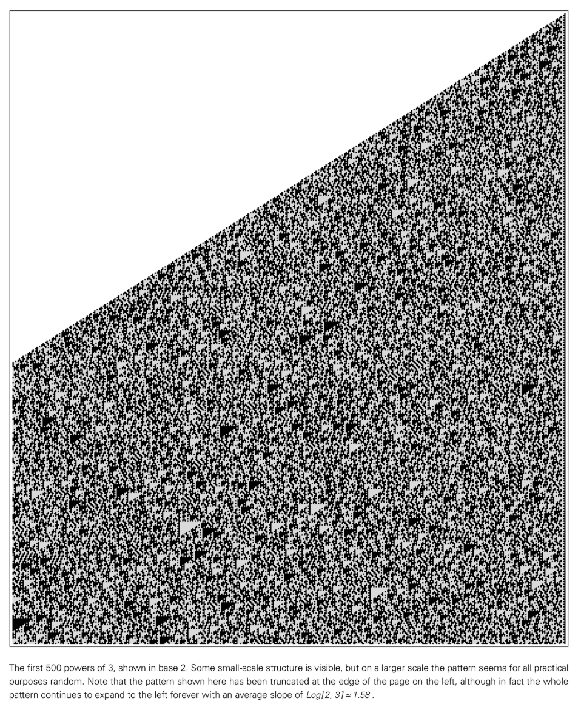
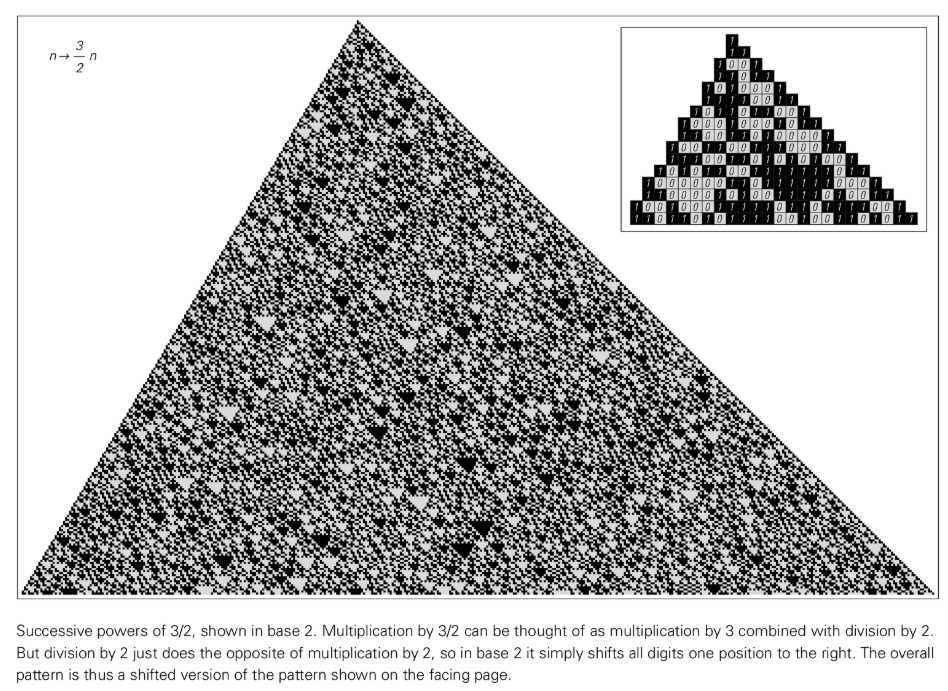
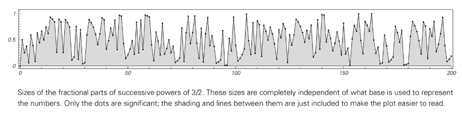

# 第4章：基于数字的系统

## 数字的概念
传统科学长期致力于用数字描述自然系统，但这种做法通常将数字理想化，仅关注其大小。在这种视角下，数字被视为基本的、不可分割的实体，其唯一重要的属性就是它在数轴上的位置。然而，在计算机中，数字必须由数字序列（如二进制的 0 和 1）来明确表示，这揭示了一种更深层次的结构。

这种差异至关重要。当我们审视数字在计算机中的表示法（即它们的数字序列）时，会发现即使是基于最简单数字规则的系统也能产生复杂的行为，其模式与[细胞自动机](annotation:numeric-cellular-automata)等其他[简单程序](annotation:numeric-simple-programs)生成的模式惊人地相似。传统数学之所以常常忽略这一点，是因为它倾向于寻找能够产生简洁、封闭形式解的系统，而这类系统本质上行为简单。然而，当我们放弃这种限制，将数字视为可操作的数据结构时，[复杂性](annotation:numeric-complexity)的起源便从这些数字序列的细节中显现出来。

## 基本算术
看似最简单的算术过程也可能导致高度复杂的行为。例如，从 1 开始重复加 1，生成的数字序列（1, 2, 3, ...）在二进制表示下会形成一个具有复杂嵌套结构的模式，这表明简单的累加过程在底层结构上并不简单。

 

乘法可以产生更引人注目的结果。从 1 开始重复乘以 2，在二进制中只是一个简单的左移操作，产生一个非常简单的、可预测的模式。然而，如果重复乘以 3，生成的数字序列模式则异常复杂，虽然其中仍可见微小的三角形结构，但在宏观尺度上看起来几乎是[随机的](annotation:numeric-randomness)。

这种复杂性并非仅仅是数字表示法的产物。例如，重复乘以 3/2 的过程，其结果的小数部分大小的序列本身就表现出复杂性和明显的[随机性](annotation:numeric-randomness)，这证明了复杂性存在于数值本身，而不仅仅是其二进制的视觉表现。即使在只涉及整数的系统中，例如根据数字的奇偶性应用不同规则的系统，也可能出现看似随机的行为和不可预测的增长。这些例子共同表明，即使是基本的算术运算，也能够像[细胞自动机](annotation:numeric-cellular-automata)一样，从简单的规则中生成高度复杂和看似随机的行为。

> 补充阅读：[100年后，我们能最终破解Post的标签问题吗？一个关于计算不可约性的故事，以及更多内容](https://writings.stephenwolfram.com/2021/03/after-100-years-can-we-finally-crack-posts-problem-of-tag-a-story-of-computational-irreducibility-and-more/)

## 递归序列
[递归序列](annotation:self-referential-recursion)，即序列中的每一项由前面项确定，是另一个复杂性的来源。标准的线性递归关系，如斐波那契数列 `f(n) = f(n-1) + f(n-2)`，其规则是固定的，因此通常产生简单的增长或重复行为。

然而，当规则允许项的索引依赖于序列中先前的值时，例如 `f(n) = f(n - f(n-1)) + f(n - f(n-2))`，行为会变得复杂得多。这里的关键在于，系统回溯多远来获取信息，是由它自己生成的数值决定的。这种自我参照的反馈循环打破了简单的可预测性。尽管这类规则仅涉及加法和减法，但它们生成的序列可以在整体增长的趋势上叠加剧烈且看似随机的波动。这表明，即使是最基本运算的递归应用，也足以产生巨大的复杂性。

## 素数序列
[素数序列](annotation:prime-distribution-spectrum)是由一个非常简单的规则（埃拉托斯特尼筛法）生成的，但其分布却极其复杂。素数序列（2, 3, 5, 7, 11, ...）在许多方面都表现出随机性。例如，素数的间隔、特定形式的素数的分布以及其他相关属性都显示出不可预测的波动。这一事实具有深远的意义：一个在数学中如此基础、定义如此确定性的序列，其行为却与随机过程难以区分。

这种现象不仅限于素数。许多其他基于简单数字属性的序列，如一个数的约数个数或将其写成平方和的方式数，同样显示出巨大的复杂性。尽管数论学家经过了几个世纪的努力，这些序列的许多方面仍然是未解之谜，这有力地表明，复杂性是这些由简单算术规则定义的系统的一个基本特征，而不是例外。

## 数学常数
[数学常数](annotation:transcendental-digit-patterns)的数字序列是复杂性的另一个显著例子。有理数（如 1/3 或 1/7）的数字序列总是简单重复的。然而，像 π 这样由简单几何定义（圆的周长与直径之比）产生的数字，其数字序列却看起来完全随机，目前已计算出的数万亿位数字中都没有发现任何规律。

同样，像 √2 这样的数的数字序列也显得随机。这种复杂性是这些数字的内在属性，与表示它们的进制无关。改变表示法是一个有力的测试：例如，在连分数表示法中，有理数和二次无理数（如 √2）具有简单或重复的模式，但像 π 和 $\sqrt[3]{2}$ 这样的数字则产生看似随机的序列。当复杂性在不同的基本表示法中都持续存在时，我们就可以断定，这种复杂性是数字本身的内在属性。

## 数学函数
标准的数学函数，如 `Sin[x]` 或贝塞尔函数，通常会产生简单的重复性曲线。然而，将这些简单函数[叠加](annotation:function-superposition)起来，就可能产生复杂的非重复性行为。例如，`Sin[x] + Sin[√2 x]` 的曲线看起来就很复杂，在许多方面都显得随机，其波形永不重复。

此外，也存在单个函数就能产生复杂行为的情况。一个典型的例子是黎曼 Zeta 函数，它与素数的分布密切相关，其行为曲线极为复杂。Zeta 函数的零点位置编码了素数分布的深层信息，因此其曲线的复杂性和不可预测性直接反映了素数序列本身的复杂性。至今，它的许多基本性质仍是数学中悬而未决的重大难题。

## [迭代映射](annotation:iterative-map-behavior)与[混沌](annotation:iterative-chaos)现象
迭代映射是在一个固定的规则下，反复更新一个数值（通常在 0 到 1 之间）的过程。这类系统可以揭示两种不同类型的复杂性。

某些映射，如 `x → FractionalPart[2x]`（移位映射），表现出所谓的“混沌”或对初始条件的敏感依赖性。对初始数值的微小改变（即改变其数字序列中靠后的数字）会随着迭代被逐渐放大，最终导致结果的巨大差异。然而，这种系统本身并不生成随机性；它仅仅是放大并揭示了初始条件中已存在的随机性。它就像一个传送带，把初始数字中更深处的数字序列输送到显著位置。如果从一个简单的初始数字（如 1/2）开始，其行为是简单和重复的。

相比之下，像 `x → FractionalPart[3/2x]` 这样的映射则能内在地生成复杂性。即使从一个非常简单的初始条件开始，这个系统演化出的数字序列和数值大小序列也都是复杂的。这里的算术运算本身就在不断创造新的、复杂的数字排列。这表明，复杂性可以由系统自身的演化过程产生，而不仅仅是放大初始条件中已有的随机性，这是揭示信息和创造信息之间的根本区别。

## 连续细胞自动机与偏微分方程
复杂性并非仅限于由离散元素（如整数或数字）构成的系统。在连续系统中同样可以找到复杂性。这意味着复杂性不是“数字化”或离散化的副产品，而是动态系统更普遍的特性。

例如，在一种每个单元都可以取连续灰色值的[连续细胞自动机](annotation:continuous-cellular-automata)中，简单的局部规则就能从单个黑色单元的初始状态生成高度复杂的模式，包括看似随机的纹理和离散的局部结构。

更进一步，即使在作为现代物理学基础的完全连续的系统中，如由[偏微分方程](annotation:pde)（PDEs）描述的系统，复杂性也会出现。尽管历史上研究的大多数 PDE（如波动方程和扩散方程）行为简单，但通过搜索可以发现一些形式简单但其解却高度复杂的 PDE。这些连续系统生成的复杂模式，与我们在离散系统中看到的非常相似，这为[计算宇宙](annotation:computation-physics-bridge)和传统物理学的数学宇宙之间架起了一座桥梁。

## 结论：连续与离散系统
本书中发现的复杂性现象并非离散系统的特有产物，它同样存在于连续系统中。然而，在离散系统中发现和研究这一现象要容易得多。离散系统的模拟是直接的、无歧义的，允许我们进行一种经验性的、类似于实验的数学探索。相比之下，连续系统的数值分析往往会引入近似和伪影，使得我们很难确定所见的复杂性是系统的真实属性还是计算方法的产物。

尽管如此，核心结论是，无论系统是离散的还是连续的，从简单规则生成复杂行为的现象都是普遍存在的。这一发现之所以成为可能，正是因为离散系统提供了一个清晰的窗口，让我们能够观察到这一深刻而普适的原理。
