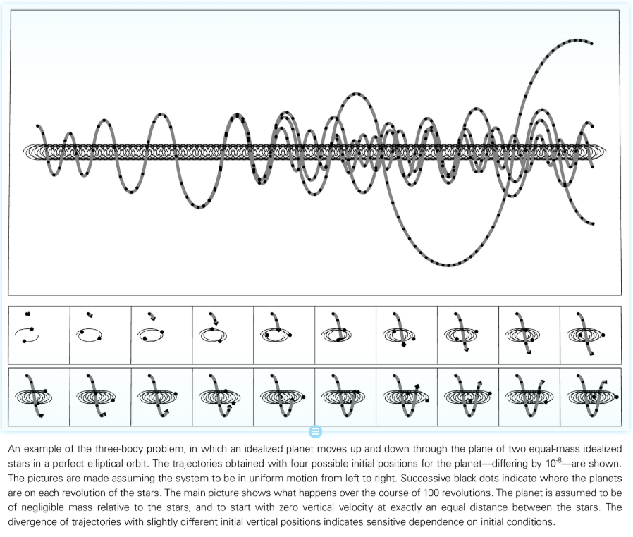
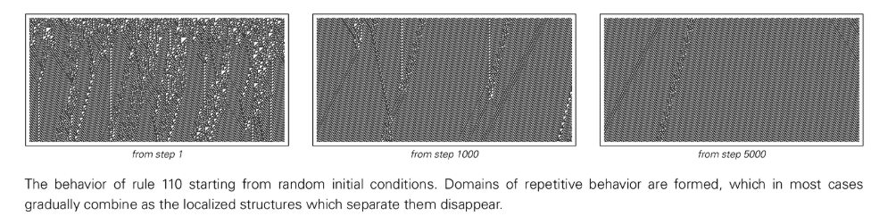

# 第7章：程序和自然界的机制

## 行为的普适性

简单程序，尽管其规则可能极为简明，却能够生成超乎想象的复杂行为。这正是本书的核心发现之一。更引人注目的是，这些由简单程序产生的行为，与我们在自然界中广泛观察到的现象展现出惊人的相似性。这种相似性并非偶然的巧合或视觉上的错觉，而是深刻地反映了简单程序与自然系统之间存在着一种基础性的对应关系。

当我们观察自然界时，会发现一个普遍现象：许多系统尽管其底层的物理、化学或生物构成截然不同，但它们在宏观层面展现出的行为模式却常常非常相似。同样地，在对简单程序的研究中，我们也能观察到，即使程序的底层规则大相径庭，它们生成的整体行为也可能高度一致。这揭示了一种“行为的普适性”，即特定类型的行为模式会反复出现，而这种出现独立于构成系统的具体细节。

这一洞见至关重要，因为它意味着我们可以通过研究简单程序的行为来深刻理解自然系统的运作机制。自然现象背后的基本驱动力，与我们在简单程序中看到的机制，在本质上是相通的。因此，本章旨在深入探讨自然界中的一些普遍现象，阐明它们如何与简单程序中的行为相对应，并特别关注那些用传统科学框架难以充分解释的复杂现象，展示新科学方法如何为其提供清晰而有力的解释。

## 随机性的三种机制

在自然界中，随机性是一种无处不在的现象。通过对简单程序的系统性研究，我发现随机性的产生主要可以归结为三种基本机制：

### 来自环境的随机性

这是传统科学中最经典、最广为接受的观点。它认为，一个系统的随机性是其与一个充满不确定性的外部环境持续相互作用的结果。日常生活中，水面上的船只颠簸就是一个很好的例子，船的运动看似随机，实则是被动地跟随随机的海浪。在微观世界，布朗运动中花粉颗粒的无规则跳动，是液体中大量分子对其进行永不停歇且无法预测的碰撞所致。这种机制的本质在于，随机性是作为一种外部“噪声”持续输入到系统中的。然而，这种观点并未真正解释随机性的终极来源，只是将其归因于一个我们碰巧没有研究的、更大的“外部系统”。此外，现实中的物理随机源（如[电子噪声发生器](annotation:electronic-noise-generator)）也常常因为内部状态的“记忆效应”（弛豫时间）和环境中存在的微妙关联性而无法产生完美的随机性。

### 来自初始条件的随机性（[混沌理论](annotation:deterministic-chaos)）

这种机制认为，随机性并非在系统的演化过程中被持续注入，而是根植于系统无法被无限精确测量的初始条件之中。系统本身遵循完全确定性的规则，但其演化轨迹对初始条件表现出极端的敏感性。一个微乎其微的初始差异，会随着时间的推移被指数级放大，最终导致宏观行为呈现出随机性。例如，掷硬币或骰子的最终结果，在很大程度上取决于初始速度、旋转和角度等一系列微小的、人手无法精确复现的随机变化。然而，这种机制的本质是一种“转录”，它只是将初始条件中已经存在的随机性（表现为无限数字序列中的随机性）揭示出来，其行为的随机程度完全受限于初始条件的随机程度。因此，它同样没有回答随机性的根源问题，只是将这个问题推给了“最初的最初”。

[三体问题](annotation:three-body-problem)

### 随机性的内禀生成

这是本书提出的一个革命性的发现。它揭示了，一个系统即使在完全没有随机输入的情况下——其规则和初始条件都极为简单——也能够通过自身完全确定性的演化过程，从无到有地创造出高度复杂、在所有实际检测标准下都表现为随机的行为。“[规则30](annotation:rule-30)”细胞自动机便是这一机制的典范。它从一个单独的黑元开始，遵循一条简单规则，却生成了在统计上无懈可击的随机序列。这种机制不依赖于任何外部随机源，而是内在地、自发地创造随机性。我们在各种简单程序中都发现，这种现象非常普遍。因此，我们有充分的理由相信，自然界中我们观察到的大部分（如果不是全部）随机现象，其最终根源都来自于此。该机制的一个关键且独特的特征是，其产生的随机行为在细节上是可重复的——只要实验设置（规则和初始条件）完全相同，每一次运行都将得到完全相同的随机序列，这与前两种机制产生的不可预测、不可重复的随机性形成了鲜明对比。

## 连续性现象

自然界中，诸如水流、空气流动等许多系统都表现出连续、平滑的宏观特性。然而，我们用来建模的程序，如细胞自动机，其基本组成部分却是离散的。这两者之间看似存在的鸿沟应如何统一？

关键在于，大量离散组件在宏观尺度上的平均行为可以呈现出完美的连续性。而随机性正是实现从离散到连续这一过渡的核心要素。当大量离散的粒子（如分子或沙粒）进行无规则的随机运动（即“随机游走”）时，它们各自离散的、锯齿状的轨迹在整体上被“平均掉”了，从而呈现出流体那样平滑的宏观运动。

同样，在简单的“[聚集模型](annotation:aggregation-model)”中，尽管我们每次只在现有团簇的边缘随机添加一个离散的单元，但经过成千上万步之后，形成的团簇宏观上也会呈现出近似光滑的圆形。重要的是，实现这一平滑效果的随机性并不必须来自外部。由系统“内禀生成”的随机性，同样能够有效地驱动这种平滑的宏观结果。

## 离散性的起源

与连续性现象相对应，自然界也充满了各种鲜明的离散现象，例如动物皮毛上非黑即白的条纹，而非连续渐变的灰色。这种离散性又是如何产生的呢？

一个重要的机制是，即使系统的底层规则是完全连续的，其宏观行为也可能表现出离散的特征。这通常是通过所谓的“[相变](annotation:phase-transition)”来实现的。当一个系统的某个控制参数被连续地、平滑地改变时，系统本身的行为可能会在某个特定的临界点发生突然的、不连续的状态跃迁。

在我们的程序模型中，也能清晰地观察到类似现象。例如，在一个一维细胞自动机中，如果我们将初始黑元所占的密度作为参数，并从 0 开始连续增加。我们会发现，只要密度低于 50%，无论具体数值是多少，系统最终都会演化成全白的状态。然而，一旦密度越过 50%，系统的行为就会发生突变，最终稳定在一个全黑的状态。这种从平滑改变的参数中产生离散结果的现象，在自然界中极为常见。

## 满足约束的问题

传统科学，尤其在生物学和物理学中，倾向于用“约束”来解释自然形态的成因。这种观点认为，系统会通过某种方式自发演化，以达到一个满足特定最优约束（如能量最低、表面积最小或填充密度最大）的最终状态。然而，本书的观点认为，这种解释在面对复杂形态时是站不住脚的。

对于一个自然系统来说，通过盲目的随机尝试或基于局部信息的逐步迭代改进，来找到满足全局约束的精确解，几乎是不可能的。迭代过程非常容易陷入所谓的“局部最优解”——就像一个试图滚到山谷最低点的球，很容易被一个小坑洼困住，而无法到达真正的谷底。即使人为地施加额外的“震动”来帮助它逃离这些小坑，以接近全局最优解，这种方法仍然在计算上极其昂贵，且往往无法保证成功。

因此，一个更合理、更有力的解释是：我们在自然界中看到的复杂模式，并非系统“解决”了一个复杂优化问题的结果，而是遵循一套相对简单的、明确的演化规则（就像一个计算机程序）直接生成的结果。演化规则提供了清晰的、一步一步的生成过程，而约束仅仅是对最终形态进行描述的一种方式。

## 简单行为的起源

正如复杂行为可以由简单规则产生，自然界中常见的简单行为（如均匀、重复和嵌套）同样可以由多种不同的、基于简单规则的机制产生。我们无需为每一种简单行为寻找一种独特的、复杂的解释。

### 均匀性

系统达到均匀状态可以通过多种方式实现。例如，从一个初始点开始的同质生长，像晶体一样向外扩张；系统中每个孤立的部分独立地演化到同一个稳定状态；或者，也是非常重要的一种方式，系统在微观层面表现出高度的随机行为，但在宏观尺度上，这些随机涨落被平均化，最终呈现出看似完美的均匀状态。

### 重复性

当一个确定性系统只有有限个可能的状态时，它的行为最终必然会进入一个循环，从而表现出时间上的重复性。在空间上，重复性可以通过局部周期性结构的移动（形成波）或从一个简单的“种子”结构按规律生长来产生。即使从完全随机的初始条件开始，系统也可能通过自身的演化机制自然出现高度重复的模式。

### 嵌套性（分形）

美丽的嵌套结构也可以通过多种机制产生。一种是直观的“自上而下”的分裂过程，即一个元素根据固定的规则分裂成几个更小的、按比例缩小的自身，这个过程不断递归进行，就像植物分枝一样。然而，另一种更常见且更深刻的方式是“自下而上”的构造：从一个简单的局部规则出发，系统通过不断的迭代，在宏观尺度上自然浮现出嵌套的、自相似的结构。

最终我们发现，无论是简单行为还是复杂行为，其背后都存在着多种可能的生成机制。这些机制本身并不复杂，而且都可以被非常简单的程序模型所捕捉和再现。
