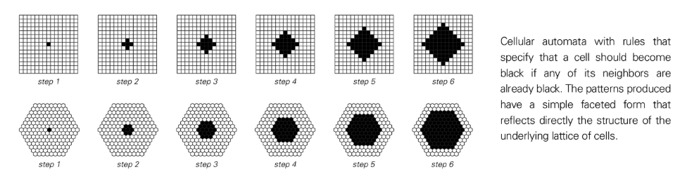
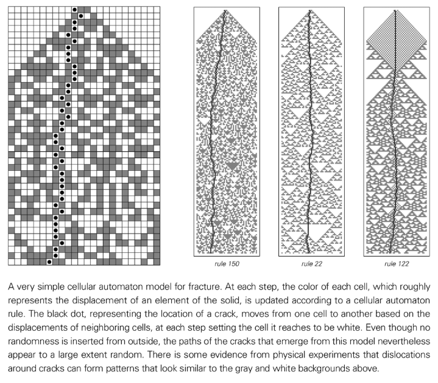
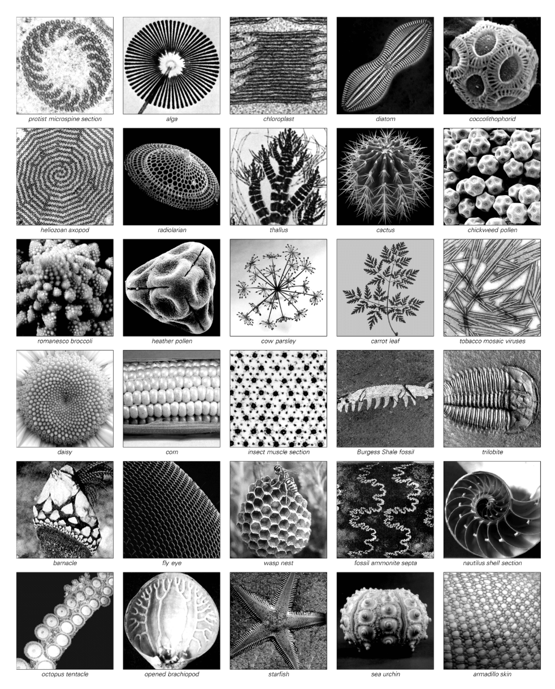
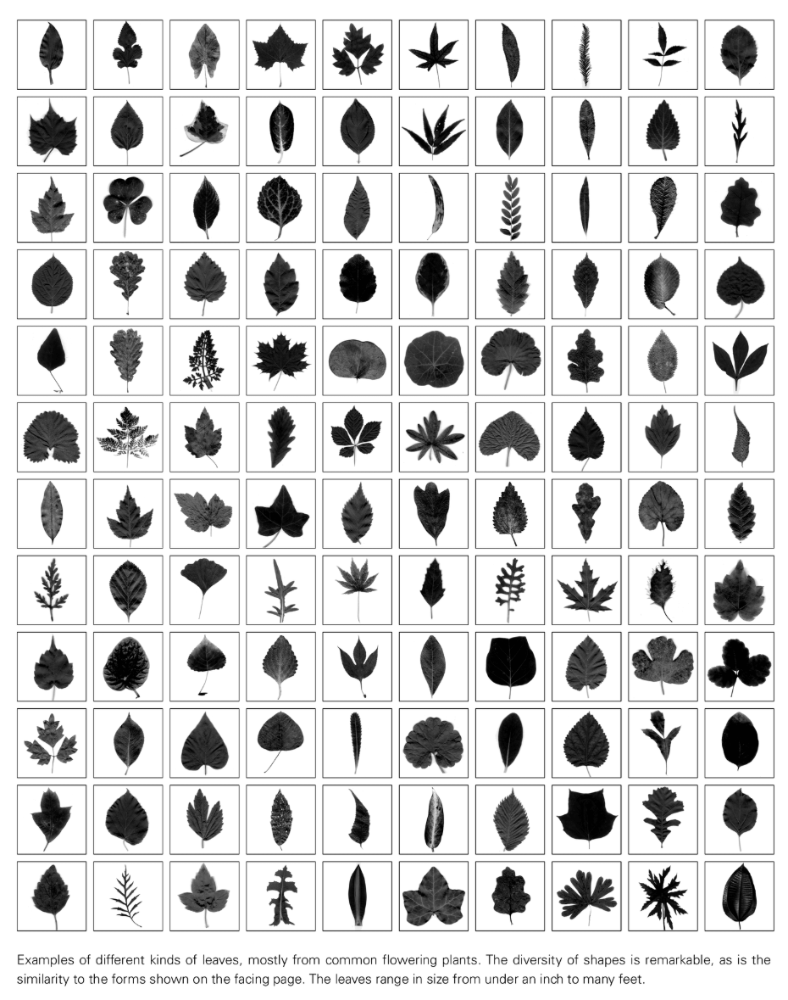
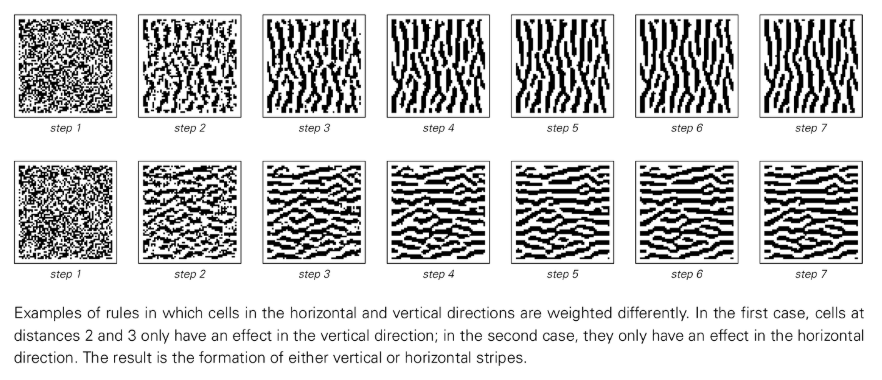

# 第8章：对日常系统的影响

## 建模的问题

本章将运用简单程序的思想，探讨一系列自然及其他领域中的特定系统，并阐述其行为特征的根源。这些系统大多在日常生活中很常见，但其行为的根本原因在很大程度上仍是未解之谜。我们将发现，通过简单程序的视角，这些行为的起源将不再那么神秘。

我的目的并非详尽解释所有细节，而是要识别出导致各类系统最显著行为特征的基本机制。我将构建尽可能简单的模型。本书的一个核心发现是，复杂行为可由极其简单的规则产生，尤其是在使用程序而非传统数学方程进行思考时。

模型终究是一种理想化。传统科学有时过度依赖少数几个数字来验证模型，而忽略了整体行为。我认为，评估模型的最佳第一步是直观比较模型生成的图像与系统本身的图像。一个好的模型应是简单的，却能大致再现系统的多种特征。

需要明确的是，模型是系统的抽象表示，其内部元素无需与系统本身的物理组成部分直接对应。例如，细胞自动机模型可以成功再现系统行为，但这并不意味着系统本身是由遵循细胞自动机规则的离散单元构成的。模型的关键在于抓住决定系统行为的重要效应，并忽略其他次要因素。构建模型的挑战正在于此。我始终选取少数我认为最重要的效应来构建最简模型，以理解整体行为的基本机制。

## 晶体生长

晶体在微观层面是由原子规则排列构成的，其生长过程始于一个“种子”，然后原子在表面逐渐累积。一个简单的细胞自动机模型——任何与黑色单元相邻的单元在下一步也变黑——可以生成简单的多面体晶体形态，这与许多天然宝石的形状相似。

然而，雪花的形态却异常复杂。其复杂性的主要原因在于，当冰晶附着在雪花上时会释放热量，从而抑制附近区域新冰晶的附着。我们可以用一个细胞自动机规则来捕捉这一效应：仅当一个单元有且仅有一个黑色邻居时，它才会变黑。这个简单的规则竟能生成与真实雪花惊人相似的复杂图案。这表明，雪花形态的复杂性源于简单的生长抑制规则。

同样，其他类型的晶体也展现出多样的形态，包括针状、树枝状乃至看似随机的形态。这些复杂和随机的形态也可以通过非常简单的细胞自动机规则产生。这表明，晶体形状中观察到的随机性，很可能并非源于外部环境或种子的随机性，而是由简单的底层规则内在生成的。

## 材料断裂

日常生活中，打碎一个固体物体是产生随机性的常见方式。断裂产生的粗糙、随机的裂纹表面，其根源是什么？即便是在完美的单晶体中，断裂模式也同样呈现随机性，这说明其基本机制与特定材料的细节无关。

当固体断裂时，裂纹会迅速扩展。我们可以将固体的组成部分想象成由弹簧连接，裂纹的传播路径则由弹簧被拉伸至断裂的位置决定。一个极简的细胞自动机模型可以模拟这一过程：单元的位移状态根据邻居的状态更新，而裂纹（一个特殊标记）则根据周围单元的位移移动。尽管模型中未引入任何外在随机性，其生成的裂纹路径却呈现出显著的随机性。这表明，材料断裂中的随机性很可能是由系统内部动态过程内在生成的。

## 流体流动

从缓慢水流中的平滑层流，到高速水流中物体后方形成的复杂涡街和湍流，[流体流动](annotation:fluid-flow)展现了广泛的复杂现象。当流速增加时，规则的涡旋会开始出现不规则的“小故障”，最终形成看似随机的湍流。

传统科学一直未能对湍流的根源给出令人信服的解释。然而，从简单程序易于产生复杂和随机行为的发现来看，湍流现象不再那么令人惊讶。我们可以用一个简单的细胞自动机系统来模拟流体：大量粒子在离散网格上运动，并根据简单规则进行碰撞。在微观尺度上，我们看到的是离散粒子的运动；但在宏观尺度上，通过对大块粒子进行平均，系统展现出平滑、连续的流体行为。

该模型能成功再现从形成稳定涡旋到转变为不规则湍流的整个过程。这种随机性从何而来？过去普遍认为这与“混沌理论”中的“对初始条件的敏感依赖性”有关。然而，在该模型中，微小初始条件的改变在宏观流体行为层面几乎没有可辨识的影响。这意味着流体中的随机性并非简单地由初始条件的随机性放大而来。

结论是，湍流中的大部分随机性是由系统自身内在生成的。随机性并非仅存在于微观粒子层面，而是在宏观流体运动的层面上直接产生。

## 生物学中的基本问题

生物系统常被视为自然界复杂性的顶峰，人们通常将其归因于适应和自然选择。然而，我逐渐相信，生物系统中最显著的许多复杂性实例，实际上与适应或自然选择关系不大。它们更可能是我在本书中发现的基本现象的又一例证：在几乎任何类型的系统中，许多底层规则的选择都不可避免地导致高度复杂的行为。

生物体的遗传物质可以被直接视为指导其发育的程序。虽然一个完整有机体的遗传程序非常庞大，但控制其某个局部的子程序可能非常简单。我们看到的许多复杂生物形态，例如[叶片形态](annotation:leaf-morphogenesis)和色素沉着图案，往往仅涉及少数几种细胞类型，这表明它们可能由简单的程序生成。

过去人们普遍认为，生物体的每一个特征都是为了最大化其适应性而经过自然选择精心优化的结果。例如，植物枝叶的[黄金分割螺旋](annotation:golden-spiral)被解释为最大化光照，而软体动物壳上的复杂图案则被视为迷惑天敌的伪装。但我强烈怀疑，这些“目的”与这些特征存在的真正原因关系甚微。我相信，这些特征的出现，仅仅因为它们能通过相当简单的程序轻易产生。

随机突变在生物进化过程中会尝试大量的程序，这与[遗传算法](annotation:genetic-algorithm)等演化计算方法的策略颇为相似。根据本书的发现，这些程序中必然有相当一部分会产生复杂的行为。自然选择会筛选出那些能成功生存的程序，但决定生物体成功的，往往是比较粗略的特征，而非复杂行为的所有细节。因此，一个碰巧能产生复杂图案的程序，可能仅仅因为它满足了“产生混合颜色”这一粗略的生存优势而被选中。

我认为，我们在生物系统中看到的大部分复杂性，其根源在于一个纯粹的抽象事实：在随机选择的程序中，许多程序自身就能产生复杂的行为。获得复杂性其实相当容易。

那么，自然选择的角色是什么？我怀疑，自然选择的主要作用几乎是相反的：它倾向于限制复杂性。对于行为简单的系统（如直线生长），自然选择可以有效地进行优化（如选择最优长度）。但对于行为复杂的系统，自然选择几乎无能为力，因为它无法预测对底层程序的微小改动会对整体复杂行为产生何种系统性的有利影响。

因此，自然选择使得生物系统在某些方面更像是工程系统：由行为相对简单、可预测的模块构成，从而易于调整和优化。而那些不受自然选择严格约束的方面，则能够展现出由简单程序内在生成的、不受限制的复杂性，如同我们在物理系统中观察到的那样。

### 动植物的生长

动植物的复杂形态，很可能源于极其简单的生长规则。

以植物为例，其分枝结构可以通过简单的邻域无关替换系统来建模。在每一步，每个生长中的茎尖都被一组特定形态的较小新茎所取代。尽管底层规则极度简单，但由此产生的几何排列却能立刻展现出巨大的复杂性。这一简单的分枝过程不仅能生成各种植物（从藻类到树木）的整体形态，还能生成形态各异的[叶片形态](annotation:leaf-morphogenesis)。叶片形状的巨大多样性，很可能就是这些简单生长规则的直接体现。

另一个例子是植物的“叶序”（phyllotaxis），即叶片、花瓣等元素围绕茎的排列方式。在绝大多数植物中，新元素之间形成的夹角几乎精确地等于137.5°（[黄金角](annotation:golden-angle)）。这种精确的角度并非源于复杂的优化过程，而是一个简单的自组织过程的必然结果：新元素倾向于在现有元素留下的最大空隙处形成，这一过程会自然地收敛到黄金角。

动物的生长机制则有所不同。例如，角和壳的生长是通过在基部添加物质，这导致了盘绕而非分枝。软体动物壳的多样形态，可以通过改变开口处不同点物质分泌速率的简单几何规则来生成。自然界中几乎所有可能的壳形态，都可以在这个简单模型的参数空间中找到。

对于更复杂的动物，其身体由不同部分组成，这是因为在胚胎发育的不同阶段和位置，遗传程序的不同部分被激活。由于动物胚胎在发育早期缺乏刚性，组织可以进行折叠、卷曲等复杂变形，形成各种内部器官。动物形态的差异，很大程度上也仅仅是不同部位相对生长速率变化的结果。

总而言之，我们在动植物形态中看到的惊人多样性和复杂性，似乎并不需要复杂的底层规则。相反，它们是极其简单的生长规则在不同物种中产生细微变化的结果，而这些简单的程序规则本身就蕴含着产生巨大复杂性的潜力。

### 生物色素沉着图案

生物色素沉着图案是视觉上最明显的复杂性例子之一。软体动物壳上的图案，其多样性与一维细胞自动机从随机初始条件演化出的图案惊人地相似。由于壳的生长是一行一行累积的，这强烈暗示其图案是由类似于一维细胞自动机的简单局部规则生成的。这些规则在不同物种间可能是随机选择的，复杂图案的出现并非出于某种特定目的，而只是简单规则的偶然产物。许多软体动物壳上的图案终生被不透明的皮肤覆盖，这也证明了这些图案不可能经过自然选择的精心优化。

对于其他动物（如哺乳动物、鱼类、爬行动物）的二维皮肤图案，同样可以通过简单的模型来解释。一个二维细胞自动机，其规则是每个单元的颜色由附近单元的平均颜色决定（近处促进同色，远处抑制同色），就能从随机初始条件中迅速生成斑点、条纹和迷宫状等结构。这些结构与在大量不同动物身上反复出现的图案非常相似。

这再次表明，生物界中许多引人注目的复杂图案，其根源并非复杂的适应性机制，而是由极其简单的、类似于细胞自动机的局部规则内在生成的。

## 金融系统

金融市场价格的波动，尤其是在短时间尺度上，表现出明显的随机性。这种随机性源自何处？它不太可能完全是外部世界随机事件的反映。更有可能的是，这种随机性在很大程度上是市场内部动态的产物。

我们可以将市场看作一个由大量实体（交易者）组成的系统，每个实体都根据其他实体的行为遵循简单的规则。一个极简的理想化模型是，将市场视为一个一维细胞自动机，每个单元代表一个交易实体，其颜色（买入或卖出）由邻居前一步的行为决定。

正如我们在本书中反复看到的，简单的模型可以产生复杂的行为。即使底层规则是确定的，并且初始条件很简单，这样的模型也能生成看似随机的价格波动序列（例如，通过计算每一步买入和卖出单元总数的累积差异）。

这意味着，金融市场中观察到的许多随机性，可能并非源于外在的随机输入或不可预测的人类行为，而是由市场本身作为一个由众多相互作用的、遵循简单规则的实体构成的系统所内在生成的。
