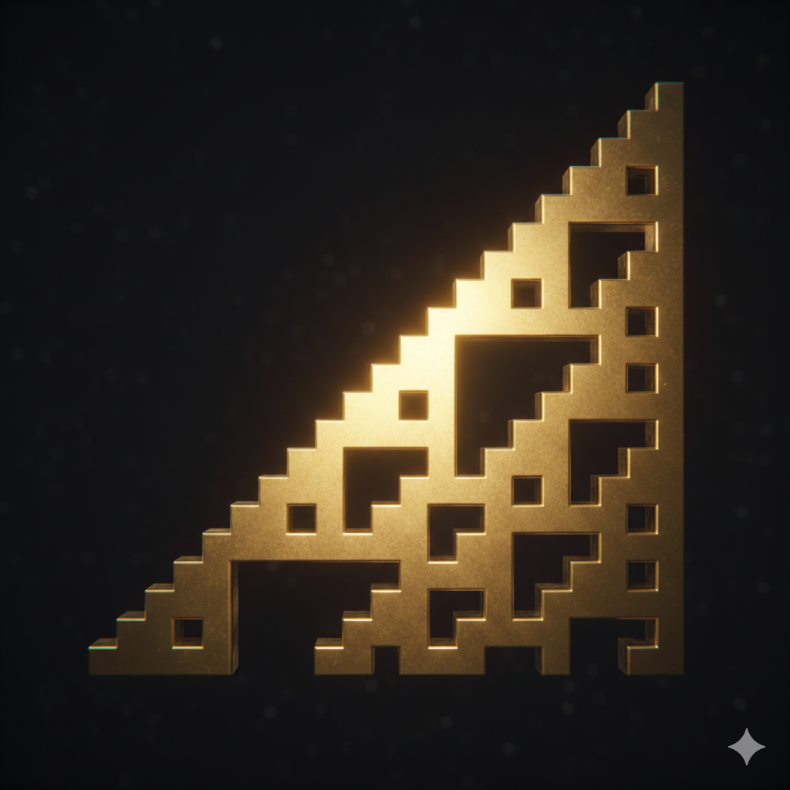
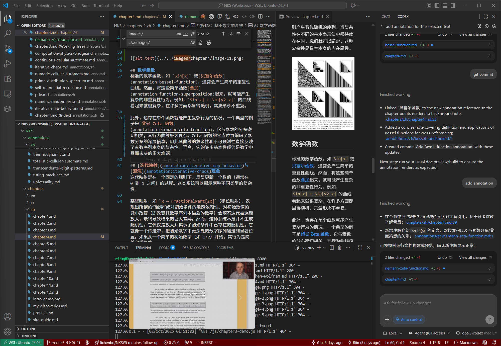

# 我的发现

> 记录我在《一种新科学》相关主题上的灵感、收藏与实验成果，方便随时回顾与扩展。

## 细胞自动机收藏

1. [Growing Neural Cellular Automata](https://distill.pub/2020/growing-ca/) —— Distill 的深度文章，展示了如何通过可微分的元胞自动机框架训练系统自我生长、修复与维持形态。

2. 「复杂」的极限在哪里：Wolfram与他的「计算等价性原理」：https://zhuanlan.zhihu.com/p/24950767

## 研究随记

- 可以在此记录个人实验、思考或阅读摘记，持续补充自己的研究轨迹。
- 若有值得长期追踪的主题，可按类别拆分成新的小节，保持结构清晰。

## 后续计划

- 整理更多与元胞自动机、复杂系统和自动化建模相关的优秀资源。
- 结合本站交互式演示，记录自己的探索步骤与心得。

<iframe width="560" height="315" src="https://www.youtube.com/embed/PdE-waSx-d8?si=GBzN2wRzHuttMZlS" title="YouTube video player" frameborder="0" allow="accelerometer; autoplay; clipboard-write; encrypted-media; gyroscope; picture-in-picture; web-share" referrerpolicy="strict-origin-when-cross-origin" allowfullscreen></iframe>